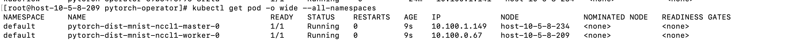
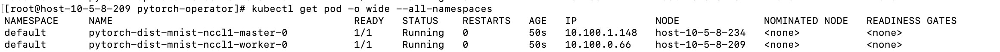
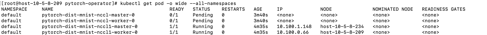
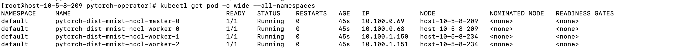
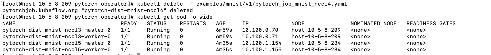

<!-- TOC -->

- [1. 测试拓扑敏感](#1-测试拓扑敏感)
    - [1.1 环境描述](#11-环境描述)
    - [1.2 任务描述](#12-任务描述)
    - [1.3 测试用例(拓扑感知)](#13-测试用例拓扑感知)
        - [1.3.1 单独执行py1](#131-单独执行py1)
        - [1.3.2 单独执行py](#132-单独执行py)
        - [1.3.3 先执行py1，然后执行py任务](#133-先执行py1然后执行py任务)
        - [1.3.4 单独执行py2](#134-单独执行py2)
    - [1.3 测试用例(阻塞)](#13-测试用例阻塞)
        - [1.3.1 分别执行py3、py4、py5 任务](#131-分别执行py3py4py5-任务)
    - [1.3.2 1.3.1 中接着删除py4](#132-131-中接着删除py4)

<!-- /TOC -->

# 1. 测试拓扑敏感
## 1.1 环境描述
2node（234，209），每个node2个GPU
## 1.2 任务描述

py: 2pod任务，topo=true
py1: 2pod 任务，node亲和性分别使pod调度到209和234
py2: 4pod任务，topo=true

py3: 2pod 任务
py4: 3pod任务，block=true
py5：2pod 任务

## 1.3 测试用例(拓扑感知)
### 1.3.1 单独执行py1
预期： 被调度
结果成功

### 1.3.2 单独执行py
预期： 被调度
结果成功

### 1.3.3 先执行py1，然后执行py任务
预期：py1被调度，py被阻塞
结果成功

### 1.3.4 单独执行py2
预期： 被调度
结果成功

## 1.3 测试用例(阻塞)
### 1.3.1 分别执行py3、py4、py5 任务
预期： py3被调度，py4、py5阻塞
结果成功

## 1.3.2 1.3.1 中接着删除py4
预期： py5 有阻塞转为调度
结果成功
