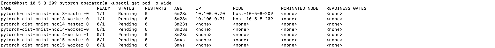

测试pytorch-operator 1.1
sense-rubber 0.7

# 1. 测试拓扑敏感
## 1.1 环境描述
2node（234，209），每个node2个GPU
## 1.2 任务描述

py: 2pod任务，topo=true
py1: 2pod 任务，node亲和性分别使pod调度到209和234
py2: 4pod任务，topo=true

py3: 2pod 任务
py4: 3pod任务，block=true
py5：2pod 任务

## 1.3 测试用例(拓扑感知)
### 1.3.1 单独执行py1
预期： 被调度
结果成功

### 1.3.2 单独执行py
预期： 被调度
结果成功

### 1.3.3 先执行py1，然后执行py任务
预期：py1被调度，py被阻塞
结果成功

### 1.3.4 单独执行py2
预期： 被调度
结果成功

## 1.3 测试用例(阻塞)
### 1.3.1 分别执行py3、py4、py5 任务
预期： py3被调度，py4、py5阻塞
结果成功

## 1.3.2 1.3.1 中接着删除py4
预期： py5 有阻塞转为调度
结果成功
