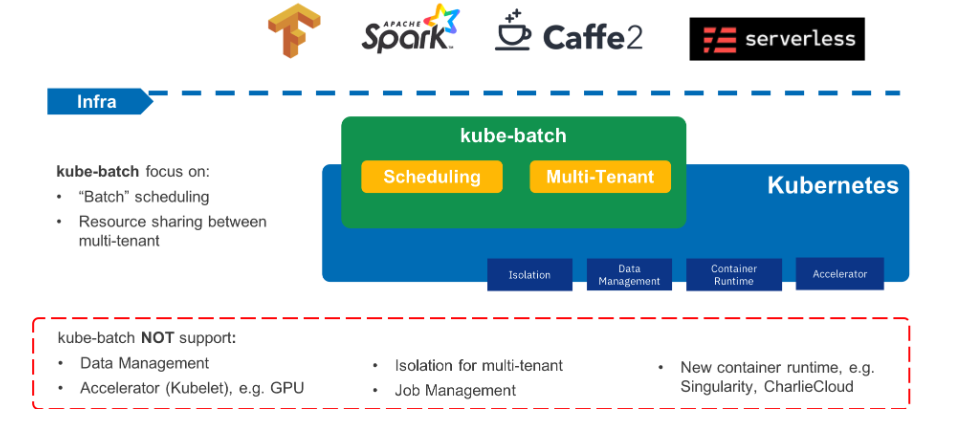

<!-- TOC -->

- [1. 背景](#1-背景)
- [2. kubebatch在Kubernetes 中的架构位置](#2-kubebatch在kubernetes-中的架构位置)
- [3. 部署kubebatch](#3-部署kubebatch)
    - [3.1 安装golang](#31-安装golang)
    - [3.1.1 安装golang](#311-安装golang)
    - [3.1.2 配置golang](#312-配置golang)
    - [3.1.3 删除golang](#313-删除golang)
    - [3.2 安装helm](#32-安装helm)
        - [3.2.1 简介](#321-简介)
        - [3.2.2 helm 简单组成](#322-helm-简单组成)
        - [3.2.3 安装helm](#323-安装helm)
            - [3.2.3.1 安装helm客户端](#3231-安装helm客户端)
            - [3.2.3.2 安装TILLER](#3232-安装tiller)
                - [3.2.3.2.1 故障：镜像下载不了](#32321-故障镜像下载不了)
                - [3.2.3.2.2 故障：helm needs socat on the nodes of the k8s cluster](#32322-故障helm-needs-socat-on-the-nodes-of-the-k8s-cluster)
    - [3.3 部署kubebatch](#33-部署kubebatch)
        - [3.3.1 故障：CRD资源已经存在](#331-故障crd资源已经存在)

<!-- /TOC -->
# 1. 背景
* Kubeflow:A batch scheduler of kubernetes for high performance workload, e.g. AI/ML, BigData, HPC
* It builds upon a decade and a half of experience on running batch workloads at scale using several systems

# 2. kubebatch在Kubernetes 中的架构位置
The following figure describes the overall architecture and scope of kube-batch; the out-of-scope part is going to be handled by other projects



# 3. 部署kubebatch
依赖
* kubernetes 集群
* golang
* helm

## 3.1 安装golang
* notice:注意安装go的版本，最好是比较新的版本，因为Kubeflow这一套都是很新的东西，go版本最好新一点
* 我们安装的是go1.12.9.linux-amd64.tar.gz

## 3.1.1 安装golang
* wget https://dl.google.com/go/go1.12.9.linux-amd64.tar.gz
* tar -C /usr/local -xzf go1.12.9.linux-amd64.tar.gz
* vim ~/.bash_profile 
  export PATH=$PATH:/usr/local/go/bin
* source ~/.bash_profile 

## 3.1.2 配置golang
* 暂时使用默认配置，通过go env查看默认配置
* 配置常用的环境变量
```
export GOROOT=/usr/local/go
export GOPATH=/root/go
export PATH=$PATH:/usr/local/go/bin
```

## 3.1.3 删除golang
* 删除golang的解压目录，通过which go查看
* 删除~/.bash_profile 关于go的环境变量

## 3.2 安装helm
### 3.2.1 简介
* helm 是在kubenetes中很好的find、share、and use software工具
* 新版本的helm已经被CNCF管理
* Share your own applications as Helm charts
* Create reproducible builds of your Kubernetes applications
* Intelligently manage your Kubernetes manifest files
* Manage releases of Helm packages

### 3.2.2 helm 简单组成
* Helm has two parts: a client (helm) and a server (tiller)
* Tiller runs inside of your Kubernetes cluster, and manages releases (installations) of your charts.
* Helm runs on your laptop, CI/CD, or wherever you want it to run.
* Charts are Helm packages that contain at least two things:
    * A description of the package (Chart.yaml)
    * One or more templates, which contain Kubernetes manifest files
* Charts can be stored on disk, or fetched from remote chart repositories (like Debian or RedHat packages)

### 3.2.3 安装helm
#### 3.2.3.1 安装helm客户端
* wget  https://get.helm.sh/helm-v2.14.3-linux-amd64.tar.gz
* tar -xvf  helm-v2.14.3-linux-amd64.tar.gz 
* cp  linux-amd64/helm /usr/local/bin/
*  添加PATH /usr/local/bin/
* helm 查看安装成功

#### 3.2.3.2 安装TILLER
* 默认是helm init  就可以安装，但是执行过程中出现一些问题 ,最终编程下面的
* helm init --tiller-image doublemine/kubernetes-helm.tiller:v2.14.3 --node-selectors "kubernetes.io/hostname=bj-idc1-10-10-31-26"
* 参考：https://helm.sh/docs/install/


##### 3.2.3.2.1 故障：镜像下载不了
* 一个是官网镜像下载不了，于是就在docker hub找到一个镜像，--tiller-image 参数指定镜像

##### 3.2.3.2.2 故障：helm needs socat on the nodes of the k8s cluster
* 问题描述一致：https://github.com/helm/helm/issues/966
* 原因简单来说就是coreOS 部署Kubernetes时，kubelet是二进制安装，但是安装helm教程默认是kubelet容器运行，所以导致socat not found
* 网上推荐的方法如下
```
If you don't want to run kubelet in a container you may install socat in /opt/bin/ and add it to the PATH of the kubelet systemd.unit

Environment="PATH=/usr/local/sbin:/usr/local/bin:/usr/sbin:/usr/bin:/sbin:/bin:/opt/bin"
```
* 但是测试发现问题没有被解决，后面发现tiller pod被调度到bj-idc1-10-10-31-25 节点上，但是本人yum install socat在bj-idc1-10-10-31-26上，因此猜测可能需要将tiller pod指定在bj-idc1-10-10-31-26节点上（本人只有26节点上权限），因此加上--node-selectors参数。helm version 发现问题解决


## 3.3 部署kubebatch
* mkdir -p $GOPATH/src/github.com/kubernetes-sigs/
* cd $GOPATH/src/github.com/kubernetes-sigs/
* git clone http://github.com/kubernetes-sigs/kube-batch -b
* git checkout  v0.4.2
* helm install  --no-crd-hook  $GOPATH/src/github.com/kubernetes-sigs/kube-batch/deployment/kube-batch --namespace kube-system
*  helm list显示安装结果（status 是DEPLOYED）
```
[root@BJ-IDC1-10-10-31-26 kube-batch]# helm list
NAME       	REVISION	UPDATED                 	STATUS  	CHART                       	APP VERSION	NAMESPACE  
ardent-duck	1       	Sat Sep  7 20:49:56 2019	DEPLOYED	kube-batch-0.4.1            	           	kube-system
```

### 3.3.1 故障：CRD资源已经存在
* 官网是helm install $GOPATH/src/github.com/kubernetes-sigs/kube-batch/deployment/kube-batch --namespace kube-system 安装
*  故障显示  Error: customresourcedefinitions.apiextensions.k8s.io "podgroups.scheduling.incubator.k8s.io" already exists

*  原因 ：安装教程可能 是 针对新 搭建的kubenetes集群
* 解决：添加 --no-crd-hook 参数


