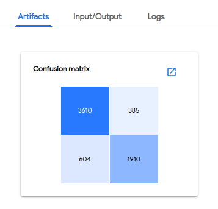

<!-- TOC -->

- [1. 背景](#1-背景)
- [2.pipeline简单使用](#2pipeline简单使用)
- [3. 理解pipeline](#3-理解pipeline)
    - [3.1 pipeline组成](#31-pipeline组成)
    - [3.2 pipeline目的](#32-pipeline目的)
    - [3.3 pipeline创建](#33-pipeline创建)
        - [3.3.1 下图是pipeline 生命周期的一个例子](#331-下图是pipeline-生命周期的一个例子)
        - [3.3.2 python sdk实现pipeline生命周期过程](#332-python-sdk实现pipeline生命周期过程)
        - [3.3.3 Pipeline data on the Kubeflow Pipelines UI](#333-pipeline-data-on-the-kubeflow-pipelines-ui)
        - [3.3.4 训练结果输出](#334-训练结果输出)
            - [3.3.4.1 Prediction results:](#3341-prediction-results)
            - [3.3.4.2 Confusion matrix:](#3342-confusion-matrix)
            - [3.3.4.3 Receiver operating characteristics (ROC) curve:](#3343-receiver-operating-characteristics-roc-curve)
- [4. pipeline架构图](#4-pipeline架构图)
    - [4.1 实现思路](#41-实现思路)
- [5.  pipeline  interface](#5--pipeline--interface)
    - [5.1 pipeline UI](#51-pipeline-ui)
    - [5.2 Python SDK](#52-python-sdk)
    - [5.3 REST API](#53-rest-api)
- [6 pipeline 重要概念](#6-pipeline-重要概念)
    - [6.1 Component](#61-component)
        - [6.1.1 Component code](#611-component-code)
        - [6.1.2 Component definition](#612-component-definition)
        - [6.1.3 Containerizing components](#613-containerizing-components)
    - [6.2 Graph](#62-graph)
    - [6.3 Experiment](#63-experiment)
    - [6.4 Run and Recurring Run](#64-run-and-recurring-run)
    - [6.5 Run Trigger](#65-run-trigger)
    - [6.6 Output Artifact](#66-output-artifact)
- [7.Building Pipelines with the SDK](#7building-pipelines-with-the-sdk)
- [8. Upgrading and Reinstalling](#8-upgrading-and-reinstalling)
- [9. Samples and Tutorials](#9-samples-and-tutorials)
- [10.Reference](#10reference)

<!-- /TOC -->

# 1. 背景
kubeflow/pipelines 实现了一个工作流模型。所谓工作流，或者称之为流水线（pipeline），可以将其当做一个有向无环图（DAG）。其中的每一个节点，在 kubeflow/pipelines 的语义下被称作组件（component）。组件在图中作为一个节点，其会处理真正的逻辑，比如预处理，数据清洗，模型训练等等。每一个组件负责的功能不同，但有一个共同点，即组件都是以 Docker 镜像的方式被打包，以容器的方式被运行的。


kubeflow/pipelines 它就是一个支持自定义的流水线系统，用户可以通过它定义自己的机器学习流水线，并且在执行时输出一定的用于可视化过程的文件，系统的前端会将其可以理解的文件进行可视化，方便用户跟踪学习过程。

* 下面过程只是简单介绍Pipelines使用。详细使用参考https://www.kubeflow.org/docs/gke/pipelines-tutorial/

#  2.pipeline简单使用
* kubeflow UI进入pipelines界面
* Click the name of the sample, [Sample] Basic - Parallel Execution, on the pipelines UI: 


* Click Create experiment: 


* Follow the prompts to create an experiment and then create a run. The sample supplies default values for all the parameters you need. The following screenshot assumes you’ve already created an experiment named My experiment and are now creating a run named My first run: 


* Click Start to create the run.

* Click the name of the run on the experiments dashboard: 


* Explore the graph and other aspects of your run by clicking on the components of the graph and the other UI elements: 


# 3. 理解pipeline
## 3.1 pipeline组成
The Kubeflow Pipelines platform consists of:

* A user interface (UI) for managing and tracking experiments, jobs, and runs.（前端界面）
* An engine for scheduling multi-step ML workflows.（调度）
* An SDK for defining and manipulating pipelines and components.（sdk）
* Notebooks for interacting with the system using the SDK.（notebook操作）

## 3.2 pipeline目的
* 管理ML工作流程
* 简化训练过程，管理训练记录
* 方便重复训练

## 3.3 pipeline创建
### 3.3.1 下图是pipeline 生命周期的一个例子


### 3.3.2 python sdk实现pipeline生命周期过程
* 全部代码链接：https://github.com/kubeflow/pipelines/tree/master/samples/core/xgboost_training_cm
```
@dsl.pipeline(
  name='XGBoost Trainer',
  description='A trainer that does end-to-end distributed training for XGBoost models.'
)
def xgb_train_pipeline(
    output,
    project,
    region='us-central1',
    train_data='gs://ml-pipeline-playground/sfpd/train.csv',
    eval_data='gs://ml-pipeline-playground/sfpd/eval.csv',
    schema='gs://ml-pipeline-playground/sfpd/schema.json',
    target='resolution',
    rounds=200,
    workers=2,
    true_label='ACTION',
):
  delete_cluster_op = DeleteClusterOp('delete-cluster', project, region).apply(gcp.use_gcp_secret('user-gcp-sa'))
  with dsl.ExitHandler(exit_op=delete_cluster_op):
    create_cluster_op = CreateClusterOp('create-cluster', project, region, output).apply(gcp.use_gcp_secret('user-gcp-sa'))

    analyze_op = AnalyzeOp('analyze', project, region, create_cluster_op.output, schema,
                           train_data, '%s/{{workflow.name}}/analysis' % output).apply(gcp.use_gcp_secret('user-gcp-sa'))

    transform_op = TransformOp('transform', project, region, create_cluster_op.output,
                               train_data, eval_data, target, analyze_op.output,
                               '%s/{{workflow.name}}/transform' % output).apply(gcp.use_gcp_secret('user-gcp-sa'))

    train_op = TrainerOp('train', project, region, create_cluster_op.output, transform_op.outputs['train'],
                         transform_op.outputs['eval'], target, analyze_op.output, workers,
                         rounds, '%s/{{workflow.name}}/model' % output).apply(gcp.use_gcp_secret('user-gcp-sa'))

    predict_op = PredictOp('predict', project, region, create_cluster_op.output, transform_op.outputs['eval'],
                           train_op.output, target, analyze_op.output, '%s/{{workflow.name}}/predict' % output).apply(gcp.use_gcp_secret('user-gcp-sa'))

    confusion_matrix_op = ConfusionMatrixOp('confusion-matrix', predict_op.output,
                                            '%s/{{workflow.name}}/confusionmatrix' % output).apply(gcp.use_gcp_secret('user-gcp-sa'))

    roc_op = RocOp('roc', predict_op.output, true_label, '%s/{{workflow.name}}/roc' % output).apply(gcp.use_gcp_secret('user-gcp-sa'))
```

### 3.3.3 Pipeline data on the Kubeflow Pipelines UI
* 下图是创建一个pipeline界面，箭头是非默认参数


### 3.3.4 训练结果输出
The following screenshots show examples of the pipeline output visible on the Kubeflow Pipelines UI.
#### 3.3.4.1 Prediction results:

#### 3.3.4.2 Confusion matrix:

#### 3.3.4.3 Receiver operating characteristics (ROC) curve:


# 4. pipeline架构图


架构图中各个部件的作用如下：
* Python SDK: You create components or specify a pipeline using the Kubeflow Pipelines domain-specific language (DSL).
* DSL compiler: The DSL compiler transforms your pipeline’s Python code into a static configuration (YAML).
* Pipeline Service: You call the Pipeline Service to create a pipeline run from the static configuration.
* Kubernetes resources: The Pipeline Service calls the Kubernetes API server to create the necessary Kubernetes resources (CRDs) to run the pipeline.
* Orchestration controllers: A set of orchestration controllers execute the containers needed to complete the pipeline execution specified by the Kubernetes resources (CRDs). The containers execute within Kubernetes Pods on virtual machines. 
* Artifact storage: The Pods store two kinds of data:
    * Metadata: Experiments, jobs, runs, etc. Also single scalar metrics, generally aggregated for the purposes of sorting and filtering. Kubeflow Pipelines stores the metadata in a MySQL database.
    * Artifacts: Pipeline packages, views, etc. Also large-scale metrics like time series, usually used for investigating an individual run’s performance and for debugging. 
* Persistence agent and ML metadata: The Pipeline Persistence Agent watches the Kubernetes resources created by the Pipeline Service and persists the state of these resources in the ML Metadata Service. The Pipeline Persistence Agent records the set of containers that executed as well as their inputs and outputs. The input/output consists of either container parameters or data artifact URIs.
* Pipeline web server: The Pipeline web server gathers data from various services to display relevant views: the list of pipelines currently running, the history of pipeline execution, the list of data artifacts, debugging information about individual pipeline runs, execution status about individual pipeline runs.

## 4.1 实现思路
* 虽然 kubeflow/pipelines 的使用略显复杂，但它的实现其实并不麻烦。整个的架构可以分为五个部分，分别是 ScheduledWorkflow CRD 以及其 operator，流水线前端，流水线后端， Python SDK 和 persistence agent。
    *  ScheduledWorkflow CRD 扩展了 argoproj/argo 的 Workflow 定义,也是流水线项目中的核心部分，它负责真正地在 Kubernetes 上按照拓扑序创建出对应的容器完成流水线的逻辑。
    * Python SDK 负责构造出流水线，并且根据流水线构造出 ScheduledWorkflow 的 YAML 定义，随后将其作为参数传递给流水线系统的后端服务。
    * 后端服务依赖关系存储数据库（如 MySQL）和对象存储（如 Amazon S3），处理所有流水线中的 CRUD 请求。
    * 前端负责可视化整个流水线的过程，以及获取日志，发起新的运行等。
    * Persistence agent 负责把数据从 Kubernetes Master 的 etcd 中 sync 到后端服务的关系型数据库中，其实现的方式与 CRD operator 类似，通过 informer 来监听 Kubernetes apiserver 对应资源实现。

# 5.  pipeline  interface
这小节讲述的是用户和pipeline交互接口。

## 5.1 pipeline UI
UI界面可以实现如果功能
* 通过用户自定义压缩文件加载pipeline
* Create an experiment to group one or more of your pipeline runs.（https://www.kubeflow.org/docs/pipelines/overview/concepts/experiment/）
* Create and start a run within the experiment. A run is a single execution of a pipeline. 
* Explore the configuration, graph, and output of your pipeline run.
* Compare the results of one or more runs within an experiment.
* Schedule runs by creating a recurring run.

## 5.2 Python SDK
The Kubeflow Pipelines SDK provides a set of Python packages that you can use to specify and run your ML workflows.
* https://www.kubeflow.org/docs/pipelines/sdk/sdk-overview/

## 5.3 REST API 
The Kubeflow Pipelines API is useful for continuous integration/deployment systems,
* for example, where you want to incorporate your pipeline executions into shell scripts or other systems. 
* For example, you may want to trigger a pipeline run when new data comes in.

# 6 pipeline 重要概念
## 6.1 Component 

* component是ML工作流程中一环，都是通过容器运行。
### 6.1.1 Component code
* component 代码分为两个部分
    * Client code: the code  talks to endpoints to submit jobs. 
    * Runtime code: The code that does the actual job and usually runs in the cluster. For example, Spark code that transforms raw data into preprocessed data.
### 6.1.2 Component definition 
A component specification in YAML format describes the component for the Kubeflow Pipelines system. A component definition has the following parts:
* Metadata: name, description, etc.
* Interface: input/output specifications (name, type, description, default value, etc).
* Implementation: A specification of how to run the component given a set of argument values for the component’s inputs. The implementation section also describes how to get the output values from the component once the component has finished running.

For the complete definition of a component, see https://www.kubeflow.org/docs/pipelines/reference/component-spec/

### 6.1.3 Containerizing components 
* components通过容器运行
* components交互通过网络

## 6.2 Graph
Graph 显示pipeline执行的生命周期过程，显示component之间关系和component执行状态（running, succeeded, failed, or skipped.）
## 6.3 Experiment
* An experiment is a workspace where you can try different configurations of your pipelines. 
* You can use experiments to organize your runs into logical groups. Experiments can contain arbitrary runs, including recurring runs.

## 6.4 Run and Recurring Run
* A run is a single execution of a pipeline. 
    * 运行过程通过日志记录
    * 设计成独立的，允许再现
    * 通过UI看到运行状态， 
* A recurring run is a repeatable run of a pipeline. 
    * The configuration for a recurring run includes a copy of a pipeline with all parameter values specified and a run trigger.
    * You can start a recurring run inside any experiment, and it will periodically start a new copy of the run configuration. 
    * You can enable/disable the recurring run from the Kubeflow Pipelines UI. You can also specify the maximum number of concurrent runs, to limit the number of runs launched in parallel. 

## 6.5 Run Trigger
A run trigger is a flag that tells the system when a recurring run configuration spawns a new run. The following types of run trigger are available:
* Periodic: for an interval-based scheduling of runs (for example: every 2 hours or every 45 minutes).
* Cron: for specifying cron semantics for scheduling runs.

## 6.6 Output Artifact
An output artifact is an output emitted by a pipeline component, which the Kubeflow Pipelines UI understands and can render as rich visualizations. 

# 7.Building Pipelines with the SDK
https://www.kubeflow.org/docs/pipelines/sdk/

# 8. Upgrading and Reinstalling
https://www.kubeflow.org/docs/pipelines/upgrade/

# 9. Samples and Tutorials
https://www.kubeflow.org/docs/pipelines/tutorials/

# 10.Reference
https://www.kubeflow.org/docs/pipelines/reference/


