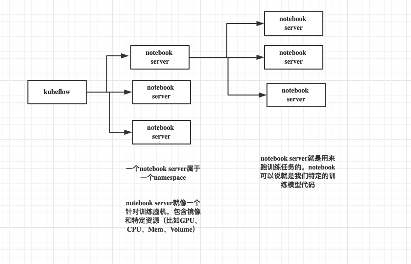
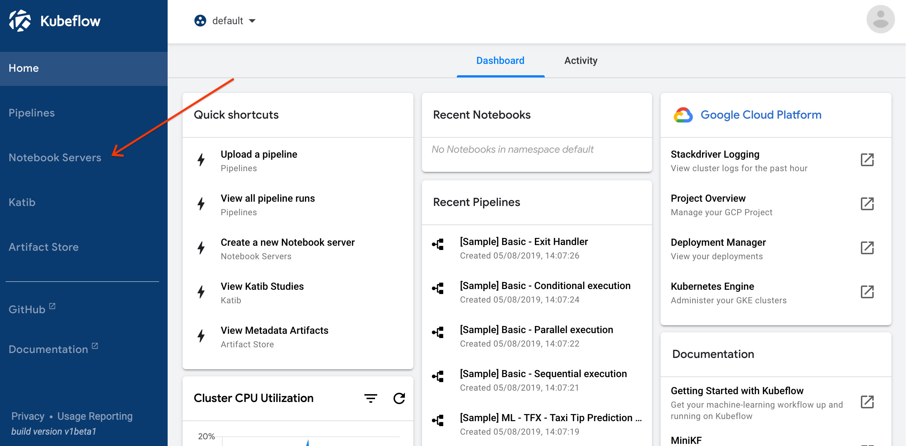
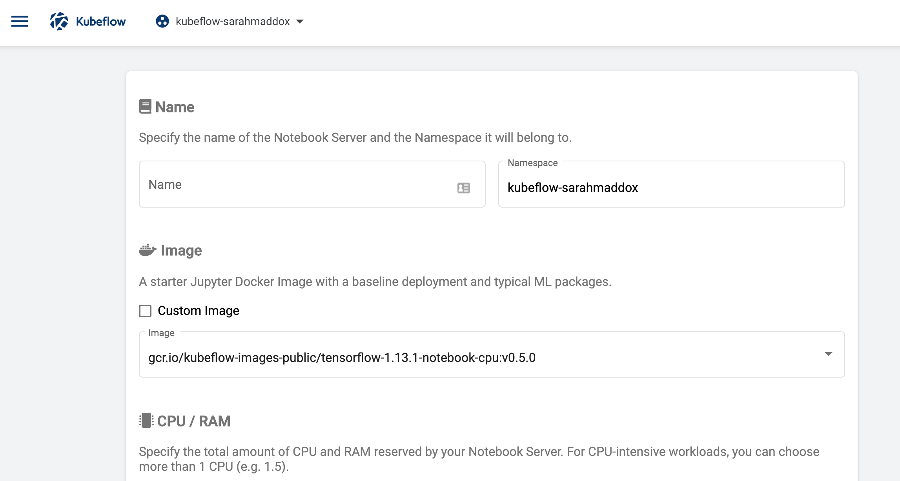
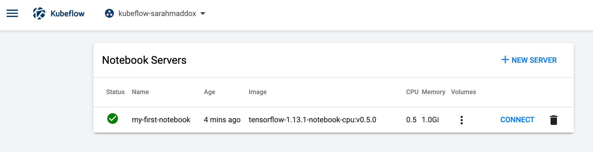
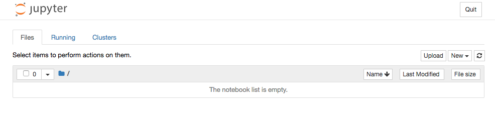

<!-- TOC -->

- [1. 背景](#1-背景)
- [2. 特点](#2-特点)
- [3. setup your notebooks](#3-setup-your-notebooks)
    - [3.1 Quick guide for new notebook](#31-quick-guide-for-new-notebook)
        - [3.1.1 Install Kubeflow and open the Kubeflow UI](#311-install-kubeflow-and-open-the-kubeflow-ui)
        - [3.1.2 Create a Jupyter notebook server and add a notebook(过程描述的很复杂，但是按照UI界面比较简单)](#312-create-a-jupyter-notebook-server-and-add-a-notebook过程描述的很复杂但是按照ui界面比较简单)
        - [3.1.3 Experiment with your notebook](#313-experiment-with-your-notebook)
- [4. Create a Custom Jupyter Image](#4-create-a-custom-jupyter-image)
- [5. Submit Kubernetes Resources](#5-submit-kubernetes-resources)

<!-- /TOC -->

# 1. 背景
There are multiple benefits of integrating Jupyter Notebooks in Kubeflow for enterprise environments. These benefits include:

* Integrating well with the rest of the infrastructure with respect to authentication and access control.（访问权限控制）

* Enabling easier notebook sharing across the organization.
    * Users can create notebook containers or pods directly in the cluster, rather than locally on their workstations. （通过UI部署训练，而不是Kubectl平台工具）
    * Admins can provide standard notebook images for their organization, and set up role-based access control (RBAC), Secrets and Credentials to manage which teams and individuals can access the notebooks.（有利于镜像工具的标准化定制）

# 2. 特点

* The training job can run single node or distributed on the same Kubernetes cluster, but not inside the notebook pod itself. （notebook运行在一个pod中）

# 3. setup your notebooks
* Your Kubeflow deployment includes services for spawning and managing Jupyter notebooks.
* You can set up multiple notebook servers per Kubeflow deployment. Each notebook server can include multiple notebooks. Each notebook server belongs to a single namespace, which corresponds to the project group or team for that server.


##  3.1 Quick guide for new notebook
* Summary of steps:

    * Follow the Kubeflow getting-started guide to set up your Kubeflow deployment and open the Kubeflow UI.（打开kubeflow UI）

    * Click Notebook Servers in the left-hand panel of the Kubeflow UI.（点击Notebook Servers）

    * Choose the namespace corresponding to your Kubeflow profile.（选择namespace）

    * Click NEW SERVER to create a notebook server.（new notebook server）

    * When the notebook server provisioning is complete, click CONNECT.（连接notebook server）

    * Click Upload to upload an existing notebook, or click New to create an empty notebook.（提交notebook）


### 3.1.1 Install Kubeflow and open the Kubeflow UI
note: Installing Kubeflow on a existing Kubernetes cluster 
* https://www.kubeflow.org/docs/other-guides/accessing-uis/

### 3.1.2 Create a Jupyter notebook server and add a notebook(过程描述的很复杂，但是按照UI界面比较简单)
* Click Notebook Servers in the left-hand panel of the Kubeflow UI to access the Jupyter notebook services deployed with Kubeflow: 


* Sign in:
sign in using any username and password.

* Select a namespace:
    * Click the namespace dropdown to see the list of available namespaces.
    * Choose the namespace that corresponds to your Kubeflow profile. (https://www.kubeflow.org/docs/other-guides/multi-user-overview/)

* Click NEW SERVER on the Notebook Servers page:
You should see a page for entering details of your new server. Here is a partial screenshot of the page:


* Enter a name of your choice for the notebook server. The name can include letters and numbers, but no spaces. For example, my-first-notebook.

* Kubeflow automatically updates the value in the namespace field to be the same as the namespace that you selected in a previous step. This ensures that the new notebook server is in a namespace that you can access.

* Select a Docker image for the baseline deployment of your notebook server. You can choose from a range of standard images or specify a custom image:
    * Standard: The standard Docker images include typical machine learning (ML) packages that you can use within your Jupyter notebooks on this notebook server. Select an image from the Image dropdown menu. 

    * Custom: If you select the custom option, you must specify a Docker image in the form registry/image:tag. For guidelines on creating a Docker image for your notebook, see https://www.kubeflow.org/docs/notebooks/custom-notebook/

* Specify the total amount of CPU that your notebook server should reserve. The default is 0.5. For CPU-intensive jobs, you can choose more than one CPU (for example, 1.5).

* Specify the total amount of memory (RAM) that your notebook server should reserve. The default is 1.0Gi.

* (Optional) Specify one or more data volumes if you want to store and access data from the notebooks on this notebook server. 

* Click LAUNCH. You should see an entry for your new notebook server on the Notebook Servers page, with a spinning indicator in the Status column. It can take a few minutes to set up the notebook server.

* When the notebook server provisioning is complete, you should see an entry for your server on the Notebook Servers page, with a check mark in the Status column:


* Click CONNECT to start the notebook server.

* When the notebook server is running, you should see the Jupyter dashboard interface. If you requested a new workspace, the dashboard should be empty of notebooks:


* Click Upload to upload an existing notebook, or click New to create an empty notebook. You can read about using notebooks in the Jupyter documentation.

### 3.1.3 Experiment with your notebook
The default notebook image includes all the plugins that you need to train a TensorFlow model with Jupyter, including Tensorboard for rich visualizations and insights into your model.
To test your Jupyter installation, you can run a basic ‘hello world’ program (adapted from mnist_softmax.py) as follows:

* Use the Jupyter dashboard to create a new Python 3 notebook.

* Copy the following code and paste it into a code block in your notebook:
```
from tensorflow.examples.tutorials.mnist import input_data
mnist = input_data.read_data_sets("MNIST_data/", one_hot=True)

import tensorflow as tf

x = tf.placeholder(tf.float32, [None, 784])

W = tf.Variable(tf.zeros([784, 10]))
b = tf.Variable(tf.zeros([10]))

y = tf.nn.softmax(tf.matmul(x, W) + b)

y_ = tf.placeholder(tf.float32, [None, 10])
cross_entropy = tf.reduce_mean(-tf.reduce_sum(y_ * tf.log(y), reduction_indices=[1]))

train_step = tf.train.GradientDescentOptimizer(0.05).minimize(cross_entropy)

sess = tf.InteractiveSession()
tf.global_variables_initializer().run()

for _ in range(1000):
  batch_xs, batch_ys = mnist.train.next_batch(100)
  sess.run(train_step, feed_dict={x: batch_xs, y_: batch_ys})

correct_prediction = tf.equal(tf.argmax(y,1), tf.argmax(y_,1))
accuracy = tf.reduce_mean(tf.cast(correct_prediction, tf.float32))
print("Accuracy: ", sess.run(accuracy, feed_dict={x: mnist.test.images, y_: mnist.test.labels}))
```

* Run the code. You should see a number of WARNING messages from TensorFlow, followed by a line showing a training accuracy something like this:
```
Accuracy:  0.9012
```

# 4. Create a Custom Jupyter Image
* 自定义的镜像处理满足训练的基本要求，好需要满足Jupyter配置要求。kubeflow 要求启动镜像之后立马启动Jupyter

* Follow these steps to configure the launch command (CMD) in your Docker image:
    * Set the working directory:
        * The /home/jovyan directory is backed by a Kubernetes persistent volume (PV).
    ```
    --notebook-dir=/home/jovyan
    ```

    * Allow Jupyter to listen on all IP addresses:
    ```
    --ip=0.0.0.0
    ```

    * Allow the user to run the notebook as root:
    ```
    --allow-root
    ```

    * Set the port:
    ```
    --port=8888
    ```
    * Disable authentication. Use the following setting to allow passwordless access to your Jupyter notebook servers:
    ```
    --NotebookApp.token=''  --NotebookApp.password=''
    ```

    * Allow any origin to access your Jupyter notebook server:
    ```
    --NotebookApp.allow_origin='*'
    ```

    * Set the base URL. The Kubeflow notebook controller manages the base URL for the notebook server using the environment variable called NB_PREFIX. Your Docker image should define the variable and set the value of base_url as follows:
    ```
    --NotebookApp.base_url=NB_PREFIX
    ```

* Below is an example of what your Dockerfile should contain:
```
ENV NB_PREFIX /

CMD ["sh","-c", "jupyter notebook --notebook-dir=/home/jovyan --ip=0.0.0.0 --no-browser --allow-root --port=8888 --NotebookApp.token='' --NotebookApp.password='' --NotebookApp.allow_origin='*' --NotebookApp.base_url=${NB_PREFIX}"]
```

# 5. Submit Kubernetes Resources
* jupyter-notebook service 和 Jupyter notebook Pods绑定。
*  jupyter-notebook service  绑定jupyter-notebook role.jupyter-notebook role有下面所有资源的控制权限。如果是 自定义资源 ，该如何访问控制
```
    Pods
    Deployments
    Services
    Jobs
    TFJobs
    PyTorchJobs

```

*  因此我们能直接在Jupyter notebook创建kubenetes资源 。 kubectl command-line tool已经预先 安装在 notebook中。我们 可以直接使用Kubectl创建资源
```
!kubectl create -f myspec.yaml
```


