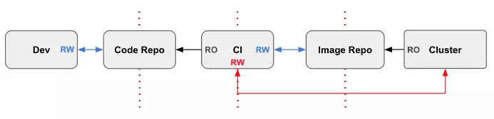
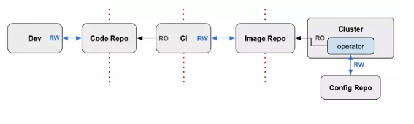
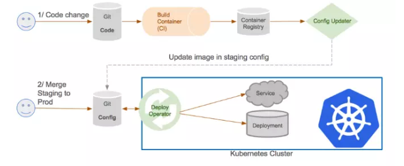

<!-- TOC -->

- [1. 背景](#1-背景)
- [2. 什么是GitOps](#2-什么是gitops)
- [3. GitOps主要优点](#3-gitops主要优点)
- [4. GitOps应用场景——满足云原生环境下的持续交付](#4-gitops应用场景满足云原生环境下的持续交付)
    - [4.1 不可变基础设施](#41-不可变基础设施)
    - [4.2 声明性容器编排](#42-声明性容器编排)
- [5. GitOps的基本原则](#5-gitops的基本原则)
    - [5.1 任何能够被描述的内容都必须存储在Git库中](#51-任何能够被描述的内容都必须存储在git库中)
    - [5.2 不应直接使用Kubectl](#52-不应直接使用kubectl)
    - [5.3 调用Kubernetes 的API的接口或者控制器应该遵循 Operator 模式](#53-调用kubernetes-的api的接口或者控制器应该遵循-operator-模式)
- [6. 最佳实践](#6-最佳实践)
    - [6.1 以Git作为事实的唯一真实来源](#61-以git作为事实的唯一真实来源)
    - [6.2 拉式流水](#62-拉式流水)
        - [6.2.1 推送流水线及概念](#621-推送流水线及概念)
        - [6.2.2 拉式流水](#622-拉式流水)
    - [6.3 GitOps流水线](#63-gitops流水线)
- [参考](#参考)

<!-- /TOC -->
# 1. 背景
* GitOps：一种云原生的持续交付模型。是一种模型，不是一种软件。
* 除了GitOps，你可能还听说过DevOps，或者AIOps、GOps等，是的，现在是“Ops”盛行的时代。

GitOps是一种实现持续交付的模型，它的核心思想是将应用系统的声明性基础架构和应用程序存放在Git的版本控制库中。

在本文中，将重点阐述GitOps工作流程的原理和模式，以及将它们应用在生产和大规模运行Kubernetes中的一些实践经验。

# 2. 什么是GitOps
将Git作为交付流水线的核心，每个开发人员都可以提交拉取请求（Pull Request）并使用Gi​​t来加速和简化Kubernetes的应用程序部署和运维任务。通过使用像Git这样的简单工具，开发人员可以更高效地将注意力集中在创建新功能而不是运维相关任务上（例如，应用系统安装、配置、迁移等）。

# 3. GitOps主要优点
* 通过GitOps，当使用Git提交基础架构代码更改时，自动化的交付流水线会将这些更改应用到应用程序的实际基础架构上。
* 它还会使用工具将整个应用程序的实际生产状态与基础架构源代码进行比较，然后它会告诉集群哪些基础架构源代码与实际环境不匹配。

将GitOps理论方法应用在持续交付流水线上，有诸多优势和特点：
* 安全的云原生CI/CD管道模型
* 更快的平均部署时间和平均恢复时间
* 稳定且可重现的回滚（例如，根据Git恢复/回滚/ fork）
* 与监控和可视化工具相结合，对已经部署的应用进行全方位的监控

# 4. GitOps应用场景——满足云原生环境下的持续交付
GitOps作为CI / CD流水线的方案，由于没有单一工具可以完成流水线中所需的所有工作，因此可以自由地为流水线的不同部分选择最佳工具。创建流水线最困难的部分是将所有部件粘合在一起。

GitOps也不是万能的，它也有相应的应用场景。

## 4.1 不可变基础设施
通常需要系统管理员确保所有的机器都处于相同的状态。接着所有的修改、补丁、升级需要在所有的机器中进行。随着时间的推移，很难再确保所有的机器处于相同的状态，同时越来越容易出错。这就是传统的可变架构中经常出现的问题。

这时我们有了不可变架构，它将整个机器环境打包成一个单一的不可变单元，而不是传统方式仅仅打包应用。这个单元包含了之前所说的整个环境栈和应用所有的修改、补丁和升级，这就解决了前面的问题。

“不可变基础设施”通过容器，它变得更易于理解，更加实用，并引起了业内广泛注意。“不可变基础设施”让我们以全新的方式理解和面对应用系统，尤其是使以微服务为代表的分布式系统在部署、运营等方面变得不那么复杂，而有很好的可控性。

GitOps是在具体Kubernetes的应用实践中出现的，GitOps需要依托于“不可变基础架构”才能发挥其作用。在一定程度上说，“不可变基础架构”为GitOps的出现创造了必要的条件，反过来GitOps应用Kubernetes的容器编排能力，能够迅速的使用镜像搭建出应用系统所需的组件。

## 4.2 声明性容器编排
Kubermetes作为一个云原生的工具，可以把它的“声明性”看作是“代码”，声明意味着配置由一组事实而不是一组指令组成。

借助Kubermetes的声明性特点，应用系统的整个配置文件集可以在Git库中进行版本控制。通过使用Git库，应用程序更容易部署到Kubernetes中，以及进行版本回滚。更重要的是，当灾难发生时，群集的基础架构可以从Git库中可靠且快速地恢复。

# 5. GitOps的基本原则
以下是在云原生环境中GitOps的原则。

## 5.1 任何能够被描述的内容都必须存储在Git库中
* 通过使用Git作为存储声明性基础架构和应用程序代码的存储仓库，可以方便地监控集群，以及检查比较实际环境的状态与代码库上的状态是否一致。
* 我们的目标是描述系统相关的所有内容：策略，代码，配置，甚至监控事件和版本控制等，并且将这些内容全部存储在版本库中，在通过版本库中的内容构建系统的基础架构或者应用程序的时候，如果没有成功，则可以迅速的回滚，并且重新来过。

## 5.2 不应直接使用Kubectl
不提倡在命令行中直接使用kubectl命令操作执行部署基础架构或应用程序到集群中。还有一些开发者使用CI工具驱动应用程序的部署，但如果这样做，可能会给生产环境带来潜在不可预测的风险。

## 5.3 调用Kubernetes 的API的接口或者控制器应该遵循 Operator 模式
* 调用Kubernetes 的API的接口或者控制器应该遵循 Operator 模式（什么是Operator：https://coreos.com/blog/introducing-operators.html）

* 集群的状态和Git库中的配置文件等要保持一致，并且查看分析它们之间的状态差异。

# 6. 最佳实践
## 6.1 以Git作为事实的唯一真实来源
* 理解标题意思是所有数据都来源于git版本库，而不是Kubectl
* git 是开发人员使用的基本工具包之一，而不用学习使用Kubectl
* 使用git能方便的进行监控（diff），以及检查比较实际环境的状态与代码库上的状态是否一致

## 6.2 拉式流水
### 6.2.1 推送流水线及概念
* 目前大多数CI / CD工具都使用基于推送的模型。基于推送的流水线意味着代码从CI系统开始，通过一系列构建测试等最终生成镜像，最后手动使用“kubectl”将任何更改推送到Kubernetes集群。

* 很多开发人员不愿意在CI中启动CD部署流程，或者使用命令行工具操作启动CD部署流程的原因可能是这样做会将集群的用户和密码等公布出去。虽然可以有措施保护CI / CD 脚本和命令行，但是这些操作毕竟还是在集群外部非可信区工作的。所以，类似做法是不可取的，会给系统安全带来潜在的风险。
* 具有集群外读/写（R/W）权限的典型推送流水线

    * CI运行测试，输出传递到容器映像存储库。
    * CD系统自动部署容器（或根据请求，即手动）。

### 6.2.2 拉式流水
* 在GitOps中，镜像被拉出并且凭证保留在集群中

* Git库是拉式流水线模式的核心，它存储应用程序和配置文件集。
* 开发人员将更新的代码推送到Git代码库; CI工具获取更改并最终构建Docker镜像
* GitOps检测到有镜像，从存储库中提取新镜像，然后在Git配置仓库中更新其YAML。
* GitOps会检测到群集已过期，并从配置库中提取已更改的清单，并将新镜像部署到群集。

## 6.3 GitOps流水线
* GitOps流水线

# 参考
* https://juejin.im/post/5b8277b3e51d4538b406d573