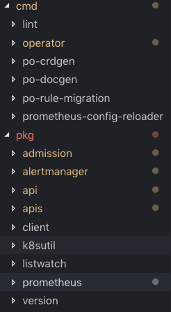

# 1. 背景
为什么需要Prometheus-Operator呢？
Prometheus原理简单来说是通过ip和port获取采集器内容，解析采集内容保存在本地Prometheus 时序型数据库中。
但是，当我们采集器转义到Kubernetes集群后换将就发生较大变化。
* Kubernetes 管理的基本单位是pod，pod 随时可能delete、update、crate，scale，水平扩展能力比较强。这恰恰是Prometheus 弱点（ip、端口静态）。这个需要第三方功能来实现。
* 将Prometheus、AlertManager纳管在Kubernetes中，动态扩展。
* 权限管理。
* fork 仓库中添加部分注释，https://github.com/xiaoluwwwxiaolu/Prometheus-Operator

以上，是我认为Prometheus 监控Kubernetes集群需要Prometheus-Operator工具的几点原因。

## 1.1 阅读源码条件
之前关着门写过一个CRD Controller，没有参考点，也不知道到底有什么地方需要改进。同时之前做过一段时间prometheus,因此想着能否读Prometheus-Operator源码，一方面能对改进自定义Controller有不少想法，一方面为后面Prometheus-Operator使用打下坚实基础。

阅读Prometheus Operator基础：
* 熟悉Kubernetes各种对象使用
* 参考sample-Controller 实现一个自定义控制器
* 对client-go各个部件功能比较熟悉
* Prometheus 监控有较深理解（阅读Prometheus官网）

另外，阅读过程难免出问题，希望多多指正。

# 2. Prometheus-Operator总体理解
* 其实，所有Operator 都是在Controller基础上建立起来的，所有在理解Prometheus-Operator时多参看Controller 逻辑过程。

* Prometheus-Operator 有两个非常重要的功能
    * 通过label过滤监控的pod
    * 实现config file和Prometheus.yml分离（configmap管理）
* 代码主干内容是PrometheusController、AlertManagerController实现。另外是PrometheusRule 生成Prometheus Config文件

## 2.1 目录结构和功能

目录分两层，pkg是基本功能实现，cmd是上层逻辑代码调用pkg（有些是测试）。
* cmd
    * lint：实例化各种CRD对象
    * operator：Prometheus-Operator 主逻辑，核心是启动PrometheusController、AlertManagerController
    * po-crdgen: 实例化CRD对象
    * po-docgen: 生成文档，和业务无关，可以不看
    * po-rule-migration:合并rule文件
    * Prometheus-config-reload: 刷新Prometheus配置文件
* pkg
    * admission: http访问入口
    * alertmanager: 告警Controller
    * api: 操作各种CRD对象的api client
    * apis: 定义各种CRD对象的结构
    * client: 工具生成的
    * k8sutil：各种小工具
    * listwatch: 对所有对象的list watch动作封装
    * prometheus: Prometheus Controller，config信息生成

# 3. Prometheus-Operator逻辑图
* 图片比较大，建议离线放大看

# 4. 总结
* Prometheus-Operator监控采集器时通过Prometheus 注册机制实现的
* 在实例化对象时使用大量的工厂机制，但是我们自己的CRD对象只有一个，没法使用工厂。
* 使用TLSConfig 进行权限管理，而不是直接使用Kuberconfig文件（可改进）
* Promethues和AlertManager 采用的是单线程启动，还是阻塞的。不过监控本身不需要并发性。
* 使用Status字段，这也是Controller需要改进的。（可改进）

