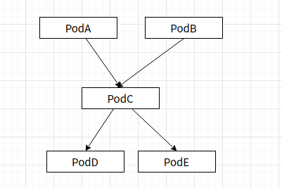
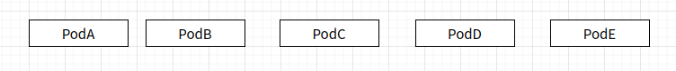

<!-- TOC -->

- [1.背景](#1背景)
    - [1.1 argo 启动pod原理](#11-argo-启动pod原理)
    - [1.2 存在的问题](#12-存在的问题)
    - [1.3 改进思路](#13-改进思路)
- [2. 解决问题](#2-解决问题)
    - [2.1 一次遍历创建所有workflow pod](#21-一次遍历创建所有workflow-pod)
        - [2.1.1 难点](#211-难点)
        - [2.1.2 解决思路](#212-解决思路)
    - [2.2 使用Init Container保证workflow pods执行顺序](#22-使用init-container保证workflow-pods执行顺序)
        - [2.2.1 难点：](#221-难点)
        - [2.2.2 解决思路](#222-解决思路)
    - [2.3 实现Inputs和Outputs功能](#23-实现inputs和outputs功能)
        - [2.3.1 难点](#231-难点)
        - [2.3.2 解决思路](#232-解决思路)
        - [2.3.3 该方案缺点](#233-该方案缺点)

<!-- /TOC -->
# 1.背景
## 1.1 argo 启动pod原理
以steps为例：
* 只有上一step所有节点completed，才create下一step的所有pod（因为outputs需要上一层Inputs结果，在controller中动态一层层渲染）
* Wait容器主要作用是监听Main容器是否结束，如果结束就保存容器outputs
* pod 启动顺序通过Controller保证
* workflow 事件存储在延时队列中，只有轮训到该workflow，才能依次进行预处理、校验、创建pod，节点维护


## 1.2 存在的问题
因为workflow node是一层层渲染展开的，会存在以下问题：
* controller一层层创建pod，增加创建pod时间开销
    * 容器除了Running，created和stopped也需要时间
    * workflow 延时队列轮训，增加了创建pod时间
    
* argo未从整个workflow角度考虑资源是否足够
    * 从调度角度来看，argo是从一个个小batch来提交任务请求的
    * 假设集群4GPU，workflow两个batch分别需要4 、5GPU，调度第二个batch会失败，前面分配4GPU 也浪费了
* argo 节点之间执行的顺序应该是固定的
    * 理论上一次遍历就能确定顺序，但是argo每次轮循都是从头递归遍历树

* 本次优化思路只针对第一点

## 1.3 改进思路
* 创建workflow时就创建所有的pod
    * 必须解决动态展开问题，同时支持Inputs和Outputs功能
    * pod先后顺序通过Init Container 保证
    * Inputs和Outputs值在Controller维护

    
    
# 2. 解决问题
argo标记父子节点状态流程如下:
* 首先判断根节点是否Completed，如果是return，否则下一步
* 判断所有子节点是否Completed，如果存在一个子节点不是Completed，就return，等待下一个轮训。如果节点未被创建，就创建节点，return 等待下一轮循。否则下一步
* 标记根节点Completed，return
## 2.1 一次遍历创建所有workflow pod
### 2.1.1 难点
* 修改后不影响workflow主干逻辑
### 2.1.2 解决思路
argo默认是一层层创建节点，改进后希望第一轮创建所有节点，接下来轮循是维护节点状态。

修改思路如下:
* 首先判断根节点是否Completed，如果是return，否则下一步
* 判断所有子节点是否Completed，如果存在一个子节点不是Completed，标记该节点为Not Completed。如果节点未被创建，就创建节点
* 判断根节点是否Completed，如果不是，return 等待下一个轮训。否则下一步
* 标记根节点Completed，return。

## 2.2 使用Init Container保证workflow pods执行顺序
### 2.2.1 难点：
* pod 太多，init container如何较好体现pod之间依赖关系
* argo 重启之后，pod执行顺序不能发生变化
### 2.2.2 解决思路
init Container解决的问题是父节点Completed，子节点的主容器才能启动。

根据每次轮训过程，不管argo是什么样状态，每一个轮训都可以获取所有节点的依赖关系以及节点状态，即使argo重启也不影响。因此这部分是比较合适作为InitContainer判断结束的标准。

实现思路如下:
* controller通过server暴露所有workflow 节点是否Completed
* 创建pod时，由Controller为Pod添加InitContainer，command是查询父节点状态请求
* server 设计:
    * server 存储节点状态的数据结构:map[string]bool{"namespace/wf_name/node_name":true}
    * request请求包含所有希望查询的父节点 
        * request: http://server_ip:server_port/?node1&node2...
    * response 返回的信息是该节点主容器是否允许被拉起来
        * response:{http code:404,value:false} or {http code:200,value:true}
* init command 命令（做过小测试）:
    ```
    #!/bin/bash
    while : 
    do	
    code=$(curl  -o /dev/null -s -w %{http_code}  http://server_ip:server_port\?key)
    if [ "$code" == '200' ]; then
        echo  "get key success"
        exit  0;
    fi
    echo sleep...
    sleep 3s
    done
    ```
## 2.3 实现Inputs和Outputs功能
### 2.3.1 难点
* 启动主容器时，Inputs参数需要被main容器感知（较麻烦）
    * 通过环境变量和配置文件都是容器起来之后才能获取环境变量和配置文件，不符合需求
    * 如果不将用户command命令作为启动命令（容器中PID=1），pod的status 就没办法直接和用户进程状态绑定(exit0->success,exit 1 ->failed)
* 通过什么方式去赋值Inputs
### 2.3.2 解决思路
这部分逻辑是父节点Completed后，将父节点Outputs塞进子节点Inputs变量中。因此该模块必须要感知workflow nodes生命周期。

argo每一层的参数渲染流程是固定的：
* 在轮训到某一层时，argo定义局部Scop map存储Outputs/Inputs参数
* 当感知该层Completed后，将Outputs 存储到map中
* 轮训到下一层时，使用Scop存储的参数赋值给模板变量，然后创建node


改进思路：
* 由argo系统定义main容器的启动命令，但是要求启动进程(PID=1)和用户进程绑定
    * 使用信号量和启动进程绑定
* 将上面最后一步变成使用client-go api给main容器执行用户命令
```
启动pod添加类似脚本：(做过小测试)
apiVersion: v1
kind: ConfigMap
metadata:
     name: my-configmap
data:
     entrypoint.sh: |-
       #!/bin/bash
       trap 'exit 0' USR1
       trap 'exit 1' USR2
       sleep 7d &
       wait $!
       exit 1
---
apiVersion: v1
kind: Pod
metadata:
     name: my-pod
spec:
     restartPolicy: Never
     containers:
     - name: my-container
       image: docker/whalesay
       command:
       - /bin/entrypoint.sh
       volumeMounts:
       - name: configmap-volume
         mountPath: /bin/entrypoint.sh
         readOnly: true
         subPath: entrypoint.sh
     volumes:
     - name: configmap-volume
       configMap:
         defaultMode: 0700
         name: my-configmap
```
```
controller根据用户进程退出状态发送信号:
exec main-process
if $?==0:
    kill -USR1 1(pid)
else:
    kill -USR2 1
```
### 2.3.3 该方案缺点
* 用户进程PID不再是1
* main容器中必须要有类似sleep进程
* describe pod 会发现用户command发生变化，但是describe workflow可以查到