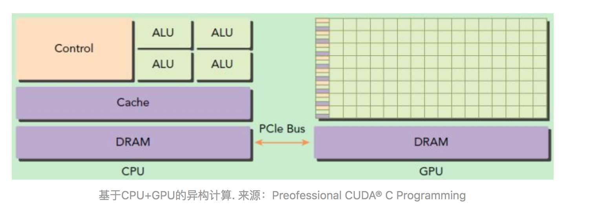

<!-- TOC -->

- [1. 背景](#1-背景)
- [2. cuda编程模型基础](#2-cuda编程模型基础)
    - [2.1 cuda程序执行流程](#21-cuda程序执行流程)
    - [2.2 cuda三个函数类型](#22-cuda三个函数类型)
    - [2.3 kernel线程层次结构](#23-kernel线程层次结构)

<!-- /TOC -->
# 1. 背景
* 2006年，NVIDIA公司发布了CUDA，CUDA是建立在NVIDIA的GPUs上的一个通用并行计算平台和编程模型，基于CUDA编程可以利用GPUs的并行计算引擎来更加高效地解决比较复杂的计算难题。

* GPU并不是一个独立运行的计算平台，而需要与CPU协同工作，可以看成是CPU的协处理器，因此当我们在说GPU并行计算时，其实是指的基于CPU+GPU的异构计算架构

* 在异构计算架构中，GPU与CPU通过PCIe总线连接在一起来协同工作，CPU所在位置称为为主机端（host），而GPU所在位置称为设备端（device），如下图所示。

* 可以看到GPU包括更多的运算核心，其特别适合数据并行的计算密集型任务，如大型矩阵运算，而CPU的运算核心较少，但是其可以实现复杂的逻辑运算，因此其适合控制密集型任务。另外，CPU上的线程是重量级的，上下文切换开销大，但是GPU由于存在很多核心，其线程是轻量级的。因此，基于CPU+GPU的异构计算平台可以优势互补，CPU负责处理逻辑复杂的串行程序，而GPU重点处理数据密集型的并行计算程序，从而发挥最大功效。

# 2. cuda编程模型基础
* 在CUDA中，host和device是两个重要的概念，我们用host指代CPU及其内存，而用device指代GPU及其内存。
* CUDA程序中既包含host程序，又包含device程序，它们分别在CPU和GPU上运行。
* host与device之间可以进行通信，这样它们之间可以进行数据拷贝。
## 2.1 cuda程序执行流程
* 典型的CUDA程序的执行流程如下：
    * 分配host内存，并进行数据初始化；
    * 分配device内存，并从host将数据拷贝到device上；
    * 调用CUDA的核函数在device上完成指定的运算；
    * 将device上的运算结果拷贝到host上；
    * 释放device和host上分配的内存。
* 上面流程中最重要的一个过程是调用CUDA的核函数来执行并行计算，kernel是CUDA中一个重要的概念，kernel是在device上线程中并行执行的函数，核函数用__global__符号声明，在调用时需要用<<<grid, block>>>来指定kernel要执行的线程数量，在CUDA中，每一个线程都要执行核函数，并且每个线程会分配一个唯一的线程号thread ID，这个ID值可以通过核函数的内置变量threadIdx来获得。

## 2.2 cuda三个函数类型
由于GPU实际上是异构模型，所以需要区分host和device上的代码，在CUDA中是通过函数类型限定词开区别host和device上的函数，主要的三个函数类型限定词如下：
* \_\_global\_\_：在device上执行，从host中调用（一些特定的GPU也可以从device上调用），返回类型必须是void，不支持可变参数参数，不能成为类成员函数。注意用__global__定义的kernel是异步的，这意味着host不会等待kernel执行完就执行下一步。
* \_\_device\_\_：在device上执行，单仅可以从device中调用，不可以和__global__同时用。
* \_\_host\_\_：在host上执行，仅可以从host上调用，一般省略不写，不可以和__global__同时用，但可和__device__，此时函数会在device和host都编译。

## 2.3 kernel线程层次结构
* kernel在device上执行其实是启动很多线程，一个kernel启动的所有线程称为一个网格grid，同一个网格上的线程共享全局内存空间。

* grid是线程结构的第一层次，
