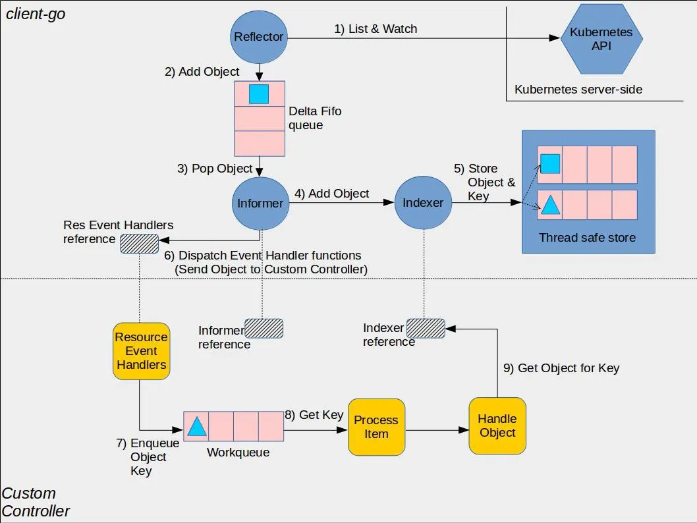

<!-- TOC -->

- [1. 背景](#1-背景)
- [2. 源码分析](#2-源码分析)

<!-- /TOC -->
# 1. 背景
*  informer负责各个组件和apiserver的资源和事件同步
*  深入理解informer有利于理解kubernetes事件处理机制和未来的瓶颈

* 简单来说，informer监听某些资源，从apiservice中接受该类型的资源变化，然后由用户注册的回调函数处理资源变化

# 2. 源码分析
* 以sample-controller 为例
    * 黄色的部分是controller相关的框架，包括workqueue
    * 蓝色部分是client-go的相关内容，包括informer, reflector(其实就是informer的封装), indexer
    * 从流程上看，reflector从apiserver中通过list&watch机制接收事件变化，进入Delta FIFO队列中，由informer进行处理。informer会将delta FIFO队列中的事件交给indexer组件，indexer组件会将事件持久化存储在本地的缓存中。之后，由于用户事先将为informer注册各种事件的回调函数，这些回调函数将针对不同的组件做不同的处理。例如在controller中，将把object放入workqueue中，之后由controller的业务逻辑中进行处理。处理的时候将从缓存中获取object的引用。即各组件对资源的处理仅限于本地缓存中，直到update资源的时候才与apiserver交互。
    

