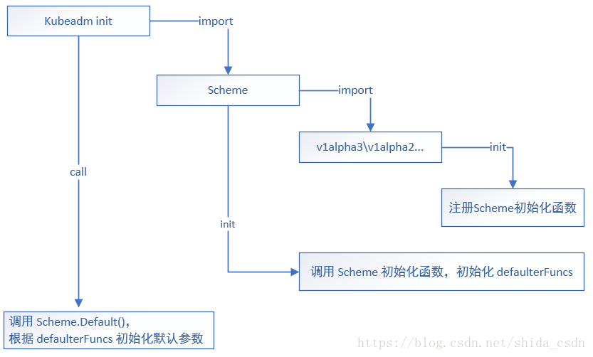
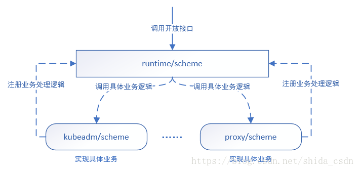

<!-- TOC -->

- [1. 背景](#1-背景)
- [2. scheme 源码分析（参考kubeadmin）](#2-scheme-源码分析参考kubeadmin)
    - [2.1  Scheme 的构造](#21--scheme-的构造)
    - [2.3 Scheme 的初始化](#23-scheme-的初始化)
        - [2.3.1 SchemeBuilder](#231-schemebuilder)
    - [2.4](#24)

<!-- /TOC -->
# 1. 背景
 cmd/kubeadm/app/cmd/init.go 中的 NewCmdInit 函数一开头就调用了如下代码
 ```
 func NewCmdInit(out io.Writer) *cobra.Command {
    externalcfg := &kubeadmapiv1beta1.InitConfiguration{}
    kubeadmscheme.Scheme.Default(externalcfg)
    ......
}
 ```

scheme作用是什么？

# 2. scheme 源码分析（参考kubeadmin）
经过分析，kubeadmscheme.Scheme.Default(externalcfg)  的作用就是对 externalcfg 进行初始化赋值

注意这里设定的默认值指的是不通过 flag 设置的那些值，因此不会覆盖用户手动传递进来的参数值

那么它是如何工作的呢？

## 2.1  Scheme 的构造
 我们找到 kubeadmscheme.Scheme 的定义，cmd/kubeadm/app/apis/kubeadm/scheme/scheme.go

 ```
    package scheme
     
    import (
    	metav1 "k8s.io/apimachinery/pkg/apis/meta/v1"
    	"k8s.io/apimachinery/pkg/runtime"
    	"k8s.io/apimachinery/pkg/runtime/schema"
    	"k8s.io/apimachinery/pkg/runtime/serializer"
    	utilruntime "k8s.io/apimachinery/pkg/util/runtime"
    	"k8s.io/kubernetes/cmd/kubeadm/app/apis/kubeadm"
    	"k8s.io/kubernetes/cmd/kubeadm/app/apis/kubeadm/v1alpha2"
    	"k8s.io/kubernetes/cmd/kubeadm/app/apis/kubeadm/v1alpha3"
    )
     
    // Scheme is the runtime.Scheme to which all kubeadm api types are registered.
    var Scheme = runtime.NewScheme()
     
    // Codecs provides access to encoding and decoding for the scheme.
    var Codecs = serializer.NewCodecFactory(Scheme)
     
    func init() {
    	metav1.AddToGroupVersion(Scheme, schema.GroupVersion{Version: "v1"})
    	AddToScheme(Scheme)
    }
     
    // AddToScheme builds the kubeadm scheme using all known versions of the kubeadm api.
    func AddToScheme(scheme *runtime.Scheme) {
    	utilruntime.Must(kubeadm.AddToScheme(scheme))
    	utilruntime.Must(v1alpha2.AddToScheme(scheme))
    	utilruntime.Must(v1alpha3.AddToScheme(scheme))
    	utilruntime.Must(scheme.SetVersionPriority(v1alpha3.SchemeGroupVersion))
    }

 ```
 *  经过分析，init 所做的工作就是初始化该Scheme，包括向 Scheme 注册了一系列的默认参数初始化函数
 * Scheme 的数据结构如下，与参数初始化相关的是 defaulterFuncs，它是一个 map 结构，后文介绍其作用
```
type Scheme struct {
	// versionMap allows one to figure out the go type of an object with
	// the given version and name.
	gvkToType map[schema.GroupVersionKind]reflect.Type
 
	// typeToGroupVersion allows one to find metadata for a given go object.
	// The reflect.Type we index by should *not* be a pointer.
	typeToGVK map[reflect.Type][]schema.GroupVersionKind
 
	// unversionedTypes are transformed without conversion in ConvertToVersion.
	unversionedTypes map[reflect.Type]schema.GroupVersionKind
 
	// unversionedKinds are the names of kinds that can be created in the context of any group
	// or version
	// TODO: resolve the status of unversioned types.
	unversionedKinds map[string]reflect.Type
 
	// Map from version and resource to the corresponding func to convert
	// resource field labels in that version to internal version.
	fieldLabelConversionFuncs map[schema.GroupVersionKind]FieldLabelConversionFunc
 
	// defaulterFuncs is an array of interfaces to be called with an object to provide defaulting
	// the provided object must be a pointer.
	defaulterFuncs map[reflect.Type]func(interface{})
 
	// converter stores all registered conversion functions. It also has
	// default converting behavior.
	converter *conversion.Converter
 
	// versionPriority is a map of groups to ordered lists of versions for those groups indicating the
	// default priorities of these versions as registered in the scheme
	versionPriority map[string][]string
 
	// observedVersions keeps track of the order we've seen versions during type registration
	observedVersions []schema.GroupVersion
 
	// schemeName is the name of this scheme.  If you don't specify a name, the stack of the NewScheme caller will be used.
	// This is useful for error reporting to indicate the origin of the scheme.
	schemeName string
}
```
## 2.3 Scheme 的初始化
我们很容易注意到，init 函数调用了AddToScheme 函数，那它是干什么用的呢？

以 v1alpha3 为例，

跟踪到 cmd/kubeadm/app/apis/kubeadm/v1alpha3/register.go
```
// GroupName is the group name use in this package
const GroupName = "kubeadm.k8s.io"
 
// SchemeGroupVersion is group version used to register these objects
var SchemeGroupVersion = schema.GroupVersion{Group: GroupName, Version: "v1alpha3"}
 
var (
	// TODO: move SchemeBuilder with zz_generated.deepcopy.go to k8s.io/api.
	// localSchemeBuilder and AddToScheme will stay in k8s.io/kubernetes.
 
	// SchemeBuilder points to a list of functions added to Scheme.
	SchemeBuilder      runtime.SchemeBuilder
	localSchemeBuilder = &SchemeBuilder
	// AddToScheme applies all the stored functions to the scheme.
	AddToScheme = localSchemeBuilder.AddToScheme
)
 
func init() {
	// We only register manually written functions here. The registration of the
	// generated functions takes place in the generated files. The separation
	// makes the code compile even when the generated files are missing.
	localSchemeBuilder.Register(addKnownTypes, addDefaultingFuncs)
}
 
// Kind takes an unqualified kind and returns a Group qualified GroupKind
func Kind(kind string) schema.GroupKind {
	return SchemeGroupVersion.WithKind(kind).GroupKind()
}
 
// Resource takes an unqualified resource and returns a Group qualified GroupResource
func Resource(resource string) schema.GroupResource {
	return SchemeGroupVersion.WithResource(resource).GroupResource()
}
 
func addKnownTypes(scheme *runtime.Scheme) error {
	scheme.AddKnownTypes(SchemeGroupVersion,
		&InitConfiguration{},
		&ClusterConfiguration{},
		&ClusterStatus{},
		&JoinConfiguration{},
	)
	metav1.AddToGroupVersion(scheme, SchemeGroupVersion)
	return nil
}
```
* v1alpha3.AddToScheme 函数实际上是 localSchemeBuilder.AddToScheme 的别名
*  localSchemeBuilder 则是 runtime.SchemeBuilder 类型的，


### 2.3.1 SchemeBuilder
我们继续跟踪到 SchemeBuilder 的定义
```
package runtime
 
// SchemeBuilder collects functions that add things to a scheme. It's to allow
// code to compile without explicitly referencing generated types. You should
// declare one in each package that will have generated deep copy or conversion
// functions.
type SchemeBuilder []func(*Scheme) error
 
// AddToScheme applies all the stored functions to the scheme. A non-nil error
// indicates that one function failed and the attempt was abandoned.
func (sb *SchemeBuilder) AddToScheme(s *Scheme) error {
	for _, f := range *sb {
		if err := f(s); err != nil {
			return err
		}
	}
	return nil
}
 
// Register adds a scheme setup function to the list.
func (sb *SchemeBuilder) Register(funcs ...func(*Scheme) error) {
	for _, f := range funcs {
		*sb = append(*sb, f)
	}
}
 
// NewSchemeBuilder calls Register for you.
func NewSchemeBuilder(funcs ...func(*Scheme) error) SchemeBuilder {
	var sb SchemeBuilder
	sb.Register(funcs...)
	return sb
}
```

 可以看到，SchemeBuilder 实际上是一个函数数组，

而其 AddToScheme 函数就是将自己包含的处理函数依次应用到 Scheme 上，

给人的感觉好像是过滤器似的，让 Scheme 分别被定义好的函数们给处理一遍，
注意这个处理并不是“加载默认参数”这类处理，而是初始化 Scheme 的相关处理

而这些 “函数们” 在哪里注册进来的呢？当然是通过 cmd/kubeadm/app/apis/kubeadm/v1alpha3/register.go 的 init 了

## 2.4
 Scheme 中处理函数的注册

 看 cmd/kubeadm/app/apis/kubeadm/v1alpha3/register.go 的 init 函数
 该函数通过调用 SchemeBuilder 的 Register 方法，将函数 addKnownTypes 和 addDefaultingFuncs 注册进 Scheme 
实际上就是将 Scheme 处理函数加到了 SchemeBuilder 函数数组里
再看看 addDefaultingFuncs 的函数定义，cmd/kubeadm/app/apis/kubeadm/v1alpha3/defaults.go

```
func addDefaultingFuncs(scheme *runtime.Scheme) error {
	return RegisterDefaults(scheme)
}
```
继续跟踪到 cmd/kubeadm/app/apis/kubeadm/v1alpha3/zz_generated.defaults.go （该文件是自动生成的）
```

    // RegisterDefaults adds defaulters functions to the given scheme.
    // Public to allow building arbitrary schemes.
    // All generated defaulters are covering - they call all nested defaulters.
    func RegisterDefaults(scheme *runtime.Scheme) error {
    	scheme.AddTypeDefaultingFunc(&ClusterConfiguration{}, func(obj interface{}) { SetObjectDefaults_ClusterConfiguration(obj.(*ClusterConfiguration)) })
    	scheme.AddTypeDefaultingFunc(&ClusterStatus{}, func(obj interface{}) { SetObjectDefaults_ClusterStatus(obj.(*ClusterStatus)) })
    	scheme.AddTypeDefaultingFunc(&InitConfiguration{}, func(obj interface{}) { SetObjectDefaults_InitConfiguration(obj.(*InitConfiguration)) })
    	scheme.AddTypeDefaultingFunc(&JoinConfiguration{}, func(obj interface{}) { SetObjectDefaults_JoinConfiguration(obj.(*JoinConfiguration)) })
    	return nil
    }
```
  RegisterDefaults 函数分别对不同的数据类型（如 InitConfiguration、JoinConfiguration等）定义了对应的初始化方法
  看一下 AddTypeDefaultingFunc 的定义，
  ```
  // AddTypeDefaultingFunc registers a function that is passed a pointer to an
// object and can default fields on the object. These functions will be invoked
// when Default() is called. The function will never be called unless the
// defaulted object matches srcType. If this function is invoked twice with the
// same srcType, the fn passed to the later call will be used instead.
func (s *Scheme) AddTypeDefaultingFunc(srcType Object, fn func(interface{})) {
	s.defaulterFuncs[reflect.TypeOf(srcType)] = fn
}
```

 发现是以数据类型为Key，以对该数据类型的初始化处理函数为value，

存进了 Scheme 的 defaulterFuncs Map 属性中了

反过来，看下开始那句 kubeadmscheme.Scheme.Default(externalcfg)

它定义在 /staging/src/k8s.io/apimachinery/pkg/runtime/scheme.go

```
// Default sets defaults on the provided Object.
func (s *Scheme) Default(src Object) {
	if fn, ok := s.defaulterFuncs[reflect.TypeOf(src)]; ok {
		fn(src)
	}
}
```


 恰恰是读取了这个 defaulterFuncs map 中定义的处理函数，

按照数据类型选择合适的处理函数依次对不同的数据类型进行处理（赋值）

## 2.5 整体流程图



# 3. 设计总结
k8s 在设计上抽象出了 Scheme 的概念(即 runtime/scheme)，向开发者提供了一个框架，

各模块需要根据需求实现各自具体的 Scheme（如 kubeadm/scheme）

而具体实现的过程就是将自己的处理逻辑注册到 Scheme，让 Scheme 能真正工作

调用的时候，我们只需要调用框架提供的开放接口，如 Scheme.Default(externalcfg)

框架就会自动地通过反射找到我们已经注册好的处理逻辑进行正确的业务处理了



# 4. 实现自定义 Scheme
以初始化默认参数为例，实现一个自定义的 Scheme 至少应该做如下几步：
```
import  "k8s.io/apimachinery/pkg/runtime"                                                                       //  1.  引入 runtime 包

Scheme = runtime.NewScheme()                                                                                      //  2.  实例化 Scheme

Scheme.AddTypeDefaultingFunc(<结构体引用>, <给结构体设置默认值的函数>)     //  3.  注册默认参数赋值处理函数

```
