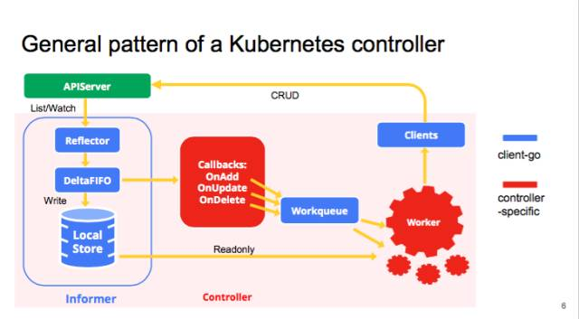

<!-- TOC -->

- [1. 背景](#1-背景)
- [2. 通用队列](#2-通用队列)
    - [2.1 Add 函数实现](#21-add-函数实现)
    - [2.2 Get 函数](#22-get-函数)
    - [2.3 Done 函数](#23-done-函数)
    - [2.4 通用队列总结](#24-通用队列总结)
- [3. 延时队列](#3-延时队列)
    - [3.1 总结](#31-总结)
- [4.限速队列](#4限速队列)
    - [4.1 限速器](#41-限速器)
        - [4.1.1 ItemExponentialFailureRateLimiter](#411-itemexponentialfailureratelimiter)
        - [4.1.2 ItemFastSlowRateLimiter](#412-itemfastslowratelimiter)
        - [4.1.3 MaxOfRateLimiter](#413-maxofratelimiter)
        - [4.1.4 BucketRateLimiter](#414-bucketratelimiter)
    - [4.2 限速队列实现](#42-限速队列实现)
    - [4.3 总结](#43-总结)

<!-- /TOC -->
# 1. 背景


* client-go为什么要实现队列呢？在client-go中，队列有点类似于golang中的chan，主要用于开发并行程序间的数据同步。比如各种Controller通过client-go的informer监听对象变化，当有资源变化时通过回调函数将资源写入队列中，再由其他的协程完成处理。
 
* 这里肯定有人会问为什么不用chan呢？原因很简单，就是chan的功能过于单一，无法满足各类场景的需求，比如限制数据队列的写入速度。

* 由于kubernetes很多模块都有队列的需求，而且很多需求都一样，所以统一实现在了client-go中


* client-go中抽象了几种队列，包括通用队列、限速队列、延时队列等。这三种队列层层递进，可以作为我们参考时间队列的金典范例


# 2. 通用队列
看看client-go中的通用队列是怎么定义的：
```
// 代码源自client-go/util/workqueue/queue.go
// 这是一个interface类型，说明有其他的各种各样的实现
type Interface interface {
    Add(item interface{})                   // 向队列中添加一个元素，interface{}类型，说明可以添加任何类型的元素
    Len() int                               // 队列长度，就是元素的个数
    Get() (item interface{}, shutdown bool) // 从队列中获取一个元素，双返回值，这个和chan的<-很像，第二个返回值告知队列是否已经关闭了
    Done(item interface{})                  // 告知队列该元素已经处理完了
    ShutDown()                              // 关闭队列
    ShuttingDown() bool                     // 查询队列是否正在关闭
}
```
这里感觉感觉队列和chan很像，尤其是Get()函数和<-都是两个返回值，第一个返回元素，第二个告知队列是否已经关闭。但是队列和chan不同的地方在于Get()返回了元素但是不会从队列中移除，只有执行Done()函数后队列才会执行移除操作，而chan的<-调用直接从chan的对象中删除了。

看过了通用队列的抽象定义，本章节将会对client-go中实现的通用队列做说明，说明之前先看看几个重要的类型
```
// 代码源于client-go/util/workqueue/queue.go
type Type struct {
    queue []t              // 元素数组
    dirty set              // dirty的元素集合
    processing set         // 正在处理的元素集合
    cond *sync.Cond        // 与pthread_cond_t相同，条件同步
    shuttingDown bool      // 关闭标记
    metrics queueMetrics   // 这个metrics和prometheus的metrics概念相同，此处不做过多说明，知道功能就行
}
// 以下的这些类型定义也是够了，对于C/C++程序猿来说不能忍~
type empty struct{}        // 空类型，因为sizeof(struct{})=0
type t interface{}         // 元素类型是泛型
type set map[t]empty       // 用map实现的set，所有的value是空数据就行了
```

## 2.1 Add 函数实现
```
// 代码源自client-go/util/workqueue/queue.go
func (q *Type) Add(item interface{}) {
    // 和pthread_cond_t不同的是golang的cond自带了互斥锁
    q.cond.L.Lock()
    defer q.cond.L.Unlock()
    // 队列正在关闭，直接返回 
    if q.shuttingDown {
        return
    }
    // 已经标记为脏的数据，也直接返回，因为存储在了脏数据的集合中
    if q.dirty.has(item) {
        return
    }
    // 告知metrics添加了元素
    q.metrics.add(item)
    // 添加到脏数据集合中
    q.dirty.insert(item)
    // 元素刚被拿走处理，那就直接返回
    if q.processing.has(item) {
        return
    }
    // 追加到元素数组的尾部
    q.queue = append(q.queue, item)
    // 通知有新元素到了，此时有协程阻塞就会被唤醒
    q.cond.Signal()
}
```

## 2.2 Get 函数
```
// 代码源自client-go/util/workqueue/queue.go
func (q *Type) Get() (item interface{}, shutdown bool) {
    // 加锁解锁不解释
    q.cond.L.Lock()
    defer q.cond.L.Unlock()
    // 没有数据，阻塞协程
    for len(q.queue) == 0 && !q.shuttingDown {
        q.cond.Wait()
    }
    // 协程被激活但还没有数据，说明队列被关闭了，这个和chan一样
    if len(q.queue) == 0 {
        return nil, true
    }
 
    // 弹出第一个元素，我一直感觉golang的slice[1:]这种操作性能不太高~以后有时间看看代码实现
    item, q.queue = q.queue[0], q.queue[1:]
    // 通知metrics元素被取走了
    q.metrics.get(item)
    // 从dirty集合中移除，加入到processing集合，经过前面的分析这里就很好理解了
    q.processing.insert(item)
    q.dirty.delete(item)
 
    return item, false
}
```

## 2.3 Done 函数
```
// 代码源自client-go/util/workqueue/queue.go
func (q *Type) Done(item interface{}) {
    // 加锁解锁不解释
    q.cond.L.Lock()
    defer q.cond.L.Unlock()
    // 通知metrics元素处理完了
    q.metrics.done(item)
    // 从processing集合中删除
    q.processing.delete(item)
    // 重点来啦，此处判断脏元素集合，看看处理期间是不是又被添加，如果是那就在放到队列中，完全符合我们的分析
    if q.dirty.has(item) {
        q.queue = append(q.queue, item)
        q.cond.Signal()
    }
}
```

## 2.4 通用队列总结
* 在我的理解中，队列就是一个FIFO队列是等价的，不存在去重的功能。但是上面的通用队列确实包含了去重队列。
* 队列中包含了shutdown功能
* dirt字段和process字段设计的很有意思。
    * dirt元素包含type中的元素，去重也是根据dirt（set集合）实现的
    * processing存放的是在队列中Get的元素，因为分布式是由延时的，必须要有一个类似set结构保存取出来的数据，避免数据丢失


# 3. 延时队列
client-go中对于延时队列的抽象如下：
```
// 代码源自client-go/util/workqueue/delaying_queue.go
type DelayingInterface interface {
    Interface                                          // 继承了通用队列所有接口                   
    AddAfter(item interface{}, duration time.Duration) // 增加了延迟添加的接口
}
```
从延时队列的抽象来看，和通用队列基本一样，只是多了延迟添加的接口， 也就增加了一些机制实现元素的延迟添加，这一点可以从延时队列的实现类型上可以看出：

```
// 代码源自client-go/util/workqueue/delaying_queue.go
type delayingType struct {
    Interface                      // 这参数不出意外是通用队列的实现
    clock clock.Clock              // 时钟，用于获取时间
    stopCh chan struct{}           // 延时就意味着异步，就要有另一个协程处理，所以需要退出信号
    heartbeat clock.Ticker         // 定时器，在没有任何数据操作时可以定时的唤醒处理协程，定义为心跳没毛病
    waitingForAddCh chan *waitFor  // 所有延迟添加的元素封装成waitFor放到chan中
    metrics retryMetrics           // 和通用队列中的metrics功能类似
}
// 
type waitFor struct {
    data    t                      // 元素数据，这个t就是在通用队列中定义的类型interface{}
    readyAt time.Time              // 在什么时间添加到队列中
    index int                      // 这是个索引，后面会详细说明
}

```
在分析延时队列如何利用上面定义的数据结构实现功能之前我们需要了解另一个东西：
```
// 代码源自client-go/util/workqueue/delaying_queue.go
// waitFor的定义上面有，是需要延时添加的元素都要封装成这个类型
// waitForPriorityQueue就把需要延迟的元素形成了一个队列，队列按照元素的延时添加的时间(readyAt)从小到大排序
// 实现的策略就是实现了go/src/container/heap/heap.go中的Interface类型，读者可以自行了解heap
// 这里只需要知道waitForPriorityQueue这个数组是有序的，排序方式是按照时间从小到大
type waitForPriorityQueue []*waitFor
// heap需要实现的接口，告知队列长度
func (pq waitForPriorityQueue) Len() int {
    return len(pq)
}
// heap需要实现的接口，告知第i个元素是否比第j个元素小
func (pq waitForPriorityQueue) Less(i, j int) bool {
    return pq[i].readyAt.Before(pq[j].readyAt) // 此处对比的就是时间，所以排序按照时间排序
}
// heap需要实现的接口，实现第i和第j个元素换
func (pq waitForPriorityQueue) Swap(i, j int) {
    // 这种语法好牛逼，有没有，C/C++程序猿没法理解~
    pq[i], pq[j] = pq[j], pq[i]
    pq[i].index = i                            // 因为heap没有所以，所以需要自己记录索引，这也是为什么waitFor定义索引参数的原因
    pq[j].index = j
}
// heap需要实现的接口，用于向队列中添加数据
func (pq *waitForPriorityQueue) Push(x interface{}) {
    n := len(*pq)                       
    item := x.(*waitFor)
    item.index = n                             // 记录索引值
    *pq = append(*pq, item)                    // 放到了数组尾部
}
// heap需要实现的接口，用于从队列中弹出最后一个数据
func (pq *waitForPriorityQueue) Pop() interface{} {
    n := len(*pq)
    item := (*pq)[n-1]
    item.index = -1
    *pq = (*pq)[0:(n - 1)]                     // 缩小数组，去掉了最后一个元素
    return item
}
// 返回第一个元素
func (pq waitForPriorityQueue) Peek() interface{} {
    return pq[0]
}
```
 因为延时队列利用waitForPriorityQueue管理所有延时添加的元素，所有的元素在waitForPriorityQueue中按照时间从小到大排序，对于延时队列的处理就会方便很多了。

接下来我们就可以分析延时队列的实现了，因为延时队列集成通用队列，所以这里只对新增的函数做说明：
```
// 代码源自client-go/util/workqueue/delaying_queue.go
func (q *delayingType) AddAfter(item interface{}, duration time.Duration) {
    // 如果队列关闭就直接退出
    if q.ShuttingDown() {
        return
    }
    // 记录metrics
    q.metrics.retry()
    // 不需要延迟，那就直接像通用队列一样添加
    if duration <= 0 {
        q.Add(item)
        return
    }
 
    // 把元素封装成waitFor传入chan，切记select没有default，所以可能会被阻塞
    // 这里面用到了stopChan，因为有阻塞的可能，所以用stopChan可以保证退出
    select {
    case <-q.stopCh:
    case q.waitingForAddCh <- &waitFor{data: item, readyAt: q.clock.Now().Add(duration)}:
    }
}
```
AddAfter()就是简单把元素送到chan中， 所以核心实现在从chan中获取数据那部分， 如下所示：
```
// 代码源自client-go/util/workqueue/delaying_queue.go
// 这部分就是演示队列的核心代码
func (q *delayingType) waitingLoop() {
    defer utilruntime.HandleCrash()
    // 这个变量后面会用到，当没有元素需要延时添加的时候利用这个变量实现长时间等待
    never := make(<-chan time.Time)
    // 构造我们上面提到的有序队列了，并且初始化
    waitingForQueue := &waitForPriorityQueue{}
    heap.Init(waitingForQueue)
    // 这个map是用来避免对象重复添加的，如果重复添加就只更新时间
    waitingEntryByData := map[t]*waitFor{}
    // 开始无限循环
    for {
        // 队列关闭了，就可以返回了
        if q.Interface.ShuttingDown() {
            return
        }
        // 获取当前时间
        now := q.clock.Now()
        // 有序队列中是否有元素，有人肯定会问还没向有序队列里添加呢判断啥啊？后面会有添加哈
        for waitingForQueue.Len() > 0 {
            // Peek函数我们前面注释了，获取第一个元素，注意：不会从队列中取出哦
            entry := waitingForQueue.Peek().(*waitFor)
            // 元素指定添加的时间过了么？如果没有过那就跳出循环
            if entry.readyAt.After(now) {
                break
            }
            // 既然时间已经过了，那就把它从有序队列拿出来放入通用队列中，这里面需要注意几点：
            // 1.heap.Pop()弹出的是第一个元素，waitingForQueue.Pop()弹出的是最后一个元素
            // 2.从有序队列把元素弹出，同时要把元素从上面提到的map删除，因为不用再判断重复添加了
            // 3.此处是唯一一个地方把元素从有序队列移到通用队列，后面主要是等待时间到过程
            entry = heap.Pop(waitingForQueue).(*waitFor)
            q.Add(entry.data)
            delete(waitingEntryByData, entry.data)
        }
 
        // 如果有序队列中没有元素，那就不用等一段时间了，也就是永久等下去
        // 如果有序队列中有元素，那就用第一个元素指定的时间减去当前时间作为等待时间，逻辑挺简单
        // 有序队列是用时间排序的，后面的元素需要等待的时间更长，所以先处理排序靠前面的元素
        nextReadyAt := never
        if waitingForQueue.Len() > 0 {
            entry := waitingForQueue.Peek().(*waitFor)
            nextReadyAt = q.clock.After(entry.readyAt.Sub(now))
        }
        // 进入各种等待
        select {
        // 有退出信号么？
        case <-q.stopCh:
            return
        // 定时器，没过一段时间没有任何数据，那就再执行一次大循环，从理论上讲这个没用，但是这个具备容错能力，避免BUG死等
        case <-q.heartbeat.C():
        // 这个就是有序队列里面需要等待时间信号了，时间到就会有信号
        case <-nextReadyAt:
        // 这里是从chan中获取元素的，AddAfter()放入chan中的元素
        case waitEntry := <-q.waitingForAddCh:
            // 如果时间已经过了就直接放入通用队列，没过就插入到有序队列
            if waitEntry.readyAt.After(q.clock.Now()) {
                insert(waitingForQueue, waitingEntryByData, waitEntry)
            } else {
                q.Add(waitEntry.data)
            }
            // 下面的代码看似有点多，目的就是把chan中的元素一口气全部取干净，注意用了default意味着chan中没有数据就会立刻停止
            drained := false
            for !drained {
                select {
                case waitEntry := <-q.waitingForAddCh:
                    if waitEntry.readyAt.After(q.clock.Now()) {
                        insert(waitingForQueue, waitingEntryByData, waitEntry)
                    } else {
                        q.Add(waitEntry.data)
                    }
                default:
                    drained = true
                }
            }
        }
    }
}
// 下面的代码是把元素插入有序队列的实现
func insert(q *waitForPriorityQueue, knownEntries map[t]*waitFor, entry *waitFor) {
    // 看看元素是不是被添加过？如果添加过看谁的时间靠后就用谁的时间
    existing, exists := knownEntries[entry.data]
    if exists {
        if existing.readyAt.After(entry.readyAt) {
            existing.readyAt = entry.readyAt
            heap.Fix(q, existing.index)
        }
 
        return
    }
    // 把元素放入有序队列中，并记录在map里面,这个map就是上面那个用于判断对象是否重复添加的map
    // 注意，这里面调用的是heap.Push，不是waitForPriorityQueue.Push
    heap.Push(q, entry)
    knownEntries[entry.data] = entry
}
```
到这里延时队列核心代码基本分析完了，其重要的一点就是golang的heap，他辅助实现了元素按时间先后进行排序，这样延时队列就可以一个一个的等待超时添加了。heap的排序算法实现非常有意思，有兴趣的读者可以看看，我是准备用专门的文章介绍的。

## 3.1 总结
* 限速队列是在普通队列上加上了一个延时结构。
* 在实现延时队列中，在append到普通队列前先push进入到waitForPriorityQueue队列，该队列是根据时间有序序列
* 延时代表的是异步的，在延时队列实现使用了通道
* 心跳是为了避免无限等待故障

# 4.限速队列
限速队列应用非常广泛，比如我们做某些操作失败时希望重试几次，但是立刻重试很有可能还会失败，我们希望延迟一段时间在重试，而且失败次数越多延迟时间越长，这个时候就有限速的概念在里面了。在分析限速队列前，我们需要知道限速器。

## 4.1 限速器
限速器是client-go的一种抽象，具体实现可以有很多种，比如比较极端的就是不限制任何速度，我们来看看限速器的抽象是如何定义的：
```
// 代码源自client-go/util/workqueue/default_rate_limiter.go
type RateLimiter interface {
    When(item interface{}) time.Duration // 返回元素需要等待多长时间
    Forget(item interface{})             // 抛弃该元素，意味着该元素已经被处理了
    NumRequeues(item interface{}) int    // 元素放入队列多少次了
}
```
如果对于限速器还没有比较直观的认识，我们可以通过几个实际的限速器加深认识。

### 4.1.1 ItemExponentialFailureRateLimiter
ItemExponentialFailureRateLimiter是比较常用的限速器，他会根据元素错误次数逐渐累加等待时间，具体实现如下：
```
// 代码源自client-go/util/workqueue/default_rate_limiters.go
// 限速器的定义
type ItemExponentialFailureRateLimiter struct {
    failuresLock sync.Mutex           // 互斥锁
    failures     map[interface{}]int  // 记录每个元素错误次数，每调用一次When累加一次
 
    baseDelay time.Duration           // 元素延迟基数，算法后面会有说明
    maxDelay  time.Duration           // 元素最大的延迟时间
}
// 实现限速器的When接口
func (r *ItemExponentialFailureRateLimiter) When(item interface{}) time.Duration {
    r.failuresLock.Lock()
    defer r.failuresLock.Unlock()
    // 累加错误计数，比较好理解
    exp := r.failures[item]
    r.failures[item] = r.failures[item] + 1
 
    // 通过错误次数计算延迟时间，公式是2^i * baseDelay,按指数递增，符合Exponential名字
    backoff := float64(r.baseDelay.Nanoseconds()) * math.Pow(2, float64(exp))
    if backoff > math.MaxInt64 {
        return r.maxDelay
    }
    // 计算后的延迟值和最大延迟值二者取最小值
    calculated := time.Duration(backoff)
    if calculated > r.maxDelay {
        return r.maxDelay
    }
 
    return calculated
}
// 实现限速器的NumRequeues接口，很简单，没什么好说的
func (r *ItemExponentialFailureRateLimiter) NumRequeues(item interface{}) int {
    r.failuresLock.Lock()
    defer r.failuresLock.Unlock()
 
    return r.failures[item]
}
//  实现限速器的Forget接口，也很简单，没什么好说的
func (r *ItemExponentialFailureRateLimiter) Forget(item interface{}) {
    r.failuresLock.Lock()
    defer r.failuresLock.Unlock()
 
    delete(r.failures, item)
}
```
使用ItemExponentialFailureRateLimiter的可以认为是错误后不断尝试的过程，而且随着尝试次数的增加按照指数增加延迟时间。

### 4.1.2 ItemFastSlowRateLimiter
ItemFastSlowRateLimiter和ItemExponentialFailureRateLimiter很像，都是用于错误尝试的，但是ItemFastSlowRateLimiter的限速策略是尝试次数超过阈值用长延迟，否则用短延迟。我们来看看具体实现：
```
// 代码源自client-go/util/workqueue/default_rate_limiters.go
// 限速器定义
type ItemFastSlowRateLimiter struct {
    failuresLock sync.Mutex          // 互斥锁
    failures     map[interface{}]int // 错误次数计数
 
    maxFastAttempts int              // 错误尝试阈值
    fastDelay       time.Duration    // 短延迟时间
    slowDelay       time.Duration    // 长延迟时间
}
// 限速器实现When接口
func (r *ItemFastSlowRateLimiter) When(item interface{}) time.Duration {
    r.failuresLock.Lock()
    defer r.failuresLock.Unlock()
 
    // 累加错误计数
    r.failures[item] = r.failures[item] + 1
    // 错误次数超过阈值用长延迟，否则用短延迟
    if r.failures[item] <= r.maxFastAttempts {
        return r.fastDelay
    }
 
	return r.slowDelay
}
// 限速器实现NumRequeues接口，比较简单不多解释
func (r *ItemFastSlowRateLimiter) NumRequeues(item interface{}) int {
    r.failuresLock.Lock()
    defer r.failuresLock.Unlock()
 
    return r.failures[item]
}
// 限速器实现Forget接口，比较简单不多解释
func (r *ItemFastSlowRateLimiter) Forget(item interface{}) {
    r.failuresLock.Lock()
    defer r.failuresLock.Unlock()
 
    delete(r.failures, item)
}
```
### 4.1.3 MaxOfRateLimiter
MaxOfRateLimiter是一个非常有意思的限速器，他内部有多个限速器，每次返回最悲观的。何所谓最悲观的，比如内部有三个限速器，When()接口返回的就是三个限速器里面延迟最大的。让我们看看具体实现：
```
// 代码源自client-go/util/workqueue/default_rate_limiters.go
type MaxOfRateLimiter struct {
    limiters []RateLimiter   // 限速器数组，创建该限速器需要提供一个限速器数组
}
// 限速器实现When接口
func (r *MaxOfRateLimiter) When(item interface{}) time.Duration {
    ret := time.Duration(0)
    // 这里在获取所有限速里面时间最大的
    for _, limiter := range r.limiters {
        curr := limiter.When(item)
        if curr > ret {
            ret = curr
        }
    }
 
    return ret
}
// 限速器实现NumRequeues接口
func (r *MaxOfRateLimiter) NumRequeues(item interface{}) int {
	ret := 0
    // Requeues也是取最大值
    for _, limiter := range r.limiters {
        curr := limiter.NumRequeues(item)
        if curr > ret {
            ret = curr
        }
    }
 
    return ret
}
// 限速器实现Forget接口
func (r *MaxOfRateLimiter) Forget(item interface{}) {
    // 逐一遍历Forget就行了，比较简单
    for _, limiter := range r.limiters {
        limiter.Forget(item)
    }
}
```

### 4.1.4 BucketRateLimiter
BucketRateLimiter是利用golang.org.x.time.rate.Limiter实现固定速率(qps)的限速器，至于golang.org.x.time.rate.Limiter的实现原理读者可以自行分析，此处只对BucketRateLimiter做说明。
```
// 代码源自client-go/util/workqueue/default_rate_limiters.go
type BucketRateLimiter struct {
    *rate.Limiter                      // 这个就是golang.org.x.time.rate.Limiter
}
func (r *BucketRateLimiter) When(item interface{}) time.Duration {
    return r.Limiter.Reserve().Delay() // 获取延迟，这个延迟会是个相对固定的周期
}
func (r *BucketRateLimiter) NumRequeues(item interface{}) int {
    return 0                           // 因为固定频率的，也就不存在重试什么的了
}
func (r *BucketRateLimiter) Forget(item interface{}) {
}
```
BucketRateLimiter主要依靠golang.org.x.time.rate.Limiter，所以本身的代码基本没有啥内容，对于我们来说只要知道这个限速器可以提供稳定的QPS就可以啦~

## 4.2 限速队列实现
上面说了好多限速器，也该看看限速队列是怎么实现的了，client-go中对于限速队列的抽象如下：
```
// 代码源自client-go/util/workqueue/rate_limiting_queue.go
type RateLimitingInterface interface {
    DelayingInterface                 // 继承了延时队列
    AddRateLimited(item interface{})  // 按照限速方式添加元素的接口
    Forget(item interface{})          // 丢弃指定元素
    NumRequeues(item interface{}) int // 查询元素放入队列的次数
}
// 这个是限速队列的实现
type rateLimitingType struct {
    DelayingInterface                 // 同样要继承延迟队列
    rateLimiter RateLimiter           // 哈哈，这就对了嘛，加一个限速器就可以了
}
```
有了限速器的概念再来看限速队列就简单多了，通过限速器获取对象的延迟时间，然后通过延时方式放入队列，这样队列的内容就会按照我们要求的速率进入了。下面就是相应的代码，非常简单：
```
// 代码源自client-go/util/workqueue/rate_limitting_queue.go
func (q *rateLimitingType) AddRateLimited(item interface{}) {
    // 通过限速器获取延迟时间，然后加入到延时队列
    q.DelayingInterface.AddAfter(item, q.rateLimiter.When(item))
}
func (q *rateLimitingType) NumRequeues(item interface{}) int {
    return q.rateLimiter.NumRequeues(item) // 太简单了，不解释了
}
func (q *rateLimitingType) Forget(item interface{}) {
    q.rateLimiter.Forget(item)             // 太简单了，不解释了
}
```

## 4.3 总结
* 限速队列主要是在延时队列的基础上实现的
* Fotget代表该对象已经被成功处理
* 目的其实是非常重要的，一次可能不能被成功处理，如果处理失败，就重复处理