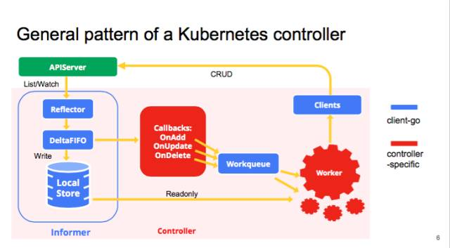
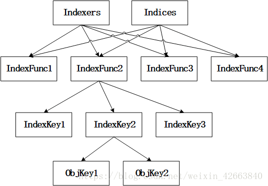

<!-- TOC -->

- [1. 背景](#1-背景)
- [2.Indexer功能介绍](#2indexer功能介绍)
    - [2.1 Indexer 数据结构](#21-indexer-数据结构)
        - [2.1.1 关键数据类型](#211-关键数据类型)
        - [2.1.2 Indexer 接口](#212-indexer-接口)
        - [2.1.3 Store 接口](#213-store-接口)
    - [2.2 Indexer实现之cache](#22-indexer实现之cache)
        - [2.2.1 cache数据结构](#221-cache数据结构)
        - [2.2.2 ThreadSafeStore](#222-threadsafestore)
- [2.3 cache 实现](#23-cache-实现)
- [3.kubernetes中主要的索引函数](#3kubernetes中主要的索引函数)
- [4. 总结](#4-总结)
    - [4.1 应用场景](#41-应用场景)

<!-- /TOC -->

* source
    * https://blog.csdn.net/weixin_42663840/article/details/81530606
# 1. 背景
介绍informer中的index索引机制

# 2.Indexer功能介绍
Informer是client-go的重要组成部分，由于Informer比较庞大，所以我们把它拆解成接独立的模块分析，本文分析的就是Indexer模块。


* Indexer是什么，从字面上看是索引器，他所在的位置就是Informer的LocalStore。
* 目的是加快索引对象速度


## 2.1 Indexer 数据结构
```
    // 代码源自client-go/tools/cache/index.go
    type Indexer interface {
        Store  // 此处继承了Store这个interface，定义在cliet-go/tool/cache/store.go中
        ......
    }
```

### 2.1.1 关键数据类型
Indexer在Store基础上扩展了索引能力，那Indexer是如何实现索引的呢?让我们来看看几个非常关键的类型：
```
// 代码源自client-go/tools/cache/index.go
type IndexFunc func(obj interface{}) ([]string, error) // 计算索引的函数，传入对象，输出字符串索引，注意是数组哦！
type Indexers map[string]IndexFunc                     // 计算索引的函数有很多，用名字分类
type Indices map[string]Index                          // 由于有多种计算索引的方式，那就又要按照计算索引的方式组织索引
type Index map[string]sets.String                      // 每种计算索引的方式会输出多个索引(数组)
                                                       // 而多个目标可能会算出相同索引，所以就有了这个类型
```
* 看着很晕，下面图帮组解释
    * 上面类型是两种最终访问ObjKey方式，一种是通过Obj访问，一种是通过key字符串访问
    * 图中不代表Indexers和Indices都指向了同一个数据，只是示意都用相同的IndexFunc的名字。
    * 索引类：IndexFunc1.....这些都是索引函数的名称，我们称之为索引类，大概意思就是把索引分类了；
    * 索引键：IndexKey1....这些是同一个对象在同一个索引类中的多个索引键值，我们称为索引键，切记索引键有多个；
    * 对象键：ObjKey1.....这些是对象键，每个对象都有唯一的名称；


### 2.1.2 Indexer 接口
有了上面的基础，我们再来看看Indexer与索引相关的接口都定义了哪些？
```
// 代码源自client-go/tools/cache/index.go
//这个接口实现的就是为了取上面三种类型数据，索引类、索引键、对象键
type Indexer interface {
    // 集成了存储的接口，前面提到了，后面会有详细说明
    Store
    // indexName索引类，obj是对象，计算obj在indexName索引类中的索引键，通过索引键把所有的对象取出来
    // 基本就是获取符合obj特征的所有对象，所谓的特征就是对象在索引类中的索引键
    Index(indexName string, obj interface{}) ([]interface{}, error)
    // indexKey是indexName索引类中一个索引键，函数返回indexKey指定的所有对象键
    // 这个对象键是Indexer内唯一的，在添加的时候会计算，后面讲具体Indexer实例的会讲解
    IndexKeys(indexName, indexKey string) ([]string, error)
    // 获取indexName索引类中的所有索引键
    ListIndexFuncValues(indexName string) []string
    // 这个函数和Index类似
    ByIndex(indexName, indexKey string) ([]interface{}, error)
    // 返回Indexers
    GetIndexers() Indexers
    // 添加Indexers，就是增加更多的索引分类
    AddIndexers(newIndexers Indexers) error
}
```

### 2.1.3 Store 接口
```
// 代码源自client-go/tools/cache/store.go
type Store interface {
    // 添加对象
    Add(obj interface{}) error
    // 更新对象
    Update(obj interface{}) error
    // 删除对象
    Delete(obj interface{}) error
    // 列举对象
    List() []interface{}
    // 列举对象键
    ListKeys() []string
    // 返回obj相同对象键的对象，对象键是通过对象计算出来的字符串
    Get(obj interface{}) (item interface{}, exists bool, err error)
    // 通过对象键获取对象
    GetByKey(key string) (item interface{}, exists bool, err error)
    // 用[]interface{}替换Store存储的所有对象，等同于删除全部原有对象在逐一添加新的对象
    Replace([]interface{}, string) error
    // 重新同步
    Resync() error
}
```
从Store的抽象来看，要求每个对象都要有唯一的键，至于键的计算方式就看具体实现了。我们看了半天的各种抽象，是时候讲解一波具体实现了。

## 2.2 Indexer实现之cache
### 2.2.1 cache数据结构
cache是Indexer的一种非常经典的实现，所有的对象缓存在内存中，而且从cache这个类型的名称来看属于包内私有类型，外部无法直接使用，只能通过专用的函数创建。其实cache的定义非常简单，如下所以：

```
// 代码源自client-go/tools/cache/store.go
type cache struct {
    cacheStorage ThreadSafeStore // 线程安全的存储
    keyFunc KeyFunc              // 计算对象键的函数
}
// 计算对象键的函数
type KeyFunc func(obj interface{}) (string, error)
```

这里可以看出来cache有一个计算对象键的函数，创建cache对象的时候就要指定这个函数了

### 2.2.2 ThreadSafeStore
从cache的定义来看，所有的功能基本是通过ThreadSafeStore这个类型实现的，keyFunc就是用来计算对象键的。所以，我们在分析cache之前，分析ThreadSafeStore是非常重要的，接下来就看看这个类型是如何定义的：
```
// 代码源自client-go/tools/cache/thread_safe_store.go
type ThreadSafeStore interface {
    Add(key string, obj interface{})
    Update(key string, obj interface{})
    Delete(key string)
    Get(key string) (item interface{}, exists bool)
    List() []interface{}
    ListKeys() []string
    Replace(map[string]interface{}, string)
    Index(indexName string, obj interface{}) ([]interface{}, error)
    IndexKeys(indexName, indexKey string) ([]string, error)
    ListIndexFuncValues(name string) []string
    ByIndex(indexName, indexKey string) ([]interface{}, error)
    GetIndexers() Indexers
    AddIndexers(newIndexers Indexers) error
    Resync() error
}
```
我为什么没有对ThreadSafeStore做注释呢？乍一看和Indexer这个itnerface基本一样，但还是有差别的，就是跟存储相关的接口。Indexer因为继承了Store，存储相关的增删改查输入都是对象，而ThreadSafeStore是需要提供对象键的。所以ThreadSafeStore和Indexer基本一样，也就没必要再写一遍注释，我们可以把精力主要放在具体的实现类上：
```
// 代码源自client-go/tools/cache/thread_safe_store.go
type threadSafeMap struct {
    lock  sync.RWMutex           // 读写锁，毕竟读的多写的少，读写锁性能要更好
    items map[string]interface{} // 存储对象的map，对象键:对象
    indexers Indexers            // 这个不用多解释了把，用于计算索引键的函数map
    indices Indices              // 快速索引表，通过索引可以快速找到对象键，然后再从items中取出对象
}
```
看了具体的实现类是不是感觉很简单？其实就是很简单，如果没有经过系统的梳理，如此简单的实现也不见的很容易看明白。我还是要在此强调一次，索引键和对象键是两个重要概念，索引键是用于对象快速查找的，经过索引建在map中排序查找会更快；对象键是为对象在存储中的唯一命名的，对象是通过名字+对象的方式存储的。

后续内容会简单很多，所以会把多个函数放在一起注释，下面就是和存储相关的函数的统一说明：
```
// 代码源自client-go/tools/cache/thread_safe_store.go
// 添加对象函数
func (c *threadSafeMap) Add(key string, obj interface{}) {
    // 加锁，因为是写操作，所以是全部互斥的那种
    c.lock.Lock()
    defer c.lock.Unlock()
    // 把老的对象取出来
    oldObject := c.items[key]
    // 写入新的对象
    c.items[key] = obj
    // 由于对象的添加就要更新索引
    c.updateIndices(oldObject, obj, key)
}
// 更新对象函数，和添加对象一模一样，所以就不解释了，为啥Add函数不直接调用Update呢？
func (c *threadSafeMap) Update(key string, obj interface{}) {
    c.lock.Lock()
    defer c.lock.Unlock()
    oldObject := c.items[key]
    c.items[key] = obj
    c.updateIndices(oldObject, obj, key)
}
// 删除对象
func (c *threadSafeMap) Delete(key string) {
    // 加锁，因为是写操作，所以是全部互斥的那种
    c.lock.Lock()
    defer c.lock.Unlock()
    // 判断对象是否存在？
    if obj, exists := c.items[key]; exists {
        // 删除对象的索引
        c.deleteFromIndices(obj, key)
        // 删除对象本身
        delete(c.items, key)
    }
}
// 获取对象
func (c *threadSafeMap) Get(key string) (item interface{}, exists bool) {
    // 此处只用了读锁
    c.lock.RLock()
    defer c.lock.RUnlock()
    // 利用对象键取出对象
    item, exists = c.items[key]
	return item, exists
}
// 列举对象
func (c *threadSafeMap) List() []interface{} {
    // 此处只用了读锁	
    c.lock.RLock()
    defer c.lock.RUnlock()
    // 直接遍历对象map就可以了
    list := make([]interface{}, 0, len(c.items))
    for _, item := range c.items {
        list = append(list, item)
    }
	return list
}
// 列举对象键
func (c *threadSafeMap) ListKeys() []string {
    // 此处只用了读锁	
    c.lock.RLock()
    defer c.lock.RUnlock()
    // 同样是遍历对象map，但是只输出对象键
    list := make([]string, 0, len(c.items))
    for key := range c.items {
        list = append(list, key)
    }
    return list
}
// 取代所有对象，相当于重新构造了一遍threadSafeMap
func (c *threadSafeMap) Replace(items map[string]interface{}, resourceVersion string) {
    // 此处必须要用全局锁，因为有写操作
    c.lock.Lock()
    defer c.lock.Unlock()
    // 直接覆盖以前的对象
    c.items = items
 
    // 重建索引
    c.indices = Indices{}
    for key, item := range c.items {
        c.updateIndices(nil, item, key)
    }
    // 发现没有，resourceVersion此处没有用到，估计是其他的Indexer实现有用
}
```
下面就是跟索引相关的函数了，也是我主要讲解的内容，所以每个函数都是独立注释的，我们一个一个的过：
```
// 代码源自client-go/tools/cache/thread_safe_store.go
// 这个函数就是通过指定的索引函数计算对象的索引键，然后把索引键的对象全部取出来
func (c *threadSafeMap) Index(indexName string, obj interface{}) ([]interface{}, error) {
    // 只读，所以用读锁
    c.lock.RLock()
    defer c.lock.RUnlock()
    // 取出indexName这个分类索引函数
    indexFunc := c.indexers[indexName]
    if indexFunc == nil {
        return nil, fmt.Errorf("Index with name %s does not exist", indexName)
    }
    // 计算对象的索引键
    indexKeys, err := indexFunc(obj)
    if err != nil {
        return nil, err
    }
    // 取出indexName这个分类所有索引
    index := c.indices[indexName]
 
    // 返回对象的对象键的集合
    returnKeySet := sets.String{}
    // 遍历刚刚计算出来的所有索引键
    for _, indexKey := range indexKeys {
        // 取出索引键的所有对象键
        set := index[indexKey]
        // 把所有的对象键输出到对象键的集合中
        for _, key := range set.UnsortedList() {
            returnKeySet.Insert(key)
        }
    }
    // 通过对象键逐一的把对象取出
    list := make([]interface{}, 0, returnKeySet.Len())
    for absoluteKey := range returnKeySet {
        list = append(list, c.items[absoluteKey])
    }
 
    return list, nil
}
```
这个函数比较有意思，利用一个对象计算出来的索引键，然后把所有具备这些索引键的对象全部取出来，为了方便理解我都是这样告诉自己的：比如取出一个Pod所在节点上的所有Pod，这样理解就会非常方便，但是kubernetes可能就不这么用。如果更抽象一点，就是符合对象某些特征的所有对象，而这个特征就是我们指定的索引函数计算出来的。

好啦，下一个函数：
```
    // 代码源自client-go/tools/cache/thread_safe_store.go
    // 这个函数和上面的函数基本一样，只是索引键不用再计算了，使用者提供
    func (c *threadSafeMap) ByIndex(indexName, indexKey string) ([]interface{}, error) {
        // 同样是读锁
        c.lock.RLock()
        defer c.lock.RUnlock()
        // 判断indexName这个索引分类是否存在
        indexFunc := c.indexers[indexName]
        if indexFunc == nil {
            return nil, fmt.Errorf("Index with name %s does not exist", indexName)
        }
        // 取出索引分类的所有索引
        index := c.indices[indexName]
        // 再出去索引键的所有对象键
        set := index[indexKey]
        // 遍历对象键输出
        list := make([]interface{}, 0, set.Len())
        for _, key := range set.List() {
            list = append(list, c.items[key])
        }
     
        return list, nil
    }
```
这个函数相比于上一个函数功能略微简单一点，获取的是一个具体索引键的全部对象。Come on，没几个函数了！
```
// 代码源自client-go/tools/cache/thread_safe_store.go
// 你会发现这个函数和ByIndex()基本一样，只是输出的是对象键
func (c *threadSafeMap) IndexKeys(indexName, indexKey string) ([]string, error) {
    // 同样是读锁    
    c.lock.RLock()
    defer c.lock.RUnlock()
    // 判断indexName这个索引分类是否存在
    indexFunc := c.indexers[indexName]
    if indexFunc == nil {
        return nil, fmt.Errorf("Index with name %s does not exist", indexName)
    }
    // 取出索引分类的所有索引
    index := c.indices[indexName]
    // 直接输出索引键内的所有对象键
    set := index[indexKey]
    return set.List(), nil
}
```
还有最后一个(其他的对外接口函数太简单了，读者自行分析就好了):
```
// 代码源自client-go/tools/cache/thread_safe_store.go
// 这个函数用来获取索引分类内的所有索引键的
func (c *threadSafeMap) ListIndexFuncValues(indexName string) []string {
    // 依然是读锁
    c.lock.RLock()
    defer c.lock.RUnlock()
    // 获取索引分类的所有索引
    index := c.indices[indexName]
    // 直接遍历后输出索引键
    names := make([]string, 0, len(index))
    for key := range index {
        names = append(names, key)
    }
    return names
}
```
至于AddIndexers()和GetIndexers()因为没有难度，而且不影响理解核心逻辑，所以此处不再浪费文字了。看了半天代码是不是感觉缺点什么？为什么没有看到索引是如何组织的？那就对了，因为还有两个最为重要的私有函数没有分析呢！
```
// 代码源自client-go/tools/cache/thread_safe_store.go
// 当有对象添加或者更新是，需要更新索引，因为代用该函数的函数已经加锁了，所以这个函数没有加锁操作
func (c *threadSafeMap) updateIndices(oldObj interface{}, newObj interface{}, key string) {
    // 在添加和更新的时候都会获取老对象，如果存在老对象，那么就要删除老对象的索引，后面有说明
    if oldObj != nil {
        c.deleteFromIndices(oldObj, key)
    }
    // 遍历所有的索引函数，因为要为对象在所有的索引分类中创建索引键
    for name, indexFunc := range c.indexers {
        // 计算索引键
        indexValues, err := indexFunc(newObj)
        if err != nil {
            panic(fmt.Errorf("unable to calculate an index entry for key %q on index %q: %v", key, name, err))
        }
        // 获取索引分类的所有索引
        index := c.indices[name]
        if index == nil {
            // 为空说明这个索引分类还没有任何索引
            index = Index{}
            c.indices[name] = index
        }
        // 遍历对象的索引键，上面刚刚用索引函数计算出来的
        for _, indexValue := range indexValues {
            // 找到索引键的对象集合
            set := index[indexValue]
            // 为空说明这个索引键下还没有对象
            if set == nil {
                // 创建对象键集合
                set = sets.String{}
                index[indexValue] = set
            }
            // 把对象键添加到集合中
            set.Insert(key)
        }
    }
}
// 这个函数用于删除对象的索引的
func (c *threadSafeMap) deleteFromIndices(obj interface{}, key string) {
    // 遍历索引函数，也就是把所有索引分类
    for name, indexFunc := range c.indexers {
        // 计算对象的索引键
        indexValues, err := indexFunc(obj)
        if err != nil {
            panic(fmt.Errorf("unable to calculate an index entry for key %q on index %q: %v", key, name, err))
        }
        // 获取索引分类的所有索引
        index := c.indices[name]
        if index == nil {
            continue
        }
        // 遍历对象的索引键
        for _, indexValue := range indexValues {
            把对象从索引键指定对对象集合删除
            set := index[indexValue]
            if set != nil {
                set.Delete(key)
            }
        }
    }
}
```

# 2.3 cache 实现

因为cache就是在ThreadSafeStore的再封装，实现也非常简单，我不做过多说明，只把代码罗列出来，读者一看便知。
```
// 代码源自client-go/tools/cache/store.go
func (c *cache) Add(obj interface{}) error {
    key, err := c.keyFunc(obj)
    if err != nil {
        return KeyError{obj, err}
    }
    c.cacheStorage.Add(key, obj)
    return nil
}
func (c *cache) Update(obj interface{}) error {
    key, err := c.keyFunc(obj)
    if err != nil {
        return KeyError{obj, err}
    }
    c.cacheStorage.Update(key, obj)
    return nil
}
func (c *cache) Delete(obj interface{}) error {
    key, err := c.keyFunc(obj)
    if err != nil {
        return KeyError{obj, err}
    }
    c.cacheStorage.Delete(key)
    return nil
}
func (c *cache) List() []interface{} {
    return c.cacheStorage.List()
}
func (c *cache) ListKeys() []string {
    return c.cacheStorage.ListKeys()
}
func (c *cache) GetIndexers() Indexers {
    return c.cacheStorage.GetIndexers()
}
func (c *cache) Index(indexName string, obj interface{}) ([]interface{}, error) {
    return c.cacheStorage.Index(indexName, obj)
}
func (c *cache) IndexKeys(indexName, indexKey string) ([]string, error) {
    return c.cacheStorage.IndexKeys(indexName, indexKey)
}
func (c *cache) ListIndexFuncValues(indexName string) []string {
    return c.cacheStorage.ListIndexFuncValues(indexName)
}
func (c *cache) ByIndex(indexName, indexKey string) ([]interface{}, error) {
    return c.cacheStorage.ByIndex(indexName, indexKey)
}
func (c *cache) AddIndexers(newIndexers Indexers) error {
    return c.cacheStorage.AddIndexers(newIndexers)
}
func (c *cache) Get(obj interface{}) (item interface{}, exists bool, err error) {
    key, err := c.keyFunc(obj)
    if err != nil {
        return nil, false, KeyError{obj, err}
    }
    return c.GetByKey(key)
}
func (c *cache) GetByKey(key string) (item interface{}, exists bool, err error) {
    item, exists = c.cacheStorage.Get(key)
    return item, exists, nil
}
func (c *cache) Replace(list []interface{}, resourceVersion string) error {
    items := map[string]interface{}{}
    for _, item := range list {
        key, err := c.keyFunc(item)
        if err != nil {
            return KeyError{item, err}
        }
        items[key] = item
    }
    c.cacheStorage.Replace(items, resourceVersion)
    return nil
}
func (c *cache) Resync() error {
    return c.cacheStorage.Resync()
}
```

# 3.kubernetes中主要的索引函数
kubernetes代码，发现最主要的索引的函数大概就下面几种：
* MetaNamespaceIndexFunc，定义在client-go/tools/cache/index.go中，从名字看就是获取对象元数据的namesapce字段，也就是所有对象以namespace作为索引键，这个就很好理解了；
* MetaNamespaceIndexFunc，定义在client-go/tools/cache/index.go中，从名字看就是获取对象元数据的namesapce字段，也就是所有对象以namespace作为索引键，这个就很好理解了；
为了方便理解，我们可以假设kubernetes主要就是一种索引函数（MetaNamespaceIndexFunc），也就是在索引中大部分就一个分类，这个分类的索引键就是namesapce。那么有人肯定会问，如果这样的话，所有的对象都存在一个namesapce索引键下面，这样的效率岂不是太低了?其实client-go为每类对象都创建了Informer(Informer内有Indexer)，所以即便存储在相同namesapce下的对象都是同一类，这个问题自然也就没有了，详情可以看我针对Informer写的文章。

大家一定要区分MetaNamespaceIndexFunc和MetaNamespaceKeyFunc的区分，第一个索引键计算函数，第二个是对象键计算函数，第一个返回的是namespace，第二个返回的是对象包含namespace在内的对象全程。

# 4. 总结
如果读者还对所谓的索引、索引分类、索引键、对象键比较混乱的话，我就要拿出我更加大白话的总结了：所有的对象(Pod、Node、Service等等)都是有属性/标签的，如果属性/标签就是索引键，Indexer就会把相同属性/标签的所有对象放在一个集合中，如果在对属性/标签分一下类，也就就是我们本文的将的Indexer的核心内容了。甚至你可以简单的理解为Indexer就是简单的把相同namesapce对象放在一个集合中，kubernetes就是基于属相/标签检索的，这么理解也不偏颇，方法不重要，只要能帮助理解都是好方法

## 4.1 应用场景
从上面来看，index不是真正所有引擎中索引的用途，因为在最开始应用的struct定义存储对象就是key value存储。

index实现两个方向，普通key value存储数据。通过两级label（namespace、label） 快速获取label下的所有对象。
* 实现过程参考Index（）函数，很经典
* 实现思路是分个方向，一个是获取key，一个是通过key获取value集合
