<!-- TOC -->

- [1. 背景](#1-背景)
- [2. 为什么需要service](#2-为什么需要service)
- [3. 创建service过程](#3-创建service过程)
    - [3.1 控制器](#31-控制器)
        - [3.1.1 Service Controller](#311-service-controller)
        - [3.1.2 EndPoint Controller](#312-endpoint-controller)
    - [3.2 kube-proxy](#32-kube-proxy)
        - [3.2.1 代理模式](#321-代理模式)
            - [3.2.1.1 userspace](#3211-userspace)
            - [3.2.1.2 iptables](#3212-iptables)
            - [3.2.1.3 ipvs](#3213-ipvs)

<!-- /TOC -->

# 1. 背景
* 除了pod，接触最多的k8s基本对象可能就是service
* Service 不同类型的原理到底是什么？
* Service 作用有哪些？


# 2. 为什么需要service
* 当kubernetes集群中，如果一组pod为另外一组pod提供服务。pod 可能会随时被创建和销毁，我们如何定义一个抽象服务来追踪这组pod及其健康状态。
    * service 本质上就是来干这件事的
    * 我们可以将service和一组pod称为微服务

# 3. 创建service过程

kubernetes 创建service需要两大模块同时协作
    * 一是控制器模块，在每次创建service对象时，生成用于暴露一组pod的kubernetes对象，也就是EndPoint对象
    * 另一个是kube-proxy，它运行在kubernetes上的每一个节点，会根据Service和EndPoint的变动改变该节点上iptables或者ipvs规则

## 3.1 控制器
控制器有两部分来监控service变动，分别是serviceController和EndPointController。

### 3.1.1 Service Controller
每当有服务创建和销毁时，informer会通知ServiceController，他会将这些任务投入到工作队列中，并且其本身启动Worker携程消费。

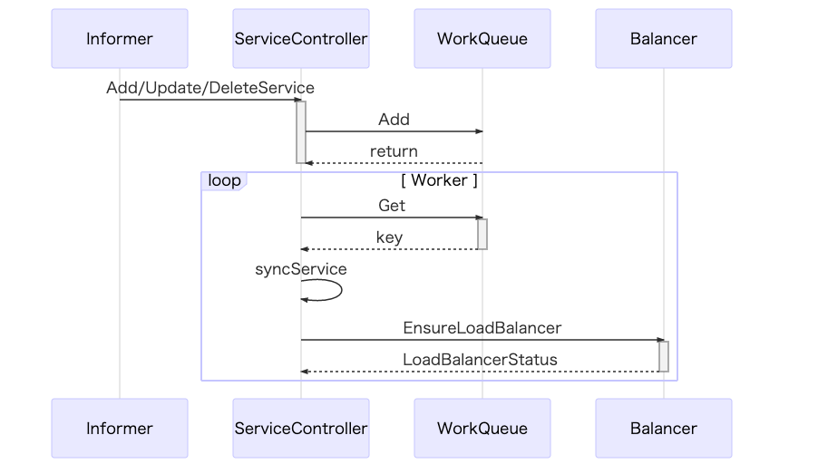

* 不过ServiceController 其实只处理了负载均衡的service对象，他会调用云服务商的API接口，不同的云服务商会实现不同的适配器来创建LoadBalancer类型的资源
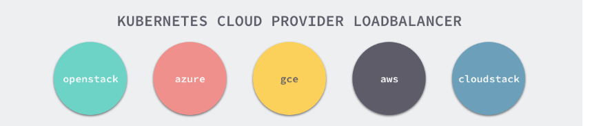

* 下面我们以GCE为例，简答介绍下Google Cloud是如何实现负载均衡类型的service

* 上述代码会先判断是否应该先删除已经存在的负载均衡资源，随后会调用一个内部的方法 ensureExternalLoadBalancer 在 Google Cloud 上创建一个新的资源，这个方法的调用过程比较复杂：
    * 检查转发规则是否存在并获取它的 IP 地址；
    * 确定当前 LoadBalancer 使用的 IP 地址；
    * 处理防火墙的规则的创建和更新；
    * 创建和删除指定的健康检查；

### 3.1.2 EndPoint Controller
ServiceController 主要处理的还是与 LoadBalancer 相关的逻辑，但是 EndpointController 的作用就没有这么简单了，我们在使用 Kubernetes 时虽然很少会直接与 Endpoint 资源打交道，但是它却是 Kubernetes 中非常重要的组成部分。

* EndpointController 本身并没有通过 Informer 监听 Endpoint 资源的变动，但是它却同时订阅了 Service 和 Pod 资源的增删事件，对于 Service 资源来讲，EndpointController 会通过以下的方式进行处理：
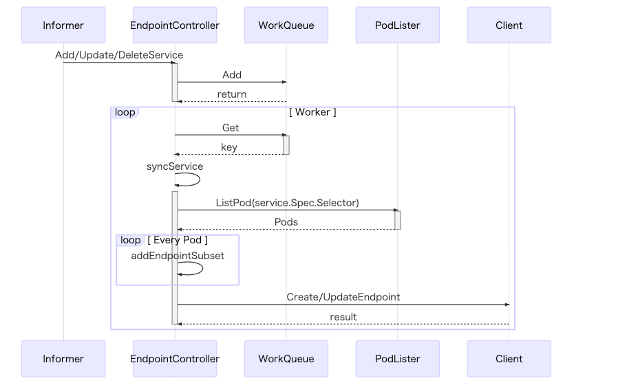

* EndpointController 中的 syncService 方法时用于创建和删除 Endpoint 资源最重要的方法，在这个方法中我们会根据 Service 对象规格中的选择器 Selector 获取集群中存在的所有 Pod，并将 Service 和 Pod 上的端口进行映射生成一个 EndpointPort 结构体：
```
func (e *EndpointController) syncService(key string) error {
	namespace, name, _ := cache.SplitMetaNamespaceKey(key)
	service, _ := e.serviceLister.Services(namespace).Get(name)
	pods, _ := e.podLister.Pods(service.Namespace).List(labels.Set(service.Spec.Selector).AsSelectorPreValidated())

	subsets := []v1.EndpointSubset{}
	for _, pod := range pods {
		epa := *podToEndpointAddress(pod)

		for i := range service.Spec.Ports {
			servicePort := &service.Spec.Ports[i]

			portName := servicePort.Name
			portProto := servicePort.Protocol
			portNum, _ := podutil.FindPort(pod, servicePort)

			epp := &v1.EndpointPort{Name: portName, Port: int32(portNum), Protocol: portProto}
			subsets, _, _ = addEndpointSubset(subsets, pod, epa, epp, tolerateUnreadyEndpoints)
		}
	}
	subsets = endpoints.RepackSubsets(subsets)

	currentEndpoints = &v1.Endpoints{
		ObjectMeta: metav1.ObjectMeta{
			Name:   service.Name,
			Labels: service.Labels,
		},
	}

	newEndpoints := currentEndpoints.DeepCopy()
	newEndpoints.Subsets = subsets
	newEndpoints.Labels = service.Labels
	e.client.CoreV1().Endpoints(service.Namespace).Create(newEndpoints)

	return nil
}
```
* 对于每一个 Pod 都会生成一个新的 EndpointSubset，其中包含了 Pod 的 IP 地址和端口和 Service 的规格中指定的输入端口和目标端口，在最后 EndpointSubset 的数据会被重新打包并通过客户端创建一个新的 Endpoint 资源。

在上面我们已经提到过，除了 Service 的变动会触发 Endpoint 的改变之外，Pod 对象的增删也会触发 EndpointController 中的回调函数。

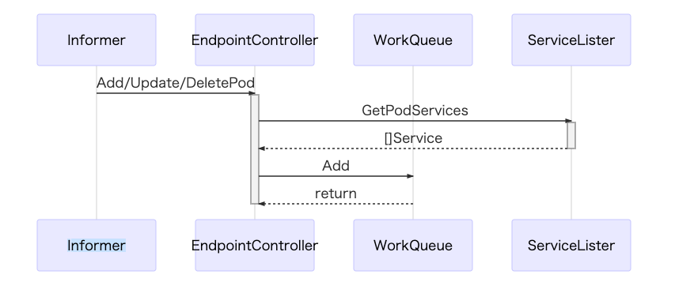
getPodServiceMemberships 会获取跟当前 Pod 有关的 Service 对象并将所有的 Service 对象都转换成 <namespace>/<name> 的字符串：
```
func (e *EndpointController) getPodServiceMemberships(pod *v1.Pod) (sets.String, error) {
	set := sets.String{}
	services, _ := e.serviceLister.GetPodServices(pod)

	for i := range services {
		key, _ := controller.KeyFunc(services[i])
		set.Insert(key)
	}
	return set, nil
}
```
这些服务最后会被加入 EndpointController 的队列中，等待它持有的几个 Worker 对 Service 进行同步。

这些其实就是 EndpointController 的作用，订阅 Pod 和 Service 对象的变更，并根据当前集群中的对象生成 Endpoint 对象将两者进行关联。


## 3.2 kube-proxy
在整个集群中另一个订阅 Service 对象变动的组件就是 kube-proxy 了，每当 kube-proxy 在新的节点上启动时都会初始化一个 ServiceConfig 对象，就像介绍 iptables 代理模式时提到的，这个对象会接受 Service 的变更事件：

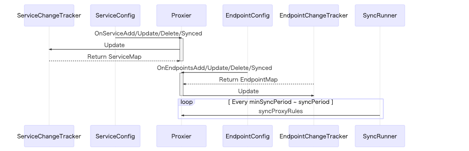

这些变更事件都会被订阅了集群中对象变动的 ServiceConfig 和 EndpointConfig 对象推送给启动的 Proxier 实例：
```
func (c *ServiceConfig) handleAddService(obj interface{}) {
	service, ok := obj.(*v1.Service)
	if !ok {
		return
	}
	for i := range c.eventHandlers {
		c.eventHandlers[i].OnServiceAdd(service)
	}
}
```
收到事件变动的 Proxier 实例随后会根据启动时的配置更新 iptables 或者 ipvs 中的规则，这些应用最终会负责对进出的流量进行转发并完成一些负载均衡相关的任务。

### 3.2.1 代理模式

在 Kubernetes 集群中的每一个节点都运行着一个 kube-proxy 进程，这个进程会负责监听 Kubernetes 主节点中 Service 的增加和删除事件并修改运行代理的配置，为节点内的客户端提供流量的转发和负载均衡等功能，但是当前 kube-proxy 的代理模式目前来看有三种：
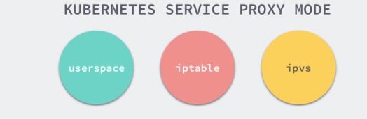

这三种代理模式中的第一种 userspace 其实就是运行在用户空间代理，所有的流量最终都会通过 kube-proxy 本身转发给其他的服务，后两种 iptable 和 ipvs 都运行在内核空间能够为 Kubernetes 集群提供更加强大的性能支持。


#### 3.2.1.1 userspace
作为运行在用户空间的代理，对于每一个 Service 都会在当前的节点上开启一个端口，所有连接到当前代理端口的请求都会被转发到 Service 背后的一组 Pod 上，它其实会在节点上添加 iptables 规则，通过 iptables 将流量转发给 kube-proxy 处理。

如果当前节点上的 kube-proxy 在启动时选择了 userspace 模式，那么每当有新的 Service 被创建时，kube-proxy 就会增加一条 iptables 记录并启动一个 Goroutine，前者用于将节点中服务对外发出的流量转发给 kube-proxy，再由后者持有的一系列 Goroutine 将流量转发到目标的 Pod 上。
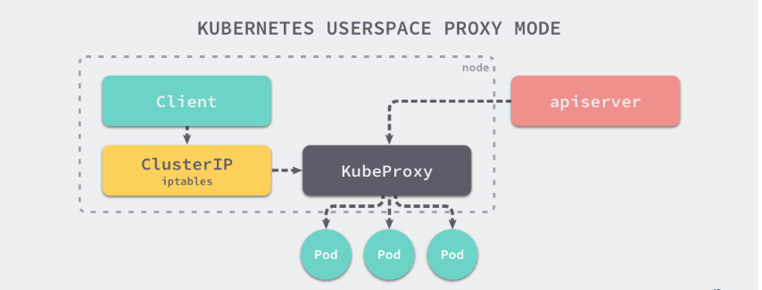

这一系列的工作大都是在 OnServiceAdd 被触发时中完成的，正如上面所说的，该方法会调用 mergeService 将传入服务 Service 的端口变成一条 iptables 的配置命令为当前节点增加一条规则，同时在 addServiceOnPort 方法中启动一个 TCP 或 UDP 的 Socket：
```
func (proxier *Proxier) mergeService(service *v1.Service) sets.String {
	svcName := types.NamespacedName{Namespace: service.Namespace, Name: service.Name}
	existingPorts := sets.NewString()
	for i := range service.Spec.Ports {
		servicePort := &service.Spec.Ports[i]
		serviceName := proxy.ServicePortName{NamespacedName: svcName, Port: servicePort.Name}
		existingPorts.Insert(servicePort.Name)
		info, exists := proxier.getServiceInfo(serviceName)
		if exists {
			proxier.closePortal(serviceName, info)
			proxier.stopProxy(serviceName, info)
		}
		proxyPort,  := proxier.proxyPorts.AllocateNext()

		serviceIP := net.ParseIP(service.Spec.ClusterIP)
		info, _ = proxier.addServiceOnPort(serviceName, servicePort.Protocol, proxyPort, proxier.udpIdleTimeout)
		info.portal.ip = serviceIP
		info.portal.port = int(servicePort.Port)
		info.externalIPs = service.Spec.ExternalIPs
		info.loadBalancerStatus = *service.Status.LoadBalancer.DeepCopy()
		info.nodePort = int(servicePort.NodePort)
		info.sessionAffinityType = service.Spec.SessionAffinity

		proxier.openPortal(serviceName, info)
		proxier.loadBalancer.NewService(serviceName, info.sessionAffinityType, info.stickyMaxAgeSeconds)
	}

	return existingPorts
}
```
这个启动的进程会监听同一个节点上，转发自所有进程的 TCP 和 UDP 请求并将这些数据包发送给目标的 Pod 对象。

在用户空间模式中，如果一个连接被目标服务拒绝，我们的代理服务能够重新尝试连接其他的服务，除此之外用户空间模式并没有太多的优势。

#### 3.2.1.2 iptables
另一种常见的代理模式就是直接使用 iptables 转发当前节点上的全部流量，这种脱离了用户空间在内核空间中实现转发的方式能够极大地提高 proxy 的效率，增加 kube-proxy 的吞吐量。
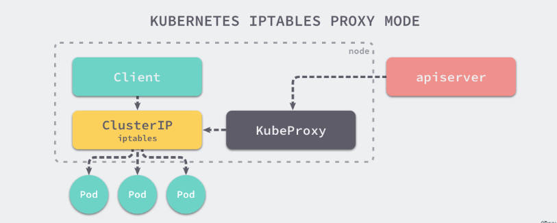
iptables 作为一种代理模式，它同样实现了 OnServiceUpdate、OnEndpointsUpdate 等方法，这两个方法会分别调用相应的变更追踪对象。
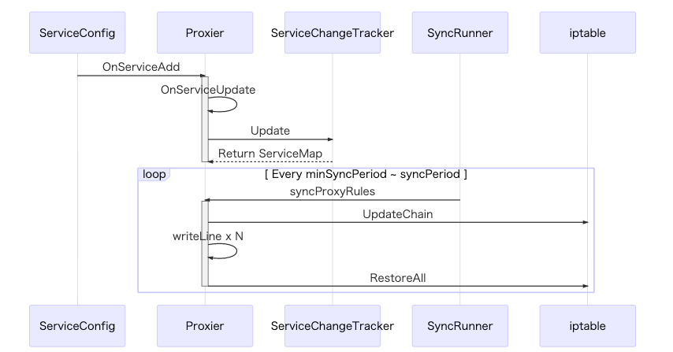
* 变更追踪对象会根据 Service 或 Endpoint 对象的前后变化改变 ServiceChangeTracker 本身的状态，这些变更会每隔一段时间通过一个 700 行的巨大方法 syncProxyRules 同步，在这里就不介绍这个方法的具体实现了，它的主要功能就是根据 Service 和 Endpoint 对象的变更生成一条一条的 iptables 规则

当我们使用 iptables 的方式启动节点上的代理时，所有的流量都会先经过 PREROUTING 或者 OUTPUT 链，随后进入 Kubernetes 自定义的链入口 KUBE-SERVICES、单个 Service 对应的链 KUBE-SVC-XXXX 以及每个 Pod 对应的链 KUBE-SEP-XXXX，经过这些链的处理，最终才能够访问当一个服务的真实 IP 地址。

虽然相比于用户空间来说，直接运行在内核态的 iptables 能够增加代理的吞吐量，但是当集群中的节点数量非常多时，iptables 并不能达到生产级别的可用性要求，每次对规则进行匹配时都会遍历 iptables 中的所有 Service 链。

规则的更新也不是增量式的，当集群中的 Service 达到 5,000 个，每增加一条规则都需要耗时 11min，当集群中的 Service 达到 20,000 个时，每增加一条规则都需要消耗 5h 的时间，这也就是告诉我们在大规模集群中使用 iptables 作为代理模式是完全不可用的。


#### 3.2.1.3 ipvs
ipvs 就是用于解决在大量 Service 时，iptables 规则同步变得不可用的性能问题。与 iptables 比较像的是，ipvs 的实现虽然也基于 netfilter 的钩子函数，但是它却使用哈希表作为底层的数据结构并且工作在内核态，这也就是说 ipvs 在重定向流量和同步代理规则有着更好的性能。
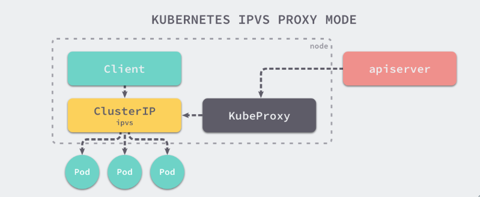

在处理 Service 的变化时，ipvs 包和 iptables 其实就有非常相似了，它们都同样使用 ServiceChangeTracker 对象来追踪变更，只是两者对于同步变更的方法 syncProxyRules 实现上有一些不同。
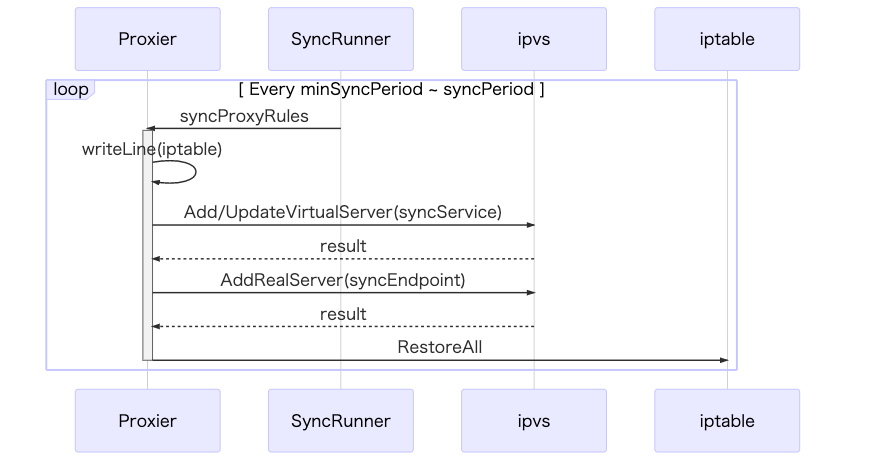

我们从 ipvs 的源代码和上述的时序图中可以看到，Kubernetes ipvs 的实现其实是依赖于 iptables 的，后者能够辅助它完成一些功能，使用 ipvs 相比 iptables 能够减少节点上的 iptables 规则数量，这也是因为 ipvs 接管了原来存储在 iptables 中的规则。

除了能够提升性能之外，ipvs 也提供了多种类型的负载均衡算法，除了最常见的 Round-Robin 之外，还支持最小连接、目标哈希、最小延迟等算法，能够很好地提升负载均衡的效率。