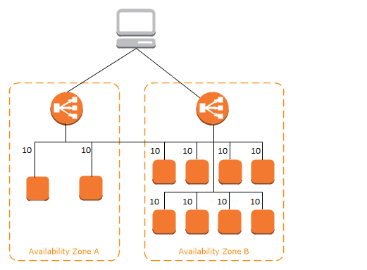
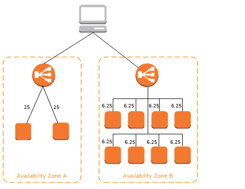

<!-- TOC -->

- [1. 背景](#1-背景)
- [2. 应用场景](#2-应用场景)
- [3. 负载均衡器组件](#3-负载均衡器组件)
    - [3.1 侦听器](#31-侦听器)
    - [3.2 负载均衡器类型](#32-负载均衡器类型)
    - [3.3 可用区与负载均衡点](#33-可用区与负载均衡点)
    - [3.4 跨区域负载均衡](#34-跨区域负载均衡)
    - [3.5 请求路由选择](#35-请求路由选择)
        - [3.5.1 路由算法](#351-路由算法)

<!-- /TOC -->
# 1. 背景
* 前面介绍kubernetes Service Controller时，是可以复用不同集群的LoadBalancing，这里描述下LoadBalance原理和作用
* 以下基于AMZ 的负载均衡器 Elastic Load Balancing https://docs.aws.amazon.com/zh_cn/elasticloadbalancing/latest/userguide/how-elastic-load-balancing-works.html

# 2. 应用场景
* 负载均衡器接受来自客户端的传入流量并将请求路由到一个或多个可用区中的已注册目标 (例如 EC2 实例)。
* 负载均衡器还会监控已注册目标的运行状况，并确保它只将流量路由到正常运行的目标。
    * 当负载均衡器检测到不正常目标时，它会停止将流量路由到该目标。
    * 当它检测到目标再次正常时，它会恢复将流量路由到该目标。

# 3. 负载均衡器组件
## 3.1 侦听器
* 通过指定一个或多个侦听器 将您的负载均衡器配置为接受传入流量
    * 侦听器是用于检查连接请求的进程。
    * 它配置了用于从客户端连接到负载均衡器的协议和端口号。
    * 它配置了用于从负载均衡器连接到目标的协议和端口号。

## 3.2 负载均衡器类型
AWS 支持三种类型负载均衡器
* Application Load Balancer
* Network Load Balancer
* Classic Load Balancer

负载均衡器类型的配置方式具有一个关键区别。对于 Application Load Balancer 和 Network Load Balancer，可以在目标组中注册目标，并将流量路由到目标组。对于 Classic Load Balancer，可以向负载均衡器注册实例。

## 3.3 可用区与负载均衡点
如果为负载均衡器启用可用区，Elastic Load Balancing 会在该可用区中创建一个负载均衡器节点。
* 如果您在可用区中注册目标但不启用可用区，这些已注册目标将无法接收流量。
* 当您确保每个启用的可用区均具有至少一个已注册目标时，负载均衡器将具有最高效率。

## 3.4 跨区域负载均衡
* 启用了跨区域负载均衡后，每个负载均衡器节点会在所有启用的可用区中的已注册目标之间分配流量。
* 禁用了跨区域负载均衡后，每个负载均衡器节点会仅在其可用区中的已注册目标之间分配流量。

下图演示了跨区域负载均衡的效果。有 2 个已启用的可用区，其中可用区 A 中有 2 个目标，可用区 B 中有 8 个目标。客户端发送请求，Amazon Route 53 使用负载均衡器节点之一的 IP 地址响应每个请求。这会分配流量，以便每个负载均衡器节点接收来自客户端的 50% 的流量。每个负载均衡器节点会在其范围中的已注册目标之间分配其流量份额。
* 如果启用了跨区域负载均衡，则 10 个目标中的每个目标接收 10% 的流量。这是因为每个负载均衡器节点可将其 50% 的客户端流量路由到所有 10 个目标。

* 如果禁用了跨区域负载均衡：
    * 可用区 A 中的两个目标中的每个目标接收 25% 的流量。
    * 可用区 B 中的八个目标中的每个目标接收 6.25% 的流量。
    * 这是因为每个负载均衡器节点只能将其 50% 的客户端流量路由到其可用区中的目标。

## 3.5 请求路由选择
* 对于 Network Load Balancer，Elastic Load Balancing 将为启用的每个可用区创建一个网络接口。可用区内的每个负载均衡器节点使用该网络接口来获取一个静态 IP 地址。在您创建负载均衡器时，可以选择将一个弹性 IP 地址与每个网络接口关联。
* 当流向应用程序的流量随时间变化时，Elastic Load Balancing 会扩展负载均衡器并更新 DNS 条目。DNS 条目还指定生存时间 (TTL) 为 60 秒。这有助于确保可以快速重新映射 IP 地址以响应不断变化的流量。
* 客户端可以确定使用哪个 IP 地址将请求发送到负载均衡器。用于接收请求的负载均衡器节点会选择一个正常运行的已注册目标，并使用其私有 IP 地址将请求发送到该目标。

### 3.5.1 路由算法
* 借助 Application Load Balancer，接收请求的负载均衡器节点使用以下过程：
    * 按优先级顺序评估侦听器规则以确定要应用的规则。
    * 使用轮询路由算法，从目标组中为规则操作选择目标。每个目标组的路由都是单独进行的，即使某个目标已在多个目标组中注册。
* 借助 Network Load Balancer，接收连接的负载均衡器节点使用以下过程：
    * 使用流哈希算法从目标组中为默认规则选择目标。它使算法基于：
        * 协议
        * 源 IP 地址和源端口
        * 目标 IP 地址和目标端口
        * TCP 序列号
    * 将每个单独的 TCP 连接在连接的有效期内路由到单个目标。来自客户端的 TCP 连接具有不同的源端口和序列号，可以路由到不同的目标。

* 借助 Classic Load Balancer，接收请求的负载均衡器节点使用以下方式选择注册实例：
    * 适用于 TCP 侦听器的轮询路由算法
    * 适用于 HTTP 和 HTTPS 侦听器的最少未完成请求路由算法

