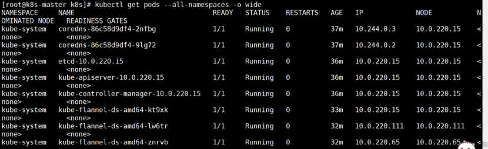
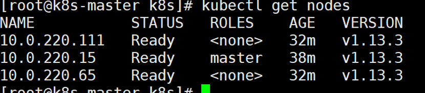

<!-- TOC -->

- [1. 背景](#1-背景)
    - [1.1 系统环境](#11-系统环境)
- [2. 搭建过程](#2-搭建过程)
    - [2.1 物理节点配置（不区分物理机和虚拟机）](#21-物理节点配置不区分物理机和虚拟机)
        - [2.1.1 关闭防火墙](#211-关闭防火墙)
        - [2.1.2 关闭SELinux](#212-关闭selinux)
        - [2.1.3 关闭Swap](#213-关闭swap)
        - [2.1.4 配置hostname](#214-配置hostname)
        - [2.1.5 配置免密](#215-配置免密)
        - [2.1.5 设置内核参数](#215-设置内核参数)
        - [2.1.6 安装docker](#216-安装docker)
    - [2.2 安装Kubernetes](#22-安装kubernetes)
        - [2.2.1 设置Kubernetes Yaml 源](#221-设置kubernetes-yaml-源)
        - [2.2.2 安装Kubernetes指定版本](#222-安装kubernetes指定版本)
        - [2.2.3 拉取镜像](#223-拉取镜像)
        - [2.2.4 启动kubelet并设置为服务](#224-启动kubelet并设置为服务)
        - [2.2.5 初始化k8s master 节点](#225-初始化k8s-master-节点)
        - [2.2.6 添加node节点](#226-添加node节点)
        - [2.2.7 配置kubectl](#227-配置kubectl)
        - [2.2.3 配置网络](#223-配置网络)
- [3. 安装校验](#3-安装校验)

<!-- /TOC -->

# 1. 背景
一直认为边看文档边实操是入门项目最快的方式，至于熟悉这个项目就得阅读源码。
Kubernetes 安装在不同环境还是有不同差异，由于国内网络限制，按照Kubernetes官网会遇到一些问题。根据遇到的问题，本人列出成功搭建Kubernetes环境过程。

## 1.1 系统环境
* 系统: centos7.5
* 系统参数: 4核 8G 100T磁盘
* Docker版本：1.18.3
* Kubernetes版本：1.13.3
* 主机信息

主机名|IP|角色
-|-|-
K8s-master |10.0.220.15 |K8s主节点
K8s-node01 |10.0.220.65 |K8s从节点01
K8s-node02 |10.0.220.111|K8s从节点02


# 2. 搭建过程
## 2.1 物理节点配置（不区分物理机和虚拟机）
### 2.1.1 关闭防火墙
关于防火墙的原因（nftables后端兼容性问题，产生重复的防火墙规则）
```
The iptables tooling can act as a compatibility layer, behaving like iptables but actually configuring nftables. This nftables backend is not compatible with the current kubeadm packages: it causes duplicated firewall rules and breakskube-proxy.
```
```
所有节点都执行命令：
systemctl disable firewalld.service 
systemctl disable firewalld.service 
```
### 2.1.2 关闭SELinux
Selinux是一套白名单机制，为了安全对服务、文件、端口设置都有严格的限制，除非对selinux非常熟，一般都是关掉selinux。

关于k8s关闭selinux的原因（关闭selinux以允许容器访问宿主机的文件系统）
```
Setting SELinux in permissive mode by runningsetenforce 0andsed ...effectively disables it. This is required to allow containers to access the host filesystem, which is needed by pod networks for example. You have to do this until SELinux support is improved in the kubelet.
```
```
所有节点都执行命令：
setenforce 0

vi /etc/selinux/config
SELINUX=disabled
```
### 2.1.3 关闭Swap
k8s 目前必须关闭swap，主要是因为社区提出的issue: https://github.com/kubernetes/kubernetes/issues/53533

本人总结原因是当物理节点内存耗尽时，kubelet 组件无法handle memory eviction。
```
所有节点都执行命令：
swapoff -a
```

### 2.1.4 配置hostname
为了用户方便知道物理节点角色，我们为设置静态hostname。
```
三个节点分别执行以下三条命令：
hostnamectl --static set-hostname  k8s-master
hostnamectl --static set-hostname  k8s-node01
hostnamectl --static set-hostname  k8s-node02
```

设置hosts文件
```
三个节点都添加同样的hosts内容：
10.0.220.15 k8s-master
10.0.220.65 k8s-node01
10.0.220.111 k8s-node02
```

### 2.1.5 配置免密
三个节点相互配置免密（原因在文档中还未找到）
过程不赘述，网上文档很多。

### 2.1.5 设置内核参数
将桥接的IPv4流量传递到iptables的链
```
所有节点都执行命令：
[root@k8s-master ~]# cat <<EOF > /etc/sysctl.d/k8s.conf
net.bridge.bridge-nf-call-ip6tables = 1
net.bridge.bridge-nf-call-iptables = 1
net.ipv4.ip_forward = 1
EOF

sysctl –-system
```

### 2.1.6 安装docker
设置yum源
```
三个节点都执行：
cd /etc/yum.repos.d/
wget https://mirrors.aliyun.com/docker-ce/linux/centos/docker-ce.repo
```

安装指定docker版本
```
三个节点都执行：
yum -y install docker-ce-18.06.1.ce-3.el7
```

将docker进程设置为服务
```
三个节点都执行：
systemctl enable docker 
systemctl start docker
```

查看docker版本
```
三个节点都执行：
docker --version
```

## 2.2 安装Kubernetes
### 2.2.1 设置Kubernetes Yaml 源
```
三个节点都执行：(写文件)
cat /etc/yum.repos.d/kubernetes.repo
[kubernetes]

name=Kubernetes

baseurl=https://mirrors.aliyun.com/kubernetes/yum/repos/kubernetes-el7-x86_64/

enabled=1

gpgcheck=1

repo_gpgcheck=1

gpgkey=https://mirrors.aliyun.com/kubernetes/yum/doc/yum-key.gpg https://mirrors.aliyun.com/kubernetes/yum/doc/rpm-package-key.gpg
```

### 2.2.2 安装Kubernetes指定版本
本文采用1.13.3版本
```
三个节点都执行：
yum install -y kubelet-1.13.3 kubeadm-1.13.3 kubectl-1.13.3 kubernetes-cni-0.6.0-0
```

### 2.2.3 拉取镜像
Kubernetes 系统本身有很多镜像，由于网络限制，本人找的镜像基本都是国内的。
```
docker pull mirrorgooglecontainers/kube-apiserver:v1.13.3
docker pull mirrorgooglecontainers/kube-controller-manager:v1.13.3
docker pull mirrorgooglecontainers/kube-scheduler:v1.13.3
docker pull mirrorgooglecontainers/kube-proxy:v1.13.3
docker pull mirrorgooglecontainers/pause:3.1
docker pull mirrorgooglecontainers/etcd:3.2.24
docker pull coredns/coredns:1.2.6
docker pull registry.cn-shenzhen.aliyuncs.com/cp_m/flannel:v0.10.0-amd64

docker tag mirrorgooglecontainers/kube-apiserver:v1.13.3 k8s.gcr.io/kube-apiserver:v1.13.3
docker tag mirrorgooglecontainers/kube-controller-manager:v1.13.3 k8s.gcr.io/kube-controller-manager:v1.13.3
docker tag mirrorgooglecontainers/kube-scheduler:v1.13.3 k8s.gcr.io/kube-scheduler:v1.13.3
docker tag mirrorgooglecontainers/kube-proxy:v1.13.3 k8s.gcr.io/kube-proxy:v1.13.3
docker tag mirrorgooglecontainers/pause:3.1 k8s.gcr.io/pause:3.1
docker tag mirrorgooglecontainers/etcd:3.2.24 k8s.gcr.io/etcd:3.2.24
docker tag coredns/coredns:1.2.6 k8s.gcr.io/coredns:1.2.6
docker tag registry.cn-shenzhen.aliyuncs.com/cp_m/flannel:v0.10.0-amd64 quay.io/coreos/flannel:v0.10.0-amd64

docker rmi mirrorgooglecontainers/kube-apiserver:v1.13.3           
docker rmi mirrorgooglecontainers/kube-controller-manager:v1.13.3  
docker rmi mirrorgooglecontainers/kube-scheduler:v1.13.3           
docker rmi mirrorgooglecontainers/kube-proxy:v1.13.3               
docker rmi mirrorgooglecontainers/pause:3.1                        
docker rmi mirrorgooglecontainers/etcd:3.2.24                      
docker rmi coredns/coredns:1.2.6
docker rmi registry.cn-shenzhen.aliyuncs.com/cp_m/flannel:v0.10.0-amd64
t
```

### 2.2.4 启动kubelet并设置为服务
```
* 三个节点都执行：
systemctl enable kubelet
systemctl start kubelet
```

### 2.2.5 初始化k8s master 节点
```
在master节点上执行：
kubeadm init --kubernetes-version=v1.13.3 --apiserver-advertise-address 10.0.220.15 --pod-network-cidr=10.244.0.0/16
```
* --apiserver-advertise-address：指定用 Master 的哪个IP地址与 Cluster的其他节点通信（一定要对应好master 节点IP地址）
* --service-cidr：指定Service网络的范围，即负载均衡VIP使用的IP地址段
* --pod-network-cidr：指定Pod网络的范围，即Pod的IP地址段
* --image-repository：Kubenetes默认Registries地址是 k8s.gcr.io，在国内并不能访问 gcr.io，在1.13版本中我们可以增加-image-repository参数，默认值是 k8s.gcr.io，将其指定为阿里云镜像地址：registry.aliyuncs.com/google_containers。
* --kubernetes-version=v1.13.3：指定要安装的版本号。
* --ignore-preflight-errors=：忽略运行时的错误，例如上面目前存在[ERROR NumCPU]和[ERROR Swap]，忽略这两个报错就是增加--ignore-preflight-errors=NumCPU 和--ignore-preflight-errors=Swap的配置即可。

初始化的结果：
```
Your Kubernetes master has initialized successfully!

To start using your cluster, you need to run the following as a regular user:

  mkdir -p $HOME/.kube
  sudo cp -i /etc/kubernetes/admin.conf $HOME/.kube/config
  sudo chown $(id -u):$(id -g) $HOME/.kube/config

You should now deploy a pod network to the cluster.
Run "kubectl apply -f [podnetwork].yaml" with one of the options listed at:
  https://kubernetes.io/docs/concepts/cluster-administration/addons/

You can now join any number of machines by running the following on each node
as root:

  kubeadm join 10.0.220.15:6443 --token i8nxlt.ox0bzax19jak1tyq --discovery-token-ca-cert-hash sha256:02e8fd59a30c53e792f5f822409762bfab5aef329fd24c48f994a20f752c5738
```

### 2.2.6 添加node节点
按照上面提示，我们添加node节点：
```
两个node节点都执行：
kubeadm join 10.0.220.15:6443 --token i8nxlt.ox0bzax19jak1tyq --discovery-token-ca-cert-hash sha256:02e8fd59a30c53e792f5f822409762bfab5aef329fd24c48f994a20f752c5738
```

### 2.2.7 配置kubectl
kubectl是用户常用的工具，使用kubectl需要有apiserver权限，我们执行下面命令
```
master节点执行：
echo "export KUBECONFIG=/etc/kubernetes/admin.conf" >> /etc/profile
source /etc/profile 
echo $KUBECONFIG
```

### 2.2.3 配置网络
kubernetes 通信有很多网络模型，常用的是cailco和flannel，下面我们选择flannel网络。
```
master 执行：
kubectl apply -f kube-flannel.yaml
```
文件如下：kube-flannel.yaml
```
kind: ClusterRole
apiVersion: rbac.authorization.k8s.io/v1beta1
metadata:
  name: flannel
rules:
  - apiGroups:
      - ""
    resources:
      - pods
    verbs:
      - get
  - apiGroups:
      - ""
    resources:
      - nodes
    verbs:
      - list
      - watch
  - apiGroups:
      - ""
    resources:
      - nodes/status
    verbs:
      - patch
---
kind: ClusterRoleBinding
apiVersion: rbac.authorization.k8s.io/v1beta1
metadata:
  name: flannel
roleRef:
  apiGroup: rbac.authorization.k8s.io
  kind: ClusterRole
  name: flannel
subjects:
- kind: ServiceAccount
  name: flannel
  namespace: kube-system
---
apiVersion: v1
kind: ServiceAccount
metadata:
  name: flannel
  namespace: kube-system
---
kind: ConfigMap
apiVersion: v1
metadata:
  name: kube-flannel-cfg
  namespace: kube-system
  labels:
    tier: node
    app: flannel
data:
  cni-conf.json: |
    {
      "name": "cbr0",
      "plugins": [
        {
          "type": "flannel",
          "delegate": {
            "hairpinMode": true,
            "isDefaultGateway": true
          }
        },
        {
          "type": "portmap",
          "capabilities": {
            "portMappings": true
          }
        }
      ]
    }
  net-conf.json: |
    {
      "Network": "10.244.0.0/16",
      "Backend": {
        "Type": "vxlan"
      }
    }
---
apiVersion: extensions/v1beta1
kind: DaemonSet
metadata:
  name: kube-flannel-ds-amd64
  namespace: kube-system
  labels:
    tier: node
    app: flannel
spec:
  template:
    metadata:
      labels:
        tier: node
        app: flannel
    spec:
      hostNetwork: true
      nodeSelector:
        beta.kubernetes.io/arch: amd64
      tolerations:
      - operator: Exists
        effect: NoSchedule
      serviceAccountName: flannel
      initContainers:
      - name: install-cni
        image: quay.io/coreos/flannel:v0.10.0-amd64
        command:
        - cp
        args:
        - -f
        - /etc/kube-flannel/cni-conf.json
        - /etc/cni/net.d/10-flannel.conflist
        volumeMounts:
        - name: cni
          mountPath: /etc/cni/net.d
        - name: flannel-cfg
          mountPath: /etc/kube-flannel/
      containers:
      - name: kube-flannel
        image: quay.io/coreos/flannel:v0.10.0-amd64
        command:
        - /opt/bin/flanneld
        args:
        - --ip-masq
        - --kube-subnet-mgr
        resources:
          requests:
            cpu: "100m"
            memory: "50Mi"
          limits:
            cpu: "100m"
            memory: "50Mi"
        securityContext:
          privileged: true
        env:
        - name: POD_NAME
          valueFrom:
            fieldRef:
              fieldPath: metadata.name
        - name: POD_NAMESPACE
          valueFrom:
            fieldRef:
              fieldPath: metadata.namespace
        volumeMounts:
        - name: run
          mountPath: /run
        - name: flannel-cfg
          mountPath: /etc/kube-flannel/
      volumes:
        - name: run
          hostPath:
            path: /run
        - name: cni
          hostPath:
            path: /etc/cni/net.d
        - name: flannel-cfg
          configMap:
            name: kube-flannel-cfg
---
apiVersion: extensions/v1beta1
kind: DaemonSet
metadata:
  name: kube-flannel-ds-arm64
  namespace: kube-system
  labels:
    tier: node
    app: flannel
spec:
  template:
    metadata:
      labels:
        tier: node
        app: flannel
    spec:
      hostNetwork: true
      nodeSelector:
        beta.kubernetes.io/arch: arm64
      tolerations:
      - operator: Exists
        effect: NoSchedule
      serviceAccountName: flannel
      initContainers:
      - name: install-cni
        image: quay.io/coreos/flannel:v0.10.0-arm64
        command:
        - cp
        args:
        - -f
        - /etc/kube-flannel/cni-conf.json
        - /etc/cni/net.d/10-flannel.conflist
        volumeMounts:
        - name: cni
          mountPath: /etc/cni/net.d
        - name: flannel-cfg
          mountPath: /etc/kube-flannel/
      containers:
      - name: kube-flannel
        image: quay.io/coreos/flannel:v0.10.0-arm64
        command:
        - /opt/bin/flanneld
        args:
        - --ip-masq
        - --kube-subnet-mgr
        resources:
          requests:
            cpu: "100m"
            memory: "50Mi"
          limits:
            cpu: "100m"
            memory: "50Mi"
        securityContext:
          privileged: true
        env:
        - name: POD_NAME
          valueFrom:
            fieldRef:
              fieldPath: metadata.name
        - name: POD_NAMESPACE
          valueFrom:
            fieldRef:
              fieldPath: metadata.namespace
        volumeMounts:
        - name: run
          mountPath: /run
        - name: flannel-cfg
          mountPath: /etc/kube-flannel/
      volumes:
        - name: run
          hostPath:
            path: /run
        - name: cni
          hostPath:
            path: /etc/cni/net.d
        - name: flannel-cfg
          configMap:
            name: kube-flannel-cfg
---
apiVersion: extensions/v1beta1
kind: DaemonSet
metadata:
  name: kube-flannel-ds-arm
  namespace: kube-system
  labels:
    tier: node
    app: flannel
spec:
  template:
    metadata:
      labels:
        tier: node
        app: flannel
    spec:
      hostNetwork: true
      nodeSelector:
        beta.kubernetes.io/arch: arm
      tolerations:
      - operator: Exists
        effect: NoSchedule
      serviceAccountName: flannel
      initContainers:
      - name: install-cni
        image: quay.io/coreos/flannel:v0.10.0-arm
        command:
        - cp
        args:
        - -f
        - /etc/kube-flannel/cni-conf.json
        - /etc/cni/net.d/10-flannel.conflist
        volumeMounts:
        - name: cni
          mountPath: /etc/cni/net.d
        - name: flannel-cfg
          mountPath: /etc/kube-flannel/
      containers:
      - name: kube-flannel
        image: quay.io/coreos/flannel:v0.10.0-arm
        command:
        - /opt/bin/flanneld
        args:
        - --ip-masq
        - --kube-subnet-mgr
        resources:
          requests:
            cpu: "100m"
            memory: "50Mi"
          limits:
            cpu: "100m"
            memory: "50Mi"
        securityContext:
          privileged: true
        env:
        - name: POD_NAME
          valueFrom:
            fieldRef:
              fieldPath: metadata.name
        - name: POD_NAMESPACE
          valueFrom:
            fieldRef:
              fieldPath: metadata.namespace
        volumeMounts:
        - name: run
          mountPath: /run
        - name: flannel-cfg
          mountPath: /etc/kube-flannel/
      volumes:
        - name: run
          hostPath:
            path: /run
        - name: cni
          hostPath:
            path: /etc/cni/net.d
        - name: flannel-cfg
          configMap:
            name: kube-flannel-cfg
---
apiVersion: extensions/v1beta1
kind: DaemonSet
metadata:
  name: kube-flannel-ds-ppc64le
  namespace: kube-system
  labels:
    tier: node
    app: flannel
spec:
  template:
    metadata:
      labels:
        tier: node
        app: flannel
    spec:
      hostNetwork: true
      nodeSelector:
        beta.kubernetes.io/arch: ppc64le
      tolerations:
      - operator: Exists
        effect: NoSchedule
      serviceAccountName: flannel
      initContainers:
      - name: install-cni
        image: quay.io/coreos/flannel:v0.10.0-ppc64le
        command:
        - cp
        args:
        - -f
        - /etc/kube-flannel/cni-conf.json
        - /etc/cni/net.d/10-flannel.conflist
        volumeMounts:
        - name: cni
          mountPath: /etc/cni/net.d
        - name: flannel-cfg
          mountPath: /etc/kube-flannel/
      containers:
      - name: kube-flannel
        image: quay.io/coreos/flannel:v0.10.0-ppc64le
        command:
        - /opt/bin/flanneld
        args:
        - --ip-masq
        - --kube-subnet-mgr
        resources:
          requests:
            cpu: "100m"
            memory: "50Mi"
          limits:
            cpu: "100m"
            memory: "50Mi"
        securityContext:
          privileged: true
        env:
        - name: POD_NAME
          valueFrom:
            fieldRef:
              fieldPath: metadata.name
        - name: POD_NAMESPACE
          valueFrom:
            fieldRef:
              fieldPath: metadata.namespace
        volumeMounts:
        - name: run
          mountPath: /run
        - name: flannel-cfg
          mountPath: /etc/kube-flannel/
      volumes:
        - name: run
          hostPath:
            path: /run
        - name: cni
          hostPath:
            path: /etc/cni/net.d
        - name: flannel-cfg
          configMap:
            name: kube-flannel-cfg
---
apiVersion: extensions/v1beta1
kind: DaemonSet
metadata:
  name: kube-flannel-ds-s390x
  namespace: kube-system
  labels:
    tier: node
    app: flannel
spec:
  template:
    metadata:
      labels:
        tier: node
        app: flannel
    spec:
      hostNetwork: true
      nodeSelector:
        beta.kubernetes.io/arch: s390x
      tolerations:
      - operator: Exists
        effect: NoSchedule
      serviceAccountName: flannel
      initContainers:
      - name: install-cni
        image: quay.io/coreos/flannel:v0.10.0-s390x
        command:
        - cp
        args:
        - -f
        - /etc/kube-flannel/cni-conf.json
        - /etc/cni/net.d/10-flannel.conflist
        volumeMounts:
        - name: cni
          mountPath: /etc/cni/net.d
        - name: flannel-cfg
          mountPath: /etc/kube-flannel/
      containers:
      - name: kube-flannel
        image: quay.io/coreos/flannel:v0.10.0-s390x
        command:
        - /opt/bin/flanneld
        args:
        - --ip-masq
        - --kube-subnet-mgr
        resources:
          requests:
            cpu: "100m"
            memory: "50Mi"
          limits:
            cpu: "100m"
            memory: "50Mi"
        securityContext:
          privileged: true
        env:
        - name: POD_NAME
          valueFrom:
            fieldRef:
              fieldPath: metadata.name
        - name: POD_NAMESPACE
          valueFrom:
            fieldRef:
              fieldPath: metadata.namespace
        volumeMounts:
        - name: run
          mountPath: /run
        - name: flannel-cfg
          mountPath: /etc/kube-flannel/
      volumes:
        - name: run
          hostPath:
            path: /run
        - name: cni
          hostPath:
            path: /etc/cni/net.d
        - name: flannel-cfg
          configMap:
            name: kube-flannel-cfg
```

# 3. 安装校验
查看pod
```
kubectl get pods --all-namespaces -o wide
```


查看node
```
kubectl get nodes
```
