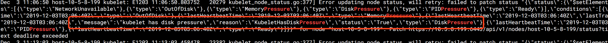
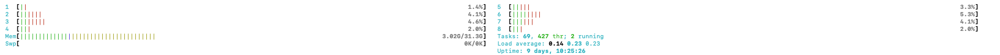
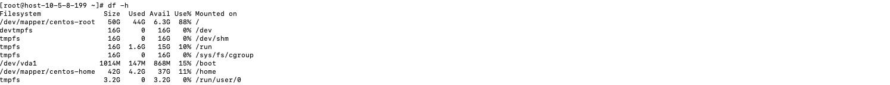
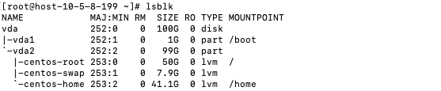
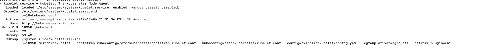
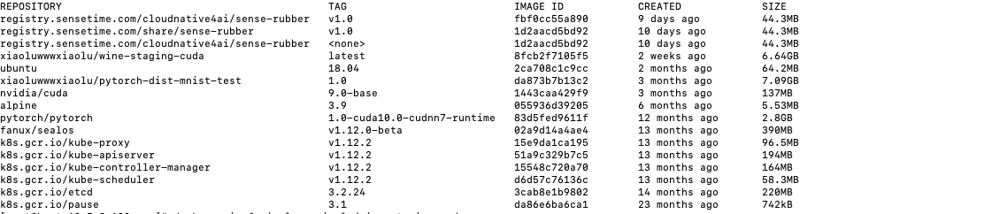

<!-- TOC -->

- [1. 背景](#1-背景)
- [2 问题分析](#2-问题分析)
    - [2.1 难点](#21-难点)
    - [2.2 问题猜想](#22-问题猜想)
    - [2.3 排除问题](#23-排除问题)
        - [2.3.1 环境排除](#231-环境排除)
        - [2.3.2 查阅日志](#232-查阅日志)
        - [2.3.3 文档](#233-文档)
        - [2.3.4 问题确认](#234-问题确认)
- [3. 问题解决](#3-问题解决)
- [4. 总结](#4-总结)

<!-- /TOC -->

# 1. 背景
* 在OpenStack虚机上搭建kubernetes，起初没什么问题，但是一段时间后master 突然异常了，故障描述如下
    * master:6443 异常关闭
    * kube-system 很多重要的pod异常，比如etcd、coredns，有些是被evict
    * 重启kubelet，Kubectl 命令可以短暂使用，一心跳周期后master:6443 异常关闭
    * 重启kubelet，然后快速使用Kubectl delete pod（异常pod，希望重新创建），多次尝试发现pod大概率不会创建成功，即使创建成功，该节点上也会有新的pod被evict
    * 所有异常的pod都集中在一个节点，很不幸，该节点刚好是master节点，导致k8s不能使用

# 2 问题分析
## 2.1 难点
该问题难点是日志难以定位，master:6443 异常关闭后，几乎所有的pod都会爆出日志，系统一大堆日志很难定位到重要日志信息。

## 2.2 问题猜想
* 很明显，master节点时因为资源不足导致pod被删掉，定位基本可以定位在资源不足上

* 日志虽多，但是重要信息永远在日志上，并且我们可以重点观察kubelet恢复之后立马崩溃的日志信息，之后的日志是连带效应


## 2.3 排除问题
### 2.3.1 环境排除
防火墙、swap、docker先关排查，正常
### 2.3.2 查阅日志
* 观察发现一条重要日志信息
    * 从中可以发现是资源进程的消息导致Error
    * 提到了内存和磁盘，message中写的磁盘信息，因此重点可能是磁盘故障
    
    

* 内存查看
    * 没啥问题
    
* 磁盘
    * 磁盘100g，基本分在/和/home下面
    * / 已经88%
    * 虽然还足够，但是还是有风险



### 2.3.3 文档
* https://tonybai.com/2017/10/16/out-of-node-resource-handling-in-kubernetes-cluster/
    * 描述的很相似，磁盘超过阀值后，会删掉pod

### 2.3.4 问题确认
* 查看到kubelet所有配置信息


*  cat /var/lib/kubelet/config.yaml
    * imagefs.available: 15%，而/下已经88，超过了，所以会删掉pod
```
...
evictionHard:
  imagefs.available: 15%
  memory.available: 100Mi
  nodefs.available: 10%
  nodefs.inodesFree: 5%
...
```

# 3. 问题解决
* 最开始挂载了一块盘，但是没法再一次挂载到/下，因此没效，k8s默认检查的是/下的剩余空间，而不是总剩余空间


* 查看images大小，并删掉很大的images


* 将数据移入新挂载的磁盘中，减少/压力

* 最好是能直接扩容/空间


# 4. 总结
* 分配虚拟机空间太少，/才50，创建k8s一定要看清楚了，包括内存等其余资源要足够

* k8s master默认不被调度也是由原因的，用户pod所占资源太多后，k8s就会杀掉pod
* master 和 普通node节点分离也有利于安全

