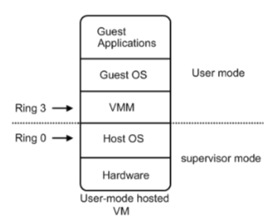
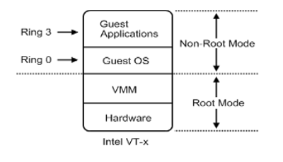
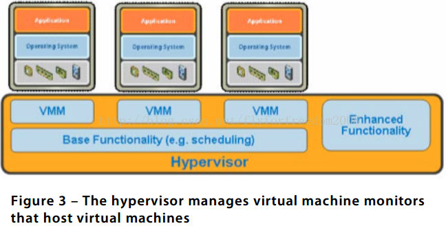

<!-- TOC -->

- [1. 背景](#1-背景)
- [2. 虚拟化类型](#2-虚拟化类型)
    - [2.1 计算虚拟化（服务器虚拟化）](#21-计算虚拟化服务器虚拟化)
        - [2.1.1 如何实现服务器虚拟化](#211-如何实现服务器虚拟化)
            - [2.1.1.1 hosted架构](#2111-hosted架构)
            - [2.1.1.2 hypervisor](#2112-hypervisor)
    - [2.2 存储虚拟化](#22-存储虚拟化)
    - [2.3 网络虚拟化](#23-网络虚拟化)
    - [2.3 其它虚拟化](#23-其它虚拟化)
- [3. 全虚拟化和半虚拟化](#3-全虚拟化和半虚拟化)
    - [3.1 全虚拟化](#31-全虚拟化)
        - [3.1.1 软件实现全虚拟化](#311-软件实现全虚拟化)
            - [3.1.1.1 特权解除(优先级压缩)](#3111-特权解除优先级压缩)
            - [3.1.1.2 陷入模拟(二进制翻译)](#3112-陷入模拟二进制翻译)
        - [3.1.2 硬件辅助虚拟化](#312-硬件辅助虚拟化)
    - [3.2 半虚拟化](#32-半虚拟化)
- [4. 虚拟化的发展历程和实现方式](#4-虚拟化的发展历程和实现方式)

<!-- /TOC -->
# 1. 背景
* 为什么需要虚拟化
    * 系统资源隔离
    * 物理server资源多，很多服务不需要这么多资源，可以使用vm将资源隔离
    * 弹性扩展vm资源配置

# 2. 虚拟化类型
计算机资源分为三种：计算、存储、网络。
## 2.1 计算虚拟化（服务器虚拟化）
物理机缺点(成本高。资源利用率高)
* 普通物理机内存平均利用率也就20%-30%
* 物理机独占空间
* 资源固定

### 2.1.1 如何实现服务器虚拟化
对于业界标准的x86系统，虚拟化采取hosted或者hypervisor架构。
#### 2.1.1.1 hosted架构
hosted架构将虚拟化层以一个应用程序的方式安装运行于操作系统之上，支持最为广泛的各种硬件配置。
#### 2.1.1.2 hypervisor
hypervisor(裸金属)架构将虚拟化层直接安装到干净的x86系统上，由于它不需要通过操作系统而直接访问硬件，hypervisor架构相对于hosted架构效率更高，且具有更好的可扩展性、健壮性和性能。

简单来说，就是计算机硬件和操作系统之间多了一个层hypervisor，把操作系统和硬件的逻辑依赖关系隔离。操作系统和hypervisor通信，hypervisor和硬件通信。
* 操作系统对hypervisor(包括VMM)来说就是一个文件，因此可以跑多个操作系统
* 对硬件来说，hypervisor就是一个操作系统。
* 这样主机操作系统就从管硬件管应用中解脱出来，变成只管应用接口。

既然虚拟操作系统是一个文件，那么完全可以将虚拟机放在一个文件服务器中，这样就可以如果一台机器宕机，可以将操作系统文件在另外一个机器恢复，这样就在系统层面实现HA，不需要软件。
如果硬件需要升级，可以将操作系统文件迁移到其它系统，这样就实现系统级别迁移。

## 2.2 存储虚拟化
* 基本上不用，企业都是购买一个企业的存储管理系统。

## 2.3 网络虚拟化
网络虚拟化用了很多年了，网络中加V的都是网络虚拟化。

## 2.3 其它虚拟化
还有针对具体资源的虚拟化，比如CPU、GPU等等，虚拟化是一类非常泛的概念。

# 3. 全虚拟化和半虚拟化
现在市场上最常见的虚拟化软件有VMWare workstation(VMWare)、VirtualBox(Oracle)、Hyper-V(Microsoft)、KVM(Redhat)、Xen等，这些软件统称之为VMM(Virtual Machine Monitor)，使用不同的虚拟化实现。而这些虚拟化实现的方式可以分为全虚拟化、半虚拟化、硬件虚拟化等，本篇主要是理解这些虚拟化实现的原理。
## 3.1 全虚拟化
不需要对GuestOS操作系统软件的源代码做任何的修改，就可以运行在这样的VMM中。
* 在全虚拟化的虚拟平台中，GuestOS并不知道自己是一台虚拟机，它会认为自己就是运行在计算机物理硬件设备上的HostOS。
* 因为全虚拟化的VMM！！！会将一个OS所能够操作的CPU、内存、外设等物理设备逻辑抽象成为虚拟CPU、虚拟内存、虚拟外设等虚拟设备后，再交由GuestOS来操作使用。这样的GuestOS会将底层硬件平台视为自己所有的，但是实际上，这些都是VMM为GuestOS制造了这种假象。
* 全虚拟化又分为：软件辅助的全虚拟化 & 硬件辅助的全虚拟化。

### 3.1.1 软件实现全虚拟化

在intel没发布x86CPU虚拟化技术之前，完全虚拟化都是通过软件实现的。
软件实现虚拟化，主要使用两种技术结合：特权解除(优先级压缩)、陷入模拟(二进制翻译)。
#### 3.1.1.1 特权解除(优先级压缩)
* 从上述的软件辅助全虚拟化架构图中可以看出，VMM、GuestOS、GuestApplications都是运行在Ring 1-3用户态(！！！VMM也处于用户态！！！)中的应用程序代码。
* 当在GuestOS中执行系统内核的特权指令时，一般都会触发异常！！！。这是因为用户态代码不能直接运行在核心态中，而且系统内核的特权指令大多都只能运行在Ring 0核心态中。
* 在触发了异常之后，这些异常就会被VMM捕获，再由VMM！！！将这些特权指令！！！进行虚拟化成为只针对虚拟CPU起作用(！！！)的虚拟特权指令！！！。
* hypervisor将操作系统的指令翻译并将结果缓存供之后使用，而用户级指令无需修改就运行，具有和物理机一样的执行速度。
其本质就是使用若干能运行在用户态中的非特权指令(！！！)来模拟出只针对GuestOS有效的虚拟特权指令，从而将特权指令的特权解除掉。

缺点:
* 但是特权解除的问题在于当初设计标准x86架构CPU时，并没有考虑到要支持虚拟化技术，所以会存在一部分特权指令运行在Ring 1用户态上，而这些运行在Ring 1上的特权指令并不会触发异常然后再被VMM捕获(！！！有些特权指令不会被VMM捕获！！！)。从而导致在GuestOS中执行的特权指令直接对HostOS造成了影响(GuestOS和HostOS没能做到完全隔离)。

针对这个问题，再引入了陷入模拟的机制。
#### 3.1.1.2 陷入模拟(二进制翻译)
就是VMM会对GuestOS中的二进制代码(运行在CPU中的代码！！！)进行扫描！！！，一旦发现GuestOS执行的二进制代码中包含有运行在用户态上的特权指令二进制代码时，就会将这些二进制代码翻译成虚拟特权指令二进制代码(！！！)或者是翻译成运行在核心态中的特权指令！！！二进制代码从而强制的触发异常！！！。这样就能够很好的解决了运行在**Ring 1用户态上的特权指令没有被VMM捕获！！！**的问题，更好的实现了GuestOS和HostOS的隔离。

简而言之，软件辅助虚拟化能够成功的将所有在GuestOS中执行的系统内核特权指令进行捕获、翻译，使之成为只能对GuestOS生效的虚拟特权指令。但是退一步来说，之所以需要这么做的前提是因为CPU并不能准确的去判断一个特权指令！！！到底是由GuestOS发出！！！的还是由HostOS发出！！！的，这样也就无法针对一个正确的OS去将这一个特权指令执行。

### 3.1.2 硬件辅助虚拟化
直到后来CPU厂商们发布了能够判断特权指令归属！！！的标准x86 CPU之后，迎来了硬件辅助全虚拟化。

硬件辅助全虚拟化主要使用了支持虚拟化功能的CPU进行支撑，CPU可以明确的分辨出来自GuestOS的特权指令，并针对GuestOS进行特权操作(！！！)，而不会影响到HostOS。

* 从更深入的层次来说，虚拟化CPU形成了新的CPU执行状态 —— Non-Root Mode& Root Mode。从上图中可以看见，GuestOS(！！！)运行在Non-Root Mode 的Ring 0核心态中，这表明GuestOS能够直接执行特却指令而不再需要 特权解除 和 陷入模拟 机制。
* 并且在硬件层上面紧接的就是虚拟化层的VMM，而不需要HostOS！！！。这是因为在硬件辅助全虚拟化的VMM会以一种更具协作性的方式来实现虚拟化 —— 将虚拟化模块加载到HostOS的内核中，例如：KVM，KVM通过在HostOS内核中加载KVM Kernel Module来将HostOS转换成为一个VMM！！！。所以此时VMM可以看作是HostOS，反之亦然。

这种虚拟化方式创建的GuestOS知道自己是正在虚拟化模式中运行的GuestOS，KVM就是这样的一种虚拟化实现解决方案。

## 3.2 半虚拟化
需要对GuestOS的内核代码做一定的修改，才能够将GuestOS运行在半虚拟化的VMM中。
半虚拟化通过在GuestOS的源代码级别上修改特权指令来回避上述的虚拟化漏洞。
修改内核后的GuestOS也知道自己就是一台虚拟机。所以能够很好的对核心态指令和敏感指令进行识别和处理，但缺点在于GuestOS的镜像文件并不通用。

# 4. 虚拟化的发展历程和实现方式
* https://blog.csdn.net/jmilk/article/details/51031118

