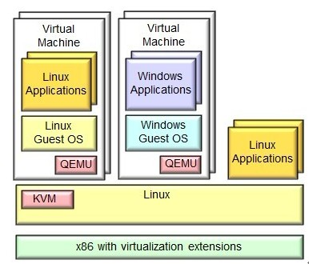
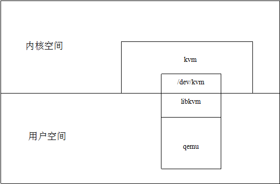
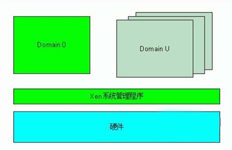

<!-- TOC -->

- [1. 背景](#1-背景)
- [2 kvm](#2-kvm)
- [3 qemu](#3-qemu)
- [4 qemu-kvm](#4-qemu-kvm)
- [5 libvirt](#5-libvirt)
- [6 xen](#6-xen)

<!-- /TOC -->

# 1. 背景
谈论到虚拟化，经常听到的词是qemu,kvm,qemu-kvm,xen,libvirt，上面这些技术具体定位是什么，有什么区别

# 2 kvm
KVM(Kernel-based Virtual Machine)基于内核的虚拟机,KVM是集成到Linux内核的Hypervisor，是X86架构且硬件支持虚拟化技术（Intel VT或AMD-V）的Linux的全虚拟化解决方案。它是Linux的一个很小的模块，利用Linux做大量的事，如任务调度、内存管理与硬件设备交互等。

# 3 qemu
QEMU是一套由Fabrice Bellard所编写的模拟处理器的自由软件。它与Bochs，PearPC近似，但其具有某些后两者所不具备的特性，如高速度及跨平台的特性。经由kqemu这个开源的加速器，QEMU能模拟至接近真实电脑的速度。

# 4 qemu-kvm
准确来说，KVM是Linux kernel的一个模块。可以用命令modprobe去加载KVM模块。加载了模块后，才能进一步通过其他工具创建虚拟机。但仅有KVM模块是 远远不够的，因为用户无法直接控制内核模块去作事情,你还必须有一个运行在用户空间的工具才行。
这个用户空间的工具，kvm开发者选择了已经成型的开源虚拟化软件 QEMU。说起来QEMU也是一个虚拟化软件。它的特点是可虚拟不同的CPU(当时结合KVM技术时，还是使用KVM虚拟化出CPU)。比如说在x86的CPU上可虚拟一个Power的CPU，并可利用它编译出可运行在Power上的程序。
KVM使用了QEMU的一部分，并稍加改造，就成了可控制KVM的用户空间工具了。所以你会看到，官方提供的KVM下载有两大部分(qemu和kvm)三个文件(KVM模块、QEMU工具以及二者的合集)。也就是说，你可以只升级KVM模块，也可以只升级QEMU工具。这就是KVM和QEMU 的关系。

从存在形式看,KVM是两个内核模块kvm.ko和kvm_intel.ko(对AMD处理器来说，就是kvm_amd.ko)，这两个模块用来实现CPU的虚拟化。 如果要让用户在KVM上完成一个虚拟机相关的操作，显然需要用户空间的东西，同时还包括IO虚拟化，所以KVM的解决方案借鉴了QEMU的东西并做了一定的修改，形成了自己的KVM虚拟机工具集和IO虚拟化的支持，也就是所谓的qemu-kvm.（KVM is a fork of QEMU, namely qemu-kvm)
QEMU是个独立的虚拟化解决方案，从这个角度它并不依赖KVM。 而KVM是另一套虚拟化解决方案，不过因为这个方案实际上只实现了内核中对处理器(Intel VT, AMD SVM)虚拟化特性的支持，换言之，它缺乏设备虚拟化以及相应的用户空间管理虚拟机的工具，所以它借用了QEMU的代码并加以精简，连同KVM一起构成了另一个独立的虚拟化解决方案，不妨称之为：KVM+QEMU. 

# 5 libvirt
当然由于redhat已经开始支持KVM，它认为KVM+QEMU'的方案中用户空间虚拟机管理工具不太好使，或者通用性不强，所以redhat想了一个libvirt出来，一个用来管理虚拟机的API库，不只针对KVM,也可以管理Xen等方案下的虚拟机。

# 6 xen
Xen是第一类运行再裸机上的虚拟化管理程序(Hypervisor)。它支持全虚拟化和半虚拟化,Xen支持hypervisor和虚拟机互相通讯.
Xen最重要的优势在于半虚拟化，此外未经修改的操作系统也可以直接在xen上运行(如Windows)，能让虚拟机有效运行而不需要仿真，因此虚拟机能感知到hypervisor，而不需要模拟虚拟硬件，从而能实现高性能。
