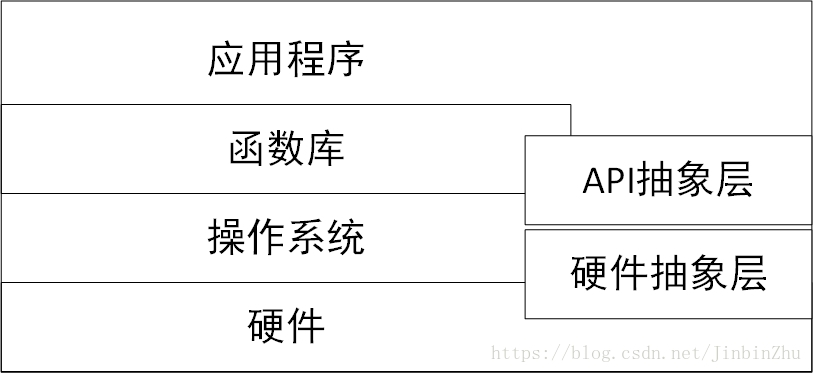
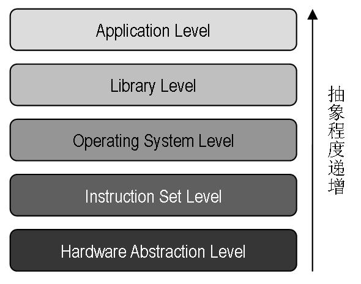
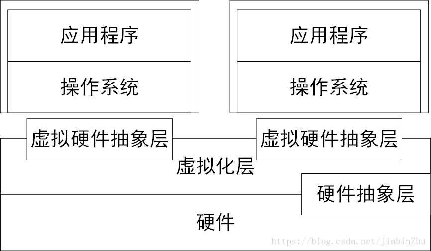

<!-- TOC -->

- [1. 背景](#1-背景)
- [2. 虚拟化分类](#2-虚拟化分类)
    - [2.1 对象分类](#21-对象分类)
    - [2.2 抽象程度分类](#22-抽象程度分类)
        - [2.2.1 计算机系统分层](#221-计算机系统分层)
        - [2.2.2 虚拟化以及5个虚拟化抽象程度](#222-虚拟化以及5个虚拟化抽象程度)
            - [2.2.2.1  指令集架构等级的虚拟化（Instruction Set Architecture Level）](#2221--指令集架构等级的虚拟化instruction-set-architecture-level)
            - [2.2.2.2 硬件抽象层等级的虚拟化（Hardware Abstraction Level）](#2222-硬件抽象层等级的虚拟化hardware-abstraction-level)
            - [2.2.2.3 操作系统等级的虚拟化（Operating System Level）](#2223-操作系统等级的虚拟化operating-system-level)
            - [2.2.2.4 编程语言等级的虚拟化（Programming Language Level）](#2224-编程语言等级的虚拟化programming-language-level)
            - [2.2.2.5 库等级的虚拟化（Library Level）](#2225-库等级的虚拟化library-level)
- [3. 系统虚拟化](#3-系统虚拟化)
- [4. 虚拟化简史](#4-虚拟化简史)

<!-- /TOC -->
# 1. 背景
系统虚拟化简单来说就是虚拟化整个系统。

虚拟化定义:虚拟化（技术）或虚拟技术（英语：Virtualization）是一种资源管理技术，是将计算机的各种实体资源（CPU、内存、磁盘空间、网络适配器等），予以抽象、转换后呈现出来并可供分割、组合为一个或多个计算机配置环境。

# 2. 虚拟化分类
## 2.1 对象分类
* 硬件虚拟化
* 系统虚拟化（VM）
    * 平台虚拟化，将操作系统和硬件平台资源分割开 
        * 完全虚拟化：敏感指令在操作系统和硬件之间被捕捉处理，客户操作系统无需修改，所有软件都能在虚拟机中运行，例如IBM CP/CMS，VirtualBox，VMware Workstation
        * 硬件辅助虚拟化，利用硬件（主要是CPU）辅助处理敏感指令以实现完全虚拟化的功能，客户操作系统无需修改，例如VMware Workstation，Xen，KVM

        * 部分虚拟化，针对部分应用程序进行虚拟，而不是整个操作系统
        * 准虚拟化/超虚拟化（paravirtualization），为应用程序提供与底层硬件相似但不相同的软件接口，客户操作系统需要进行修改。例如Xen的半虚拟化模式。
        * 操作系统级虚拟化，使操作系统内核支持多用户空间实体，例如Parallels Virtuozzo Containers、OpenVZ、LXC以及类Unix系统上的chroot，Solaris上的Zone

    * 应用程序虚拟化，在操作系统和应用程序间创建虚拟环境 
        * 便携式应用程序，允许程序在便携式设备中运行而不用在操作系统中安装
        * 跨平台虚拟化，允许针对特定CPU或者操作系统的软件不做修改就能运行在其他平台上，例如Wine
        * 虚拟设备，运行于虚拟化平台之上，面向应用的虚拟机映像
        * 模拟器
* 虚拟内存，将不相邻的内存区，甚至硬盘空间虚拟成统一连续的内存地址
* 存储虚拟化，将实体存储空间（如硬盘）分隔成不同的逻辑存储空间
* 网络虚拟化，将不同网络的硬件和软件资源结合成一个虚拟的整体

    * 虚拟专用网络（VPN），在大型网络（通常是Internet）中的不同计算机（节点）通过加密连接而组成的虚拟网络，具有类似局域网的功能
    * 存储器虚拟化，将网络系统中的随机存储器聚合起来，形成统一的虚拟内存池
* 桌面虚拟化，在本地计算机显示和操作远程计算机桌面，在远程计算机执行程序和储存信息
* 数据库虚拟化
* 软件虚拟化
* 服务虚拟化
* 数据虚拟化 (data virtualization), 数据虚拟化是一种统一来自多个来源的数据的方法，这样应用程序，报告工具和最终用户就可以访问数据，而不需要有关原始来源，位置和数据结构的详细信息。

## 2.2 抽象程度分类
### 2.2.1 计算机系统分层

* 硬件抽象层（Hardware Abstraction Layer, HAL）是计算机中软件所能控制的硬件的抽象接口，通常包括CPU的各种寄存器、内存管理模块、I/O端口以及内存映射的I/O地址等。
* API抽象层是一个进程所能控制的系统功能的集合，包括创建新进程、内存申请、归还、进程间同步与共享、文件系统和网络操作系统等。

### 2.2.2 虚拟化以及5个虚拟化抽象程度
本质上，虚拟化！！！ 是由位于下层的软件模块！！！，通过向上层软件模块提供一个与它原先所期待的运行环境完全一致的接口的方法！！！，抽象出一个虚拟的软件或硬件接口！！！，使得上层软件可以直接运行在虚拟的环境上。

虚拟技术按抽象程度分为五个层次

#### 2.2.2.1  指令集架构等级的虚拟化（Instruction Set Architecture Level） 
软件通过模拟虚拟机的所有指令实现, 称为指令集架构等级的虚拟化不仅仅是处理器！！！, 模拟的是所有设备, 方式是截获所有指令并转换.
指令集架构的虚拟化是通过软件来模拟不同架构的处理器、存储器、总线、磁盘控制卡、计时器等多个I/O设备，软件会将虚拟机所发出的指令转换为本机可以操作的指令在现有的硬件上运行。
若主机处理器可以运行由虚拟机转换出来的指令，或是使用相同的指令集来完成任务，那就表示除了处理器以外的操作系统、I/O设备皆可不受特定平台所绑定，但由于虚拟机的每条指令都必须透过软件来模拟，所以在性能会有较大程度的耗损。

这个分类底下代表性的有Bochs以及QEMU。
#### 2.2.2.2 硬件抽象层等级的虚拟化（Hardware Abstraction Level）
由虚拟机监视器来隐藏不同厂商的处理器、存储器、芯片组…等特征，为这些虚拟机提供抽象与统一的虚拟平台。运行此平台的计算机称之为主体机器（Host Machine），而在此平台中运作的虚拟机称为客体机器（Guest Machine）.

由于客户机操作系统能看到的是硬件抽象层，因此客户机操作系统的行为和在物理平台上没什么区别。

通常，宿主机和客户机的ISA（Instruction Set Architecture，指令集架构！！！）是相同的，客户机的大部分指令可以在宿主机处理器上直接运行(！！！)，只有部分需要虚拟化的指令(！！！) 才会由虚拟化软件进行处理，从而大大降低了虚拟化开销。

另外, 客户机和宿主机的硬件抽象层的其他部分如中断控制器、设备等，可以是完全不同(！！！)的, 当客户机对硬件层抽象访问时, 虚拟化软件需要对此进行截获并模拟. 比较知名的硬件抽象层的产品有VMware、Xen等。

当前大多数x86平台的商业计算机都在使用这种虚拟化，最主要是由于现今处理器厂商提供了硬件辅助虚拟化技术！！！，例如︰第三代的Intel VT-d、AMD-Vi皆提供虚拟机直接存储器访问（Direct Memory Access）以及对各种PCI接口的直接访问功能（PCI passthrough）。

这个分类底下代表性的有VMware_ESXi、Hyper-V、Virtualbox、以及Citrix。
#### 2.2.2.3 操作系统等级的虚拟化（Operating System Level）
通过系统内核提供多个相互隔离的用户态实例.

操作系统层上的虚拟化，通过系统内核提供多个相互隔离的用户态实例(经常被称为容器！！！)，这些用户态实例对它的用户而言就像是一台真实的计算机, 具有自己独立的文件系统、网络、系统设置和库函数等。

因为这是操作系统内核主动提供的虚拟化，因此操作系统层上的虚拟化比较高效，其系统开销非常小, 不需要硬件特殊支持。但灵活性较小, 每个容器中的操作系统通常必须是同一种操作系统.

另外, 操作系统层上的虚拟化虽然为用户态实例间提供了比较强的隔离性, 但其粒度比较粗. 所以被大量应用在虚拟主机服务环境中.

硬件抽象层等级的虚拟化中的全虚拟化与操作系统底层间有非常高的隔离能力，支持不同的操作系统，安装后不需要重启主机、或修改引导程序（Boot Loader）以达到双系统的目的，风险低、维护简单。由于此等级的虚拟机可以访问底层操作系统，因此用户必须花费大量的时间来安装与设置虚拟机，接着才能开始评估或测试所需运作的软件，这些设置包含了操作系统的安装、安全性或兼容性软件的更新、网络、系统调教…等，如果所需的操作系统与底层操作系统相同，那么其实它们所作的跟实际上安装一台实体机器没有什么区别。

操作系统内核虚拟化可以最大限度的减少新增虚拟机的所需，在这个等级的虚拟机共享实体主机上的硬件以及操作系统，呈现彼此独立且隔离的虚拟机环境。

应用软件的环境是由操作系统、库、相依性软件、特定于系统的数据结构或文件系统，例如︰NTFS或Ext3，以及其他环境设置所组成。如果这些都保持不变，应用软件很难发现与真实环境的区别。这是所有操作系统等级虚拟化的关键想法。

这个分类底下代表性的有Docker、VPS以及KVM。
#### 2.2.2.4 编程语言等级的虚拟化（Programming Language Level）
将高级语言转译成一种名为字节码的语言, 通过虚拟机转译成可直接运行的命令.

传统计算机是由指令集架构所驱动的一种机械语言，硬件的操作由特殊的I/O指令处理，也可以透过区块映射（Mapping）来操作存储器，此等级的虚拟化会将高级语言转译成一种名为字节码的语言，通过虚拟机转译成为可以直接运行的命令。跨操作系统平台、跨语言皆为其优点。

例如JVM或微软的CLR(Common Language Runtime)，程序的代码由虚拟机的运行时支持系统首先翻译为硬件的机器语言，然后再执行。通常一个语言类虚拟机是作为一个进程在物理计算机系统中运行的，因此，它属于进程级虚拟化！！！。

这个分类底下代表性的有Oracle Java、Microsoft .NET、Parrot。
#### 2.2.2.5 库等级的虚拟化（Library Level）
通过虚拟化操作系统的应用级函数的服务接口, 应用无需修改即可在不同OS中运行.

大部分的应用程序都是使用由许多库组成的API（Application Programming Interface）来设计，使用动态链接的方式用于隐藏操作系统的细节，目的是提供程序员更简单的工作。

这也产生了一种新的虚拟化方式，使用不同的API与不同操作系统底层的ABI（Application Binary Interface）来进行模拟的工作。

操作系统通常会通过应用级的库函数提供给应用程序一组服务, 例如文件操作服务、时间操作服务等, 这些库函数可以隐藏操作系统内部的一些细节, 使得应用程序编程更为简单。

不同操作系统库函数有不同的服务接口. 库函数层上的虚拟化，通过虚拟化操作系统的应用级函数的服务接口，使得应用程序不需要修改，就可以在不同的操作系统中无缝运行，从而提供系统间的互操作性。

例如，WINE系统是在Linux上模拟了Windows的库函数接口(！！！)，使得一个Windows的应用程序能够在Linux平台上运行。

这个分类底下代表性的有Wine以及WSL（Windows Subsystem for Linux）。

# 3. 系统虚拟化
系统虚拟化是将一台物理物理计算机系统虚拟成一台或者多台虚拟计算机系统，每个虚拟的计算机系统（虚拟机）都有自己的虚拟硬件，来提供独立的虚拟机执行系统。
这个虚拟化层被称为虚拟机监控系统。

* 本质上来讲, 虚拟机系统和物理机系统可以是完全不同的ISA。例如, 可以在一个x86物理机上运行一个ARM的虚拟机. 但是，不同的ISA使得虚拟机的每一条指令都需要在物理机上模拟执行，从而造成较大的性能下降。
* 当然相同体系结构的系统虚拟化通常会有比较好的性能, VMM也会实现比较简单, 虚拟机大部分指令可在处理器上直接运行, 只有那些需要虚拟化的指令才会由VMM进行处理.

1974年，Popek和Goldberg定义了虚拟机可以看作是物理机的一种高效隔离的复制。该定义蕴含了三层含义（同质、高效和资源受控）。
*  同质，虚拟机的运行环境和物理机的环境在本质上需要是相同的，但是在表现上能够有一定的差异。例如虚拟机看到的处理器个数和物理机上实际的处理器个数可以不一样，但虚拟机中和物理机上看到的处理器必须是同一种基本类型(！！！)。
* 高效，要求虚拟机中运行的软件接近物理机上直接运行的性能。因此，软件在虚拟机中运行时，大多数的指令是直接运行在硬件上的，只有少量指令需要经过VM处理或模拟。
* 资源受控，VMM对系统资源拥有完全控制能力和管理权限。
相同ISA的系统虚拟化取得了很大的技术和解决方案层面的发展. 本书内容以相同ISA的系统虚拟化展开, 以x86为例, 介绍系统虚拟化的相关内容.

# 4. 虚拟化简史
系统上第一个虚拟机是1965年左右IBM公司开发的System/360 Model 40 VM.
* x86体系结构的先天设计, 存在对系统虚拟化的支持缺陷或虚拟化漏洞(Virtualization Hole). 在x86体系结构上的虚拟化技术, 都需要用软件的方法弥补体系结构设计上的不足. 例如, 代码扫描与修补方法(Scan-and-patch)或二进制代码翻译(Binary Translation)技术实现基于软件的完全虚拟化. 但这样势必带来性能损失和非常大的软件复杂度.

* 这种情况下, 学术界提出另一种思路来克服体系结构上的缺陷, 叫类虚拟化技术(Para-Virtualization). 主要思想就是通过客户机操作系统与虚拟化管理层的协同设计, 由虚拟化管理层软件提供一个近似于原物理系统, 但又不完全相同的(与原系统)的虚拟平台, 以避免虚拟化漏洞和实现更高的虚拟化效率. 修改操作系统的源码来与下层虚拟化管理层软件协同工作, 从而避免体系结构上的缺陷. Denali项目和Xen项目都支持类虚拟化. 国内把这个技术也叫做半虚拟化或者部分虚拟化, 但不准确.

* 基于软件的完全虚拟化方法不可避免地导致性能上的下降, 同时伴随一些兼容性上的损失. 而修改操作系统的类虚拟化方法对现有系统的移植和内核升级的维护提出要求, 并且对非开源的操作系统也有局限.

* 从根本上解决体系结构的缺陷, 最好是从体系结构本身入手. Intel和AMD在2006年后都逐步推出了带硬件虚拟化支持的处理器, 如Intel的Virtualization Technology(VT)技术和AMD的Secure Virtual Machine(SVM)技术. Intel和AMD采用的都是硬件辅助的完全虚拟化策略. 操作系统不需要做任何改动就能运行在虚拟机中. VMM软件可以利用这些硬件虚拟化技术, 这样软件的实现也极大简化, 并且更为高效和安全.

* 但这只是解决了处理器层如何更好地支持虚拟化的问题. 为使虚拟化解决方案更加高效(例如I/O虚拟化), 计算机系统各个层次都在逐渐加入对虚拟化的硬件支持. 以Intel为例, 除了处理器中的VT技术外, 芯片组！！！中开始提供针对IO虚拟化功能的VT-d技术, 网卡中也开始提供更好地网络虚拟化支持的多队列的VMDq技术等. 同时, PCI标准组织也在指定PCI设备级对虚拟化进行支持的单根PCI桥IOV(Single Root IOV, SR-IOV)和多根PCI桥IOV(Multi-Root IOV, MR-IOV)标准.

* 虚拟化软件也长足发展。除了VMware, Denali和Xen, 还有KVM, VirtualBox, 微软的虚拟化系列(VirtualPC, Hyper-V), Paralles的虚拟化系列(如Virtuozzo, Parallels Desktop for Mac), Citrix的XenServer, Sun的xVM, Oracle的Oracle VM和VirtualIron等.
