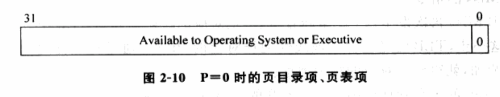

<!-- TOC -->

- [1. x86历史](#1-x86历史)
    - [1.1 x86发展历史](#11-x86发展历史)
    - [1.2 x86_64](#12-x86_64)
        - [1.2.1 AMD64](#121-amd64)
        - [1.2.2 Intel 64](#122-intel-64)
- [2. x86 内存架构](#2-x86-内存架构)
    - [2.1 地址空间](#21-地址空间)
        - [2.1.1 物理地址空间](#211-物理地址空间)
        - [2.1.2 线性地址空间](#212-线性地址空间)
    - [2.2 地址](#22-地址)
        - [2.2.1 逻辑地址](#221-逻辑地址)
        - [2.2.2 线性地址](#222-线性地址)
        - [2.2.3 物理地址](#223-物理地址)
    - [2.3 x86 内存管理机制](#23-x86-内存管理机制)
        - [2.3.1 分段机制](#231-分段机制)
            - [2.3.1.1 段选择符（段选择寄存器）](#2311-段选择符段选择寄存器)
            - [2.3.1.2 段描述符](#2312-段描述符)
            - [2.3.1.3 段描述符表](#2313-段描述符表)
            - [2.3.1.4 逻辑地址转换总结](#2314-逻辑地址转换总结)
        - [2.3.2 分页机制](#232-分页机制)
            - [2.3.2.1 页表](#2321-页表)
                - [2.3.2.1.1 未开启PAE的32位分页](#23211-未开启pae的32位分页)
                - [2.3.2.1.2 启用PAE的32位分页](#23212-启用pae的32位分页)
            - [2.3.2.2 CR3寄存器](#2322-cr3寄存器)
            - [2.3.2.3 TLB](#2323-tlb)
            - [2.3.2.4 线性地址转换为物理地址的过程](#2324-线性地址转换为物理地址的过程)
    - [2.4  x86-64架构](#24--x86-64架构)
        - [2.4.1 IA-32e的分段机制](#241-ia-32e的分段机制)
        - [2.4.2 IA-32e的分页机制](#242-ia-32e的分页机制)
- [3 x86架构的基本运行](#3-x86架构的基本运行)
    - [3.1 基本模式](#31-基本模式)
        - [3.1.1 传统IA-32模式](#311-传统ia-32模式)
        - [3.1.2 IA-32e模式](#312-ia-32e模式)
    - [3.2 基本寄存器组](#32-基本寄存器组)
    - [3.3 权限控制](#33-权限控制)
        - [3.3.1 段保护](#331-段保护)
        - [3.3.2 页保护](#332-页保护)
- [4 中断和异常](#4-中断和异常)
    - [4.1 中断架构](#41-中断架构)
        - [4.1.1 可编程中断架构](#411-可编程中断架构)
        - [4.1.2 PIC](#412-pic)
        - [4.1.3 APIC](#413-apic)
        - [3.1.4 处理器间中断](#314-处理器间中断)
        - [3.1.5 中断重要概念](#315-中断重要概念)
            - [3.1.5.1 中断分类](#3151-中断分类)
            - [3.1.5.2 中断的优先级](#3152-中断的优先级)
            - [3.1.5.3 中断的屏蔽](#3153-中断的屏蔽)
            - [3.1.5.4 IDT表](#3154-idt表)
            - [3.1.5.5 中断门](#3155-中断门)
    - [3.2 异常架构](#32-异常架构)
    - [3.3 中断和异常对比](#33-中断和异常对比)
    - [3.4 操作系统对中断/异常的处理流程](#34-操作系统对中断异常的处理流程)

<!-- /TOC -->
# 1. x86历史
## 1.1 x86发展历史
如图1-1所示x86的发展历程:


* 1978年，最早的x86处理器8086初次登场。8086是16位的处理器，这个位数指的是CPU GPR（General-Purpose Register，通用寄存器）的数据宽度为16位。8086处理器拥有16位的寄存器和16位的外部数据总线，使用20位地址寻址（拥有1MB的地址空间）。
* 在20世纪80年代初，IBM选择了8086的衍生产品8088作为IBM PC的处理器。IBM的这一举动给x86带来了巨大的发展机遇，并且帮助它成为行业的标准直到今天。
* 1982年, Intel发布80286处理器, 引入了保护模式的概念.
* 1985年后, Intel公司发布了x86体系结构下的第一款32位处理器80386, 并且引入虚拟内存.
* 1989年, 80486发布, 采用了5级流水线机制, 并且引入了片上一级缓存和能量管理.

* 当时数字不能作为商标, 1993年, Intel公司发布第一款奔腾处理器(Pentium), 此款处理器在80486基础上, 进一步增大一级缓存, 并将其分成指令缓存和数据缓存两部分, 进一步加快处理器对主存的访问时间. 同时, 奔腾处理器还引入了MMX技术, 使得处理器对多媒体处理的支持进一步增强.

* 1995到1999年, Intel发布一系列基于x86体系结构的处理器, 这一系列被称为P6家族处理器, 包括奔腾Pro(Pentium Pro), 奔腾2(Pentium Ⅱ), 奔腾2至强(Pentium Ⅱ Xeon), 赛扬(Celeron), 奔腾3(Pentium Ⅲ)以及奔腾3至强(Pentium Ⅲ Xeon)处理器. P6家族采用了超标量(Superscalar)技术, 以乱序执行的方式进一步增强了处理器的速度.

* 从2002年开始到2006年, 奔腾4(Pentium 4)家族处理器(！！！一系列！！！)占据了主导地位. 奔腾4家族的处理器基于NetBurst微处理结构, 在提升性能同时, 进一步增强了对多媒体处理的支持, 并引入超线程的概念(Hyper-Threading), 引领单核处理器的性能走向极致. 与此同时, 在奔腾4的672和662处理器上， Intel还首次加入了虚拟化支持, 即Intel VT技术. 也是在这段时期，由于AMD发展的64位扩充技术的刺激，Intel公司开始推出64位版x86。

* 从2006年起, 处理器进入多核时代(Multicore), Intel相继发布Core Duo和Core 2 Duo系列处理器.

## 1.2 x86_64
x86-64 是 x86 架构的延伸产品，是一种 64 位微处理器架构及其相应的指令集。 在x86-64出现以前，Intel与惠普联合推出IA-64架构，此架构不与x86兼容，且市场反应冷淡。于是，与 x86 兼容的 x86-64 架构应运而生。1999 年， AMD首次公开64位集为IA-32提供扩展，称为x86-64（后来改名为AMD64）。此架构后来也为Intel所采用，也就是现在的Intel 64。

x86-64能有效地把 x86架构移植到 64位环境，并且兼容原有的 x86应用程序，市场前景广阔。外界使用x84-64或者x64称呼这个64位架构，以保持中立，不偏袒任何一家厂商。

### 1.2.1 AMD64
AMD 64指令集被应用在Athlon 64、Athlon 64 FX、Athlon 64 X2、Turion 64、Turion 64 X2、Opteron及较新款的Sempron和Phenom处理器上。

其主要特点有：支持64位通用寄存器、64位整数及逻辑运算和64位虚拟地址。AMD 64架构相比之前的32位架构有如下重大改进。
* 新增寄存器。
* 地址宽度加长。
* 新增扩充指令集SSE2、SSE3。
* 新增“禁止运行”位（No-Execute，NX bit）：此位的设置可以防止蠕虫病毒的缓存溢出攻击。

### 1.2.2 Intel 64
Intel 64指令集被应用于Pentium 4、Pentium D、Pentium Extreme Edition、Celeron D、Xeon、Intel Core 2、Intel Core 2 Quad、Intel Core i3、Intel Core i5及Intel Core i7处理器上。

Intel 64架构加入了额外的寄存器和其他改良的指令集，可使处理器直接访问超过4GB的存储器，允许运行更大的应用程序。通过64位的存储器地址上限，其理论存储器容量上限达16 000 000TB（16EB），但大多数操作系统和应用程序在可见的未来都用不到如此巨大的地址空间，在初期的应用上并未支持完整的64位地址。Intel 64架构相比之前的32位架构有如下重大改进。

* 新增寄存器。
* 地址宽度加长。
* 新增改良指令集。
* 新增“禁止运行”位（eXecute Disable，XD bit）：相当于AMD 64的NX bit，通过设置此位可以防止蠕虫病毒的缓存溢出攻击。

# 2. x86 内存架构
## 2.1 地址空间
### 2.1.1 物理地址空间
*  从CPU的角度来看, 内存和其它硬件设备都是可以使用的资源. 这些资源组合(！！！)在一起, 分布在CPU的物理地址空间内(！！！内存只是一部分！！！).
* 物理地址空间的大小, 由CPU实现的物理地址位数决定, 物理地址位数和CPU处理数据的能力(即CPU位数)没有必然关系, 例如16位的8086 CPU具有20位地址空间.


### 2.1.2 线性地址空间
* 和物理地址空间一样, 线性地址空间大小取决于CPU实现的线性地址位数, 例如实现了32位线性地址的CPU具有4GB大小的线性地址空间. 
* 需要注意, 线性地址空间大小和物理地址空间大小没有必然关系. 例如Intel的PAE平台就具有4GB的线性地址空间, 64GB的物理地址空间.
* 一个平台可以有多个线性地址空间, 在现代操作系统中, 每个进程都拥有自己的私有线性地址空间. 一个典型的线性地址空间如图.


## 2.2 地址
### 2.2.1 逻辑地址
* 程序代码中使用的地址就是逻辑地址，逻辑地址通常由段选择符和段偏移地址组成，程序中操作的地址是段偏移地址部分。

### 2.2.2 线性地址
* 线性地址又叫虚拟地址，线性地址是逻辑地址转化之后结构，用来索引线性地址空间。当CPU采用分页机制时，线性地址必须转化成物理地址才能访问平台内存和硬件设备。
* 如果地址没有采用分页，线性地址就是物理地址

### 2.2.3 物理地址
* 未采用分段机制:逻辑地址->线性地址=物理地址
* 采用分段机制: 逻辑地址->线性地址->物理地址

有些资料还有"总线地址"的提法, 因为给设备寄存器分配的物理地址(！！！)和寄存器在设备上的地址(！！！)是不同的(通常设备的寄存器都认为自己是从地址0开始的), 两者存在一个映射关系, 由设备的电子线路负责转换并对CPU透明(！！！). 由于CPU用于访问设备的物理地址(！！！)是设备寄存器展现给总线的地址, 所以在x86下有时称物理地址为总线地址.


## 2.3 x86 内存管理机制
* x86 内存管理机制分为两部分：分段机制和分页机制。
* 分段机制为程序提供彼此隔离的代码区域、数据区域、栈区域，从而避免了同一个处理器上运行的多个程序互相影响。

* 分页机制实现了传统的按需分页、虚拟内存机制，可以将程序的执行环境按需映射到物理内存。此外，分页机制还可以用于提供多任务的隔离。

* 分段机制和分页机制都可以通过配置支持简单的单任务系统、多任务系统或共享内存的多处理器系统。需要强调的一点是，处理器无论在何种运行模式下都不可以禁止分段机制，但是分页机制却是可选选项。

### 2.3.1 分段机制
分段是一种简单的内存管理机制, 它将内存划分成以起始地址(Base)和长度(Limit)描述的块, 这些内存块就称为"段". 段可以与程序最基本的元素联系起来, 例如程序可以简单的分为代码段、数据段和栈, 段机制中就有对应的代码段、数据段和栈段。

分段机制由4个基本部分组成: 逻辑地址、段选择寄存器、段描述符和段描述符表。
其核心思想是: 使用段描述符描述段的基地址、长度以及各种属性(例如读写属性、访问权限). 当程序使用逻辑地址访问内存的某个部分时, CPU通过逻辑地址中的段选择符索引段描述符表以得到该内存对应的段描述符, 并检测程序的访问是否合法, 合法的话, 根据段描述符中的基地址将逻辑地址转换为线性地址.
* 逻辑地址：程序使用地址
* 段描述符表：用来索引每个程序的段描述地址
* 段描述符：存储每个进程段首地址和属性等重要内容
* 段选择寄存器：存储段描述符表的偏移地址，指向的每个进程的段描述符地址


#### 2.3.1.1 段选择符（段选择寄存器）
段描述符用来索引段描述符，段描述符存储在段选择寄存器中。
段描述符共16位，结构图如下：


各个字段含义如下：
* 索引：段描述符表索引
* TI：指明索引哪个段描述符表。当 TI=0 时，表示索引全局段描述符表（Global Descriptor Table，下面简称为GDT）；当TI=1时，表示索引本地段描述符表（Local Descriptor Table，下面简称为LDT）
* RPL：Requested Privilege Level的简称，即所要求的权限级别。RPL存在于段选择寄存器的0、1位，为程序访问段时增加一级检查。

段选择符作为逻辑地址的一部分，对应用程序是可见的。但是，正如前面在逻辑地址中介绍的，应用程序中只存储和使用逻辑地址的偏移部分，段描述符！！！ 的修改和分配！！！ 由连接器和加载器！！！ 完成。

为了使CPU能够快速地获得段选择符，x86架构提供了6个段寄存器存放当前程序中各个段的段选择符。这6个段寄存器分别如下。

* CS（Code-Segment，代码段）：存放代码段的段选择符。
* DS（Data-Segment，数据段）：存放数据段的段选择符。
* SS（Stack-Segment，栈段）：存放栈的段选择符。
* ES、FS、GS：可以存放额外三个数据段的段选择符，由程序自由使用。

由于段选择符是用来索引段描述符表访问段描述符的，为了加速段描述符的访问，x86 在段寄存器后增加了一个程序不可见的段描述符寄存器。当段寄存器被加载到一个新的段选择符后，CPU自动将该段选择符索引的段描述符加载到这个不可见的段描述符寄存器中。这6个段寄存器的构造如图1-5所示。  图1-5 段寄存器的构造:


#### 2.3.1.2 段描述符
段描述符描述某个段的基地址、长度以及各种属性（例如，读/写属性、访问权限等）。这是分段机制的核心思想。

段描述符的结构如图1-6所示。

在此，我们只详细介绍其中的Base字段、Limit字段和DPL字段。

* Base字段描述了该段的基地址。
* Limit字段描述了该段的长度。
* DPL字段指明描述符权限级别，表示该段所具有的权限。它表示代码访问此段所需要的最低权限！！！。

当CPU通过一个逻辑地址的段选择符获得该段对应的段描述符后，会使用段描述符中各种属性字段对访问进行检查，一旦确认访问合法，CPU将段描述符中的32位基地址和程序中逻辑地址的32位偏移量相加。至此，CPU便获得了逻辑地址所对应的线性地址。

#### 2.3.1.3 段描述符表
在前面介绍段选择符的结构时，我们了解到段选择符中的 TI 字段用于指明索引哪个段描述符表。TI字段的必要性源于x86架构提供了两种段描述符表 — GDT和LDT。
系统中至少有一个 GDT 可以被所有的进程访问。与此同时，系统中可以有一个或多个LDT，可以被某个进程私有，也可以被多个进程共享。

* GDT是内存中的一个数据结构。简单地讲，可以将GDT看成是一个数组，由基地址（Base）和长度（Limit）描述。
* LDT是一个段，需要用一个段描述符来描述。LDT 的段描述符存放在GDT中，当系统中有多个LDT时，GDT中必须有对应数量的段描述符。

为了加速对GDT和LDT的访问，x86架构提供了GDTR寄存器和LDTR寄存器。关于这两种寄存器的具体描述如下。

* GDTR：包括一个32位的基地址（Base）和一个16位的长度（Limit）。
* LDTR：结构与段寄存器相同（同样包含对程序不可见的段描述符寄存器）。
通过使用LGDT/SGDT指令对GDTR进行读取/存储；
通过使用LLDT/SLDT对LDTR进行读取/存储。
在进行进程切换时，LDTR的值会被换成新进程对应的LDT的段描述符。
通过段选择符索引GDT/LDT的过程如图1-7所示。


#### 2.3.1.4 逻辑地址转换总结
假设程序中某条语句访问了数据段, 例如:
```
int a = 100; //全局变量
int func(){
    int b;
    b = a;
}
```
程序从加载到变量a的逻辑地址转换为线性地址过程如下.
* 程序加载
    * 通过该进程LDT的段选择符！！！索引GDT, 获得LDT的段描述符, 被加载到LDTR寄存器的不可见部分中.
    * 该进程的CS、DS、SS被加载到了相应的段选择符. 同时, CPU根据段选择符的TI字段, 索引GDT/LDT, 获得相应的段描述符并加载到CS、DS、SS对应的不可见部分.
* 程序执行到b=a, 需要从a所在的内存中取值, 必须先把a的逻辑地址转换成线性地址
    *  进行必要的属性、访问权限检查
    * 从DS对应的段描述符寄存器获得该段的基地址
    * 将变量a的32位偏移量和描述符中的基地址相加, 获得变量a的线性地址.


### 2.3.2 分页机制
分页机制让操作系统中的虚拟内存机制称为可能. 一个页面可以存在于物理内存(！！！)中, 也可以存放在磁盘的交换区域！！！(如Linux下的Swap分区！！！, Windows的虚拟内存文件！！！)中, 程序可以使用比机器物理内存更大的内存区域！！！.

分页机制的核心思想是通过页表将线性地址转换为物理地址, 并配合旁路转换缓冲区(Translation Lookaside Buffer, TLB！！！)来加速地址转换过程. 操作系统在启动过程中, 通过将CR0寄存器的PG位置1来启动分页机制.

从图中看到, 分页机制主要由页表、CR3和TLB三个部件构成. 下面以4KB页面的32位分页为例进行讲解.

#### 2.3.2.1 页表
页表(Page Table)是用于将线性地址转换成物理地址的主要数据结构.
一个地址对齐到页边界(！！！)后的值称为页帧号, 它实际是该地址所在页面的基地址.
* 线性地址对应的页帧号！！！即虚拟页帧号(Virtual Frame Number, VFN！！！),
* 物理地址对应的页帧号！！！即物理页帧号(Physical Frame Number, PFN！！！)或机器页帧号(Machine Frame Number).
页表就是存储VFN到PFN映射的数据结构。

##### 2.3.2.1.1 未开启PAE的32位分页
在传统的32位的保护模式中，x86处理器使用两级转换方案，在这种方案中，CR3指向一个4KB的页目录，页目录又分为1024个4KB大小的页表，最后页表分为1024个长为4KB的页。
未启用PAE的4KB大小的页面如图1-9所示。

*  页目录项(Page Directory Entry): 包含页表的物理地址(！！！不是线性地址！！！). 页目录项存放在页目录(Page Directory, 也称为页目录表PDT！！！)中, CPU使用线性地址的22~31位(高10位)索引页目录, 以获得该线性地址对应的页目录项. 每个页目录项为4B大小, 故页目录占用4KB大小的物理页面, 共包含1024的页目录项.
* 页表项(Page Table Entry): 页表项包含该线性地址对应的PFN(！！！物理地址页帧号！！！)。页表项存放在页表(Page Table)中, CPU使用线性地址的12~21位索引页表, 获得该线性地址对应的页表项. 通过将线性地址的0~11位偏移量和基地址相加, 就可以得到线性地址对应的物理地址. 页表项为4B大小, 故页表包含1024个页表项, 占用一个4KB页面.
* 页表项(Page Table Entry): 页表项包含该线性地址对应的PFN(！！！物理地址页帧号！！！)。页表项存放在页表(Page Table)中, CPU使用线性地址的12~21位索引页表, 获得该线性地址对应的页表项. 通过将线性地址的0~11位偏移量和基地址相加, 就可以得到线性地址对应的物理地址. 页表项为4B大小, 故页表包含1024个页表项, 占用一个4KB页面.


图2-9显示了页目录项、页表项的构成, 通过其中的各个字段, 可以对页面访问权限, 缓存机制, 全局页等属性进行控制.

这里只关注P(Present)字段, 该字段使虚拟内存的实现成为可能. P根据其值不同, 可以代表两种情况:
* P=1: 物理页面存在于物理内存中, CPU完成地址转换后, 可以直接访问该页面.
* P=0: 页面不在物理内存中, 当CPU访问该页面时会产生一个缺页错误(Page Fault)并交由操作系统的缺页错误处理程序处理. 通常操作系统会将存放在磁盘上的页面(！！！)调入物理内存, 使访问可以继续. 需要注意的是，由于程序的局部性特点，操作系统会将该页面附近的页面一起调入物理内存，方便CPU的访问。P=0时的PDE和PTE的1～31位都将为操作系统提供物理页面在磁盘上的信息。通常情况下，这些位存储着物理页面在磁盘上的位置。P=0时, 页目录项、页表项格式变成图2-10中的格式。此时1~31位供操作系统使用以记录物理页面在磁盘上的信息, 通常是物理页面在磁盘上的位置！！！.



##### 2.3.2.1.2 启用PAE的32位分页
启用物理地址扩展（之后简称为PAE）后，页表结构将发生相应的变化。页表和页目录的总大小仍是4KB，但页表和页目录中的表项都从32位扩为64位，以使用附加的地址位。

这样，页表和页目录都只有512个表项，变成了原来方案的一半，所以又加入了一个级：CR3指向页目录指针表，即一个包含4个页目录指针的表。启用PAE的4KB大小的页面使用的三级页表如图1-10所示。


#### 2.3.2.2 CR3寄存器
CPU在索引页目录前, 必须知道页目录所在的物理地址, 该物理地址存放在CR3(Control Register 3)寄存器中, 也称为页目录基地址寄存器(Page-directory base register, PDBR). 一个进程在运行前(！！！), 必须将其页目录的基地址存入CR3. 页目录的基地址必须对齐到4K边界.

启用PAE时，CR3指向页目录指针表(PDPT)。

#### 2.3.2.3 TLB
为提高地址转换效率, x86架构使用TLB对最近用到的页面映射进行缓存, 当CPU访问某个线性地址, 其所在页面的映射存在于TLB中, 无须查找页表即可进行地址转换. 注意, 很多资料说TLB存放的是线性地址到物理地址的转换, 准确来说应该是: VFN到PFN的转换！！！. 即, CPU从TLB获得一个线性地址对应的PFN后, 仍然要和线性地址的偏移相加, 才能得到最后的物理地址, 而非直接从TLB中获取物理地址.

TLB作为缓存, 其能存放的映射条目有限, 当TLB中没有空闲条目可用时, 替换哪一个旧条目由CPU决定.

TLB也有缓存一致性的问题，这主要是指TLB中的映射条目(！！！)和页表中的映射条目(！！！)的一致性。当操作系统对页表进行修改，要负责对TLB中对应条目或整个TLB进行刷新(！！！)。

从软件的角度来看, x86提供了两种方式刷新TLB:
* 更新CR3: 此操作可以导致TLB被整体刷新, TLB中所有映射条目失效(全局TLB除外). 操作系统将当前CR3中的值重新写会CR3以刷新整个TLB. 进程切换时, 新进程的页目录基地址会写入CR3而使老进程在TLB中的条目失效.
* INVLPG指令: 这是一种更细粒度的刷新, 操作系统用它对TLB中单独的页目录项、页表项进行刷新. 这通常是在操作系统修改页表后进行的(例如分配/释放页面！！！).

#### 2.3.2.4 线性地址转换为物理地址的过程
将分页机制的三个部件——页表、CR3寄存器和TLB介绍完后，这里再对CPU使用分页机制将线性地址转换成物理地址的过程进行总结。
* CPU访问一个线性地址, 映射在TLB中跳到⓺. 如映射不存在于TLB中, 称为TLB Miss发生, 进行下一步.
* 查找页表, 页面在物理内存！！！ 中跳到⓸, 不会再进行下一步.
* 操作系统的缺页处理函数接管, 通常进行如下操作:
    * 将页面从磁盘复制到物理内存中;
    * 更改对应页表项, 设置P为1, 并对其他字段相应设置;
    * 刷新TLB中对应的页表项;
    * 从缺页错误处理函数中返回.
* 到这一步, 页面已经存在于物理内存中, 并且页表已经包含了该映射. 此时, 重新执行引发TLB Miss的指令.
* TLB Miss再次发生(！！！), CPU重新查页表, 把相应的映射插入到TLB中.
*  到这一步, TLB已经包含了该线性地址对应的PFN. 通过将线性地址中的偏移部分和PFN相加, 就得到了对应的物理地址.

## 2.4  x86-64架构
IA-32e是 Intel发布的 64位指令集扩展技术，在此以 IA-32e为例介绍 64位架构下的内存管理机制。

IA-32e模式有如下两个子模式。

* 兼容模式。此模式下，只用了32 位的线性地址，将地址的32～47位全部视为0。
* 64位模式。这种模式产生64位的线性地址，处理器需要保证地址的47～63位完全相同。实际上只使用了48位的地址。

### 2.4.1 IA-32e的分段机制
分段机制的表现与处理器的工作模式有关。

* 在兼容模式下，分段机制的作用过程与前面介绍的传统的分段机制完全相同。
* 在64位模式下，分段机制的分段功能基本上被禁用，同时提供64位的通用线性地址空间。处理器将CS、DS、ES、SS中的段基址视为0，而FS、GS中存储的段基址可在线性地址的计算过程中使用。FS、GS方便了本地数据的寻址，及操作系统数据结构的确定。这里还有一点需要引起注意，在64位模式下，处理器不会执行段长度检查！！！。

### 2.4.2 IA-32e的分页机制
64位寻址模式（长模式）下，PAE是必需的，内存页大小可以是4KB、2MB、1GB。
与前面介绍的启用PAE时的三级标签页表机制不同，长模式下，系统使用四级标签页表——附加了一个第四级页面映射表（Page-Map Level 4 Table，之后简称为PML 4 Table）。这种机制将48位的线性地址转换为52位的物理地址。下面以 4KB 页面为例对这种机制进行介绍，四级页表的结构如图 1-11所示。

* 第四级页面映射表（PML4）：包含页目录指针表的物理基地址、访问权限和内存管理信息。PML4的物理基地址存在CR3中。
* 页目录指针：包含一个页目录表的物理基地址、访问权限和内存管理信息。
* 页目录项：包含一个页表的物理基地址、访问权限和内存管理信息。
* 页表项：包含一个页面的物理地址、访问权限和内存管理信息。


# 3 x86架构的基本运行
从CPU角度来看, 程序就是一组指令并按编译时生成的顺序执行. 执行的过程中会从内存中取值(！！！)并在寄存器中操作(！！！), 以得到期望的结果. 此外, 还有一些特殊的寄存器对CPU的状态和行为进行控制.

## 3.1 基本模式
* x86有五种运行模式: 实模式、保护模式、长模式、SMM模式和虚拟8086模式。

* 具有64位扩展技术的处理器可以运行在传统的IA-32模式和IA-32e 模式下，而这些模式也都有自己的子模式，在此对它们进行简要介绍，以方便读者理解x86 CPU的工作。

### 3.1.1 传统IA-32模式
传统的IA-32模式下，x86有三种运行模式：实模式、保护模式和虚拟8086模式。

* 实模式：是Intel 8086处理器工作的模式。在该模式下，逻辑地址转换后就是物理地址，操作系统或BIOS通常在该模式下准备必要的数据结构和初始化关键的寄存器，然后再切换入保护模式。
* 保护模式：操作系统运行时最常用的模式。在该模式下，CPU的所有功能几乎都能得到使用，可以访问架构允许的所有物理地址空间。
* 虚拟 8086模式：该模式让 CPU在保护模式下为 8086程序虚拟实模式的运行环境，使这些程序在执行时无须从保护模式切换到实模式。


### 3.1.2 IA-32e模式
IA-32e 模式是x86在运行64位操作系统的时候使用的一种模式。带有64位扩展技术的处理器初始进入传统的页式地址保护模式，然后 PAE 模式被使能。IA-32e模式只能在装载64位操作系统的情况下进入，它包含两个子模式：64位模式和兼容模式。

* 64位模式用于运行在 64位操作系统上的 64位应用程序。它支持的特性如下：
    * 64位线性地址结构。

    * 现有的通用寄存器！！！ 被加宽到64位（RAX、RBX、RCX、RDX、RSI、RDI、RBP、RSP）。

    * 新增了8个通用寄存器（R8～R15）。

    * 新增了8个128位流SIMD扩展寄存器（XMM8～XMM15）。

    * 一个64位的指令指针（RIP）和一个新的RIP相关数据寻址模式。

    * 对单一的代码、数据和栈空间能用平板地址空间。

    * 扩展指令和新指令。

    * 支持大于64GB的物理地址。

    * 新的中断优先级控制机制。

* 兼容模式允许传统的 16位和 32位应用程序无须重新编译便运行在 64位操作系统下，然而虚拟8086模式！！！、任务切换！！！ 和栈参数复制特性！！！ 在兼容模式下不被支持！！！。

下面列出了目前x86-64所支持的模式及这些模式的特点。


在长模式下，x86-64对16位和32位代码进行了兼容（即兼容模式）。即使CPU上运行64位操作系统，传统的16位和32位代码也能在操作系统上运行。而且，由于x86-64兼容IA-32指令，这些代码在兼容模式下运行基本没有性能损耗。


## 3.2 基本寄存器组
以32位为例介绍, 寄存器是软件操作CPU的最基本的部件, x86架构的寄存器可粗略分为下面几类.
* 通用寄存器: 共8个32位通用寄存器, 用来保存程序运行时的临时变量、栈指针等数据.
* 内存管理寄存器: 包含段寄存器和描述符表寄存器.
*  EFLAGS寄存器: 32位的寄存器, 用来保存程序运行中的一些标志位信息, 如溢出、开启中断与否、分支跳转等信息
*  EIP寄存器: 32位的寄存器, 用来保存指向当前指令的地址. 通常称为PC指针.
*  浮点运算寄存器: 对于浮点运算(！！！), x86指令会通过一个浮点运算协处理器(！！！)来处理. 协处理器包含8个80位的浮点数据寄存器, 1个16位的控制寄存器, 1个16位的状态寄存器, 1个16位的标志寄存器, 1个11位的指令码寄存器, 1个48位浮点指令指针寄存器和1个48位的浮点数据指针寄存器. 这些浮点运算寄存器为浮点运算提供一个基本运行环境.
* 控制寄存器: x86提供了5个控制寄存器, 分别是CR0~CR4寄存器. 这些控制寄存器决定了CPU运行的模式和特征等. x86-64的64位模式引入了CR8，它被定义为任务优先级寄存器（TPR！！！），操作系统能够基于中断的优先级别使用TPR来控制是否允许外部中断来中断处理器。
* 其它寄存器: x86还提供了其它的一些寄存器, 包括8个调试寄存器(DR0~DR7)、内存区域类型寄存器(MTRR)、机器检查寄存器(Machine Check Registers)以及性能监控寄存器.

表 1-2 对运行在 64 位模式下的应用程序和运行在传统的 IA-32 环境下的应用程序中的一些寄存器数据结构进行对比分析。传统的IA-32环境包括那些存在于现有IA-32处理器中的传统模式、支持64位扩展技术的处理器中的兼容模式。


## 3.3 权限控制
x86有两种权限控制机制: 段保护和页保护. 这两种机制分别对应了内存管理中的段机制和分页机制.

### 3.3.1 段保护
三种属性

* 当前权限级别(Current Privilege Level, CPL): CPL代表当前运行的代码的权限. 通过CS的0、1位记录代码的CPL值, CPL可以有0~3共4个级别. Ring0对应CPL=0, 具有最高权限, 操作系统内核运行在该权限; Ring3对应CPL=3, 用户程序运行在Ring3. CPL值越高权限越低.

* 描述符权限级别(Descriptor Privilege Level, DPL): DPL代表段和门所具有的权限. 代表了代码访问某个段或某个门时所需的最低权限！！！. 例如, 某个数据段描述符有DPL=2, 则只有CPL=0、1、2的代码可以访问该数据段, CPL=3的不能访问.

* 所要求的的权限级别(Requested Privilege Level, RPL): RPL比较特殊, 存在于段寄存器的0~1位(注意, CS寄存器的0~1位是CPL)

### 3.3.2 页保护
思想比较简单, 通过在页目录项、页表项中引入了一个User/Supervisor位, 将页面(或整个页目录项)分为User和Supervisor两个特权级.


* 该位为0时表示Supervisor模式, 对应CPL=0、1、2的情况;
* 为1表示User模式, 对应CPL=3的情况.

当程序运行在CPL=0、1、2, 也就是Supervisor模式下时, 可以访问所有页面; 运行在CPL=3下的程序处于User模式, 只能访问User页面.

段保护和页保护是可以混用的, 从而带来更为灵活的保护机制.

# 4 中断和异常

## 4.1 中断架构
从某种意义上, 现代计算机架构是由大量的中断事件驱动(！！！)的. 中断提供给外部硬件设备一种"打断CPU当前执行任务, 并响应自身服务！！！"的手段.

### 4.1.1 可编程中断架构
* 中断从设备发送到CPU需要由被称为"中断控制器"的部件转发(MSI除外). 
* 中断控制器发展至今, 经历了PIC(Programmable Interrupt Controller, 可编程中断控制器)和APIC(Advanced Programmable Interrupt Controller, 高级可编程中断控制器)两个阶段.

### 4.1.2 PIC
8259A芯片就是常说的PIC, 它具有IR0~IR7共8个中断管脚连接外部设备.

* 中断管脚具有优先级, 其中IR0优先级最高, IR7最低. PIC有三个重要的寄存器
    * IRR(Interrupt Request Register, 中断请求控制器): 共8位, 对应IR0~IR7这8个中断管脚. 某位置1代表收到对应管脚的中断但还未提交到CPU.
    * ISR(Interrupt Service Register, 中断服务寄存器): 共8位. 某位置1代表对应管脚的中断已经提交到了CPU处理, 但CPU还未处理完.
    * IMR(Interrupt Mask Register, 中断屏蔽寄存器): 共8位. 某位置1对应的中断管脚被屏蔽.
    
    * 除此之外, PIC还有一个EOI位, 当CPU处理完一个中断时, 通过写该位告知PIC中断处理完成.

* PIC向CPU递交中断的流程如下.
    *  一个或多个IR管脚上产生电平信号, 若对应的中断没有被屏蔽, IRR中相应的位被置1(！！！所有收到的IR管脚的电平信号！！！).
    * PIC拉高INT管脚通知CPU中断发生.
    * CPU通过INTA管脚应答PIC, 表示中断请求收到.
    * PIC收到INTA应答后, 将IRR中具有最高优先级(！！！因为有多个！！！)的位清0, 并设置ISR中对应的位.
    * CPU通过INTA管脚第二次发出脉冲, PIC收到后计算最高优先级中断的vector, 并将它提交到数据线上.
    * 等待CPU写EOI. 收到EOI后, ISR中最高优先级的位被清0. 若PIC处于AEOI模式, 当第二个INTA脉冲收到后, ISR中最高优先级的位自动清0.

* PIC 中断处理流程(和电路知识结合紧密)
    * 当IRQ线上发生中断请求时, 8259内核的IRR对应的位将置位, 这个中断请求可以是edge或level模式触发
    *  如果这个中断请求是允许的(没被屏蔽, 通过IMR), 则提交到处理器INTR pin上
    * 处理器将以interrupt acknowledge cycle(中断响应周期)作为回复(走的是系统总线！！！), 这个cycle被host bridge(CPU到PCI桥)传送到PCH(Platform Controller Hub)上
    *  PCH将这个cycle转化为8259可以响应的两个interrupt acknowledge pulse(中断响应脉冲)出现在master和slave 8259控制器的INTA#pin上.
    * 在接收到第1个INTA#脉冲后, 8259进行优先级的仲裁, 最高的中断请求得到响应, ISR寄存器相应的位置位, IRR寄存器对应的位被清0(控制器接收了请求后就将相应的IRR<中断请求状态>寄存器位清0).
    *  如果如果slave 8259赢了中断仲裁（即slave上有优先级别高的中断请求），则master 8259通过一条3位宽的内部线向slave 8259传送一个slave identification code（从片标识码），slave 8259会对这个code进行检查，决定是否在第2个INTA#脉冲时回复一个interrupt vector，当这个code与slave 8259内的identification code相符时（初始化时设置），slave 8259必须回复一个interrupt vector通过data bus给processor。
    * 如果master 8259赢了中断仲裁，则master 8259在第2个INTA#脉冲时，会回复一个interrupt vector通过data bus(数据总线)给processor。
    * 中断完成后，在AEOI（Automatic End of Interrupt）模式里，8259在第2个INTA#结束后自动清ISR相应的位。否则必须发送一个EOI命令给8259。

### 4.1.3 APIC
PIC可以在UP(单处理器)平台上工作, 但无法用于MP(多处理器)平台. 因此, APIC应运而生.

APIC由位于CPU中的本地高级可编程中断控制器(Local Advanced Programmable Interrupt Controller, LAPIC)和位于主板南桥中I/O高级可编程中断控制器(I/O Advanced Programmable Interrupt Controller. IOAPIC)两部分构成. 关系如图.


* IOAPIC通常有24个不具有！！！优先级的管脚, 用于连接外部设备.

* 当IRQ线(连接的外设线！！！)上有中断请求发生时，I/O APIC在redirection table(通常是操作系统设定的)里找到管脚对应的RTE（redirection table entry或者说redirection table寄存器），读取RTE内的中断消息内容, 通过其各个字段, 格式化出一条包含该中断所有信息的中断消息, 再经由system bus(！！！老式的通过专门的APIC总线)发送给LAPIC.

* System Bus是广播总线, 特定CPU上的Local APIC先判断是否属于中断消息的目标对象.

* 在LAPIC内部, 也有IRR、ISR和EOI寄存器, 其中IRR、ISR为256位, EOI为32位, 注意: 没有了IMR寄存器, 通过mask位实现.


* APIC系统中, 中断的发起大致流程如下.
    * IOAPIC收到某个管脚产生的中断信号
    * 查找PRT表获得该管脚对应的RTE. 根据RTE各字段格式化出一条中断消息, 并确定发送给哪个(或多个)CPU的LAPIC.(关键部分)
    * 通过系统总线或APIC总线发送中断消息
    * LAPIC收到中断消息, 判断是否由自己接收
    * 如确定接收, 将IRR中对应的位置1. 同时确定此时是否将该中断交给CPU处理.
    * 如确定提交中断给CPU处理, 从IRR获取最高优先级的中断, 将ISR中对应的位置1, 并提交中断. 对于edge触发, IRR中对应位此时清0.
    *  CPU处理完中断, 软件写EOI寄存器告知中断处理完成, 对于level触发的中断, IRR中对应位清0. LAPIC可提交下一个中断.


### 3.1.4 处理器间中断
在MP(多处理器)平台上, 多个CPU要协同工作, 处理器间中断(Inter-processor Interrupt, IPI)提供CPU之间相互通信的手段. CPU可以通过LAPIC的ICR(Interrupt Command Register, 中断命令寄存器)向指定的一个/多个CPU发送中断.

操作系统通常使用IPI来完成诸如进程转移、中断平衡和TLB刷新等工作.

### 3.1.5 中断重要概念

#### 3.1.5.1 中断分类
* 中断源角度分类
    * 外部中断: 指连接在IOAPIC上设备产生的中断、LAPIC上连接的设备或LAPIC内部中断源产生的中断以及处理器间中断。
    *  可屏蔽中断: 指可以通过某种方式(例如CLI指令、TPR)进行屏蔽的中断. 与之对应的是不可屏蔽中断.
    * 软件产生中断: 只通过INT n指令产生的中断.

这样分类不是绝对, 例如外部中断通常是可屏蔽中断, 但也可能属于不可屏蔽中断. 
* 中断触发方式分类
    *  edge触发中断: 指中断边沿方式触发(例如上升沿). ISA设备、时钟设备多使用这种触发方式。
    * level触发中断: 指中断以电平方式触发, 在中断程序应答设备前, 该电平一直有效. PCI设备使用这种触发方式.

#### 3.1.5.2 中断的优先级
在使用PIC的系统中, PIC的管脚决定了中断的优先级, 连接IR0的设备具有最高优先级, 连接IR7的设备优先级最低.

在APIC系统中, IOAPIC的管脚不再具备优先级, 设备的优先级由它所连接管脚对应RTE中的vector字段决定. vector是x86架构用于索引IDT表的下标, 范围从0~255, 值越大优先级越高. 其中, 32~255可供外部中断使用.

在现代操作系统中, 有几个概念和vector常联系在一起使用, 简单介绍下.
* IRQ: PIC时代的产物, 由于ISA设备通常是连接到固定PIC管脚, 所以说一个设备的IRQ实际是指它连接的PIC管脚号. IRQ暗示着中断优先级. 进入到APIC时代后, 仍习惯用IRQ来表示一个设备的中断号, 但对于16以下的IRQ, 它们可能不再与IOAPIC的管脚对应.
* GSI(Global System Interrupt): ACPI引入的概念, 它为系统中每个中断源指定了一个唯一的中断号. IRQ和GSI在APIC系统中常被混用, 实际上对于15以上的IRQ, 它和GSI相等.

这里, GSI和IRQ可以看作等同的概念, 表示某个设备的中断号. 它们与vector的关系由操作系统决定, 通常是在设备驱动注册中断处理程序时由操作系统分配.

#### 3.1.5.3 中断的屏蔽
无论是在PIC收到中断信号后, 还是LAPIC！！！收到中断消息后, 并不一定都是马上交给CPU处理的, 这还要取决于CPU当前是否屏蔽中断(不可屏蔽中断除外).

当CPU屏蔽中断时, 中断会被依附(pending)在PIC/LAPIC的IRR寄存器(！！！)中, 一旦CPU开启中断, 会在第一时间响应PIC/LAPIC所依附(pending)的中断. CPU可通过下面几种方式屏蔽/开启中断.

* CLI/STI指令: 这是操作系统最常用的屏蔽/开启中断的方法. CLI指令将本CPU的EFLAGS寄存器的IF位清0, 阻止接收中断; STI指令将IF位置1, 允许接收中断. 这两条指令支队当前CPU起作用.
* TPR（Task Priority Register）寄存器: 根据该寄存器值代表的优先级, 部分屏蔽外部中断.
* PIC/IOAPIC的中断屏蔽位:
    * PIC可以通过IMR寄存器屏蔽对应管脚.
    * IOAPIC可通过RTE中的mask位屏蔽对应管脚. 该方法不会讲中断依附(pengding)到IRR, 而是直接忽略, 对于edge触发中断可能导致中断丢失.

#### 3.1.5.4 IDT表
IDT实际上就是个大数组, 用于存放各种"门"(中断门、陷阱门、任务门). 这些门是中断和异常通往各自处理函数的入口. 当一个中断或异常发生, CPU用它们对应的vector号索引IDT表以获得对应的"门".

IDT表的基地址存放在IDTR寄存器中，该寄存器与GDTR类似，由一个基地址字段（Base）和长度字段（Limit）构成。

#### 3.1.5.5 中断门
"门"是入口, 中断门就是中断的入口. 中断门实际上是一种段描述符, 称为系统描述符, 由段描述符的S位控制. 格式如图.

* 其中, 段选择符、偏移量字段可以看作是一个逻辑地址, 通过索引GDT将该逻辑地址转换为中断处理函数入口的线性地址. 
* 这里特别要注意的是DPL字段, 很多操作系统会将门的DPL设为0. 那么有一个问题: 程序在用户态时(CPL=3)发生中断, 岂不是不能过一个DPL=0的中断门? 实际上, 中断门和陷阱门的DPL只在使用INT n指令引起中断/异常时才检查, 硬件产生的中断/异常不检查. 
*  P字段代表中断门是否有效, 清0无效.

通常操作系统的中断都用了中断门, 没有使用陷阱门. 中断门和陷阱门唯一区别在于程序通过中断门跳转后, EFLAGS寄存器的IF位自动清0, 中断关闭. 而陷阱门没有.

## 3.2 异常架构
和中断相比, 异常最大的不同在于它是在程序的执行过程中同步发生的. 例如下面
```
void main()
{
    int a = 10;
    a = a/0;
}
```
异常分为三类:
* 错误(Fault): 由某种错误情况引起, 一般可以被错误处理程序纠正. 错误发生时, 处理器将控制权转移给对应的处理程序, 修正后重新回到产生异常的指令继续执行. 例如, 常见的缺页错误就属于此类.

* 陷阱(Trap): 指在执行了一条特殊指令后引起的异常, 处理器允许忽略异常继续往下执行. 在异常处理程序里不必修正错误, 回到发生异常指令的下一条指令继续执行. 陷阱是有意的异常，陷阱最重要的用途是在用户程序和内核之间提供一个像过程一样的接口（即系统调用）。例如, Linux 32用于实现系统调用的INT 80指令就属于此类.

* 终止(Abort): 指严重的不可恢复的错误, 将导致程序终止的异常. 例如MCA(Machine Check Architecture).

和中断门一样, 陷阱门存放在IDT表中. 异常发生后, CPU用该异常的vector号索引对应的陷阱门. x86架构将vector 0~19预留给各个异常.


## 3.3 中断和异常对比


## 3.4 操作系统对中断/异常的处理流程
各个操作系统对于中断/异常处理实现不同, 但基本流程如下
* CPU通过vector索引IDT表得到对应的"门", 并获得其处理函数的入口地址.
* 程序跳到处理函数执行, 由于处理函数存放在CPL=0的代码段, 程序可能会发生权限提升. 处理函数通常执行以下步骤.
    * 保存被中断任务的上下文, 并开始执行处理函数.
    *  如果是中断, 处理完成后需要写EOI寄存器(伪中断不需要)应答, 异常不需要.
    *  恢复被打断的任务的上下文, 准备返回
* 从中断/异常的处理函数返回, 恢复被打断的任务, 使其继续执行.

目前, 新的中断方式: MSI(Message Signalled Interrupt)已经被广泛应用,这里先不介绍.


