<!-- TOC -->

- [1. 虚拟化技术背景](#1-虚拟化技术背景)
    - [1.1 特权指令和敏感指令](#11-特权指令和敏感指令)
    - [1.2 虚拟环境的简单实现](#12-虚拟环境的简单实现)
    - [1.3  虚拟化漏洞的产生](#13--虚拟化漏洞的产生)
    - [1.4 虚拟化漏洞的解决办法](#14-虚拟化漏洞的解决办法)
- [2. 处理器虚拟化](#2-处理器虚拟化)
    - [2.1 指令模拟](#21-指令模拟)
        - [2.1.1 虚拟寄存器](#211-虚拟寄存器)
        - [2.1.2 上下文](#212-上下文)
        - [2.1.3 虚拟处理器](#213-虚拟处理器)
            - [2.1.3.1 客户机OS角度的虚拟处理器](#2131-客户机os角度的虚拟处理器)
            - [2.1.3.2 VMM角度的虚拟处理器](#2132-vmm角度的虚拟处理器)
        - [2.1.4 VMM陷入机制](#214-vmm陷入机制)
    - [2.2 中断和异常的模拟及注入](#22-中断和异常的模拟及注入)
    - [2.3 对称多处理器技术的模拟](#23-对称多处理器技术的模拟)
- [3 内存虚拟化](#3-内存虚拟化)
    - [3.1 内存虚拟化目的](#31-内存虚拟化目的)
    - [3.2 内存虚拟化面临问题](#32-内存虚拟化面临问题)
    - [3.3 内存虚拟化实现](#33-内存虚拟化实现)
- [4. I/O虚拟化](#4-io虚拟化)
    - [4.1 I/O虚拟化思路](#41-io虚拟化思路)
    - [4.2 设备发现](#42-设备发现)
    - [4.3 访问截获](#43-访问截获)
        - [4.3.1 Port I/O](#431-port-io)
            - [4.3.1.1 非直接分配](#4311-非直接分配)
            - [4.3.1.2 直接分配](#4312-直接分配)
        - [4.3.2 MMIO](#432-mmio)
            - [4.3.2.1 非直接分配](#4321-非直接分配)
            - [4.3.2.2 直接分配](#4322-直接分配)
        - [4.3.3 中断](#433-中断)
            - [4.3.3.1 非直接分配](#4331-非直接分配)
            - [4.3.3.2 直接分配](#4332-直接分配)
        - [4.3.4 DMA或类似的共享内存机制](#434-dma或类似的共享内存机制)
    - [4.4 设备模拟](#44-设备模拟)
        - [4.4.1 基于软件的虚拟化](#441-基于软件的虚拟化)
        - [4.4.2 半虚拟化](#442-半虚拟化)
        - [4.4.3 基于硬件的直接分配（实际上已经不是设备模拟了）](#443-基于硬件的直接分配实际上已经不是设备模拟了)
    - [4.5 设备共享](#45-设备共享)
- [5. VMM功能和组成](#5-vmm功能和组成)
    - [5.1 虚拟环境管理](#51-虚拟环境管理)
        - [5.1.1 虚拟资源](#511-虚拟资源)
        - [5.1.2 虚拟环境调度](#512-虚拟环境调度)
        - [5.1.3 虚拟机之间的进程通信](#513-虚拟机之间的进程通信)
        - [5.1.4 虚拟化环境的管理接口](#514-虚拟化环境的管理接口)
    - [5.2 物理资源管理](#52-物理资源管理)
        - [5.2.1 处理器管理](#521-处理器管理)
        - [5.2.2 内存管理](#522-内存管理)
        - [5.2.3 中断管理](#523-中断管理)
        - [5.2.4 系统时间维护](#524-系统时间维护)
        - [5.2.5 设备管理](#525-设备管理)
    - [5.3 其它模块](#53-其它模块)
        - [5.3.1 软件定时器](#531-软件定时器)
        - [5.3.2 多处理器同步原语(spinlock、rcu等)](#532-多处理器同步原语spinlockrcu等)
        - [5.3.3 调试手段(包括系统级别和虚拟环境待定)](#533-调试手段包括系统级别和虚拟环境待定)
        - [5.3.4 性能采集与分析工具](#534-性能采集与分析工具)
        - [5.3.5 安全机制](#535-安全机制)
        - [5.3.6 电源管理](#536-电源管理)
- [6. VMM分类](#6-vmm分类)
    - [6.1 按虚拟平台分类](#61-按虚拟平台分类)
        - [6.1.1 完全虚拟化](#611-完全虚拟化)
            - [6.1.1.1 软件辅助的完全虚拟化](#6111-软件辅助的完全虚拟化)
            - [6.1.1.2 硬件辅助完全虚拟化](#6112-硬件辅助完全虚拟化)
        - [6.1.2 类虚拟化](#612-类虚拟化)
    - [6.2 暗中VMM结构分类](#62-暗中vmm结构分类)
        - [6.2.1  Hypervisor模型](#621--hypervisor模型)
            - [6.2.1.1 Hypervisor模型的优点](#6211-hypervisor模型的优点)
            - [6.2.1.2 Hypervisor模型的缺点](#6212-hypervisor模型的缺点)
        - [6.2.2 宿主模型](#622-宿主模型)
            - [6.2.2.1 宿主模型的优点](#6221-宿主模型的优点)
            - [6.2.2.2 宿主模型的缺点](#6222-宿主模型的缺点)
        - [6.2.3 混合模型](#623-混合模型)
            - [6.2.3.1 混合模型的优点](#6231-混合模型的优点)
            - [6.2.3.2 混合模型的缺点](#6232-混合模型的缺点)
    - [6.3  按软件框架分类](#63--按软件框架分类)
        - [6.3.1  Type1: 没有宿主机OS, Hypervisor直接运行在硬件上](#631--type1-没有宿主机os-hypervisor直接运行在硬件上)
        - [6.3.2  Type2: Hypervisor运行在宿主机操作系统中](#632--type2-hypervisor运行在宿主机操作系统中)
- [7.典型虚拟化产品和特点](#7典型虚拟化产品和特点)

<!-- /TOC -->

# 1. 虚拟化技术背景
## 1.1 特权指令和敏感指令
* 多数现代计算机体系结构都有两个或以上的特权级, 用来分隔系统软件和应用软件.
* 系统中一些操作和管理关键系统资源的指令会被定为特权指令, 这些指令只有在最高特权级上正确执行(！！！不是说只能在最高级别运行！！！). 在非最高特权级上, 特权指令会引发一个异常, 处理器会陷入最高特权级, 交给系统软件来处理.
* 在不同的运行级上, 不仅指令的执行效果是不同的, 而且不是！！！所有特权指令都会发生异常(！！！). 例如一个x86平台的用户违反规范, 在用户态修改EFLAGS寄存器的中断位, 这一修改不会产生任何效果, 也不会引起异常陷入, 而是会被硬件直接忽略.
* 在虚拟化里, 还有一类指令被称为敏感指令, 即操作特权资源的指令, 包括修改虚拟机的运行模式或下面物理机的状态; 读写敏感的寄存器或内存, 例如时钟或中断寄存器; 访问存储保护系统、内存系统或地址重定位系统以及所有的I/O指令.
* 显然, 所有特权指令！！！都是敏感指令！！！, 然而并不是所有敏感指令！！！都是特权指令！！！. 
## 1.2 虚拟环境的简单实现
为VMM可以完全控制系统资源, 不允许直接执行客户机操作系统的敏感指令(！！！包括了特权指令和敏感指令！！！）. 即, 敏感指令！！！必须在VMM的监控审查下进行！！！, 或经由VMM来完成.

如果一个系统上所有敏感指令都是特权指令！！！, 则能用一个很简单的方法实现一个虚拟环境: 将VMM运行在最高特权级, 客户机OS运行在非最高特权级上, 当客户机OS因执行敏感指令(此时, 也是特权指令)而陷入到VMM时, VMM模拟执行引起异常的敏感指令！！！, 这种方法叫"陷入再模拟".

## 1.3  虚拟化漏洞的产生
总之, 判断一个结构是否可以虚拟化, 其核心在于该结构对敏感指令的支持上. 如果在某些结构上所有敏感指令都是特权指令！！！, 则它是可虚拟化的结构; 否则, 如果它无法支持在所有敏感指令！！！上触发异常, 则不是一个可虚拟化的结构, 我们称存在"虚拟化漏洞".

总之, 判断一个结构是否可以虚拟化, 其核心在于该结构对敏感指令的支持上. 如果在某些结构上所有敏感指令都是特权指令！！！, 则它是可虚拟化的结构; 否则, 如果它无法支持在所有敏感指令！！！上触发异常, 则不是一个可虚拟化的结构, 我们称存在"虚拟化漏洞".

## 1.4 虚拟化漏洞的解决办法
* 所有指令解释执行. 最简单最直接的方法是, 如果所有虚拟化都采用模拟来实现(！！！), 例如解释执行, 就是取一条指令, 模拟出这条指令执行的效果, 再继续取下一条指令(！！！所有指令, 无论是否敏感指令！！！), 那么就不存在所谓陷入不陷入的问题, 从而避免了虚拟化漏洞. 这种方法不但能适用于模拟与物理机相同体系结构的虚拟机, 而且也能模拟不同体系结构的虚拟机. 这种方法保证了所有指令执行收到VMM的监管, 但它对每条指令不区别对待, 最大缺点是性能太差, 不符合虚拟机"高效"特点.

* 硬件辅助手段. 既要填补虚拟化漏洞, 又要保证虚拟化性能, 只能采取一些辅助手段, 或直接在硬件层面填补虚拟化漏洞！！！,

* 软件辅助避免使用无法陷入的敏感指令. 或通过软件的方法避免虚拟机中使用无法陷入的敏感指令！！！.

# 2. 处理器虚拟化
处理器虚拟化是VMM中最核心的部分, 因为访问内存和I/O指令本身就是敏感指令, 所以内存虚拟化和I/O虚拟化都依赖于处理器虚拟化的正确实现.

## 2.1 指令模拟

VMM运行在最高特权级, 可以控制物理处理器上所有关键资源; 客户机OS运行在非最高特权级, 所以其敏感指令会陷入到VMM中通过软件方式进行模拟. 所以, 处理器虚拟化的关键在于正确模拟指令的行为.

介绍指令模拟之前, 我们理解三个概念: 虚拟寄存器、上下文和虚拟处理器.

### 2.1.1 虚拟寄存器
从某种程度上, 物理处理器无非包括了一些存放数据的物理寄存器, 并且规定了使用这些寄存器的指令集, 然后按照一段预先写好的指令流, 在给定的时间点使用给定的部分寄存器来完成某种目的.

当客户机OS试图访问关键资源！！！的时候, 该请求并不会真正发生在物理寄存器上. 相反, VMM会通过准确模拟物理处理器的行为, 而将其访问定位到VMM为其设计与物理寄存器对应的"虚拟"的寄存器上.

当然, 从VMM实现来说, 这样的虚拟寄存器往往是在内存中！！！.
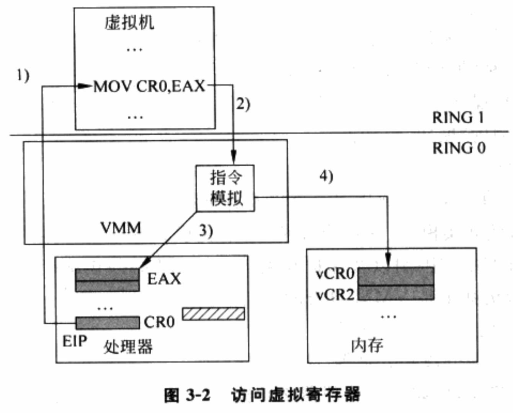

### 2.1.2 上下文
在没有虚拟化的环境中, 操作系统直接负责物理处理器管理, 负责进程间调度和切换. 但是, VMM接管物理处理器后, 客户机OS运行在VMM为之设计的虚拟处理器之上, 管理虚拟处理器, 并在虚拟处理器上负责该虚拟机内进程调度和切换. 而调度切换, 涉及到了上下文状态, 这里是虚拟处理器上下文.

而在某个时刻, 物理处理器中的寄存器状态构成了当前进程的上下文状态.

进程上下文！！！主要是与运算相关的寄存器状态！！！, 例如EIP寄存器指向进程当前执行的指令, ESP存放着当前进程的堆栈指针等.

虚拟处理器上下文比进程上下文更为复杂, 因为客户机OS本身包含很多敏感指令, 会试图访问和修改物理处理器上定义的所有寄存器, 而这种访问和修改会被VMM重定位到虚拟处理器上. 所以, 对于虚拟处理器, 其上下文包括了更多的系统寄存器, 例如CR0、CR3、CR4和各种MSR等. 当VMM在决定切换虚拟处理器的时候, 需要考虑保存和恢复的上下文也更为复杂.（包含了很多操作系统中很多不可见寄存器）

### 2.1.3 虚拟处理器
虚拟处理器可以从两个角度来理解.
#### 2.1.3.1 客户机OS角度的虚拟处理器
首先, 从客户机OS角度, 其在运行的虚拟处理器需要具备与其"期望"的物理处理器一样的功能和行为, 这种"期望"的前提条件甚至可以允许客户机OS的修改, 例如VMM可以修改客户机OS的源码, 使客户机OS所"期望"的与VMM所呈现的功能集合一致. 典型"期望"包括:

⓵ 指令集合与执行效果

⓶ 可用寄存器集合, 包括通用寄存器以及各种系统寄存器.

⓷ 运行模式, 例如实模式、保护模式和64位长模式等。 处理器的运行模式决定了指令执行的效果、寻址宽度和限制以及保护粒度等.

⓸ 地址翻译系统, 例如页表级数.

⓹ 保护机制, 例如分页和分段等.

⓺ 中断/异常机制, 例如虚拟处理器必须能够正确模拟真实处理器的行为, 在错误的执行条件下, 为虚拟机注入一个虚拟的异常.

#### 2.1.3.2 VMM角度的虚拟处理器
从VMM的角度看, 虚拟处理器是其需要模拟完成的一组功能集合.

虚拟处理器功能可以由物理处理器和VMM共同完成.
* 对于非敏感指令！！！, 物理处理器直接解码处理其请求！！！, 并将相关效果直接反映到物理寄存器上;
* 对于敏感指令！！！, VMM负责陷入再模拟！！！, 从程序角度也就是一组数据结构与相关处理代码的集合.
    * 数据结构用于存储虚拟寄存器的内容,
    * 相关处理代码负责按照物理处理器的行为将效果反映到虚拟寄存器上.

VMM已经可以为虚拟机呈现与实际物理机不一致的功能和行为。 例如, 虚拟处理器的个数, 可以与物理处理器的个数不一致。
总之, 在处理器虚拟化中, 定义虚拟寄存器和虚拟处理器, 利用上下文进行虚拟处理器调度切换, 宗旨都是让虚拟机执行的敏感指令陷入下来后, 能被VMM模拟, 而不直接作用于真实硬件上.

### 2.1.4 VMM陷入机制
VMM陷入是利用处理器的保护机制, 利用中断和异常来完成的, 它有以下几种方式.
* 基于处理器保护机制触发的异常！！！, 例如前面提到的敏感指令的执行. 处理器在执行敏感指令前, 检查其执行条件是否满足, 例如当前特权级、运行模式以及内存映射关系等。一旦任一条件不满足, VMM得到陷入然后进行处理.
*  虚拟机主动触发异常, 也就是常说的陷阱. 条件满足时, 处理器会在触发陷阱的指令执行完毕后, 再抛出一个异常. 虚拟机可以通过陷阱指令来主动请求陷入到VMM中. 类虚拟化技术就是通过这种方式实现Hypercall的.
* 异步中断, 包括处理器内部的中断源和外部的设备中断源. 一旦中断信号到达处理器, 处理器会强行中断当前指令, 然后跳到VMM注册的中断服务程序中. 例如, VMM可以通过调度算法指定当前虚拟机运行时的时间片长度, 然后编程外部时钟源, 确保时间片用完时触发中断, 从而允许VMM进行下一次调度.

## 2.2 中断和异常的模拟及注入
中断和异常机制是处理器提供给系统程序的重要功能
* 异常保证了系统程序对处理器关键资源的绝对控制,
* 中断提供了与外设之间有效地一种交互方式.

VMM对于异常的虚拟化需要完全遵照物理处理器对于各种异常条件的定义, 再根据虚拟处理器当时的内容, 来判断是否需要模拟出一个虚拟的异常, 并注入到虚拟环境中.

VMM通常会在硬件异常处理程序和指令模拟代码中进行异常虚拟化的检查. 无论哪条路径, VMM需要区分两种原因: 一是虚拟机自身对运行环境和上下文的设置违背了指令正确执行的条件; 二是虚拟机运行在非最高特权级别, 由于虚拟化的原因触发的异常. 第二种情况是由于陷入再模拟的虚拟化方式所造成的, 并不是虚拟机本身的行为. 而第一种情况的检查, VMM实际是在虚拟处理器的内容上进行, 因为它反映了虚拟机所期望的运行环境. 错误的异常注入会导致客户OS做出错误反应, 后果无法预知.

物理中断的触发来自特定的物理中断源, 同样, 虚拟中断的触发来自于虚拟设备的模拟程序！！！. 当设备模拟器！！！发现虚拟设备状态满足中断产生的条件时, 会将这个虚拟中断！！！通知给中断控制器的模拟程序(！！！), 例如模拟LAPIC. 最后, VMM会在特定时候检测虚拟中断控制器的状态, 来决定是否模拟一个中断的注入. 而这里的虚拟中断源包括: 处理器内部中断源的模拟, 例如LAPIC时钟、处理器间中断等; 外部虚拟设备的模拟, 例如8254、RTC、IDE、网卡和电源管理模块等; 直接分配给虚拟机！！！使用的真实设备的中断！！！, 通常来自VMM的中断服务程序; 自定义的中断类型.

当VMM决定向虚拟机注入一个中断或异常时, 它需要严格模拟物理处理器的行为！！！来改变客户指令流的路径, 而且还要包含一些必需的上下文保护与恢复. VMM需要首先判断当前虚拟机的执行环境是否允许接受中断或是异常的注入, 假如客户机OS正好通过RFLAGS.IF位禁止了中断的发生, 这时VMM就只能把中断事件暂时缓存起来, 直到某时刻客户机操作系统重新允许了中断的发生, VMM才立即切入来模拟一个中断的注入. 而当中断事件不能被及时注入时, VMM还要进一步考虑如下因素.

⓵ 该中断类型是否允许丢失中断, 如果允许, VMM则可以将其后到达的多个同类型中断合为一个事件; 否则, VMM必须要跟踪所有后续到达的中断实例, 在客户指令流重新允许中断时, 将每一个缓存的中断一一注入.

⓶ 该中断在阻塞期间是否被中断源取消！！！, 这决定了VMM是否会额外注入一个已经被取消的假中断.

⓷ 当一次阻塞的中断实例比较多, VMM可能还要考虑客户机OS能否处理短期内大量同类型的中断注入, 因为这在真实系统中可能并不出现.

实际实现中, 还要考虑更多因素.

当模拟中断或异常的注入时, VMM需要首先判断是否涉及到运行模式的切换. 假如虚拟机可能运行在一个64位兼容模式, 而中断/异常处理程序运行在64位长模式, 这时VMM就得按照处理器的规定, 将虚拟机的运行模式进行软件切换！！！, 对保存的客户上下文进行相应的修改！！！. 可能需要的模式切换后, VMM还需要根据真实处理器在该模式下的中断注入过程！！！, 完整地进行软件模拟. 例如, 将必需的处理器状态(指令地址、段选择子等)复制压入当前模式下对应中断/异常服务程序的堆栈; 到中断模拟逻辑去查找发生中断的向量号; 根据该向量号来查找相关的中断/异常服务程序的入口地址; 最后修改虚拟机的指令地址为上述入口地址, 然后返回到虚拟机执行等.

总而言之, 中断/异常的虚拟化由中断/异常源的定义、中断/异常源与VMM处理器虚拟化模块间的交互机制以及最终模拟注入的过程组成.

## 2.3 对称多处理器技术的模拟

在没有虚拟化的环境中, 对称多处理器技术可以让OS拥有并控制多个物理处理器, 它通过提供并发的计算资源和运算逻辑, 允许上层OS同时调度多条基于不同计算目的的进程并发执行, 从而有效提高系统的吞吐率与性能.

同样, 当物理计算资源足够多时, VMM也可以考虑为虚拟机呈现多个虚拟处理器, 即客户对称处理器虚拟化技术, 也称客户SMP技术. 这样, 当这些虚拟处理器同时被调度在多个物理处理器上执行时, 也可以有效提高给定虚拟机的性能.

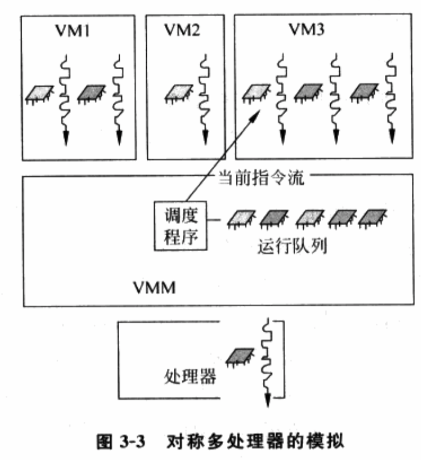

客户SMP引入, VMM在虚拟环境的管理和责任发生变化.

首先, VMM必须按照客户机操作系统期望的那样呈现客户SMP的存在, 这样客户机OS才不会认为其运行在单一处理器上, 才会试图初始化其它的虚拟处理器, 并在其上运行调度程序. VMM可以是模拟一个现实中的接口, 例如通过APIC表来表述; 也可以是一个自定义的接口协议, 只要客户机OS被修改来配合VMM即可.

其次, SMP的并发执行能力虽然带来了性能上提升, 但多个处理器竞争共享资源的情况也给软件带来了更多复杂性. 为保证正确性, 通常系统程序需要实现一套同步机制来协调处理器之间的步调, 从而确保任何时候只有一个处理器能对共享资源进行修改, 并且在释放修改权之前, 确保修改的效果能被每个处理器察觉到.

在客户SMP机制引入后, 实际上VMM面临物理处理器(即主机SMP)以及虚拟处理器之间(即客户SMP)的同步问题.

⓵ 对于发生在VMM自身代码之间的同步问题, 由VMM负责协调物理处理器之间的步调来满足主机SMP的要求.

⓶ 对于发生在同一虚拟机内部, 多个虚拟处理器间的同步问题, 通常VMM不需要参与, 这是客户OS自身的职责. VMM只需要在客户机OS发起某种特权操作, 例如刷新页表时, 正确地模拟其效果即可.

⓷ 对于VMM造成的虚拟处理器之间的同步问题, 仍需要VMM来负责处理. 例如, VMM可能将N个虚拟处理器在M(M>N)个物理处理器之间迁移, 客户机OS只知道自己有N个虚拟处理器, 所以只会在这N个虚拟处理器的上下文内进行同步操作, 但当VMM将这N个虚拟处理器迁移到M个物理处理器上运行时, VMM就必须负责所有M个物理处理器上状态的同步.

最后, VMM对虚拟机管理模块也必须根据客户SMP的存在做相应修改. 例如, 挂起命令要区分挂起虚拟处理器还是挂起虚拟机, 当挂起某个虚拟机就必然挂起该虚拟机内所有指令流的执行.

下面看下在客户SMP功能被引入后初始化过程如何模拟的

通常, 对称多处理器技术定义有标准的一套初始化过程. 在没有虚拟化时, BIOS负责选取BSP(主启动处理器)与AP(应用处理器), 把所有处理器都初始化到某个状态后, BIOS在BSP上通过启动加载程序(Boot Loader)跳转至操作系统的初始化代码, 同时所有的AP处于某种等待初始化硬件信号的状态. 接下来, OS！！！会在初始化到某个时刻时, 发出某种初始化硬件信号给所有AP, 并提供一段特定的启动代码, AP在收到初始化硬件信号后, 就会跳转到**操作系统指定的启动代码！！！**中继续执行. 通过这样的一种方式, OS最终就成功按自己的方式初始化了所有处理器, 最后在每个处理器上独立地运行调度程序.
那么, 虚拟环境中, 客户SMP功能被引入后初始化怎么做的? 注意, 此时讨论的是VMM已经启动运行起来, 而客户OS正处于初始化阶段. VMM选择第一个虚拟处理器作为BSP, 其它虚拟处理器作为AP, 将所有虚拟机处理器都初始化到某种状态. 这里分两种情况: 如果客户机OS不能修改, 而它又期望看到虚拟处理器与物理处理器加电重设后一样的状态, VMM就必须按照软件开发手册上对于处理器加电重设状态的描述, 设置虚拟处理器的寄存器状态, 包括虚拟控制寄存器和虚拟运行模式等; 如果客户机OS可以修改, VMM可以使用一套自定义的协议而不必按照规范, 例如直接跳过实模式把虚拟处理器初始化为保护模式. 接下来, 当启动代码初始化到某个时刻时, AP需要收到某种初始化信号被唤醒. 这里还是相应分为两种情况: 如果客户机OS不能被修改, 则VMM负责截获客户机OS发出的INIT-SIPI-SIPI序列, 唤醒其它虚拟AP; 如果客户OS可以被修改, VMM也可以自定义一套简单的唤醒机制.

# 3 内存虚拟化
没有虚拟化条件下，操作系统对内存管理和使用达到下面两条共识:
* 内存是从物理地址0开始的（比如内核加载必须要从0开始）
* 内存地址是连续的，或者说尽可能连续（DMA）

## 3.1 内存虚拟化目的
内存虚拟化目的有两个
* 提供虚拟机从0开始的连续内存空间
* 虚拟机之间有效隔离、共享、调度资源

## 3.2 内存虚拟化面临问题
* 提供给虚拟机的内存不可能是从0开始
* 如果将内存进行分区提供给虚拟机使用，内存的使用效率并不是很灵活

对以上问题，内存虚拟化的核心是引入一层新的地址空间---客户机物理地址空间

## 3.3 内存虚拟化实现
* 如下图所示，vmm负责管理和分配每个虚拟地址内存，客户机看到的是一个虚构的客户机物理地址空间， 其指令的目标地址也是客户机物理地址。(虚拟机使用的是虚拟出来的物理地址)
* 虚拟环境下，这样的地址不会直接发到总线上，需要由VMM将虚拟地址转化成实际的物理地址才能被处理器操作
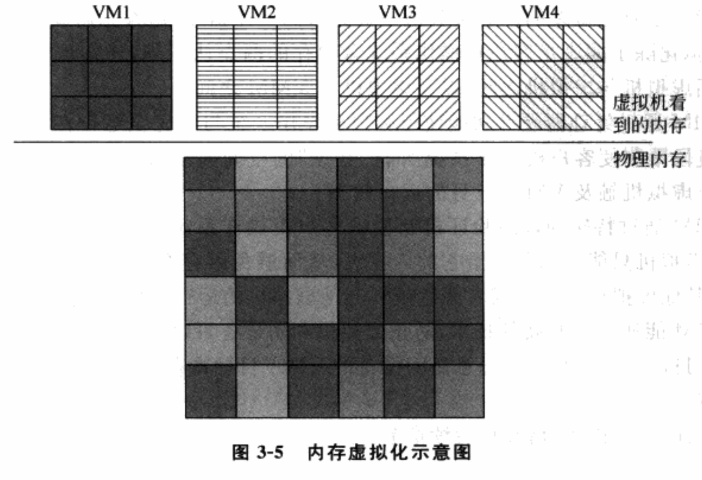

因此，我们需要解决两个非常重要的问题
* 维护客户机物理地址和真实物理地址之间的映射关系
* 截获客户机物理地址转化成真实的物理地址

第一个实现比较简单，在vmm中需要一套数据结构来维护客户机物理地址和真实物理地址之间的映射关系。
第二个实现稍微复杂：一个最简单的办法, 设法让虚拟机对客户机物理地址空间的每一次访问都触发异常, 然后由VMM来查询地址转换表模拟其访问. 这种方法完备性和正确性没问题, 但性能是最差的, 其它方法见后续.

# 4. I/O虚拟化
* 驱动程序不关系外设的电路设计，只关心使用外设接口
* 处理器访问外设必须映射到物理地址空间，只有驱动程序通过指令访问外设才能正真的识别目标对象
下图是典型外设可能有的资源
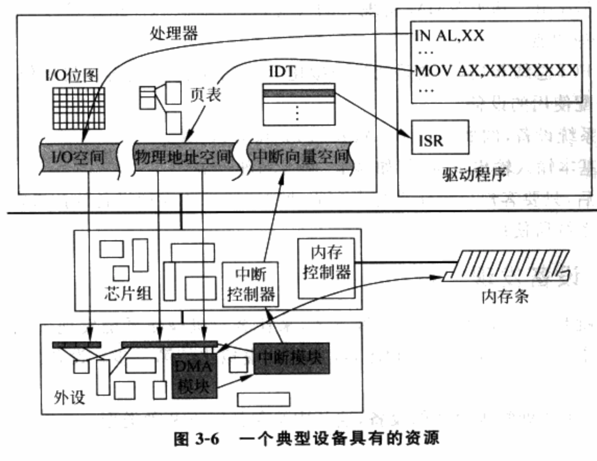

* I/O端口寄存器. 它被映射到I/O地址空间中, 由特殊指令IN/OUT访问. 若指令流处于最高特权级, 整个64KB的I/O地址空间都可自由访问, 驱动程序就是; 当指令流运行在其它特权级, 只有I/O位图允许的端口才能访问.
* MMIO寄存器. 被映射到物理地址空间, 通过页表方式控制访问权限.
* 中断. 由于外设的物理构造, 速度远低于处理器, 往往通过一步时间通知的方式来完成延后的操作, 这个通知机制通常是中断模块实现. 每个允许发生中断的外设会在处理器的中断向量空间分配一个序号.
* DMA提供给设备不经处理器而直接访问内存的方式, 从而特别适合大批量数据的批量传输. 从访问方式来说, DMA模块！！！被映射在I/O端口或MMIO中！！！.

## 4.1 I/O虚拟化思路
在虚拟环境中, I/O面临的问题是: 外设资源有限, 为满足多个客户机OS需求, VMM必须通过I/O虚拟化方式复用有限的外设资源. 

VMM截获客户OS对设备的访问请求, 然后通过软件方式模拟真实设备. 从处理器角度看, 外设是通过一组I/O资源(端口I/O或MMIO)来进行访问的, 所以设备相关的虚拟化又被称为I/O虚拟化.

I/O虚拟化不需要完整虚拟化出所有外设的所有接口. 怎么做取决于设备与VMM的策略以及客户机OS的需求.
*  虚拟芯片组. 基于VMM实现上考虑, 这个虚拟芯片组还可承担ACPI电源管理相关的一些功能.
* 虚拟PCI总线布局, 主要是通过虚拟化PCI配置空间, 为客户机OS呈现或直接分配使用的设备.
* 虚拟系统设备, 例如PIC、IO-APIC、PIT和RTC等.
* 虚拟基本输入输出设备, 例如显卡、网卡和硬盘等.

I/O虚拟化主要包含以下几个方面的虚拟化
* I/O端口寄存器(Port I/O)
* MMIO寄存器
* 中断
* DMA

## 4.2 设备发现
即让VMM提供一种方式, 来让客户机OS发现虚拟设备, 这样的客户机OS才能加载相关驱动, 这是I/O虚拟化的第一步. 设备发现取决于被虚拟的设备类型.
(1) 模拟一个所处物理总线的设备, 这其中又包括以下两种类型.
* 模拟一个所处总线类型是不可枚举的物理设备，而且该设备本身所属的资源是硬编码固定下来的。比如ISA设备、PS/2键盘、鼠标、RTC及传统IDE控制器。对于这类设备，驱动程序会通过设备特定的方式！！！来检测设备是否存在，例如读取特定端口的状态信息。对于这类设备的发现，VMM在给定端口进行正确的模拟就可以了，即截获客户机对该端口的访问，模拟出结果交给客户机。
*  模拟一个所处总线类型是可枚举的物理设备，而且相关设备资源是软件可配置的，比如PCI设备。由于PCI总线是通过PCI配置空间定义一套完备的设备发现方式，并且允许系统软件(BIOS或操作系统)通过PCI配置空间的一些字段对给定PCI设备进行资源的配置，例如允许或禁止I/O端口和MMIO，设置I/O和 MMIO的起始地址等。所以VMM仅模拟自身的逻辑是不够的，必须进一步模拟PCI总线的行为，包括拓扑关系和设备特定的配置空间内容，以便让客户机操作系统发现这类虚拟设备。

(2) 模拟一个完全虚拟的设备
这种情况下，没有一个现实中的规范与之对应，这种虚拟设备所处的总线类型完全由VMM自行决定，VMM可以选择将虚拟设备挂在PCI总线上，也可以完全自定义一套新的虚拟总线协议，这样的话客户机操作系统必须加装新的总线驱动。

## 4.3 访问截获
虚拟设备被客户操作系统发现，操作系统中的驱动会按照设备定义的借口使用驱动，VMM必须截获驱动程序对设备访问，并加以模拟。可以毫不犹豫的说关键在于处理器虚拟化。

### 4.3.1 Port I/O
对于端口I/O，处理器对于端口I/O资源的控制在于指令流所处的特权级别和相关I/O位图.
#### 4.3.1.1 非直接分配
对于一个非直接分配给客户机OS使用的设备, 客户OS运行在一个非特权环境中, 所以客户OS能否访问给定I/O端口就完全由I/O位图决定. 自然地, VMM完全可以将设备的所有端口I/O从I/O位图中关闭, 这样, 当客户指令流在访问该I/O端口时, 物理处理器就会及时抛出一个保护异常, 然后VMM就能获取异常原因, 然后将请求发送给设备模拟器进行模拟.

#### 4.3.1.2 直接分配
相反, 对于一个直接分配给客户机OS的设备, VMM可以将该设备所属端口I/O从I/O位图中打开, 这样处理器就把访问发送到系统总线, 最终到达目标物理设备而不被模拟.

### 4.3.2 MMIO
对于MMIO，MMIO本身也是物理地址空间的一部分, 而物理地址空间的访问控制是通过页表来控制的.

#### 4.3.2.1 非直接分配
对于非直接分配给客户机OS使用的设备, 在物理处理器遍历的真实页表里, VMM只要把映射到该MMIO的页表项设为无效，当客户机指令流试图再访问目标地址时, 物理处理器就会抛出缺页异常，从而陷入到VMM中，VMM遍历客户页表, 就能发现设备所属的MMIO资源, 然后将请求交给设备模拟器进行模拟。

#### 4.3.2.2 直接分配
相反, 对于直接分配给客户OS使用的设备, VMM只需要按照客户页表的设置打开真实页表映射即可, 这样客户机OS对该设备的访问也不再被模拟.

### 4.3.3 中断
#### 4.3.3.1 非直接分配
对于非直接分配, 假设该设备可以产生中断, 那么VMM只要提供一种机制，供设备模拟器在接收到物理中断并需要触发中断时，可以通知到虚拟中断逻辑，然后由虚拟中断逻辑模拟一个虚拟中断的注入。

#### 4.3.3.2 直接分配
相反, 对于直接分配的, VMM物理中断处理函数在接收到物理中断后, 辨认出中断源属于某个客户机, 然后通知该客户机的虚拟中断逻辑.

### 4.3.4 DMA或类似的共享内存机制
如果设备可以提供DMA或类似的共享内存机制, DMA允许设备绕过处理器直接访问目标内存, 而若客户机OS驱动程序是未经修改的, 则设备模拟器接收到的 DMA目标地址 是 客户机物理地址！！！.

因此, VMM只要提供一种机制, 让设备模拟器了解各种地址之间转换关系！！！ , 从而可以把客户机物理地址映射成自己的虚拟地址, 就能真正做到DMA目标地址的访问.

## 4.4 设备模拟
### 4.4.1 基于软件的虚拟化
虚拟设备与现实设备具有完全一样的接口定义。这种情况下，VMM的设备模拟器需要仔细研究现实设备的接口定义和内部设计规范，然后以软件的方式模拟真实逻辑电路来满足每个接口的定义和效果, 例如PS/2键盘、鼠标等。现实设备具有哪些资源，设备模拟器就需要呈现出同样的资源。这种情况下，客户机操作系统原有的驱动程序无需修改就能驱动虚拟设备。设备访问过程中，VMM通过截获驱动程序对设备的访问进行模拟。

举例：qemu, VMware Workstation

### 4.4.2 半虚拟化
给客户机操作系统提供一个特定的驱动程序（称为前端, Front-end, FE），VMM中的模拟程序称为后端(Back-End, BE)设备驱动，前端将来自于其他模块的请求通过VMM提供的特殊通信机制直接发送给后端，后端处理完请求后再发回通知给前者。

与传统设备驱动程序流程（前一种方式）比较，传统设备程序为了完成一次操作要涉及到多个寄存器的操作，使得VMM要截获每个寄存器访问！！！并进行相应的模拟，就会导致多次上下文切换。这种方式能很大程度的减少上下文切换的频率，提供更大的优化空间。

举例：xen virtio（virtio，主要包括virtio框架、virtio前端驱动、后端实现方式及原理、前端后端共享内存的方式）
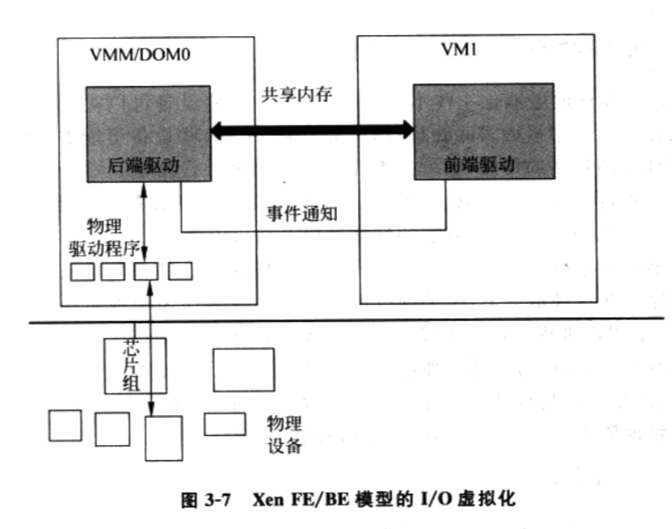

### 4.4.3 基于硬件的直接分配（实际上已经不是设备模拟了）
直接将物理设备分配给客户机操作系统，由客户机操作系统直接访问目标设备！！！。这种情况下实际上不存在设备模拟，客户机直接通过原有的驱动无缝操作真实硬件。这种方式从性能上说是最优的，但这种方式需要比较多的硬件资源。

基于硬件的直接分配还有一种方式，硬件本身支持虚拟化，本身可以向不同的虚拟机提供独立的硬件支持，设备本身支持多个虚拟机同时访问。比如SR-IOV。

举例：intel的vt-d和PCI-SIG的SR-IOV

一个VMM中，常常是多种虚拟化方式并存。

不同的IO虚拟化方式对比
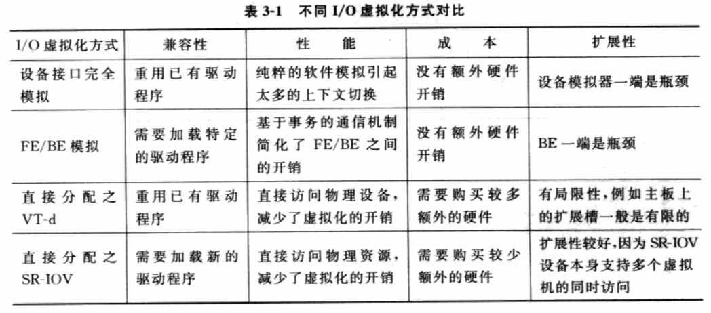
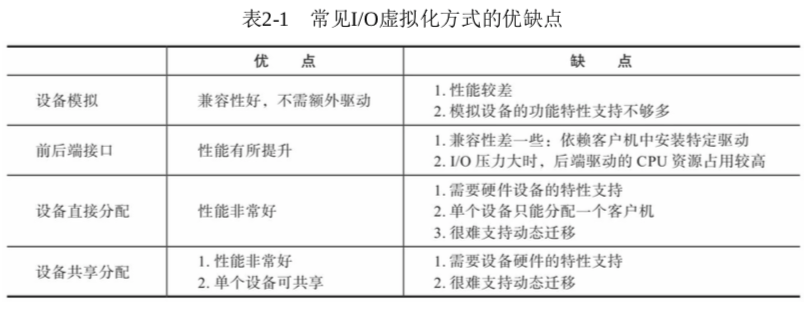

## 4.5 设备共享

设备虚拟化中，
* 有些设备可以被软件模拟器完全用软件的方式模拟而不用接触实际物理设备，比如CMOS，
* 而有些设备需要设备模拟进一步请求物理硬件的帮助, 也就是需要利用到物理外设资源.

一般输入输出类设备属于后一类设备，如鼠标、键盘、显卡、硬盘、网卡。这些设备都涉及到从真实设备上获取输入或者输出到真实设备上。

设备模拟器通常运行在一个 I/O特权环境！！！ 中, 这样的I/O特权环境中有驱动物理外设的物理驱动程序.

这种情况下, 相关的设备模拟器本身是作为物理驱动程序的一个客户而存在, 例如一个用户进程. I/O特权环境中的多数物理驱动程序都是可以同时接收多个客户或进程的请求，达到物理资源的复用.

同样, 每个虚拟机都有自己专属的设备模拟逻辑, 也就是在I/O特权环境中存在一个相对应的用户进程！！！. 通过这种方式, I/O虚拟化就有效地将物理资源在多个虚拟环境中复用起来, 如图。
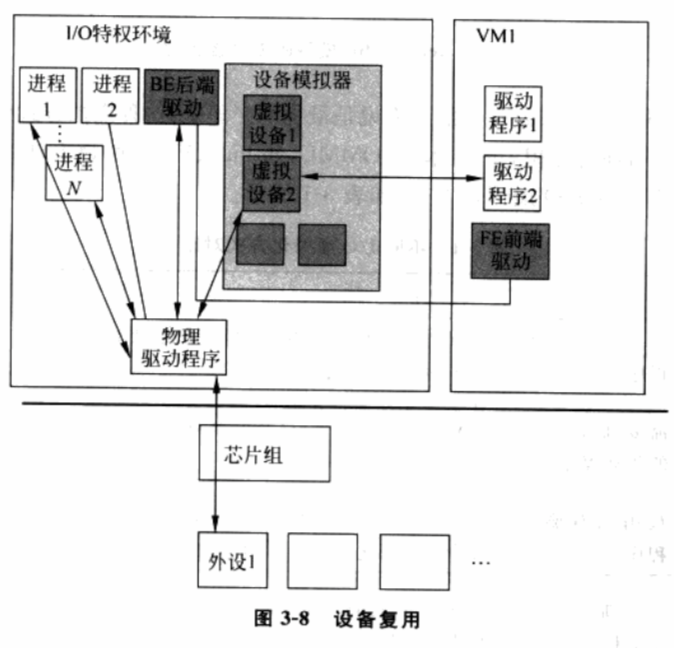

# 5. VMM功能和组成
从软件角度来看，物理机器是有处理器、内存和I/O设备等一组资源的实体。虚拟机也一样。

VMM基本上由两个部分组成，虚拟环境管理和物资资源管理，前一部分是所有VMM产品需要提供的功能，后一部分根据实现结构差异各有差异。

## 5.1 虚拟环境管理
### 5.1.1 虚拟资源
VMM需要提供如下基本模块.
* 处理器虚拟化模块. 为虚拟机提供虚拟处理器.
* 内存虚拟化模块. 为虚拟机提供虚拟内存
* 设备虚拟化模块. 为虚拟机提供虚拟I/O设备.

### 5.1.2 虚拟环境调度
操作系统调度单位进程/线程，VMM调度单位是虚拟处理器

当虚拟处理器被调度时，VMM调度程序负责将虚拟处理器上下文装载到物理处理器上，然后虚拟处理器所对应的客户指令开始真正执行。

当时间片用完，或者虚拟指令退出，程序调度触发，挑选下一个虚拟处理器继续执行。

VMM调度策略有多种，例如平均分配时间片，或按照虚拟机权重等。

### 5.1.3 虚拟机之间的进程通信
与OS就进程通信机制类似，虚拟机之间也存在虚拟机之间通信机制。

虚拟机之间实现进程通信的方式有很多，通常来讲，VMM实现虚拟机之间的进程通信机制，并向虚拟机之间提供响应API，虚拟机的客户OS通过调用这些API和其它虚拟机进行通信。这些API可以是事件通知也可以是共享内存。

VMM还提供虚拟机和VMM之间交互API。

### 5.1.4 虚拟化环境的管理接口
虚拟机的管理功能由上层的管理程序和VMM提供的管理接口组成.
* VMM提供一组完备的管理接口, 来支持虚拟环境的创建、删除、暂停、查询和迁移等功能.
* 上层的管理程序则通过调用VMM提供的管理接口, 为用户提供管理界面

## 5.2 物理资源管理
与OS一样, VMM本身承担全部或部分物理资源管理角色.
### 5.2.1 处理器管理
* 系统启动时检测并获取所有的处理器;
* 对每个处理器进行初始化, 如设置运行模式、设置页表、设置中断处理函数等;
* 将所有处理器纳入调度序列, 由调度程序对处理器进行调度.

有些VMM还支持对物理处理器的热插拔. 有些VMM还具有高可靠性的支持, 当收到处理器失效通知时, 如MCA(Machine Check Abort), VMM将其做热拔出处理.

### 5.2.2 内存管理
* 系统启动时VMM检测并获取内存;
* 对获得的内存的初始化, 包括分页并设置页表等;
* 提供内存分配接口, 以便VMM的其它模块能获得/释放内存;
* 给虚拟机分配内存, 并维护虚拟机物理地址与实际物理地址的映射关系, 以供VMM其它模块查询使用.

### 5.2.3 中断管理
VMM负责初始化并设置中断相关资源, 如处理器中断向量表、Local APIC和中断控制器(I/O APIC、8259 PIC). 当中断发生后, VMM是接收者, 它会根据中断的来源, 或直接处理, 或转发到相应特权虚拟机来处理.

### 5.2.4 系统时间维护
VMM拥有和时间相关的硬件资源, 因此VMM负责维护系统时间, 并向各虚拟机提供虚拟化的时间.

### 5.2.5 设备管理
Hypervisor模型中, 所有外设都属于VMM, 因此, VMM需要包含所有设备的驱动程序来管理这些设备. 混合模型下, 大部分外设属于特权客户操作系统, 由特权客户OS的驱动程序来管理这些外设. VMM也拥有少部分的设备, 如用于调试的串口, 因此也需要包含这些设备的驱动程序.

## 5.3 其它模块
### 5.3.1 软件定时器
通常是通过时钟中断处理函数来实现的, 在VMM中广泛使用, 如系统时间的维护等.
### 5.3.2 多处理器同步原语(spinlock、rcu等)
与OS一样, 当多处理器共享同一个资源时, VMM需要提供同步原语来同步多处理器的读写访问.

### 5.3.3 调试手段(包括系统级别和虚拟环境待定)
printk是最简单的调试手段, 有些还会开发其他调试工具

### 5.3.4 性能采集与分析工具
VMM通常也会提供profiling工具, 用于性能数据的采集和分析. 这些能采集VMM的全局的性能数据, 也能采集针对某个虚拟机的性能数据.

### 5.3.5 安全机制
VMM要保证各个虚拟机之间, 以及虚拟机与VMM之间是隔离的.

### 5.3.6 电源管理
包括处理器电源管理、睡眠状态电源管理等.

# 6. VMM分类
* 软件虚拟化
通过软件模拟来实现VMM层，通过纯软件的环境来模拟执行客户机里的指令。
最纯粹的软件虚拟化实现当属QEMU。在没有启用硬件虚拟化辅助的时候，它通过软件的二进制翻译仿真出目标平台呈现给客户机，客户机的每一条目标平台指令都会被QEMU截取，并翻译成宿主机平台的指令，然后交给实际的物理平台执行。由于每一条都需要这么操作一下，其虚拟化性能是比较差的，同时其软件复杂度也大大增加。但好处是可以呈现各种平台给客户机，只要其二进制翻译支持。

* 硬件虚拟化
硬件虚拟化技术就是指计算机硬件本身提供能力让客户机指令独立执行，而不需要（严格来说是不完全需要）VMM截获重定向。
以x86架构为例，它提供一个略微受限制的硬件运行环境供客户机运行（non-root mode），在绝大多数情况下，客户机在此受限环境中运行与原生系统在非虚拟化环境中运行没有什么两样，不需要像软件虚拟化那样每条指令都先翻译再执行，而VMM运行在root mode，拥有完整的硬件访问控制权限。仅仅在少数必要的时候，某些客户机指令的运行才需要被VMM截获并做相应处理，之后客户机返回并继续在non-root mode中运行。可以想见，硬件虚拟化技术的性能接近于原生系统，并且，极大地简化了VMM的软件设计架构。
Intel从2005年就开始在其x86 CPU中加入硬件虚拟化的支持——Intel Virtualization Technology，简称Intel VT。到目前为止，在所有的Intel CPU中，都可以看到Intel VT的身影。

## 6.1 按虚拟平台分类
根据VMM提供的虚拟平台类型可将VMM分成两类:
* 第一类VMM虚拟的是现实存在的平台, 并且在客户机操作系统来看, 虚拟的平台和现实的平台是一样的, 客户机操作系统察觉不到是运行在一个虚拟平台上. 这样的虚拟平台可以运行现有的操作系统, 无须对操作系统进行修改, 因此称为完全虚拟化(Full Virtualization).
* 第二类VMM虚拟的是现实中不存在的平台, 而是经过VMM重新定义的, 这种虚拟化平台需要对所运行的客户机操作系统进行或多或少的修改使之适应虚拟环境, 因此客户机OS知道其运行在虚拟平台上, 并且会去主动适应. 这种称为类虚拟化(Para Virtualization).

另外, 一个VMM既可以提供完全的虚拟化的虚拟平台, 又提供类虚拟化的虚拟平台.

### 6.1.1 完全虚拟化
x86架构为例, 完全虚拟化经历了两个阶段: 软件辅助的完全虚拟化和硬件辅助的完全虚拟化
#### 6.1.1.1 软件辅助的完全虚拟化
x86虚拟化技术早期, x86体系没有在硬件层次！！！上对虚拟化提供支持, 因此完全虚拟化只能通过软件实现.
一个典型做法是优先级压缩(Ring Compression)和二进制代码翻译(Binary Translation)相结合.
* 优先级压缩(Ring Compression)
优先级压缩的原理是: 由于VMM和客户机运行在不同特权级上, 对应到x86上, 通常是VMM运行在Ring 0, 客户机OS内核运行在Ring 1, 客户机OS应用程序运行在Ring 3. 当客户机OS内核执行相关特权指令时, 由于在非特权的Ring 1, 因此通常触发异常, VMM截获该特权指令并进行虚拟化.
Ring Compression能正确处理大部分特权指令, 但是由于x86指令体系在设计之初并没有考虑到虚拟化, 因此有些指令还是不能通过Ring Compression正常处理, 即在Ring 1做特权操作的时候却没有触发异常(比如修改EFLAGES的IF标志), 从而VMM不能截获并做相应处理.
* 二进制代码翻译(Binary Translation)
二进制代码翻译方法因此被引入来处理这些虚拟化不友好的指令.
二进制代码翻译的思想很简单, 就是通过扫描并修改客户机的二进制代码, 将难以虚拟化的指令转化为支持虚拟化的指令.
VMM通常会对OS的二进制代码进行扫描, 一旦发现需要处理的指令, 就将其翻译成支持虚拟化的指令块(Cache Block). 这些指令块可以与VMM合作访问受限的虚拟资源！！！, 或显式地触发异常！！！ 让VMM进一步处理.
此外, 由于该技术可以修改客户机的二进制代码, 因此别广泛应用于性能优化！！！, 即将某些造成性能瓶颈的指令替换成更高效的指令来提高性能.
这种方式很难在架构上保证其完整性, 因此, x86在硬件上加入了对虚拟化的支持, 从而在硬件架构上实现了虚拟化.

#### 6.1.1.2 硬件辅助完全虚拟化
*  如果硬件本身加入足够的虚拟化功能, 就可以截获操作系统对敏感指令的执行或对敏感资源的访问, 从而通过异常方式报告给VMM, 这就解决了虚拟化的问题.
Intel的VT-x技术就是这样. VT-x在处理器上新引入了一个新的执行模式用于运行虚拟机. 当虚拟机执行在这个特殊模式中时, 它仍然面对的是一套完整的处理器寄存器集合和执行环境, 只是对任何特权操作都会被处理器截获并报告给VMM. VMM本身运行在正常模式下, 在接收到处理器的报告后, 通过对目标指令的解码, 找到对应的虚拟化模块进行模拟, 并把最终的效果反映在特殊模式下的环境中.
硬件辅助虚拟化是一种完备的虚拟化方法, 因为内存和外设的访问本身也是由指令来承载, 对处理器指令级别的截获意味VMM可以模拟一个与真实主机完全一样的环境.

### 6.1.2 类虚拟化
两个虚拟化目标中, 纯软件的虚拟化可以做到第一个目标，但性能不是很好，而且软件设计的复杂度大大增加。
那么如果放弃第一个目标呢？让客户机意识到自己是运行在虚拟化环境里，并做相应修改以配合VMM，这就是半虚拟化（Para-Virtualization）。
* 一方面，可以提升性能和简化VMM软件复杂度；
* 另一方面，也不需要太依赖硬件虚拟化的支持，从而使得其软件设计（至少是VMM这一侧）可以跨平台且是优雅的。

源代码级别修改指令以回避虚拟化漏洞的方式来使VMM能够对物理资源实现虚拟化.

x86的难以虚拟化的指令, 完全虚拟化通过Binary Translation在二进制代码级别上避免虚拟化漏洞. 类虚拟化采用另一种思路, 即修改操作系统的内核(即API级), 使得操作系统内核完全避免这些难以虚拟化的指令. 操作系统通常会用到处理器提供的所有功能, 例如特权级别、地址空间和控制寄存器等.

类虚拟化首先解决的问题就是如何插入VMM. 典型做法是修改操作系统的处理器相关代码, 让操作系统主动让出特权级别, 而运行在次一级特权级. 这样, 当操作系统试图执行特权指令时, 保护异常被触发, 从而提供截获点给VMM来模拟.

既然内核代码需要被修改, 类虚拟化可以进一步用来优化I/O. 即, 类虚拟化不是去模拟真实设备, 因为太多寄存器模拟会影响性能. 相反, 类虚拟化可以定义出高度优化的I/O协议. 这种I/O协议完全基于事务, 可以达到近物理机的速度.

“本质上，准虚拟化弱化了对虚拟机特殊指令的被动截获要求，将其转化成客户机操作系统的主动通知。但是，准虚拟化需要修改客户机操作系统的源代码来实现主动通知。”典型的半虚拟化技术就是virtio，使用virtio需要在宿主机/VMM和客户机里都相应地装上驱动。

## 6.2 暗中VMM结构分类

### 6.2.1  Hypervisor模型
在Hypervisor模型中, VMM首先可被看作是一个完备的操作系统！！！, 不过和传统OS不同, VMM为虚拟化而设计的, 因此还具备虚拟化功能.
从架构看,
* 首先, 所有物理资源如处理器、内存和I/O设备都归VMM所有, 因此, VMM管理物理资源;

* 其次, VMM需要向上提供虚拟机用于运行客户操作系统, 因此, VMM负责虚拟环境的创建和管理.

图3-9展示了Hypervisor的架构, 其中

* 处理器管理代码(Processor, P)负责物理处理器的管理和虚拟化！！！,
* 内存管理代码(Memory, M)负责物理内存的管理和虚拟化！！！,
* 设备模型(Device Model, DM)负责I/O设备的虚拟化,
* 设备驱动(Device Driver, DR)负责I/O设备的驱动, 即物理设备的管理.

VMM直接管理所有物理资源, 包括处理器、内存和I/O设备, 所以设备驱动也是VMM的一部分. 此外, 处理器管理代码、内存管理代码和设备模型也是VMM的一部分.
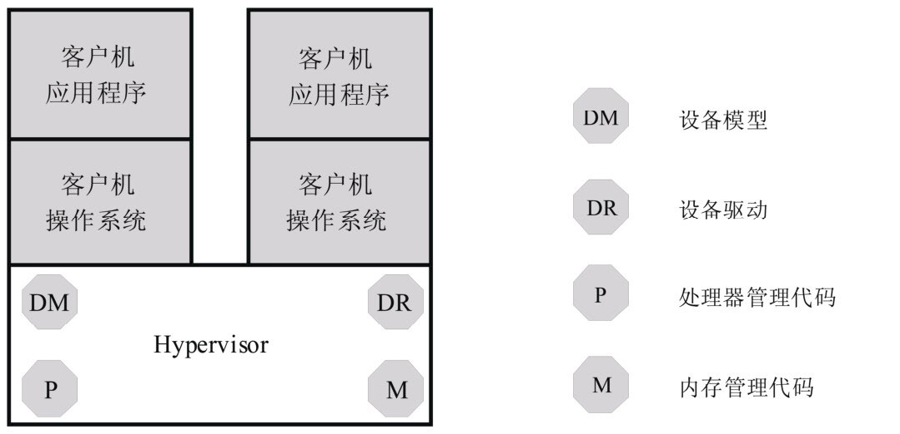

#### 6.2.1.1 Hypervisor模型的优点

由于VMM同时具备物理资源的管理功能和虚拟化功能, 所以, 物理资源虚拟化效率更高.

安全层面, 虚拟机的安全只依赖VMM的安全. 宿主模型中同时依赖VMM和宿主机OS的安全.

#### 6.2.1.2 Hypervisor模型的缺点
Hypervisor模型拥有虚拟化高效率同时也有缺点.

由于VMM完全拥有物理资源, 因此, VMM需要进行物理资源的管理, 包括设备的驱动. 设备驱动工作量很大, 所以基于Hypervisor模型的VMM通常根据市场定位, 选择一些I/O设备来支持, 而不是所有.

此外, 很多功能必须在VMM中重新实现, 例如调度和电源管理等, 无法像宿主模型那样借助宿主机OS.

### 6.2.2 宿主模型
* 物理资源由宿主机OS管理. 宿主机OS并不是为虚拟化设计的, 因此本身不具备虚拟化功能, 有些实现中还包括用户态进程, 如负责I/O虚拟化的用户态设备模型.
* VMM通过调用宿主机OS的服务来获得资源, 实现处理器、内存和I/O设备的虚拟化。VMM创建虚拟机后, 通常将虚拟机作为宿主机OS的一个进程参与调度.

图3-10显示宿主模型架构.
* 宿主机OS拥有所有物理资源, 包括I/O设备, 所以设备驱动位于宿主机操作系统中.
*     VMM(图中虚拟机管理内核模块)则包含处理器虚拟化模块和内存虚拟化模块.

图中设备模型实际也是VMM一部分, 具体实现中, 可将设备模型放在用户态, 也可放在内核态.

宿主模型的VMM:
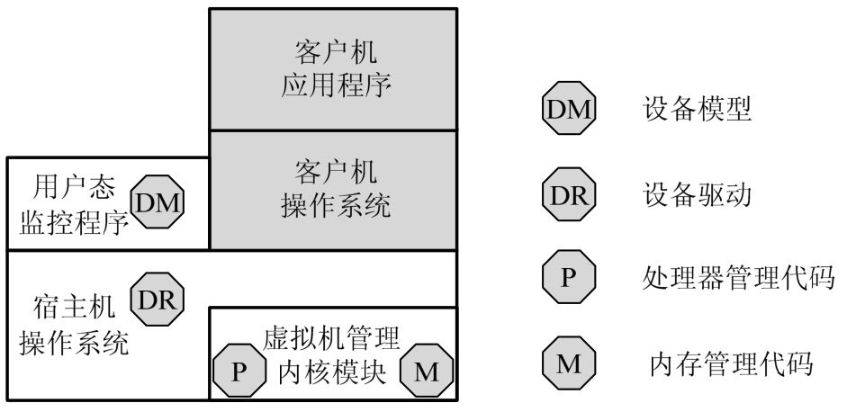

#### 6.2.2.1 宿主模型的优点
宿主模型的优缺点和Hypervisor模型恰好相反.

宿主模型最大优点是能充分利用现有OS的设备驱动程序, VMM无须为各类I/O设备重新实现驱动程序, 可以专注于物理资源的虚拟化.

此外, 宿主模型也可利用宿主机OS的其它功能, 例如调度和电源管理等, 这都不需要VMM重新实现.

#### 6.2.2.2 宿主模型的缺点

VMM调用宿主机OS的服务获取资源进行虚拟化, 系统服务设计之初没考虑虚拟化支持, 效率和功能有影响.
安全, 虚拟机的安全同时依赖VMM和宿主机OS的安全.

### 6.2.3 混合模型
VMM仍然在最底层, 拥有所有物理资源.

与Hypervisor不同的是, VMM会主动让出大部分I/O设备的控制权, 将他们交给一个运行在特权虚拟机中的特权操作系统来控制.

相应, VMM虚拟化的职责也被分担. 处理器和内存的虚拟化仍然是VMM完成, 而I/O虚拟化由VMM和特权操作系统共同合作完成.

图3-11显示混合模型.
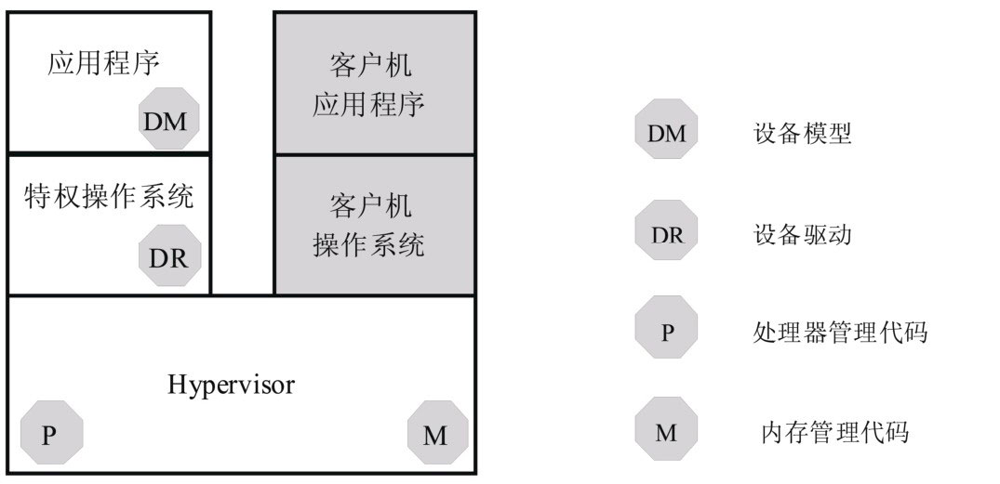

I/O设备的虚拟化由VMM和特权操作系统共同完成, 因此, 设备模型模块位于特权操作系统中, 并且通过相应的通信机制与VMM合作.

#### 6.2.3.1 混合模型的优点
混合模型集中了上面两种模型的优点.

VMM既可利用现有OS的I/O设备驱动. VMM直接控制处理器、内存等物理资源, 虚拟化效率比较高。

安全性上, 对特权OS的权限控制得当, 虚拟机安全性只依赖VMM.

#### 6.2.3.2 混合模型的缺点
特权OS运行在虚拟机上, 当需要特权OS提供服务时, VMM需要切换, 产生上下文切换开销. 切换频繁时, 上下文切换开销会造成性能的明显下降.

出于性能考虑, 很多功能还是必须在VMM中实现, 无法借助特权OS, 如调度程序和电源管理等.

## 6.3  按软件框架分类
从软件框架的角度上，根据虚拟化层是直接位于硬件之上还是在一个宿主操作系统之上，将虚拟化划分为Type1和Type2，如图1-6所示。
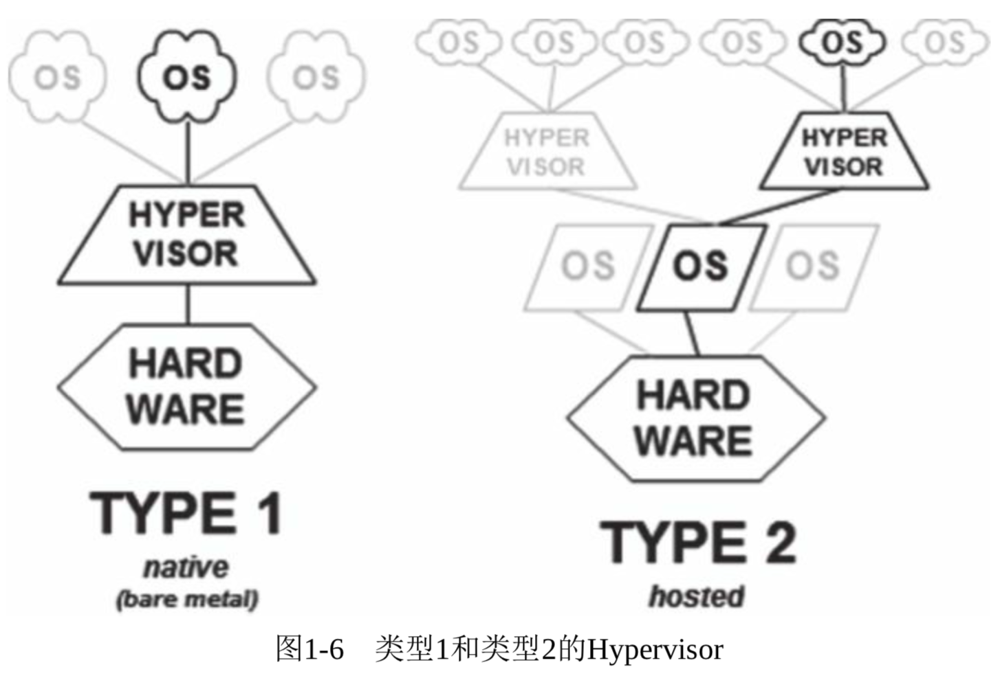

### 6.3.1  Type1: 没有宿主机OS, Hypervisor直接运行在硬件上
它们直接控制硬件资源以及客户机。典型地如Xen和VMware ESX。

### 6.3.2  Type2: Hypervisor运行在宿主机操作系统中
Type2（类型2）Hypervisor运行在一个宿主机操作系统之上，如VMware Workstation；或系统里，如KVM。这类Hypervisor通常就是宿主机操作系统的一个应用程序，像其他应用程序一样受宿主机操作系统的管理。比如VMware Workstation就是运行在Windows或者Linux操作系统上的一个程序而已。客户机是在宿主机操作系统上的一个抽象，通常抽象为进程。

# 7.典型虚拟化产品和特点

