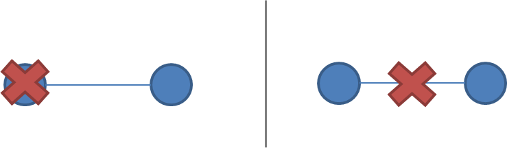

<!-- TOC -->

- [1. 背景](#1-背景)
    - [1.1 抽象的深入理解](#11-抽象的深入理解)
    - [1.2 抽象作用](#12-抽象作用)
    - [1.3 抽象风险和解决办法](#13-抽象风险和解决办法)
    - [1.4 抽象对实现分布式系统意义](#14-抽象对实现分布式系统意义)
- [2. 系统模型](#2-系统模型)
    - [2.1 node 在系统模型中地位](#21-node-在系统模型中地位)
    - [2.2 node之间交互在分布式系统中地位](#22-node之间交互在分布式系统中地位)
    - [2.3 Timing/Ordering 假设](#23-timingordering-假设)

<!-- /TOC -->

# 1. 背景
* 这里抽象就是我们常常理解的分层抽象，网络7层模型就是很好的例子，上层业务逻辑通过调用下层API结构实现。
* 通过抽象分布式模型，我们得出一些不可能实现的结果（CAP、FLP）

## 1.1 抽象的深入理解
* 如果说X是从Y抽象来的，那么
    * X的特性一定不会比Y多,只可能比Y的特性少
    * X比Y更容易理解

## 1.2 抽象作用
* 抽象并不能完全描述真实物体，但是通过抽象处重要性质，能使物体更容易掌握
## 1.3 抽象风险和解决办法
* 抽象经常要排除一些特性，这可能使抽象出的物体和真实物体有很大出入
* 因此，错误的实例是非常重要的，通过分析错误实例来增加新特性，使得抽象出来的物体更加健壮

## 1.4 抽象对实现分布式系统意义
* 抽象的目的是希望我们能用最少的代码实现分布式系统功能。
* 通过抽象，我们能知道分布式一定不能完成的特性，这样就会根据需求选择性实现特性（CAP）

# 2. 系统模型
程序分布式的问题如下：
* node独立并行运行
* 节点之间通过网络链接，或许会造成节点之间的不敢之或者数据丢失
* 没有共享存储和共享锁

分布式模型根据假设变化，分布式的假设如下：
* 每个节点功能是什么，如果节点down掉怎么办
* communication 如何关联操作，如何communication失败怎么办
* 整个系统特性有什么，包括时间和操作顺序

基于假设的强弱实现分布式系统
* 弱假设分布式系统健壮性强，但是模型复杂，实现困难
* 强假设健壮性弱，但是模型简单，实现简单

## 2.1 node 在系统模型中地位
* node 作用
    * 执行本地程序
    * 存储和计算
    * 本地时钟（可能不是准确的）
* node 节点可能failed，因此绝大多数分布式模型都会考虑node crash-recovery failure mode

* node 可能会应为任何可能的方式failed，因此产生了Byzantine fault tolerance 算法。但是这种算法在现实中没有在任何企业中应用，应为模型太复杂，实现成本太高

## 2.2 node之间交互在分布式系统中地位
* 很多分布式系统假设在通信中，每两个节点都是通过FIFO顺序通信的  
    * 但是实现过程中，我们只能满足消息的发送是FIFO，接收消息顺序是无法确保的
    * 发送的消息甚至可能会丢失

* 存在假设认为消息不可能丢失和超过延时上限
    * 现实中有部分环境是能够满足这种限制的
    * 但是如果完美的区考虑网络问题，应该要考虑网络的丢失和延时

* 网络分区，节点可能正常工作，但是因为网络分区造成网络延时和数据包丢失
    * 分区的节点可能任然可以被部分客户端访问，因此分区问题一定要和crashed node 问题分开
    

* long-distance links
    比如WAN latency长距离延时会非常大，需要和普通问题延时分开

## 2.3 Timing/Ordering 假设
* 在网络系统中，数据包的发送和接收顺序可能并非是一致的

有两种模型解决上面问题
* 同步模型
* 异步模型
