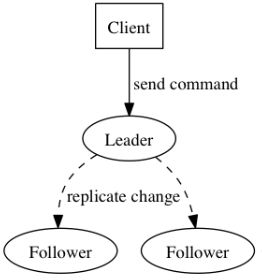
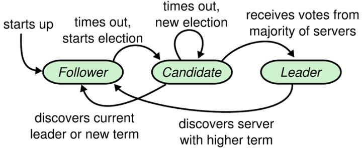
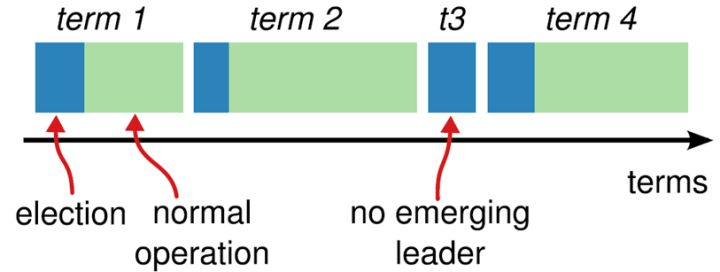
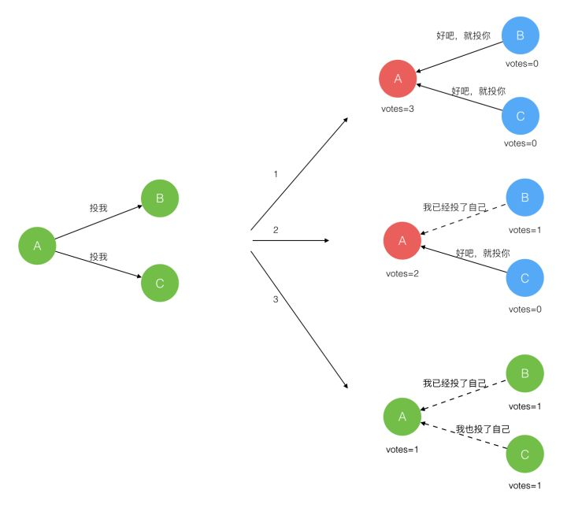
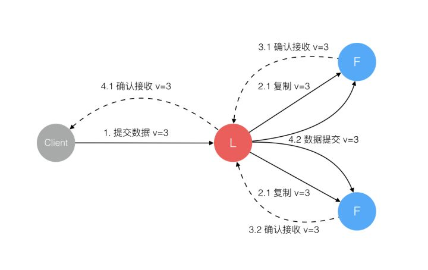
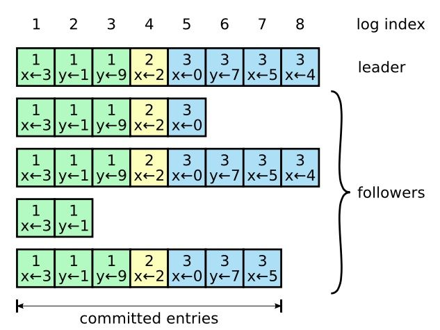
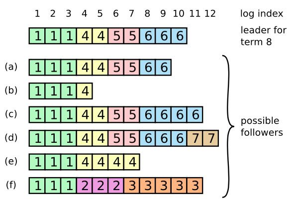

<!-- TOC -->

- [1. 背景](#1-背景)
- [2. raft 概述](#2-raft-概述)
    - [2.1 核心思想](#21-核心思想)
    - [2.2 raft角色关系](#22-raft角色关系)
    - [2.3 Raft算法角色状态转化](#23-raft算法角色状态转化)
    - [2.4 term](#24-term)
- [3. leader 选举](#3-leader-选举)
- [4. 日志同步](#4-日志同步)
    - [4.1 日志组成](#41-日志组成)
    - [4.2 日志同步作用](#42-日志同步作用)
    - [4.3 覆盖解决日志的不一致性](#43-覆盖解决日志的不一致性)
- [5. 安全性](#5-安全性)

<!-- /TOC -->
# 1. 背景
* 最近在研究etcd分布式key-value存储，里面的一致性协议是raft。
* raft 之前一致性算法是Paxos算法，但是该算法比较复杂，实现很困难，目前大部分使用的是raft算法。
* 

# 2. raft 概述
## 2.1 核心思想
* Raft算法则是从多副本状态机的角度提出，用于管理多副本状态机的日志复制
    * 日志记录先后动作，只要有日志，状态机根据日志执行都会达到最终状态
* Raft实现了和Paxos相同的功能，它将一致性分解为多个子问题
    * Leader选举（Leader election）
    * 日志同步（Log replication）
    * 安全性（Safety）
    * 日志压缩（Log compaction）
    * 成员变更（Membership change)
* Raft将系统中的角色分为领导者（Leader）、跟从者（Follower）和候选人（Candidate）
    * Leader：接受客户端请求，并向Follower同步请求日志，当日志同步到大多数节点上后告诉Follower提交日志。
    * Follower：接受并持久化Leader同步的日志，在Leader告之日志可以提交之后，提交日志。
    * Candidate：Leader选举过程中的临时角色。

## 2.2 raft角色关系

* Raft要求系统在任意时刻最多只有一个Leader，正常工作期间只有Leader和Followers。
## 2.3 Raft算法角色状态转化

* 如果Follower超时没有收到Leader的消息，它会成为一个Candidate并且开始一次Leader选举。收到大多数服务器投票的Candidate会成为新的Leader。
* Leader在宕机之前会一直保持Leader的状态。

## 2.4 term
* Raft算法将时间分为一个个的任期（term），每一个term的开始都是Leader选举。在成功选举Leader之后，Leader会在整个term内管理整个集群。
* 如果Leader选举失败，该term就会因为没有Leader而结束。

# 3. leader 选举
* Raft 使用心跳（heartbeat）触发Leader选举。
* 当服务器启动时，初始化为Follower。Leader向所有Followers周期性发送heartbeat。如果Follower在选举超时时间内没有收到Leader的heartbeat，就会等待一段随机的时间后发起一次Leader选举。

* Follower将其当前term加一然后转换为Candidate。它首先给自己投票并且给集群中的其他服务器发送 RequestVote RPC (参照前面的状态机)
    * 赢得了多数的选票，成功选举为Leader；
    * 收到了Leader的消息，表示有其它服务器已经抢先当选了Leader；
    * 没有服务器赢得多数的选票，Leader选举失败，等待选举时间超时后发起下一次选举。

* 选举出Leader后，Leader通过定期向所有Followers发送心跳信息维持其统治。若Follower一段时间未收到Leader的心跳则认为Leader可能已经挂了，再次发起Leader选举过程。

# 4. 日志同步
* Leader选出后，就开始接收客户端的请求。Leader把请求作为日志条目（Log entries）加入到它的日志中
* 然后并行的向其他服务器发起 AppendEntries RPC 复制日志条目。
* 当这条日志被复制到大多数服务器上，Leader将这条日志应用到它的状态机并向客户端返回执行结果。(只有leader才会执行这个条目)

* 某些Followers可能没有成功的复制日志，Leader会无限的重试 AppendEntries RPC直到所有的Followers最终存储了所有的日志条目。(虽然是不停的重试，但是只要超过半数的同意，状态机就会去执行)

## 4.1 日志组成
* 日志由有序编号（log index）的日志条目组成。每个日志条目包含它被创建时的任期号（term），和用于状态机执行的命令。
* 如果一个日志条目被复制到大多数服务器上，就被认为可以提交（commit）了。

## 4.2 日志同步作用
Raft日志同步保证如下两点：
* 如果不同日志中的两个条目有着相同的索引和任期号，则它们所存储的命令是相同的。
* 如果不同日志中的两个条目有着相同的索引和任期号，则它们之前的所有条目都是完全一样的。

第一条特性源于Leader在一个term内在给定的一个log index最多创建一条日志条目，同时该条目在日志中的位置也从来不会改变。

第二条特性源于 AppendEntries 的一个简单的一致性检查。当发送一个 AppendEntries RPC 时，Leader会把新日志条目紧接着之前的条目的log index和term都包含在里面。如果Follower没有在它的日志中找到log index和term都相同的日志，它就会拒绝新的日志条目。

## 4.3 覆盖解决日志的不一致性
一般情况下，Leader和Followers的日志保持一致，因此 AppendEntries 一致性检查通常不会失败。然而，Leader崩溃可能会导致日志不一致：旧的Leader可能没有完全复制完日志中的所有条目。

* 上图阐述了一些Followers可能和新的Leader日志不同的情况。一个Follower可能会丢失掉Leader上的一些条目，也有可能包含一些Leader没有的条目，也有可能两者都会发生。丢失的或者多出来的条目可能会持续多个任期。

* Leader通过强制Followers复制它的日志来处理日志的不一致，Followers上的不一致的日志会被Leader的日志覆盖。

* Leader为了使Followers的日志同自己的一致，Leader需要找到Followers同它的日志一致的地方，然后覆盖Followers在该位置之后的条目。

* Leader会从后往前试，每次AppendEntries失败后尝试前一个日志条目，直到成功找到每个Follower的日志一致位点，然后向后逐条覆盖Followers在该位置之后的条目。

# 5. 安全性
上面采用直接覆盖日志的方式肯定不是安全的，可能会导致用户的某些请求被覆盖掉。

Raft增加了如下两条限制以保证安全性：
* 拥有最新的已提交的log entry的Follower才有资格成为Leader。