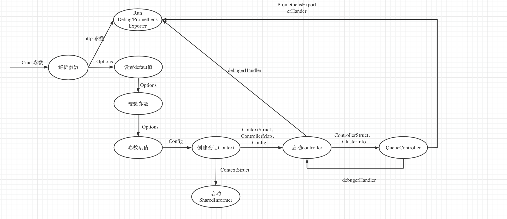
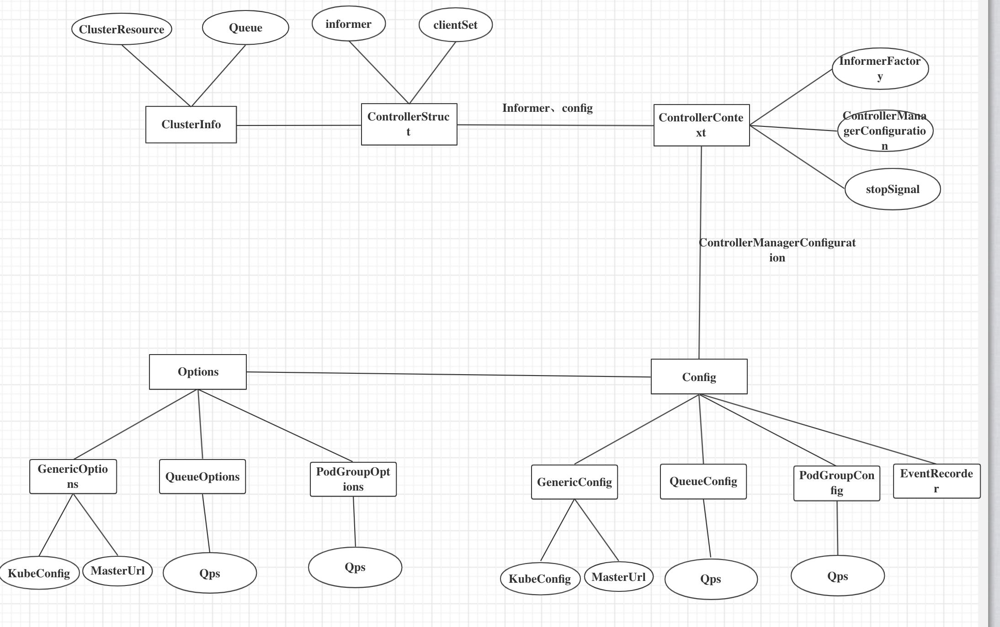

<!-- TOC -->

- [Sense-Rubber controller-manager 概要设计](#sense-rubber-controller-manager-概要设计)
- [1. 简介](#1-简介)
    - [1.1 目的](#11-目的)
    - [1.2 范围](#12-范围)
        - [1.2.1 软件名称](#121-软件名称)
        - [1.2.2 软件功能](#122-软件功能)
        - [1.2.3 软件应用](#123-软件应用)
- [2. 概要设计](#2-概要设计)
    - [2.1   第零层设计描述](#21---第零层设计描述)
    - [2.2  第一层设计描述](#22--第一层设计描述)
        - [2.2.1 分解描述](#221-分解描述)
            - [2.2.1.1 模块/子系统分解](#2211-模块子系统分解)
            - [2.2.1.2 并发进程处理分解](#2212-并发进程处理分解)
            - [2.2.1.3 数据分解](#2213-数据分解)
        - [2.2.2 依赖性描述](#222-依赖性描述)
            - [2.2.2.1 运行时设计](#2221-运行时设计)
            - [2.2.2.2 数据依赖关系](#2222-数据依赖关系)

<!-- /TOC -->
# Sense-Rubber controller-manager 概要设计
关键字： sense-rubber、controller-manager、queue-controller、podgroup-controller

摘要：
  sense-rubber 调度系统中常用k8s对象有queue和podgroup，在job调度过程中，queue和podgroup实例会发生“声明式”变化。queue-controller和podgroup-controller 分别用来维护queue和podgroup实例状态变化。controller-manager 用来管理所有自定义controller。


# 1. 简介
## 1.1 目的
本文档定位是controller-manager概要设计文档，是为了方便用户理解kube-controller设计思路、主要模块、模块的功能以及模块之间的依赖关系。
本文档描述内容并不包含controller-manager设计的详细内容。

## 1.2 范围
### 1.2.1 软件名称
sense-rubber/controller-manager。controller-manager是sense-rubber的子系统。
### 1.2.2 软件功能
controller-manager主要功能如下：
* controller-manager 优雅启动所有controllers
* queue-controller 维护queue 实例状态
* podgroup-controller 维护 podgroup实例
### 1.2.3 软件应用
controller-manager 是我们根据自身sense-ruuber调度需求实现的k8s 控制器插件集合，配合sense-rubber来实现任务调度。

# 2. 概要设计
## 2.1   第零层设计描述
cx已经完成
## 2.2  第一层设计描述
如图一是Controller-Manager的层次分解图，每部分的功能描述如下：
* Controller-Manager 是所有控制器的执行入口。在cmd中获取所有控制器的参数，然后使用参数New Controller实例并且异步执行。
* Queue-Controller：是Controller-Manager启动的controller之一。主要是维护queue，实例的状态，特别是Resource和Job。Queue-Controller主要包含Cache和SyncQueue两个模块。
* Queue-Controller/Cache: Cache主要是用来同步Queue关注的资源，比如Job、Resource、NS等。这部分并不会包含同步Queue的任何逻辑
* Queue-Controller/SyncQueue: 实现同步QueueStatus逻辑。该模块根据Queue-Controller/Cache维护的资源来维护Queue
* PodGroup-Controller: 这部分是Controller-Manage人启动的controller之一。主要是用来维护PodGroup实例状态。


图一 Controller-Manager层次分解图

### 2.2.1 分解描述
#### 2.2.1.1 模块/子系统分解
* 1 controller-manager 模块描述
```
标识：1
名称：controller-manager
类型：模块
目的：描述模块的结构和功能
功能列表：解析cmd参数，启动所有controller
要实现的需求 ID: 解析cmd参数和执行controller
子模块: 2、3
```
```
标识：2
名称：controller-manager/解析cmd flag
类型：模块
目的：描述模块的结构和功能
功能列表：解析cmd参数
要实现的需求: cmd支持多级参数，相同名称flag名称在不同controller赋值可以不同
子模块:
```
```
标识：3
名称：controller-manager/执行controller
类型：模块
目的：描述模块的结构和功能
功能列表：启动controllers
要实现的需求: 白名单方式启动所有controllers，controller支持不同参数、所有controller异步执行
子模块:
```

* 2 Queue-Controller 模块描述
```
标识：4
名称：Queue-Controller
类型：模块
目的：描述模块的结构和功能
功能列表：同步queue实例
要实现的需求:queue和ns同步、维护queue status、queue误删恢复 
子模块:
```
#### 2.2.1.2 并发进程处理分解
1 Controller-Manager Start 
```
标识：1
名称：Controller-Manager Start
类型：goroutine
目的：start 所有controllers
功能列表：解析cmd参数，start controllers
```

2 Queue-Controller

```
标识：2
名称：QueueController/Cache
类型：goroutine
目的：同步Queue关注资源
功能列表：Cache主要是用来同步Queue关注的资源，比如Job、Resource、NS等。这部分并不会包含同步Queue的任何逻辑
```

```
标识：3
名称：QueueController/SyncQueue
类型：goroutine
目的：维护Queue状态
功能列表：同步NS和Queue，维护Queue Status状态
```

#### 2.2.1.3 数据分解
1 Controller-Manager 数据
```
标识：1
名称：Options
类型：Struct
目的：存储cmd参数
```
```
标识：2
名称：Config
类型：Struct
目的：存储Controllers运行的config 参数
```
```
标识：3
名称：controllerMap
类型：Map[string]startFunc
目的：controller 白名单Map
```
```
标识：4
名称：Context
类型：Struct
目的：controller manager 运行上下文
```

2 Queue-Controller 数据
```
标识：5
名称：ClusterInfo
类型：Struct
目的：Queue关心的集群资源
```
```
标识：6
名称：QueueControllerStruct
类型：Struct
目的：QueueController Struct
```

### 2.2.2 依赖性描述
#### 2.2.2.1 运行时设计
如下图所示、下面主要逻辑是解析cmd参数、options参数赋值给config配置文件、创建ControllerManager会话内容、异步启动所有的控制器。


#### 2.2.2.2 数据依赖关系
