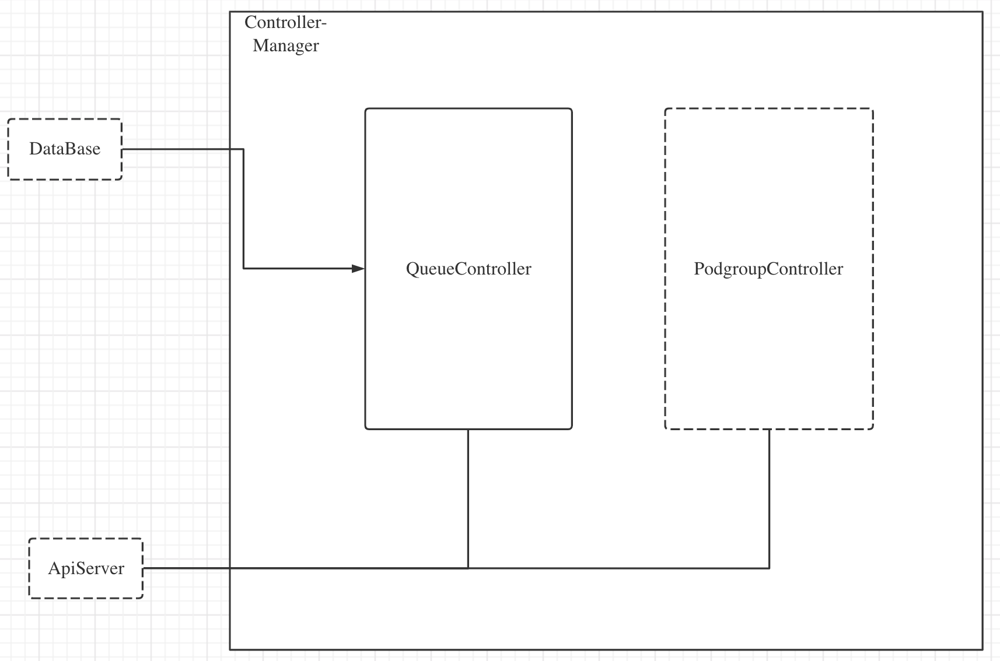
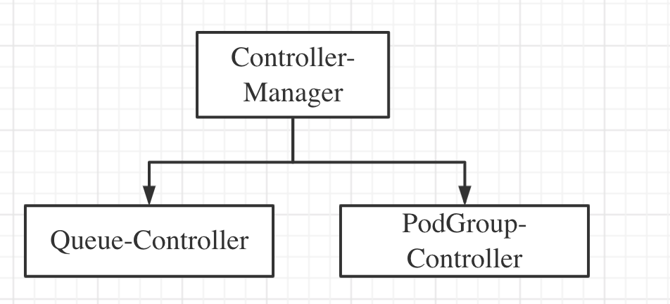
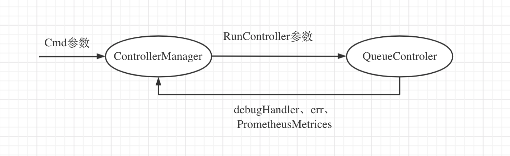
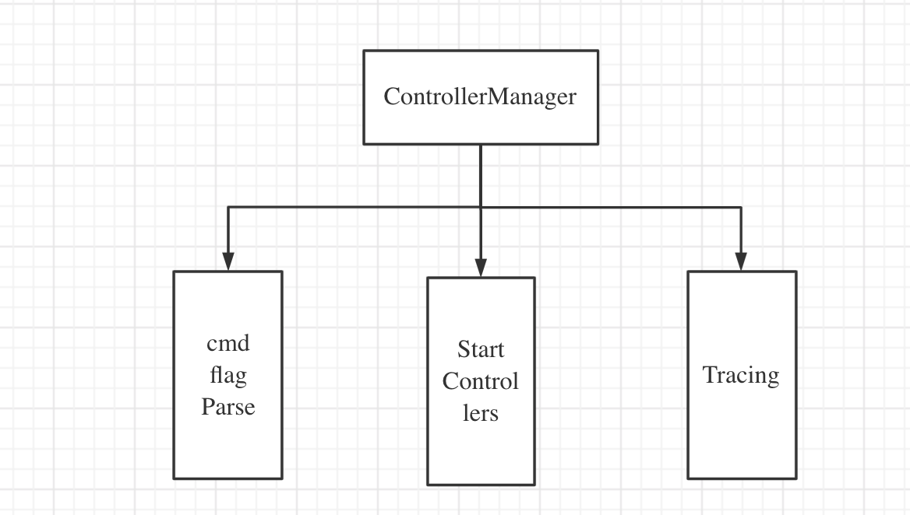
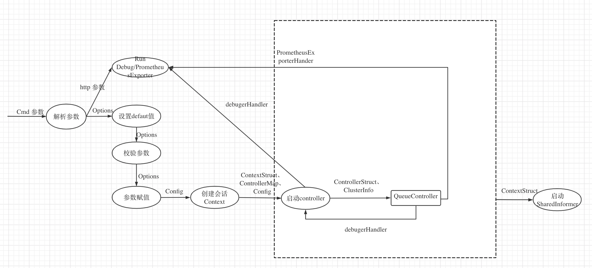
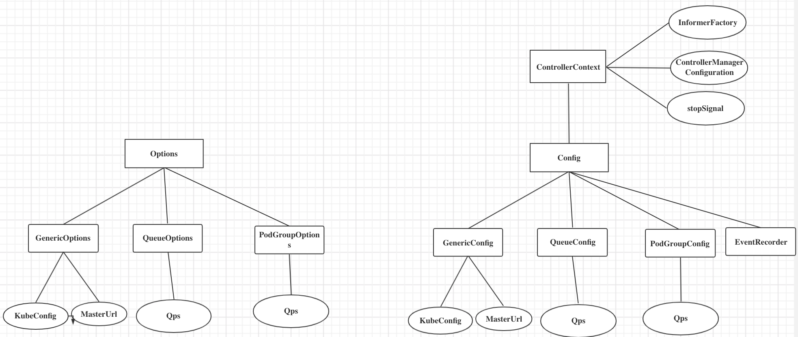
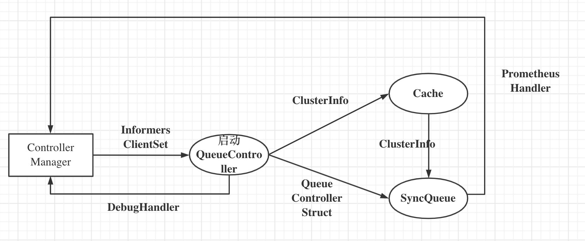
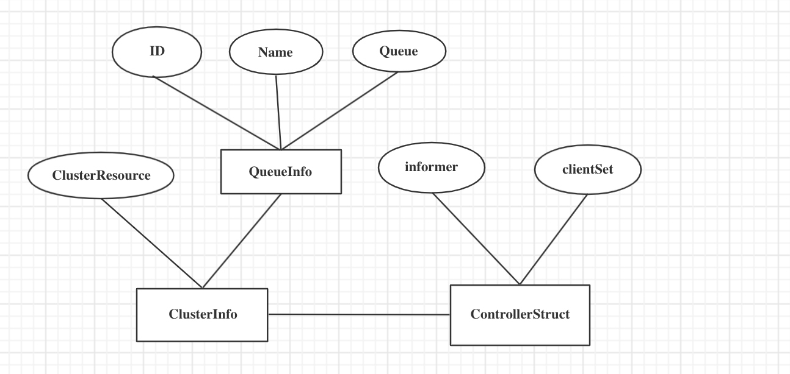

<!-- TOC -->

- [Sense-Rubber controller-manager 概要设计](#sense-rubber-controller-manager-概要设计)
- [1. 简介](#1-简介)
    - [1.1 目的](#11-目的)
    - [1.2 范围](#12-范围)
        - [1.2.1 软件名称](#121-软件名称)
        - [1.2.2 软件功能](#122-软件功能)
        - [1.2.3 软件应用](#123-软件应用)
- [2. 概要设计](#2-概要设计)
    - [2.1   第零层设计描述](#21---第零层设计描述)
    - [2.2  第一层设计描述](#22--第一层设计描述)
        - [2.2.1 分解描述](#221-分解描述)
            - [2.2.1.1 模块/子系统分解](#2211-模块子系统分解)
            - [2.2.1.2 并发进程处理分解](#2212-并发进程处理分解)
            - [2.2.1.3 数据分解](#2213-数据分解)
        - [2.2.2 依赖性描述](#222-依赖性描述)
            - [2.2.2.1 运行时设计](#2221-运行时设计)
            - [2.2.2.2 数据依赖关系](#2222-数据依赖关系)
        - [2.2.3 接口描述](#223-接口描述)
            - [2.2.3.1 模块/子系统接口](#2231-模块子系统接口)
            - [2.2.3.2 Process Interfaces 进程接口](#2232-process-interfaces-进程接口)
    - [2.3 第二层设计描述](#23-第二层设计描述)
        - [2.3.1 controller-manager](#231-controller-manager)
            - [2.3.1.1 分解描述](#2311-分解描述)
                - [2.3.1.1.1  模块/子系统分解](#23111--模块子系统分解)
                - [2.3.1.1.2 并发进程处理分解](#23112-并发进程处理分解)
                - [2.3.1.1.3 数据分解](#23113-数据分解)
            - [2.3.1.2  依赖性描述](#2312--依赖性描述)
                - [2.3.1.2.1 运行设计](#23121-运行设计)
                - [2.3.1.2.2 数据依赖关系](#23122-数据依赖关系)
        - [2.3.2 queue-controller](#232-queue-controller)
            - [2.3.2.1 数据分解](#2321-数据分解)
                - [2.3.2.1.1 模块/子系统分解](#23211-模块子系统分解)
                - [2.3.2.1.2 并发进程处理分解](#23212-并发进程处理分解)
                - [2.3.2.1.3 数据分解](#23213-数据分解)
            - [2.3.2.2  依赖性描述](#2322--依赖性描述)
                - [2.3.2.2.1 运行设计](#23221-运行设计)
                - [2.3.2.2.2 数据依赖关系](#23222-数据依赖关系)
            - [2.3.2.3 接口描述](#2323-接口描述)
                - [2.3.2.3.1 模块/子系统接口](#23231-模块子系统接口)
                - [2.3.2.3.2 进程接口](#23232-进程接口)
- [3.](#3)

<!-- /TOC -->
# Sense-Rubber controller-manager 概要设计
关键字： sense-rubber、controller-manager、queue-controller、podgroup-controller

摘要：
  sense-rubber 调度系统中常用k8s对象有queue和podgroup，在job调度过程中，queue和podgroup实例会发生“声明式”变化。queue-controller和podgroup-controller 分别用来维护queue和podgroup实例状态变化。controller-manager 用来管理所有自定义controller。


# 1. 简介
## 1.1 目的
本文档定位是controller-manager概要设计文档，是为了方便用户理解controller-manager设计思路、主要模块、模块的功能以及模块之间的依赖关系。
本文档描述内容并不包含controller-manager的详细设计内容。

## 1.2 范围
### 1.2.1 软件名称
sense-rubber/controller-manager。controller-manager是sense-rubber的子系统。
### 1.2.2 软件功能
controller-manager主要功能如下：
* controller-manager 优雅启动所有controllers
* queue-controller 维护queue实例与外部用户管理系统同步
* podgroup-controller 维护podgroup实例
### 1.2.3 软件应用
controller-manager 是我们根据自身sense-ruuber调度需求实现的k8s 控制器插件集合，配合sense-rubber来实现任务调度。

# 2. 概要设计
## 2.1   第零层设计描述
如图所示是controller-manager零层设计，主要内容如下：
* 目前controller-manager计划实现controllers为queue-controller和podgroup-controller
* queue实例误删时，通过database同步queue实例对象。数据流向是单向的
* apiserver可以和queue-controller和podgroup-controller交互，数据流向是双向的

## 2.2  第一层设计描述
如图一是Controller-Manager的层次分解图，每部分的功能描述如下：
* controller-manager 是所有控制器的执行入口。在cmd中获取所有控制器的参数，然后使用参数异步调用所有controllers。
* queue-controller：是controller-manager启动的controller之一。维护queue实例与外部用户管理系统同步，特别是Resource和Job。
* podgroup-controller: 这部分是controller-manage启动的controller之一。主要是用来维护PodGroup实例状态。


### 2.2.1 分解描述
#### 2.2.1.1 模块/子系统分解
* 1 controller-manager 模块描述
```
标识：1
名称：controller-manager
类型：模块
目的：启动controllers
功能列表：解析cmd参数，启动所有controller
要实现的需求 ID: 解析cmd参数和执行controller
子模块: 
```

* 2 queue-controller 模块描述
```
标识：2
名称：queue-controller
类型：子系统
目的：描述模块的结构和功能
功能列表：同步queue实例
要实现的需求:维护queue实例与外部用户管理系统同步
子模块:
```
#### 2.2.1.2 并发进程处理分解
1 controller-manager
```
标识：1
名称：controller-manager
类型：goroutine
目的：start 所有controllers
功能列表：解析cmd参数，start controllers
```

2 queue-controller
```
标识：2
名称：queue-controller
类型：goroutine
目的：维护Queue状态
功能列表：NS和Queue一一对应，维护queue实例与外部用户管理系统同步
```


#### 2.2.1.3 数据分解
```
标识：1
名称：ControllerContext
类型：Struct
目的：作为ControllerManager运行上下文、提供启动QueueController参数
```
```
标识：2
名称：QueueControllerStruct
类型：Struct
目的：作为queue-controller 数据体
```

### 2.2.2 依赖性描述
#### 2.2.2.1 运行时设计


#### 2.2.2.2 数据依赖关系
QueueControllerStruct和ControllerContext没有依赖关系
### 2.2.3 接口描述
#### 2.2.3.1 模块/子系统接口
```
接口标识 ：1
接口名称：controller-manager
形式：模块
输入：command string
输出：nil
返回：执行command结果
描述：解析cmd参数，执行controllers
```

```
接口标识 ：2
接口名称：queue-controller
形式：子系统
输入：ControllerContext成员变量
输出：nil
返回：debugHandler、err
描述：维护Queue状态
```
#### 2.2.3.2 Process Interfaces 进程接口
进程之间没有共享数据

## 2.3 第二层设计描述
### 2.3.1 controller-manager
#### 2.3.1.1 分解描述
controller-manager主要包含参数解析、启动controllers、tracing三个模块

##### 2.3.1.1.1  模块/子系统分解
1. Cmd Flag Parse
```
标识：1
名称：Options
类型：模块
目的：解析cmd参数
功能列表：解析cmd参数
要实现的需求: cmd支持多级参数，相同名称flag名称在不同controller赋值可以不同
子模块:
```
2. Start Controllers
```
标识：2
名称：StartControllers
类型：模块
目的：启动controllers
功能列表：每个Controller定义Start函数、创建ControllerContext会话内容、异步执行StartController
要实现的需求: 白名单方式启动所有controllers，controller支持不同参数、所有controller异步执行
子模块:3
```
```
标识：3
名称：Config
类型：模块
目的：通过Options创建Controller所需Config信息
功能列表：检验Options、设Default值、赋值
要实现的需求: 创建Controller所需Config信息
子模块:
```

3. Tracing
```
标识：4
名称：Tracing
类型：模块
目的：做Profiling、PrometheusExporter
功能列表：Profiling、PrometheusExporter
要实现的需求: Profiling、PrometheusExporter
子模块:
```
##### 2.3.1.1.2 并发进程处理分解
无
##### 2.3.1.1.3 数据分解
1 controller-manager 数据
```
标识：1
名称：Options
类型：Struct
目的：存储cmd参数
```
```
标识：2
名称：Config
类型：Struct
目的：存储Controllers运行的config 参数
```
```
标识：3
名称：controllerMap
类型：Map[string]startFunc
目的：存储controller 白名单Map
```
```
标识：4
名称：ControllerContext
类型：Struct
目的：作为controller-manager 运行上下文
```
#### 2.3.1.2  依赖性描述
##### 2.3.1.2.1 运行设计

##### 2.3.1.2.2 数据依赖关系

### 2.3.2 queue-controller
* queue-controller/Cache: Cache主要是用来同步Queue关注的资源，比如Job、Resource、NS等。这部分并不会包含同步Queue的任何逻辑
* queue-controller/SyncQueue: 实现同步QueueStatus逻辑。该模块根据Queue-controller/Cache维护的资源来维护Queue

#### 2.3.2.1 数据分解
##### 2.3.2.1.1 模块/子系统分解
1. Cache 模块描述
```
标识：1
名称：Cache
类型：模块
目的：维护Queue实例
功能列表：NS和queue一一对应，维护queue实例与外部用户管理系统同步
要实现的需求: 维护queue实例与外部用户管理系统同步
子模块: 2
```
```
标识：2
名称：api
类型：模块
目的：定义ClusterInfo、QueueInfo等Struct
功能列表：封装实例对象、定义对应help func
要实现的需求: 定义需要统计的资源对象
子模块: 
```
```
标识：3
名称：Informer
类型：模块
目的：监听apiserver事件、统计集群资源
功能列表：监听apiserver事件、统计集群资源
要实现的需求: 统计集群资源、为SyncQueue模块服务
子模块: 
```
2. SyncQueue 模块描述
```
标识：4
名称：SyncQueue
类型：模块
目的：维护queue实例与外部用户管理系统同步
功能列表：维护queue实例与外部用户管理系统同步
要实现的需求: NS和Queue对应，维护queue实例与外部用户管理系统同步
子模块: 5
```
```
标识：5
名称：Util
类型：模块
目的：作为SyncQueue工具包
功能列表：所有util help func
要实现的需求: 作为SyncQueue工具包
子模块: 
```
3. metrics 模块描述
```
标识：6
名称：metrics
类型：模块
目的：定义Prometheus监控项
功能列表：定义Prometheus监控项
要实现的需求: 吐出关键监控数据
子模块: 
```


##### 2.3.2.1.2 并发进程处理分解
```
标识：1
名称：QueueController/Cache
类型：goroutine
目的：同步Queue关注资源
功能列表：Cache主要是用来同步Queue关注的资源，比如Job、Resource、NS等。这部分并不会包含同步Queue的任何逻辑
```
```
标识：2
名称：QueueController/SyncQueue
类型：goroutine
目的：维护queue实例与外部用户管理系统同步
功能列表：维护queue实例与外部用户管理系统同步
```
##### 2.3.2.1.3 数据分解
```
标识：1
名称：ClusterInfo
类型：Struct
目的：Queue关心的集群资源
```
```
标识：2
名称：QueueControllerStruct
类型：Struct
目的：QueueController Struct
```
```
标识：3
名称：QueueConfig
类型：Struct
目的：定义QueueController启动所需参数
```

#### 2.3.2.2  依赖性描述
##### 2.3.2.2.1 运行设计


##### 2.3.2.2.2 数据依赖关系


#### 2.3.2.3 接口描述
##### 2.3.2.3.1 模块/子系统接口
```
接口标识 ：1
接口名称：cache
形式：模块
输入：ClusterInfo Struct
输出：nil
返回：nil
描述：更新QueueController 关心资源
```

```
接口标识 ：2
接口名称：SyncQueue
形式：模块
输入：ControllerStruct、ClusterInfo
输出：nil
返回：debugHandler
描述：维护queue实例与外部用户管理系统同步
```

##### 2.3.2.3.2 进程接口
无


# 3. 
* ER 图关系理解定义：哪几种关系 


* 详细：https://wenku.baidu.com/view/78aa02c7d5bbfd0a79567374.html?fr=search