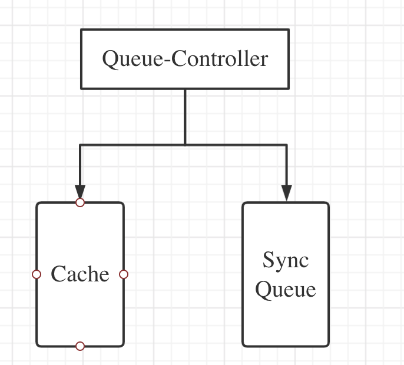

<!-- TOC -->

- [Sense-Rubber controller-manager 概要设计](#sense-rubber-controller-manager-概要设计)
- [1. 简介](#1-简介)
    - [1.1 目的](#11-目的)
    - [1.2 范围](#12-范围)
        - [1.2.1 软件名称](#121-软件名称)
        - [1.2.2 软件功能](#122-软件功能)
        - [1.2.3 软件应用](#123-软件应用)
- [2. 概要设计](#2-概要设计)
    - [2.1   第零层设计描述](#21---第零层设计描述)
    - [2.2  第一层设计描述](#22--第一层设计描述)
        - [2.2.1 分解描述](#221-分解描述)
            - [2.2.1.1 模块/子系统分解](#2211-模块子系统分解)
            - [2.2.1.2 并发进程处理分解](#2212-并发进程处理分解)
            - [2.2.1.3 数据分解](#2213-数据分解)
        - [2.2.2 依赖性描述](#222-依赖性描述)
            - [2.2.2.1 运行时设计](#2221-运行时设计)
            - [2.2.2.2 数据依赖关系](#2222-数据依赖关系)
        - [2.2.3 接口描述](#223-接口描述)
            - [2.2.3.1 模块/子系统接口](#2231-模块子系统接口)
            - [2.2.3.2 Process Interfaces 进程接口](#2232-process-interfaces-进程接口)
    - [2.3 第二层设计描述](#23-第二层设计描述)
        - [2.3.1 QueueController](#231-queuecontroller)
            - [2.3.1.1 模块/子系统分解](#2311-模块子系统分解)
            - [2.3.1.2 并发进程处理分解](#2312-并发进程处理分解)
            - [2.3.1.3 数据分解](#2313-数据分解)
        - [2.3.2  依赖性描述](#232--依赖性描述)
            - [2.3.2.1 运行设计](#2321-运行设计)
            - [2.3.2.2 数据依赖关系](#2322-数据依赖关系)
        - [2.3.3 接口描述](#233-接口描述)
            - [2.3.3.1 模块/子系统接口](#2331-模块子系统接口)
            - [2.3.3.2 进程接口](#2332-进程接口)
- [3. 写文档时疑惑的地方](#3-写文档时疑惑的地方)

<!-- /TOC -->
# Sense-Rubber controller-manager 概要设计
关键字： sense-rubber、controller-manager、queue-controller、podgroup-controller

摘要：
  sense-rubber 调度系统中常用k8s对象有queue和podgroup，在job调度过程中，queue和podgroup实例会发生“声明式”变化。queue-controller和podgroup-controller 分别用来维护queue和podgroup实例状态变化。controller-manager 用来管理所有自定义controller。


# 1. 简介
## 1.1 目的
本文档定位是controller-manager概要设计文档，是为了方便用户理解kube-controller设计思路、主要模块、模块的功能以及模块之间的依赖关系。
本文档描述内容并不包含controller-manager设计的详细内容。

## 1.2 范围
### 1.2.1 软件名称
sense-rubber/controller-manager。controller-manager是sense-rubber的子系统。
### 1.2.2 软件功能
controller-manager主要功能如下：
* controller-manager 优雅启动所有controllers
* queue-controller 维护queue 实例状态
* podgroup-controller 维护 podgroup实例
### 1.2.3 软件应用
controller-manager 是我们根据自身sense-ruuber调度需求实现的k8s 控制器插件集合，配合sense-rubber来实现任务调度。

# 2. 概要设计
## 2.1   第零层设计描述
cx已经完成
## 2.2  第一层设计描述
如图一是Controller-Manager的层次分解图，每部分的功能描述如下：
* Controller-Manager 是所有控制器的执行入口。在cmd中获取所有控制器的参数，然后使用参数New Controller实例并且异步执行。
* Queue-Controller：是Controller-Manager启动的controller之一。主要是维护queue，实例的状态，特别是Resource和Job。
* PodGroup-Controller: 这部分是Controller-Manage人启动的controller之一。主要是用来维护PodGroup实例状态。


### 2.2.1 分解描述
#### 2.2.1.1 模块/子系统分解
* 1 controller-manager 模块描述
```
标识：1
名称：controller-manager
类型：模块
目的：启动controllers
功能列表：解析cmd参数，启动所有controller
要实现的需求 ID: 解析cmd参数和执行controller
子模块: 2、3、4、5
```
```
标识：2
名称：Options
类型：模块
目的：解析cmd参数
功能列表：解析cmd参数
要实现的需求: cmd支持多级参数，相同名称flag名称在不同controller赋值可以不同
子模块:
```
```
标识：3
名称：Config
类型：模块
目的：通过Options创建Controller所需Config信息
功能列表：检验Options、设Default值、赋值
要实现的需求: 创建Controller所需Config信息
```
```
标识：4
名称：StartControllers
类型：模块
目的：启动controllers
功能列表：每个Controller定义Start函数、创建ControllerContext会话内容、异步执行StartController
要实现的需求: 白名单方式启动所有controllers，controller支持不同参数、所有controller异步执行
子模块:
```
```
标识：5
名称：Util
类型：模块
目的：做Profiling、PrometheusExporter
功能列表：Profiling、PrometheusExporter
要实现的需求: Profiling、PrometheusExporter
子模块:
```

* 2 Queue-Controller 模块描述
```
标识：6
名称：Queue-Controller
类型：子系统
目的：描述模块的结构和功能
功能列表：同步queue实例
要实现的需求:queue和ns同步、维护queue status、queue误删恢复 
子模块:
```
#### 2.2.1.2 并发进程处理分解
1 Controller-Manager
```
标识：1
名称：Controller-Manager
类型：goroutine
目的：start 所有controllers
功能列表：解析cmd参数，start controllers
```

2 Queue-Controller
```
标识：2
名称：QueueController
类型：goroutine
目的：维护Queue状态
功能列表：同步NS和Queue，维护Queue Status状态
```


#### 2.2.1.3 数据分解
1 Controller-Manager 数据
```
标识：1
名称：Options
类型：Struct
目的：存储cmd参数
```
```
标识：2
名称：Config
类型：Struct
目的：存储Controllers运行的config 参数
```
```
标识：3
名称：controllerMap
类型：Map[string]startFunc
目的：controller 白名单Map
```
```
标识：4
名称：Context
类型：Struct
目的：controller manager 运行上下文
```

2 Queue-Controller 数据
```
标识：5
名称：ClusterInfo
类型：Struct
目的：Queue关心的集群资源
```
```
标识：6
名称：QueueControllerStruct
类型：Struct
目的：QueueController Struct
```
```
标识：7
名称：QueueConfig
类型：Struct
目的：定义QueueController启动所需参数
```

### 2.2.2 依赖性描述
#### 2.2.2.1 运行时设计
如下图所示、下面主要逻辑是解析cmd参数、options参数赋值给config配置文件、创建ControllerManager会话内容、异步启动所有的控制器。


#### 2.2.2.2 数据依赖关系


### 2.2.3 接口描述
#### 2.2.3.1 模块/子系统接口
```
接口标识 ：1
接口名称：cmd参数解析
形式：模块
输入：cmd flag string
输出：nil
返回：controllers启动参数options
描述：解析cmd参数，并对参数进行校验
```


```
接口标识 ：2
接口名称：准备Start Controllers
形式：模块
输入：Options
输出：nil
返回：ControllerContext
描述：使用Options生成启动Controller所需要的ControllerContext(会话内容)
```

```
接口标识 ：3
接口名称：Run QueueController
形式：子系统
输入：ControllerContext成员变量
输出：nil
返回：debugHandler、err
描述：执行QueueController
```
#### 2.2.3.2 Process Interfaces 进程接口
```
标识：1
名称：controller-manager 启动
类型：goRoutine
目的：启动controllers
功能列表：解析参数、启动所有controllers
```
```
标识：2
名称：QueueController
类型：goRoutine
目的：维护Queue实例
功能列表：同步NS和Queue、维护Queue状态
```

## 2.3 第二层设计描述
### 2.3.1 QueueController
* Queue-Controller/Cache: Cache主要是用来同步Queue关注的资源，比如Job、Resource、NS等。这部分并不会包含同步Queue的任何逻辑
* Queue-Controller/SyncQueue: 实现同步QueueStatus逻辑。该模块根据Queue-Controller/Cache维护的资源来维护Queue

#### 2.3.1.1 模块/子系统分解
1. Cache 模块描述
```
标识：1
名称：Cache
类型：模块
目的：维护Queue实例
功能列表：同步NS和Queue，维护Queue Status状态
要实现的需求 ID: 维护Queue实例
子模块: 2
```
```
标识：2
名称：api
类型：模块
目的：定义ClusterInfo、QueueInfo等Struct
功能列表：封装实例对象、定义对应help func
要实现的需求: 定义需要统计的资源对象
子模块: 
```
```
标识：3
名称：Informer
类型：模块
目的：监听apiserver事件、统计集群资源
功能列表：监听apiserver事件、统计集群资源
要实现的需求: 统计集群资源、为SyncQueue模块服务
子模块: 
```
2. SyncQueue 模块描述
```
标识：4
名称：SyncQueue
类型：模块
目的：同步NS和Queue，维护Queue Status状态
功能列表：同步NS和Queue，维护Queue Status状态
要实现的需求: 同步NS和Queue，维护Queue Status状态
子模块: 5
```
```
标识：5
名称：Util
类型：模块
目的：作为SyncQueue工具包
功能列表：所有util help func
要实现的需求: 作为SyncQueue工具包
子模块: 
```
3. metrics 模块描述
```
标识：6
名称：metrics
类型：模块
目的：定义Prometheus监控项
功能列表：定义Prometheus监控项
要实现的需求: 吐出关键监控数据
子模块: 
```


#### 2.3.1.2 并发进程处理分解
```
标识：1
名称：QueueController/Cache
类型：goroutine
目的：同步Queue关注资源
功能列表：Cache主要是用来同步Queue关注的资源，比如Job、Resource、NS等。这部分并不会包含同步Queue的任何逻辑
```

```
标识：2
名称：QueueController/SyncQueue
类型：goroutine
目的：维护Queue状态
功能列表：同步NS和Queue，维护Queue Status状态
```
#### 2.3.1.3 数据分解
数据较少，放在一级数据分解中描述了

### 2.3.2  依赖性描述
#### 2.3.2.1 运行设计


#### 2.3.2.2 数据依赖关系
在上一层描述了

### 2.3.3 接口描述
#### 2.3.3.1 模块/子系统接口
```
接口标识 ：1
接口名称：cache
形式：模块
输入：ClusterInfo Struct
输出：nil
返回：nil
描述：更新QueueController 关心资源
```

```
接口标识 ：2
接口名称：SyncQueue
形式：模块
输入：ControllerStruct
输出：nil
返回：debugHandler
描述：同步NS和Queue、维护Queue实例状态
```

#### 2.3.3.2 进程接口
```
标识：1
名称：cache
类型：goRoutine
目的：更新QueueController关心资源
功能列表：更新QueueController关心资源
```
```
标识：2
名称：SyncQueue
类型：goRoutine
目的：同步NS和Queue、维护Queue实例状态
功能列表：同步NS和Queue、维护Queue实例状态、吐出Prometheus监控值
```

# 3. 写文档时疑惑的地方
* 有些package只有写Struct和help func，需要将其作为单独模块描述吗
* 在化ER图时，一层设计是详细点还是粗略一点好？
  * 一层详细：二层就没什么画的
  * 一层粗略：Struct在一层中不好抽象，即使抽象后、第二层中子系统Struct很多都是孤立的，ER图看起来没什么意义

