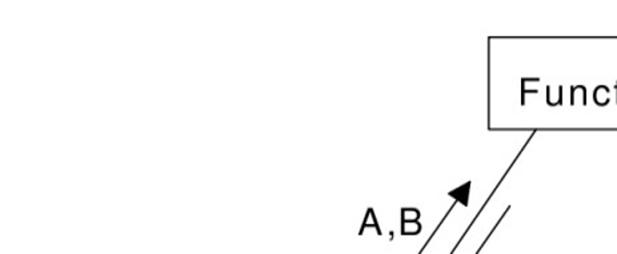

<!-- TOC -->

- [1 简介](#1-简介)
    - [1.1 目的](#11-目的)
    - [1.2 范围](#12-范围)
- [2 详细设计](#2-详细设计)
    - [2.1 模块1 详细设计](#21-模块1-详细设计)
        - [2.1.1 数据描述](#211-数据描述)
            - [2.1.1.1 简单数据描述](#2111-简单数据描述)
            - [2.1.1.2 复合数据描述](#2112-复合数据描述)
                - [2.1.1.2.1 结构1](#21121-结构1)
                - [2.1.1.2.2 结构2](#21122-结构2)
        - [2.1.2 函数描述](#212-函数描述)
            - [2.1.2.1 函数1](#2121-函数1)
            - [2.1.2.2 函数2](#2122-函数2)
    - [2.2 模块2 详细设计](#22-模块2-详细设计)
    - [2.3 错误处理](#23-错误处理)
        - [2.3.1 系统错误](#231-系统错误)
        - [2.3.2 接口错误](#232-接口错误)
        - [2.3.3 协议错误](#233-协议错误)

<!-- /TOC -->

# 1 简介
## 1.1 目的
To descript the purpose of this document. In general, LLD specification can be used to guide the coding activities directly.

描述本文的目的，一般详细设计必须能够直接指导编码活动。
## 1.2 范围
This section should address areas which this document includes and that are specifically excludes. 

本节应描述文档所包括和不包括的内容。

# 2 详细设计
This section should focus on the description of the detailed design of the software entities that are a part of the software being described by the HLD Specification 。

对于在概要设计说明书中给出的软件实体，本节集中描述它们的详细描述部分。
## 2.1 模块1 详细设计
Describe data that defined or used in the module, including:
* simple data i.e. global variable, constant or macro within the module;
* complex data i.e. Structure or union....

描述模块中定义和使用的数据，包括：
* 简单数据，如模块级的全局变量、常量、宏；
* 复合数据，如模块内部的结构、联合 ... ；
### 2.1.1 数据描述
#### 2.1.1.1 简单数据描述
describe simple variables 、constant or macro used or defined in this module;
描述在本模块中定义和使用的简单变量、常量、宏；
The description of simple data should follow the format below:
* Function Description: Describing the usage of the data
* Data Definition: Defining the data

按照下列格式进行简单数据的描述
* 功能描述：描述该数据的用途
* 数据定义：定义该数据

#### 2.1.1.2 复合数据描述
##### 2.1.1.2.1 结构1
Define and describe the Data structure (include union)
定义和说明该数据结构 ( 包括联合 );

The description of data structure should follow the format below:
* Data Structure Description: Describing the usage of the data structure
* Data Structure Definition: Defining the data structure with the actual programing language
* Data Items Description:

| Data Type | Data Item Definition | Data Item Description|
|:--|:--|:--|

按照下列格式进行数据结构的描述
* 数据结构描述：描述该数据结构的用途
* 数据结构定义：用实际的编程语言定义该数据结构
* 数据项描述：

| 数据类型 | 数据项定义 | 数据项描述|
|:--|:--|:--|
##### 2.1.1.2.2 结构2
### 2.1.2 函数描述
This section should follow the format below:
* Identification: Title of the module
* Type: Type of the module, for example, the module in Level 2 Design, the process in Level 1 Design, etc.
* Function Description: Describing the functions of the module in brief, which should be consistent with the related section in HLD documents.
* Function Invoking Relation: Using the Hierarchy Chart or Structure Chart to describe it, for example:

本节应按照下列格式进行描述：
* 标识：模块名称
* 类型：模块类型，如2级设计中的模块，1级设计中的进程
* 功能概述：简要描述本模块功能，要和概要设计文档中相关模块分解的描述一致。
* 函数调用关系 :  用层次图或结构图的方式描述函数调用关系，如：

#### 2.1.2.1 函数1
Descript the function as follows;
* Function: // name of function
* Description: // functionality of the function
* Calls: // function lists which called by this function
* Data Accessed: // global variables or database tables to be visited 
* Data Updated: // global variables or database tables to be modified 
* Input: // description of each input parameter,
 // including function description 、 value description ，
 // and relationships of the parameters
* Output: // description of output parameter
* Return: // description of return value
* Others: // other descriptions
----------------------------------------------------------------------------------------------------
* Implement: pseudo code or flow chart can be used here

用以下格式描述函数  
* Function: //  函数名称
* Description: //  函数功能、性能等的描述
* Calls: //  被本函数调用的函数清单
* Data Accessed: //  被访问的全局变量和数据库表
* Data Updated: //  被修改的全局变量和数据库表
* Input: //  输入参数说明，包括每个参数的作用、取值说明及参数间关系。
* Output: //  对输出参数的说明。
* Return: //  函数返回值的说明
* Others: //  其它说明
* 实现：   这里可以使用伪码或流程图

例子 :
m2ua_return_t m2ua_nif_sendto_mtp2
/* 该函数重用原来 MTP3 模块中提供的向 MTP2 发消息的函数 */
* if  链路号不合法，返回M2UA_FAILURE，失败
* if  消息类型不正确，返回M2UA_FAILURE，失败
* if  参数指针为空，返回M2UA_FAILUR，失败
* 调用消息申请函数VOS_AllocMsg为临时变量 pMsg 申请消息包空间
* if 申请消息包失败，返回M2UA_FAILURE，消息申请函数
* 填写发送模块信息到 pMsg
* 调用设备管理的函数 Dev_FromVspCardNoGetCpuid ，填写目的板的 CPUID
* if 调用失败
    * 调用VOS_FreeMsg ，释放 pMsg 的消息包空间
    * 返回M2UA_FAILURE ，失败
* 填写目的功能模块号到 pMsg
* 填上消息包的具体内容
* 调用消息发送函数VOS_SendMsg ，VOS 把消息包发送*到给 MTP2
* 返回  M2UA_SUCCESS ，成功
#### 2.1.2.2 函数2
## 2.2 模块2 详细设计
## 2.3 错误处理
### 2.3.1 系统错误
Describes how the errors, such as memory allocation failure, task creation failure, to be processed.

描述象内存分配失败，任务创建失败等错误是如何被处理的。
### 2.3.2 接口错误
Describes the error codes to be generated for the external entities.

描述将要产生并给外部实体用的错误码
### 2.3.3 协议错误
Describes how to handle the errors not mentioned in the protocols. (Optional)

描述在协议中没有描述的情况如何处理。（可选）

