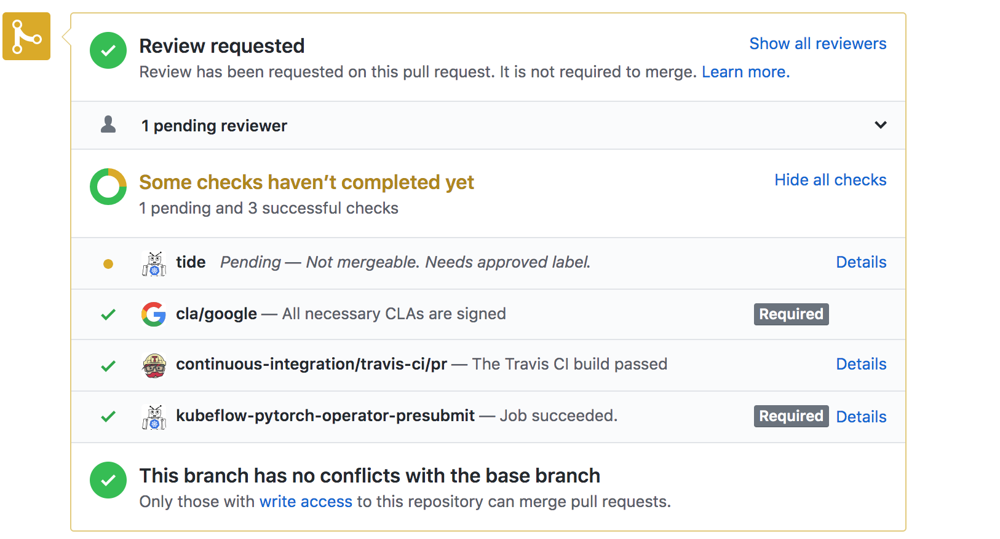

<!-- TOC -->

- [1. 背景](#1-背景)
- [2. 提交代码过程](#2-提交代码过程)
    - [2.1 提交issue](#21-提交issue)
    - [2.2 提交PR](#22-提交pr)
        - [2.2.1 fork 代码并提交到自己github仓库](#221-fork-代码并提交到自己github仓库)
        - [2.2.2 提交下PR](#222-提交下pr)
            - [2.2.2.1 Contributor License Agreement (CLA) 认证](#2221-contributor-license-agreement-cla-认证)
            - [2.2.2.2 开始检查代码流程](#2222-开始检查代码流程)

<!-- /TOC -->

# 1. 背景
* 作为一个码农，当然希望可以为开源社区贡献代码，然后作为contributor装逼
* 但是作为新手，第一次贡献代码任然很迷
* 我也不是很懂，只是描述下自己第一次共享代码的过程(kubeflow/pytorch-operator)

# 2. 提交代码过程
## 2.1 提交issue
* 描述你想表达的问题，描述问题后记得阐述自己的PR思想
* 一般如果社区成员认可这个问题，会主动要求你修复这个问题
* 自己同意之后就进入下一个阶段

## 2.2 提交PR
### 2.2.1 fork 代码并提交到自己github仓库
* fork 仓库
* git clone 自己github 仓库代码
* 一定要检查自己的user name 和email，因为Contributor License Agreement (CLA) 会进行认证，最开始因为我没有设置，导致重来了一遍
* 修改代码后提交，注意commit格式
* 使用git log 确认下username 和email

### 2.2.2 提交下PR
* 提交PR之前可以更新下本地github库代码（pull request from 开源社区）
* 向开源社区提交代码（也是pull request，和上面方向不同），注意在comment时候贴上之前写的issue链接（这样PR会自动关联issue）

#### 2.2.2.1 Contributor License Agreement (CLA) 认证
系统提示这个问题是因为你的commit邮箱email出现问题，commit的email和自己的账号email不一致导致。或者没有注册CLA。
 * https://cla.developers.google.com/ 进入注册
 * 注册之后再评论中回复@googlebot I signed it!，CLA系统会自动验证

#### 2.2.2.2 开始检查代码流程
* 首先一般系统开发人员会自动/ok-to-test，然后代码进入测试流程。如果发现很长时间没有出现/ok-to-test,可以assing 你的PR到社区成员/assign @gaocegege
* 下面是代码审核流程
    * cla/google 很快通过，只要之前cla认证没有问题
    * continuous-integration/travis-ci/pr：CI build，一般本地build没出现问题，这不也没什么问题
    * kubeflow-pytorch-operator-presubmit： 这个是开始执行测试用例，有时候即使本地项目测试全都通过，但是该项还是不会通过，因为社区项目可能更新了
        * 这时候需要merge下自己github 项目代码（从开源社区上merge）。merge
        

