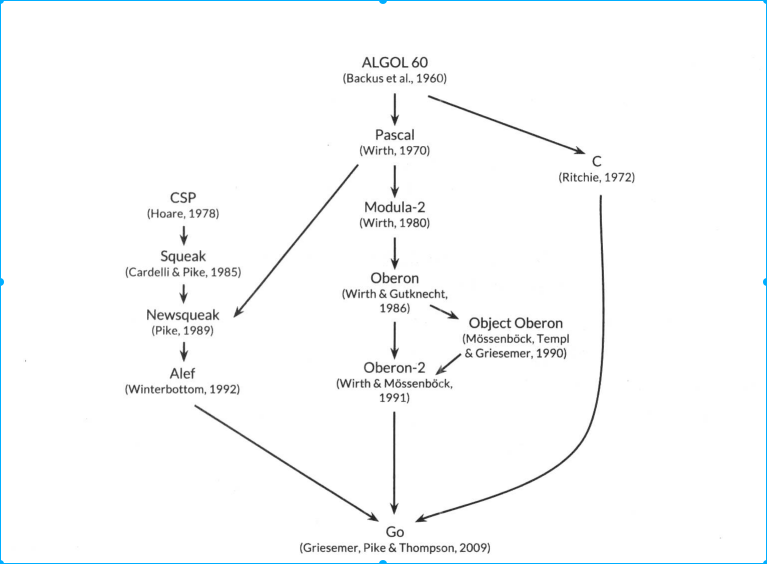

<!-- TOC -->

- [1. 背景](#1-背景)
- [2. go 起源](#2-go-起源)
    - [2.1 go 新特性](#21-go-新特性)
- [3. go 诞生的背景](#3-go-诞生的背景)
- [4. go 语言简单性](#4-go-语言简单性)

<!-- /TOC -->

# 1. 背景
* go语言开源，目的是构建简单、可靠、高效软件
* go 是google产物
* go 特点
    * 底层是C语言实现，被称为类C语言
    * 全新、高效方式实现并发
    * 数据抽象和面向对象的实现方式灵活
    * 使用了垃圾回收机制
* go 特别适合构建基础设施软件

# 2. go 起源
下面是go的祖先和继承的特点
* C语言:
    * 表达式语法、控制流、基本数据类型、按值调用的形参传递、指针
    * C强调：要编译成高效的代码，并自然的与所处的操作系统提供的抽象机制相配合
* Pascal语言：
    * Modula-2 启发包的概念
    * Oberon 消除了模块接口文件和模块实现文件之间的差异
    * Oberon-2 影响了包导入和声明的语法
* CSP: Communicating Sequential Process(通信顺序进程)
    * 最开始Hoare 提出CSP是一种形式化语言，描述程序是一组无状态进程的并行组合，进程见通信采用通道和同步组成
    * 后来被实现为真正的语言，并且具有垃圾回收机制

## 2.1 go 新特性
* slice:提供动态数组高效的随机访问功能，还允许旧链表的复制共享机制
* defer: 语句引入

# 3. go 诞生的背景
* go 语言诞生于复杂性激增的软件系统。Rob Pike说复杂性是以乘积方式增长的。在不断增加系统功能、选项、配置、快速发布的压力下，简单性往往被忽略
* 简单性应该一开始项目浓缩的思想本质，在项目声明周期中制定标准，那些变化是好的，那些变化是坏的。
    * 好的变化，功能实现，也不破坏软件的完整性
    * 坏的变化往往是，实现了方便性，却失去了重要的简单性
* 只有最开始软件设计简单性，系统增长过程中才能保证稳定、安全、自治

# 4. go 语言简单性
* go语言发挥了后发优势，基础功能实现的很好
    * 垃圾回收
    * 包系统
    * 一等公民函数
    * 词法作用域
    * 系统调用接口
    * 默认UTF-8编码的不可变字符串
* 重要的是语言特性不多，不太会增加新特性了
    * 没有隐式类型强制转化
    * 没有构造和析构函数
    * 没有运算符重载
    * 没有形参默认值
    * 没继承、没泛型
    * 没异常
    * 没宏
    * 没函数注解
    * 没线程局部存储
* go 提供变长栈来运行轻量级线程，称为goroutine，栈初始化非常小，成本低，创建100万个完全可以接收
