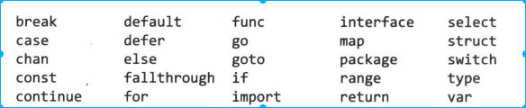
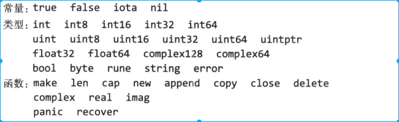

<!-- TOC -->

- [1. 名称](#1-名称)

<!-- /TOC -->

# 1. 名称
* 区分大小写
* 以下是不允许变量出现的变量名称
    * golang 中自带的25个关键字
        * fallthrough 使用在case语句，直接执行下一条不判断expr表达式
    
    * golang 预先声明的常量、类型、函数
        * iota 计数const出现个数，只能用来赋值 https://www.jianshu.com/p/08d6a4216e96
        * uintptr:该类型的指针可以用来计算
        * rune: int32 别名
        * cap: 计算分配空间的容量（比如slice，len和CAP区别）
    
    
    