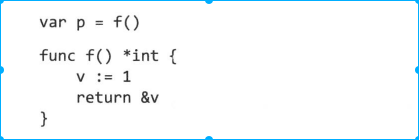

<!-- TOC -->

- [1. 名称](#1-名称)
- [2. 声明](#2-声明)
    - [2.1 声明的通用形式](#21-声明的通用形式)
    - [2.2 短变量声明](#22-短变量声明)
    - [2.3 指针](#23-指针)
    - [2.4 new](#24-new)

<!-- /TOC -->

# 1. 名称
* 区分大小写
* 以下是不允许变量出现的变量名称
    * golang 中自带的25个关键字
        * fallthrough 使用在case语句，直接执行下一条不判断expr表达式
    
    * golang 预先声明的常量、类型、函数
        * iota 计数const出现个数，只能用来赋值 https://www.jianshu.com/p/08d6a4216e96
        * uintptr:该类型的指针可以用来计算
        * rune: int32 别名
        * cap: 计算分配空间的容量（比如slice，len和CAP区别）
        * imag: 复数的虚数。imag和real、complex是用来操作复数的
        * panic、recover：出错处理机制
    

# 2. 声明
## 2.1 声明的通用形式
```
var name type = value
```
* 类型和变量值可以省略一个
* 包级别初始化在main开始之前进行，局部变量的声明和初始化在函数执行期间执行
* var 声明的使用场景
    * 声明类型和value类型不一致情况
        ```
        var myValue float64 = 100
        ```
    * 赋值的value对声明的变量不重要情况
        ```
        var myValue float64
        ```

## 2.2 短变量声明
```
name:=value
```
* 短声明变量不需要声明左边所有的变量，但是至少要声明一个变量，其余变量作为赋值使用

## 2.3 指针
* 函数返回局部变量的地址是安全的（C语言不同）
    * 如下图，函数返回后，v的地址依然存在。每次调用f返回一个不同的值


## 2.4 new
```
p :=new(int)
```
* 初始化T类型为0值，并且返回该变量指针


    
    