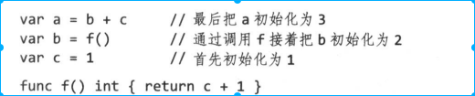

<!-- TOC -->

- [1. 名称](#1-名称)
- [2. 赋值](#2-赋值)
    - [2.1 声明的通用形式](#21-声明的通用形式)
    - [2.2 短变量声明](#22-短变量声明)
    - [2.3 指针](#23-指针)
    - [2.4 new](#24-new)
    - [2.5 变量生命周期](#25-变量生命周期)
- [3. 赋值](#3-赋值)
    - [3.1 多重赋值](#31-多重赋值)
- [4. 类型声明](#4-类型声明)
- [5. 包和文件](#5-包和文件)
    - [5.1 导入](#51-导入)
    - [5.2 初始化](#52-初始化)
    - [5.3 init](#53-init)
- [6. 作用域](#6-作用域)

<!-- /TOC -->

# 1. 名称
* 区分大小写
* 以下是不允许变量出现的变量名称
    * golang 中自带的25个关键字
        * fallthrough 使用在case语句，直接执行下一条不判断expr表达式
    
    * golang 预先声明的常量、类型、函数
        * iota 计数const出现个数，只能用来赋值 https://www.jianshu.com/p/08d6a4216e96
        * uintptr:该类型的指针可以用来计算
        * rune: int32 别名
        * cap: 计算分配空间的容量（比如slice，len和CAP区别）
        * imag: 复数的虚数。imag和real、complex是用来操作复数的
        * panic、recover：出错处理机制
    

# 2. 赋值
## 2.1 声明的通用形式
```
var name type = value
```
* 类型和变量值可以省略一个
* 包级别初始化在main开始之前进行，局部变量的声明和初始化在函数执行期间执行
* var 声明的使用场景
    * 声明类型和value类型不一致情况
        ```
        var myValue float64 = 100
        ```
    * 赋值的value对声明的变量不重要情况
        ```
        var myValue float64
        ```

## 2.2 短变量声明
```
name:=value
```
* 短声明变量不需要声明左边所有的变量，但是至少要声明一个变量，其余变量作为赋值使用

## 2.3 指针
* 函数返回局部变量的地址是安全的（C语言不同）
    * 如下图，函数返回后，v的地址依然存在。每次调用f返回一个不同的值


## 2.4 new
```
p :=new(int)
```
* 初始化T类型为0值，并且返回该变量指针

## 2.5 变量生命周期
* 包级别变量生命周期是整个程序
* 局部变量的生命周期是改变量不被访问，被垃圾回收机制回收


# 3. 赋值
## 3.1 多重赋值
* 交换场景非常适用
```
x,y=y,x
```
# 4. 类型声明
```
type newtypename typename
```
* 只有相同类型的值才能进行赋值和比较，适用type定义两种不同类型不能进行赋值和比较
* type的底层类型决定了它的结构和表达式，比如type time float。time 类型可以适用float的相同的运算符


# 5. 包和文件
* 包中导出的字符是大写的成员才对包外可见

## 5.1 导入
* 导入没有使用的包会报错。优点是能消除代码演进过程中不需要的依赖。缺点是程序员写代码稍微麻烦。

## 5.2 初始化
* 包的初始化从初始化包级别的变量名开始，这些变量按照声明顺序初始化。在依赖已经解析完毕的情况下，根据依赖的顺序进行。


* 如果包中有多个文件，初始化按照编译器收到的文件顺序进行，go工具会在调用编译器前将.go文件进行排序

## 5.3 init
* 任何文件中可以包含任意数量的init函数
```
func init(){}
```
* init函数不能被调用和引用
* init函数按照声明的顺序自动执行

# 6. 作用域
* 生命周期和作用域不一样
    * 生命周期是创建和消亡（运行时属性）
    * 作用域是作用范围（编译时属性）
