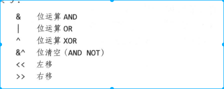

<!-- TOC -->

- [1. 背景](#1-背景)
- [2. 整数](#2-整数)
    - [2.1 二元操作符](#21-二元操作符)
        - [2.2 位运算](#22-位运算)
- [3 浮点数、复数](#3-浮点数复数)
- [4 字符串](#4-字符串)
    - [4.1 字符串工具](#41-字符串工具)
- [5. 常量](#5-常量)
    - [5.1 常量生成器 iota](#51-常量生成器-iota)
    - [5.2 无类型常量](#52-无类型常量)

<!-- /TOC -->

# 1. 背景
* golang四中数据类型
    * 基础类型
        * 数值、字符串、bool
    * 聚合类型
        * 通过基础类型得到更加复杂的类型
        * 数组、结构体
    * 引用类型
        * 都是间接指向程序变量或者状态
        * pointer、map、slice、function、channel
    * 接口类型

* golang 数值类型数据包括
    * 整数
    * 浮点数
    * 复数

# 2. 整数
* int8、int16、int32、int64、uint8、uint16、uint32、uint64
* int类型位数等于该平台上运算效率最高的值，一般是64为或者是32位
* rune是int32 同义词，常常用于指明一个值是Unicode码点，可以互换使用
* byte和int8是同义词，强调一个值是原始数据，并非量值
* uintptr是无符号整数，其大小并不确定，但足以完整存放指针。uintptr仅仅用于底层编程，    例如go程序与C程序库或者操作系统界面

## 2.1 二元操作符
* 操作符包括算术运算符、逻辑运算符、比较运算符
* 运算符的优先级如下
    
* %运算只能运用于整数，%行为因编程语言而异，go语言中，%的余数总是和被除数一致-5%3和-5%-3都是2。
* go 操作符/和C语言保持一致
* 所有的基础数据类型都可以进行比较，这意味着两个相同的数据类型可以使用==和！=进行比较。数值类型和字符串还能进行排序。

### 2.2 位运算

* ^表示按位“异或”， 若作为一元运算符，就是按位取反
* &^ 表示按位清除，比如z=x&^y,若y的某位是1，则z的对应位是0


# 3 浮点数、复数
* 浮点数转int，正数向下取整，复数向上取整，感官上都是舍弃小数部分

# 4 字符串
* len（）返回的是字符串的字节数，并非是文字符号数目
* 字符串的值无法改变，字符串本身包含的字节序列永远不变
    * 下面的操作违法
    ```
    s:="xyz"
    s[0]='a'
    ```
    * 不可变意味着两个字符串能安全的公用同一段底层内存，使得复制任意长度的字符串开销都很低廉

* golang 默认使用Unicode中的utf-8编码，utf-8是变长编码，兼容ascii

## 4.1 字符串工具
4个标准包对字符串处理非常重要:bytes、strings、strconv、Unicode

* strings包提供了许多函数，用于搜索、替换、比较、修整、切片、连接字符串
* bytes也有类似的函数，用户操作字节slice，由于字符串不可变，因此按照增量方式构建字符串会导致多次内存的分配和复制。这时候，使用bytes.Buffer效率更高
* strconv 包具备的函数，主要用于转化bool、整数、浮点与之对应的字符串形式。或把字符串转化成bool、浮点、整数。另外还有位字符串添加、去除引号的函数
* unicode 包具备判别文字字符串特性的函数，比如IsDigit、IsLetter、IsUpper、IsLower,它对原字符串的每个字符串做指定变换，生成并返回一个新字符串

# 5. 常量
* 常量是一种表达式，在编译阶段句计算出表达式的值
* 所有常量都属于基本数据类型，bool、字符串、数字
* 若同时声明一组常量，除了第一项外，其它项在等号右侧的表达式可以省略，这意味着服用前面表达式和类型
    ```
    const(
        a=1
        b
        c=2
        d
    )
    fmt.println(a,b,c,d) //1 1 2 2
    ```

## 5.1 常量生成器 iota
* 常量声明可以使用常量生成器iota，它创建一系列值，而不是逐个显示写出，常量声明中，iota从0开始取值，逐项+1


* iota 机制存在缺陷，比如不存在指数运算符，所以无法生成1000的幂


## 5.2 无类型常量
* 虽然可以是任意类型的基本数据，比如int和float，但是许多常量并不属于某一个具体常量，这些值比基本类型的数字精度更高，且算术精度高于原生的机器精度。从属常量待定的常量有6中
    * 无类型bool
    * 无类型整数
    * 无类型文字符号
    * 无类型浮点数
    * 无类型复数
    * 无类型字符串
* 除了精度更高，其还能写更多类型并且无需要转化，比如ZiB、YiB过大，那种类型都无法存储，但是上例都是合法常量

