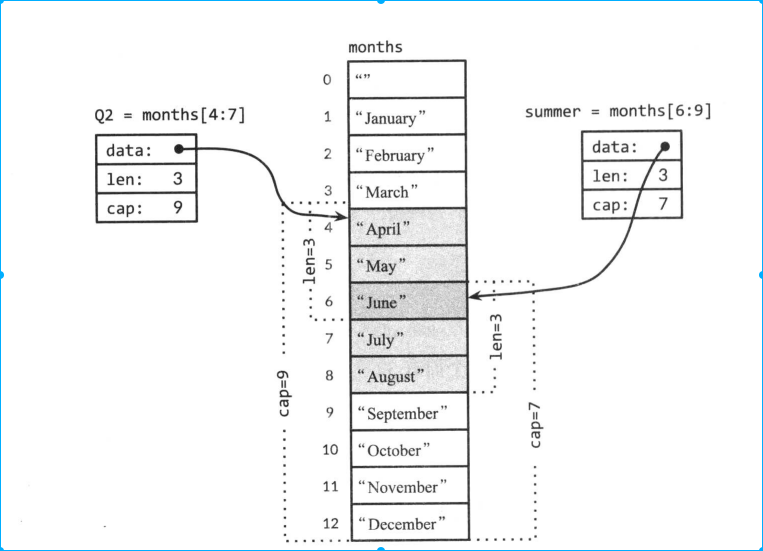

<!-- TOC -->

- [1. 背景](#1-背景)
- [2. 数组](#2-数组)
- [3. slice](#3-slice)
    - [3.1 append函数](#31-append函数)
- [4. map](#4-map)
- [5. 结构体](#5-结构体)
    - [5.1 结构体比较](#51-结构体比较)
    - [5.2 结构体嵌套和成员变量](#52-结构体嵌套和成员变量)
- [6. Json](#6-json)

<!-- /TOC -->
# 1. 背景
* 这里主要介绍四种复合类型数据：数组、slice、map、结构体
* 讲述复合数据类型如何结构化成Json，Json如何转化成复合数据类型

# 2. 数组
* 数组声明
```
var a [3]int
```
* 数组初始化
```
var a [3]int{1,2,3}
```
* 数组长度由初始化元素个数决定，出现了"..."
```
var a [...]int{1,2,3}
```
* 数组长度是数组类型的一部分，所以[3]int和[4]int是两种不同的数据类型
* 数组长度必须是常量表达式，也就是数组长度必须要在编译时间确定

* 可以在初始化部分直接写数组元素个数
    * 下面是定义了一个元素个数为100的数组，除了最后一个是-1外，其它元素都是0值
    ```
    vat a [...]int{99:-1}
    ```

* 如果一个数组中的元素是可以比较的，那么这个数组就是可以比较的
    * 可以使用==判断两个数组是否完全相同，同样!=也可以使用
    


# 3. slice
* slice表示拥有相同数据类型的可变长度序列
* slice和数组紧密相连，slice是一种轻量级的数据结构，可以用来访问数组的部分或者全部元素。
    * 该数组称为slice的底层数组
    * slice 有三个属性，指针、长度、容量
        * 指针执行数组中第一个可以从slice访问到的数组元素
        * 长度指slice访问的元素个数
        * 容量值的是slice起始元素到底层数组的最后一个元素的元素个数
        * go内置len和cap来获取slice的长度和容量
* 底层数组可以对应多个slice，这些slice可以引用数组的任何位置，彼此之间的元素可以重叠
    * 下图显示了一个月份字符串数组，和两个元素存在重叠的slice
    
* 如果slice引用超过了被引用对象的容量，即cap(s),会导致宕机。如果slice引用超过被引用对象的长度，及len(s),最终slice会比原来的slice长


* slice 并不能像数组一样直接使用比较，标准库中提供了高度优化的bytes.Equal来比较两个字节的slice，但是对于其它类型的slice，还是需要自己写比较函数进行比较
    * 这种深度的比较函数看上去很简单，并且比较的时候并不比字符串使用的==耗时
    * 为什么slice不可以直接使用自身比较？因为slice需要做的是深层次比较，如果slice中的元素包含map，那么用==直接比较
* make函数可以创建指定长度的slice
    * cap参数可以省略，省略则len和cap相等
    * 下面是make创建了一个无名数组，这个数组仅可以通过slice来访问
    ```
    make([]T,len)
    make([]T,len,cap)
    ```
## 3.1 append函数
* appen 函数对理解slice非常重要

每一次appendInt都必须检查slice是否有足够的容量来存储新的元素
* 如果底层容量足够，它会定义一个新的slice（底层数组不变），并将新的元素放在新的位置上
* 如果slice容量不足，则会创建一个新的底层数组
* 一次扩容一倍，我想是是为了减少分配内存空间时间，空间换时间


# 4. map
```
a:=map[string]int{
    "alice":1
    "jone":2
}

a:=make(map[string]int)
```

* delete 根据键删除元素
    * 即使键不再map元素中，下面操作也是安全的
        ```
        delete(a,"alice")
        ```
* map使用给定的键来查找元素，如果对应的元素不存在，就返回0值（Python不一样）
* map元素不是一个变量，不可以获取它的地址
    * 我们无法获取map元素地址是因为随着map元素增长，可能导致已有的元素重新散列到新的存储位置，这样使得获取的地址无效
    ```
    _=&a["aline"]//编译出错，无法获取map元素地址
    ```
* map零值是nil，大多数操作能在map的零值nil上操作
    * 包括查找元素、删除元素、获取元素个数、len(),因为这些和nil map行为一致
    * 但是在nil map赋值会导致错误。因此在赋值之前，一定要进行初始化
    ```
    var a map[string]int
    a["alice"]=1//err
    ```
* 通过下标访问map中的元素总是会有值，因为即使键不在map中也会返回0值。
    * 那么我们如何判断一个键是否在map中，总不能遍历map把
    ```
    age,ok:=a["alice"]
    if !ok{
        //alice 不在map中
    }
    ```
    ```
    if a,ok:=a["alice"]; !ok{
        //alice不再map中
    }
    ```
# 5. 结构体
* 点号获取成员，既可以用在结构体上也可以直接使用在结构体指针上
    ```
    var employeeOfTheMonth *Employee
    employeeOfTheMonth.Position
    //等价于(*employeeOfTheMonth).Position
    ```
* 成员变量的顺序对结构体非常重要，如果结构体成员变量信息发生变化，那么我们任务这是在定义一个新的结构体
* struce 成员变量的类型不能包含自己，但是可以定义一个包含自己的指针类型
    ```
    type tree struct{
        value int
        left,right *tree
    }
    ```

## 5.1 结构体比较
如果结构体的所有成员变量是可以比较的，那么这两个结构体就是可以比较的。
* 结构体比较可以使用==和!=
* ==是顺序比较两个结构体的所有成员变量

* 和其它可比较的类型一样，可比较的结构体都可以作为map的键类型
```
type  address struct{
    hostname string 
    port int
}
hits:=make(make(map[address]int))
hits[address{"golang.org",433}++]
```


## 5.2 结构体嵌套和成员变量
go有着不同寻常的结构体嵌套机制，可以将一个结构体作为另外一个结构体类型的成员变量使用。

* go允许我们使用不带名称的结构体成员，只需要指定类型即可，这种结构体成员成为匿名成员
    * 该结构体必须是一个类型或者指向命名类型的指针
        * 其实说成“匿名变量不是非常合适”，因为该成员变量的名字就是该类型的名字
        * 没有什么快捷的方式来初始化结构体
            ```
            c:= Circle{1,1,2}//编译错误，未知的成员变量i
            ```
    ```
    type Point struct{
        X,Y int
    }
    type Circle struct{
        Point
        Radius int
    }
    ```

# 6. Json
* json 是一种发送和接收数据格式的标准，xml、ASN.1、Google的Protocol Buffer
* golang 标准库encoding/json、encoding.xml、encoding.asn1


