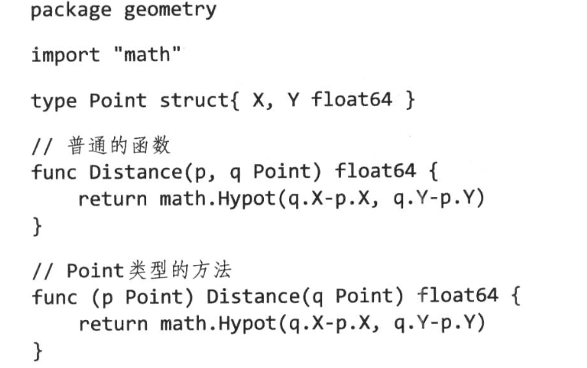
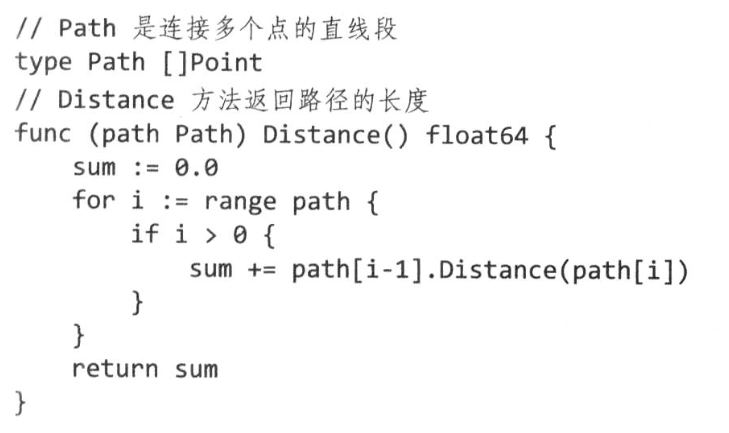
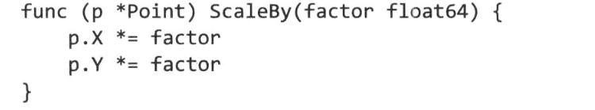
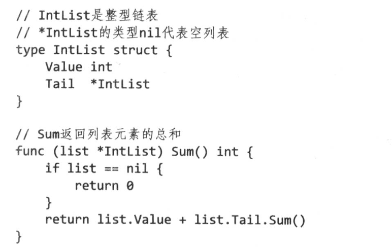

<!-- TOC -->

- [1. 背景](#1-背景)
- [2. 方法声明](#2-方法声明)
    - [2.1 指针接受者方法](#21-指针接受者方法)
    - [2.2 nil是一个合法的接受者](#22-nil是一个合法的接受者)
- [3. 通过结构体内嵌组成类型](#3-通过结构体内嵌组成类型)

<!-- /TOC -->
# 1. 背景
* 方法是某种特定类型的函数。在go语言中就表现为某种struct或者interface。

* 下面主要讲解如何基于面向对象的思想编程，如何更加有效的定义和使用方法。

* 两个非常重要的原则，封装和组合

# 2. 方法声明
如下图所示，参数p称为方法的接受者
* golang中没有特殊的别名（比如this，self），我们自己选择接受者名字就像其它的参数变量一样，由于接受者会平凡的使用，因此最好能够选择简短并且在整个方法名称中始终保持一致的名字。



* golang和其它语言不通，方法可以绑定在任何类型上。
    * 比如下面，path是一个slice类型，但是我们任然可以为path定义Distabce方法



* 同一个包下的任何类型都可以声明方法，只要他的类型既不是指针类型也不是接口类型

## 2.1 指针接受者方法
* 如下图所示，使用指针来传递接受者的变量地址
    * 下面必须通过（*Point）.ScaleBy，如果没有使用圆括号，会被理解成 *（Point.ScaleBy）
    * 习惯上，都是通过指针来传递接受者
    
    * 命令类型还有指向他们的指针是唯一可以出现在接受者声明处的类型，而且为了防止混淆，不允许本身是指针的类型进行方法声明
        ```
        type P *int
        func (P) f() {}//编译错误，非法的接受者
        ```
    
    * 不能对一个不能取地址的Point接受者参数调用*Point方法，因为无法获取临时变量的地址（但是，如果是接受者是类型，而不是指针传递参数，那么可以直接使用临时变量来调用方法）
        ```
            Point{1,2}.ScaleBy(2)//编译错误：不能获取Point类型字面量地址
        ```

## 2.2 nil是一个合法的接受者


# 3. 通过结构体内嵌组成类型
* 如下面所示，是一个嵌套Point类型的struct
    * ColoredPoint 可以直接使用Point的类型和方法
```
type Point Struct{X,Y float64}
type ColoredPoint struct{
    Point
    Color color.RGBA
}
```
