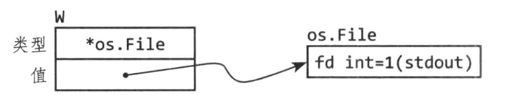

<!-- TOC -->

- [1. 接口定义](#1-接口定义)
- [2. 接口定义](#2-接口定义)
    - [2.1 接口比较](#21-接口比较)
- [3. go 标准库中的重要接口](#3-go-标准库中的重要接口)
    - [3.1 使用sort.Interface来排序](#31-使用sortinterface来排序)
    - [3.2 http.Handler 接口](#32-httphandler-接口)
    - [3.1 区分不同url](#31-区分不同url)

<!-- /TOC -->

# 1. 接口定义
* 只有接口暴露的方法才能被接口调用
    * 比如空接口可以被任何类型赋值，但是去无法调用被赋值的变量和方法
    ```
    var any interface{}
    any=true
    any=12.34
    ...
    ```
    *  配套的，我们需要使用类型断言来实现从空接口中还原出实际值（后面讲解）


# 2. 接口定义
从概念上，一个接口类型的值分为两部分：具体类型和该类型的值。两者称为接口的动态类型和动态值。


对于像golang这种静态语言，类型仅仅是一个编译时的概念，所以类型不是一个值。在我们的概念类型中，用来兴描述符来提供每个类型的具体信息，比如它的名字和方法。

比如，下面四个语句中，动态类型有三个值（第一个和最后一个值是一致的）
```
var w io.Writer
w =os.Stdout
w=new(bytes.Buffer)
w=nil
```

接下来让我们详细查看下在每一个语句之后w的值和相关到动态行为
* 第一个语句声明了w
    ```
    golang 所有的声明都会赋值一个0值，第一个w==nil
    ```
    
* 第二句讲*os.File类型赋值给了w
    ```
    w=os.Stdout
    ```
    * 这次赋值讲一个具体类型隐式转化为一个接口类型，与它对应的显示转化io.writer(os.Stdout)等价
    * 接口的动态类型会设置为指针类型*os.File的类型描述符，它的动态值会设置为os.Stdout副本
    

    * 一般来讲，编译时期我们无法知道一个接口值的动态类型会是什么，所以通过接口来做调用必然需要使用动态分支。编译器必须要生成一段代码来从类型描述符拿到名为Writed 方法地址，再间接调用该方法的地址。调用的接受者就是接口的动态值。
    * 第三句和第二句过程一致
        


## 2.1 接口比较
接口可以使用==和!=进行比较。如果两者的动态类型完全一致并且两者的动态值相等（前提是该类型可以进行比较），那么两个接口就是相等的。可以比较的接口就可一种为map键并且可以作为switch语句的操作数。

需要注意的是，在比较两个接口值时，但是对应动态类型的值时不可以比较的（比如slice），那么这个比较会以崩溃的方式失败

从这点来看，接口类型是非平凡的，其它类型要么是可以安全比较的（比如基础数据类型和指针），要么完全是不可以比较的（比如map、slice），但是当比较接口或者其中包含接口值的聚合类型时，我们必须小心崩溃的可能性。当做map键或者switch语句操作时也有类似的风险。


# 3. go 标准库中的重要接口

## 3.1 使用sort.Interface来排序
通常我们的排序算法是针对特定的数据类型，如果是一种数据类型一种排序算法复制一遍就会让人很难受。golang sort包提供针对任意序列根据任意排序函数原地排序功能。sort.Interface 接口制定通用排序算法和每个具体的序列类型之间协议（contract）。这个接口的实现确定了序列的具体布局（通常是slice），以及元素期望的排序方式。


一个原地排序算法需要三个信息，序列长度、比较两个元素含义以及如何交换两个元素，因此sort.Interface接口就有三个方法


比如我们要实现stringslice排序，我们需要实现如下方法：


下面我们就可以对字符串进行排序，字需要讲一个slice转换为StringSlice类型即可：
```
sort.Sort(StringSlice(names))
```

类型转换生成一个新的slice，与原始的names有相同的长度、容量和底层函数，不同的就是增加了三个用于排序的方法。

字符串slice排序太常用了，因此sort包中包含提供了StringSlice类型，以及一个直接排序的Strings函数，于是上面的代码可以直接简写成sort.Strings(names)


## 3.2 http.Handler 接口


如下面，是一个简单的http server例子：
    * 下面很有意思是ListenAndServer第二个参数是一个handler interface，因此下面例子传入进来的是一个db，而不是一个func


## 3.1 区分不同url
* 下面分别添加/list和/price两种url
    * URL Query方法，把http的请求解析为一个map


