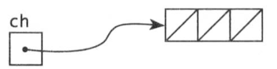

<!-- TOC -->

- [1. 背景](#1-背景)
- [2. goroutine](#2-goroutine)
- [2. 通道](#2-通道)
    - [2.1 无缓冲区通道和缓冲区通道](#21-无缓冲区通道和缓冲区通道)
        - [2.1.1 无缓冲区通道](#211-无缓冲区通道)
        - [2.1.2 缓冲区通道](#212-缓冲区通道)

<!-- /TOC -->
# 1. 背景
* GO 有两种并发编程风格
    * 这一章展示goroutine 和channel，他们支持通信顺序进程（Communication Sequential Process,CSP）,CSP 是一个并发模式，在不同的执行体（goroutine）之间传递值，但是变量本身局限于单一执行体
    * 第九章涵盖一些共享内存的多线程模型，他们和其它语言中使用的线程类似

# 2. goroutine
* 在go中一个并发执行的活动称为goroutine
* goroutine和线程在数量上有非常大的区别，这将在9.8节中讨论
* 当主干goroutine main结束时，所有的goroutine都暴力终结，然后程序退出。
* 除了从main返回或者程序退出外，没有程序化的方法让一个goroutine停止另一个。但是我们可以使用通信让一个goroutine要求自己停止


# 2. 通道
* 通道是一个特定类型的导管，叫做通道元素类型，比如一个int类型的通道写成chan int
    ```
        ch:= make(chan int) //ch 的使用类型是chan int
    ```

* 通道复制的是引用，这样调用者和被调用者都是引用同一份数据结构。
* 同一类型的通道可以使用==符号进行比较，当两者都是统一通道数据类型引用时，比较值为true

* 通道主要有两个操作:send 、receive，两者统称为通信，send 语句从一个goroutine传输一个值到另外一个执行接受式的gorountine


* 通道支持第三个操作：close，它设置一个标志位来表示当前已经发送完毕，这个通道后面没有值了
    * 关闭后的发送操作将导致宕机，在一个已经关闭的通道上进行接受操作，将获取已发送的所有值，直到通道是空

## 2.1 无缓冲区通道和缓冲区通道
通道可以创建无缓冲区通道和缓冲区通道。
```
ch:=make(chan int)//创建无缓冲区通道
ch:=make(chan int 3)//创建容量为3的缓冲区通道
```
### 2.1.1 无缓冲区通道
* 无缓冲通道上的发送操作会阻塞，直到gorouine对应通道上接受操作执行完毕。
    * 使用缓冲区通道通信将导致接受和通信同步化，因此无缓冲区通道又称为同步缓冲区通道。
* 通道可以用来连接不同gorouine，这样就起到管道的作用
    
### 2.1.2 缓冲区通道
如下图所示，是创建一个容纳3个字符串的通道.
```
ch=make(chan string,3)
```


* 缓冲通道发送操作在尾部添加元素，接收操作在队首添加元素
* 如果我们需要知道通道缓冲区容量，我们可以通过使用内置的cap函数获取
    ```
    fmt.Println(cap(ch))//3
    ```
* 可以使用内置函数len()获取通道缓冲区中元素个数。通常情况在，正常运行下通道元素个数会发生较大变化，因此价值不大。但是在错误诊断和性能优化方面有很大作用。