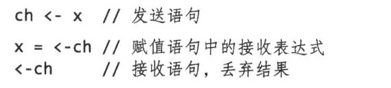

<!-- TOC -->

- [1. 背景](#1-背景)
- [2. goroutine](#2-goroutine)
- [2. 通道](#2-通道)

<!-- /TOC -->
# 1. 背景
* GO 有两种并发编程风格
    * 这一章展示goroutine 和channel，他们支持通信顺序进程（Communication Sequential Process,CSP）,CSP 是一个并发模式，在不同的执行体（goroutine）之间传递值，但是变量本身局限于单一执行体
    * 第九章涵盖一些共享内存的多线程模型，他们和其它语言中使用的线程类似

# 2. goroutine
* 在go中一个并发执行的活动称为goroutine
* goroutine和线程在数量上有非常大的区别，这将在9.8节中讨论
* 当主干goroutine main结束时，所有的goroutine都暴力终结，然后程序退出。
* 除了从main返回或者程序退出外，没有程序化的方法让一个goroutine停止另一个。但是我们可以使用通信让一个goroutine要求自己停止


# 2. 通道
* 通道是一个特定类型的导管，叫做通道元素类型，比如一个int类型的通道写成chan int
    ```
        ch:= make(chan int) //ch 的使用类型是chan int
    ```

* 通道复制的是引用，这样调用者和被调用者都是引用同一份数据结构。
* 同一类型的通道可以使用==符号进行比较，当两者都是统一通道数据类型引用时，比较值为true

* 通道主要有两个操作:send 、receive，两者统称为通信，send 语句从一个goroutine传输一个值到另外一个执行接受式的gorountine


* 通道支持第三个操作：close，它设置一个标志位来表示当前已经发送完毕，这个通道后面没有值了
    * 关闭后的发送操作将导致宕机，在一个已经关闭的通道上进行接受操作，将获取已发送的所有值，直到通道是空