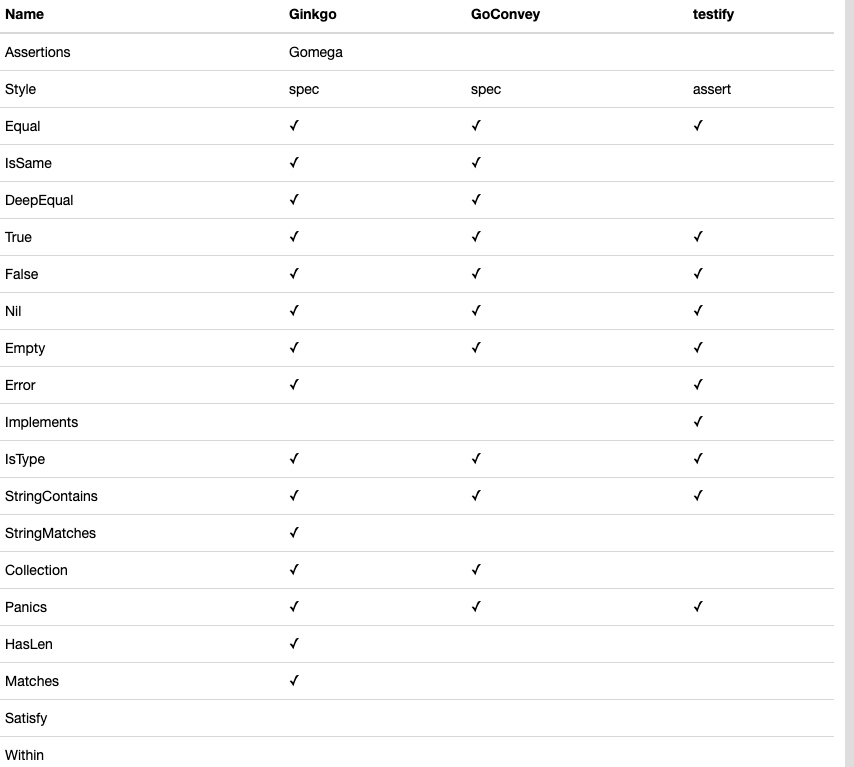

<!-- TOC -->

- [1. 背景](#1-背景)
    - [1.1 Ginkgo 功能强大](#11-ginkgo-功能强大)

<!-- /TOC -->

# 1. 背景
目前go语言比较流行的测试框架是：
```
testify(TDD)
goconvey(BDD)
Ginkgo(BDD)
```

在需求沟通上，若开发对需求的理解有偏差，就容易发生摩托变单车的事情。而BDD行为驱动测试就是为了解决这个问题，即先写功能描述。开发，测试，产品等都可以看懂，能低成本地纠正错误。

BDD可以得到我们对产品的理解提供反馈，更符合互联网团队目前对功能点的验收测试，也可结合TDD框架testify做更为细致的测试。

## 1.1 Ginkgo 功能强大
