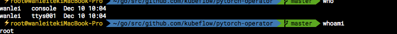

<!-- TOC -->

- [1. user](#1-user)
- [2. group](#2-group)
- [3. 权限](#3-权限)

<!-- /TOC -->
# 1. user 
* 创建用户
    * useradd test（添加用户，新增用户之后需要为用户添加密码，否则账号不能登录）
* 修改用户
    * passwd test （为用户添加密码）
    * usermod -d /home/test -G test2 test（将test用户的登录目录改成/home/test，并加入test2组，注意这里是大G。）
    * gpasswd -a test test2 将用户test加入到test2组
    * gpasswd -d test test2 将用户test从test2组中移出
* 删除用户
    * userdel test
* 查看用户
    * who 查看当前登录用户（who logged in the machine）
    * whoami 查看自己的用户名（current user who is in the shell）
        * 因为我登录机器账号是wanlei，然后shell通过sudo -s编程root权限，所以两者显示的不同
        
    * finger wanlei 查看用户最新登录时间,home目录，shell路径
    * id walei 查看用户万雷所属的组和权限
    * last 查看登录成功的用户记录
    * lastb 查看登录不成功的用户记录
    * cut -d : -f 1 /etc/passwd 查看所有用户
    
    

# 2. group
* 创建group
    * groupadd  test
* 修改group
    * groupmod -n test2  test（将test组的名子改成test2）
* 删除组
    * groupdel test2
* 查看组
    * groups （查看当前用户所在的组）
    * groups apacheuser （查看指定用户）
    * cat /etc/group （查看所有组）
# 3. 权限
